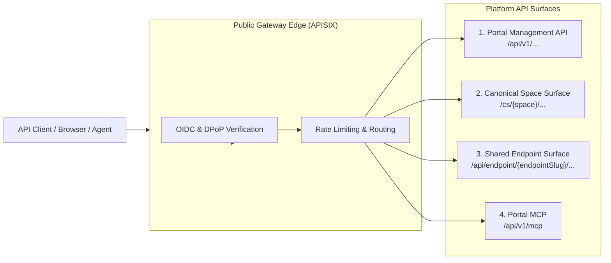

# API Overview & Architecture

joinedcontext exposes standard-first, versioned programmatic interfaces. The platform eliminates custom proprietary APIs in favor of internationally ratified specifications:

- **ETSI GS CIM 009 (NGSI-LD V1.9.1):** Core context data operations. That is the version the default broker implements and the version the conformance suite runs (1822 cases); a page citing an older one is citing a specification this platform does not serve.
- **OGC API - Features Part 1:** Geospatial feature queries.
- **OGC SensorThings API (STA) v1.1:** Time-series sensor streams.
- **Model Context Protocol:** autonomous agent tool integration. The Portal's MCP server negotiates `2026-07-28`, `2025-11-25`, `2025-06-18` or `2025-03-26` and answers with the newest the client names (`joinedcontext-portal/src/mcp/mod.rs`); an endpoint's own MCP server speaks `2025-06-18` (`joinedcontext-platform/crates/context-gateway/src/mcp/endpoint_facade.rs`).
- **OpenAPI 3.1:** Platform management and administrative operations.

---

## 1. Global API Map & Base URLs



| API Surface | Base Path URL | Purpose | Primary Consumer |
|---|---|---|---|
| **Portal Management API** | `https://{host}/api/v1/...` | Managing projects, organizations, blueprints, and approvals | Portal UI, CI systems, admin scripts |
| **Canonical Space Surface** | `https://{host}/cs/{space}/...` | Direct NGSI-LD access for the project owning the space | Project team members, resident pipelines |
| **Shared Endpoint Surface** | `https://{host}/api/endpoint/{endpointSlug}/...`| Multi-representation data consumption (GeoJSON, CSV, OGC, MCP) | Dashboards, external users, QGIS, agents |
| **Portal MCP** | `https://{host}/api/v1/mcp` | The management API as agent tools: proposing manifests, opening changes, reading a project | AI agents (Claude Code, OpenHands) |
| **Endpoint and space MCP** | `https://{host}/api/endpoint/{endpointSlug}/mcp`, `https://{host}/cs/{space}/mcp` | The context data of one endpoint or space as agent tools, under the same Policy as every other read | AI agents |

---

## 2. Authentication & Security

All API endpoints are protected by default (fail-closed, [R5](../Requirements/access-control.md#1-architecture-and-enforcement-point)).

### Token Requirements

- **Protocol:** OpenID Connect (OIDC) / OAuth 2.1 via Keycloak ([I1](../Requirements/policy-firewall.md#21-identity-stack-i1i4-canonical-here)).
- **Header:** `Authorization: Bearer <jwt>`
- **Token Claims:** Tokens carry client identity (`sub`) and tenant membership only. **Tokens never carry permissions or roles** ([I4](../Requirements/policy-firewall.md#21-identity-stack-i1i4-canonical-here)); permissions are evaluated dynamically at the gateway using stored `Policy` entities.
- **Proof of possession:** not implemented. Tokens are bearer tokens today, bound to the audience of the endpoint they were minted for and short-lived; nothing in the platform verifies a DPoP proof (RFC 9449). [AG-02](../Requirements/agents.md) asks for one on the agent surfaces, and T-2358 tracks the gap.

### Anonymous Public Access

Endpoints with `audience: public` permit unauthenticated access. Requests without a bearer token are mapped automatically to the internal role `public` and evaluated against public data policies ([GW22](../Requirements/gateway-firewall.md#5-tenants-pinning-and-chaining)).

---

## 3. Rate Limiting Headers

Two limiters stand in front of a request and they do not speak the same header.

The gateway's own limiter, which an `Endpoint` configures, answers every request on the endpoint and space surfaces with the IETF draft headers (`crates/context-gateway/src/middleware/rate_limit.rs`):

```http
RateLimit-Limit: 1000
RateLimit-Remaining: 942
RateLimit-Reset: 28
```

The edge limiter is APISIX's `limit-count` with `show_limit_quota_header`, which writes `X-RateLimit-Limit` and `X-RateLimit-Remaining` instead (`joinedcontext-deployment/components/portal/apisix-plugins.yaml`). A client that wants one number reads both names.

A caller over its quota gets **HTTP 429 Too Many Requests**, an RFC 7807 problem document and a `Retry-After: <seconds>` header carrying the same seconds as `RateLimit-Reset`.

---

## 4. Standard Error Handling (RFC 7807)

Errors are returned strictly as `application/problem+json` documents:

```json
{
  "type": "https://joinedcontext.com/errors/forbidden",
  "title": "Forbidden",
  "status": 403,
  "detail": "the write touches an attribute outside the grant: operatorPhone"
}
```

`type` is always `https://joinedcontext.com/errors/{slug}` (`crates/jc-core/src/error.rs`). `detail` and `instance` are present when there is something safe to say, and never carry an upstream URL, a tenant, a broker error body or a policy name. One extension member exists: `requestId`, written on a `500` so a report can be matched to a log line, and on nothing else. A `400` from the Portal may carry `errors`, one entry per violation, so a form can mark every bad field in one pass.

### Existence Masking

To prevent reconnaissance, requesting an unauthorized resource via single-entity fetch returns an RFC 7807 **HTTP 404 Not Found** rather than HTTP 403, eliminating existence disclosure ([R20](../Requirements/access-control.md#5-requesting-extra-data)).

---

## 5. Well-Known Discovery Documents

The platform hosts standard well-known endpoints for automated client and agent self-configuration:

- `https://idm.{host}/realms/{realm}/.well-known/openid-configuration`: the realm's own OIDC discovery document. Keycloak serves it; the platform does not proxy it, and the APISIX routes read it from there (`components/portal/apisix-plugins.yaml`).
- `/.well-known/oauth-protected-resource` and `/.well-known/oauth-protected-resource/api/v1/mcp`: RFC 9728 metadata of the Portal MCP server (`joinedcontext-portal/src/mcp/mod.rs`).
- `/api/endpoint/{endpointSlug}/.well-known/oauth-protected-resource`: the same document for one endpoint's MCP server, which names that endpoint's audience (`crates/context-gateway/src/app.rs`).
- `/api/endpoint/{endpointSlug}/schema/index.json`: the model an endpoint serves — its classes, their slots and the generated JSON Schema. There is no platform-wide `/schema/context.jsonld`; a `@context` belongs to a space's model and is served under its endpoint.

## Related

- [R5](../Requirements/access-control.md) — referenced above.
- [I1](../Requirements/policy-firewall.md) — referenced above.
- [GW22](../Requirements/gateway-firewall.md) — referenced above.
- [AG-02](../Requirements/agents.md) — referenced above.
- [04-context-spaces-and-endpoints](../Architecture/04-context-spaces-and-endpoints.md) — the model behind the endpoints.
