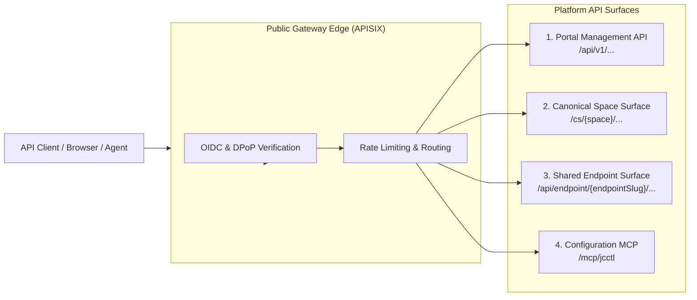

# API Overview & Architecture

joinedcontext exposes standard-first, versioned programmatic interfaces. The platform eliminates custom proprietary APIs in favor of internationally ratified specifications:

- **ETSI GS CIM 009 (NGSI-LD v1.6.1):** Core context data operations.
- **OGC API - Features Part 1:** Geospatial feature queries.
- **OGC SensorThings API (STA) v1.1:** Time-series sensor streams.
- **Model Context Protocol (MCP 2026-07-28):** Autonomous AI agent tool integration.
- **OpenAPI 3.1:** Platform management and administrative operations.

---

## 1. Global API Map & Base URLs



| API Surface | Base Path URL | Purpose | Primary Consumer |
|---|---|---|---|
| **Portal Management API** | `https://{host}/api/v1/...` | Managing projects, organizations, blueprints, and approvals | Portal UI, CI systems, admin scripts |
| **Canonical Space Surface** | `https://{host}/cs/{space}/...` | Direct NGSI-LD access for the project owning the space | Project team members, resident pipelines |
| **Shared Endpoint Surface** | `https://{host}/api/endpoint/{endpointSlug}/...`| Multi-representation data consumption (GeoJSON, CSV, OGC, MCP) | Dashboards, external users, QGIS, agents |
| **Configuration MCP** | `https://{host}/mcp/jcctl` | GitOps configuration planning and blueprint instantiation | AI Agents (Claude Code, OpenHands) |

---

## 2. Authentication & Security

All API endpoints are protected by default (fail-closed, [R5](../Requirements/access-control.md#1-architecture-and-enforcement-point)).

### Token Requirements

- **Protocol:** OpenID Connect (OIDC) / OAuth 2.1 via Keycloak ([I1](../Requirements/policy-firewall.md#21-identity-stack-i1i4-canonical-here)).
- **Header:** `Authorization: Bearer <jwt>`
- **Token Claims:** Tokens carry client identity (`sub`) and tenant membership only. **Tokens never carry permissions or roles** ([I4](../Requirements/policy-firewall.md#21-identity-stack-i1i4-canonical-here)); permissions are evaluated dynamically at the gateway using stored `Policy` entities.
- **DPoP Support:** High-security endpoints support Demonstrating Proof-of-Possession (RFC 9449) to eliminate token replay risks.

### Anonymous Public Access

Endpoints with `audience: public` permit unauthenticated access. Requests without a bearer token are mapped automatically to the internal role `public` and evaluated against public data policies ([GW22](../Requirements/gateway-firewall.md#5-tenants-pinning-and-chaining)).

---

## 3. Rate Limiting Headers

Every API response communicates rate-limit status via IETF draft standard headers:

```http
RateLimit-Limit: 1000
RateLimit-Remaining: 942
RateLimit-Reset: 28
```

If an application exceeds its quota, the gateway rejects the request with **HTTP 429 Too Many Requests** and returns an RFC 7807 problem document containing a `Retry-After: <seconds>` header.

---

## 4. Standard Error Handling (RFC 7807)

Errors are returned strictly as `application/problem+json` documents:

```json
{
  "type": "https://joinedcontext.com/errors/forbidden",
  "title": "Access Denied by Policy",
  "status": 403,
  "detail": "The current policy grant does not permit operation 'updateEntity' on this attribute set.",
  "instance": "/cs/air-quality/ngsi-ld/v1/entities/urn:ngsi-ld:Device:hel.fi:air-quality:dev-01",
  "requestId": "req-94820-a8f"
}
```

### Existence Masking

To prevent reconnaissance, requesting an unauthorized resource via single-entity fetch returns an RFC 7807 **HTTP 404 Not Found** rather than HTTP 403, eliminating existence disclosure ([R20](../Requirements/access-control.md#5-requesting-extra-data)).

---

## 5. Well-Known Discovery Documents

The platform hosts standard well-known endpoints for automated client and agent self-configuration:

- `/.well-known/openid-configuration`: Keycloak discovery metadata.
- `/.well-known/oauth-protected-resource`: OAuth 2.1 resource server metadata per RFC 9728.
- `/schema/context.jsonld`: Authoritative platform JSON-LD default context ([ADR-N-007](../Decisions/adr-n-007-apisix-standalone-no-etcd.md)).

## Related

- [R5](../Requirements/access-control.md) — referenced above.
- [I1](../Requirements/policy-firewall.md) — referenced above.
- [GW22](../Requirements/gateway-firewall.md) — referenced above.
- [ADR-N-007](../Decisions/adr-n-007-apisix-standalone-no-etcd.md) — referenced above.
- [04-context-spaces-and-endpoints](../Architecture/04-context-spaces-and-endpoints.md) — the model behind the endpoints.
