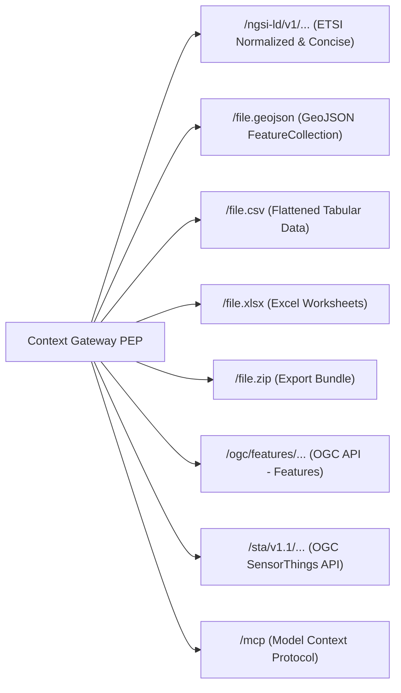

# Endpoint Representations & Translations

The platform provides multi-representation data endpoints through unique URL slugs:
`https://{host}/api/endpoint/{endpointSlug}/...`

The Context Gateway dynamically translates live NGSI-LD context data into the requested representation while enforcing identical authorization policies across all formats ([SP-03](../Requirements/space-surface.md#1-url-scheme)).

---

## 1. Supported Representations Overview



---

## 2. ETSI NGSI-LD Representations

Base Path: `/api/endpoint/{endpointSlug}/ngsi-ld/v1/entities`

### Normalized Representation (Default)

Standard ETSI property-object structure:

```json
{
  "id": "urn:ngsi-ld:WeatherObserved:hel.fi:air-quality:station-01",
  "type": "WeatherObserved",
  "temperature": {
    "type": "Property",
    "value": 22.4,
    "unitCode": "CEL",
    "observedAt": "2026-08-15T12:00:00Z"
  },
  "location": {
    "type": "GeoProperty",
    "value": {
      "type": "Point",
      "coordinates": [19.146, 48.736]
    }
  },
  "@context": "https://joinedcontext.com/schema/context.jsonld"
}
```

### Concise Representation

Requested via `Accept: application/json` with `?options=concise`:

```json
{
  "id": "urn:ngsi-ld:WeatherObserved:hel.fi:air-quality:station-01",
  "type": "WeatherObserved",
  "temperature": 22.4,
  "location": {
    "type": "Point",
    "coordinates": [19.146, 48.736]
  }
}
```

---

## 2a. What the NGSI-LD surface answers

The gateway forwards the ETSI resource tree of GS CIM 009 clause 5 under
`/api/endpoint/{endpointSlug}/ngsi-ld/v1/`. The path and the method together name one
operation of the CIM 009 Table 4.20-1 vocabulary, which is the operation the caller's
`Policy` grants have to cover; the vocabulary itself is listed in
[03-domain-model](../Architecture/03-domain-model.md).

Three headers are the gateway's own conclusions and are removed from the request before
anything reads them, whatever the client sent ([GW20](../Requirements/gateway-firewall.md), [EP-21](../Requirements/endpoints.md)):

| Header | Direction | Meaning |
|---|---|---|
| `NGSILD-Tenant` | request | the context space of the resolved endpoint, pinned by the gateway for the internal hop only; no answer of either surface carries it back ([SP-05](../Requirements/space-surface.md)) |
| `NGSILD-Results-Restricted: true` | request | the caller asks to be told when an answer was narrowed ([R22](../Requirements/access-control.md)) |
| `NGSILD-Results-Restricted: true` | response | the answer was narrowed by policy, sent **only** in answer to the request header above; a caller who did not ask reads the answer as what it is ([R22](../Requirements/access-control.md), [GW12](../Requirements/gateway-firewall.md)) |
| `NGSILD-Warning` | response | what the caller has to know to read the answer they got: which entity types this request was not allowed to select on, because it filters or orders on an attribute they do not serve on this endpoint. Sent to every caller, and it names only types the caller may read ([MP-02](../Requirements/model-projections.md), [R9](../Requirements/access-control.md)) |
| `NGSILD-Results-Count` | response | the broker's count of the matching entities, forwarded only when the gateway dropped none of them; an answer the gateway narrowed carries no count, because the difference is the number of entities withheld ([R22](../Requirements/access-control.md)) |
| `Cache-Control: private, no-store` | response | every answer is one caller's, because it is the intersection of the URL with that caller's grants; a shared cache may not store it. A document the gateway wants revalidated instead of re-read carries `private, no-cache` with a strong `ETag` ([EP-51](../Requirements/endpoints.md), [R9](../Requirements/access-control.md)) |
| `Vary: Authorization, Accept, NGSILD-Results-Restricted` | response | what the answer differs by, so a cache keyed on the URL alone cannot mix two callers ([R9](../Requirements/access-control.md)) |
| `X-Userinfo`, `X-Access-Token`, `X-Allowed-Scope-Ids`, `X-Endpoint-Slug`, `X-Consumer-Identity` | request | identity, established from the verified token only |

The signal is asked for rather than volunteered because it tells a caller that something was
there to hide: an unauthorised prober who reads `NGSILD-Results-Restricted` on an answer they
never asked about learns that the space holds more than they saw.

Two query parameters of the read grammar choose *which attribute* a decision is taken on, so each
carries a rule of its own ([AG-85](../Requirements/agents.md), T-2299). `geoproperty` is forwarded
with the caller's own geo query where no grant draws an area; where a grant draws one, the area was
written for CIM 009's default `location`, and a `geoproperty` naming another attribute is `400
BadRequestData` naming the parameter (clause 5.5.2) rather than the grant's polygon tested against
an attribute it was never written for. `geometryProperty` chooses the GeoProperty that becomes the
`geometry` of a GeoJSON answer, which is a value the response narrowing no longer recognises as
that attribute: it is admitted only when the grant covers the attribute and the endpoint does not
hide it, and is otherwise `400` naming the parameter. The MCP surface refuses both in the same
words (§8).

### Problem types

Every refusal is `application/problem+json` (RFC 7807) with a `type` under
`https://joinedcontext.com/errors/`. The body never names the rule that decided
([GW6](../Requirements/gateway-firewall.md)).

| Situation | Status | `type` |
|---|---|---|
| unknown slug, representation not enabled on the endpoint, path outside the NGSI-LD resource tree | 404 | `resource-not-found` |
| a read of one entity the policy refuses (indistinguishable from a miss, [R20](../Requirements/policy-firewall.md)) | 404 | `resource-not-found` |
| no token on an endpoint whose audience is not `public`, or a token whose `aud` does not name this endpoint | 401 | `unauthorized` |
| the operation, type, attribute, scope or area is outside every grant | 403 | `forbidden` |
| a verified token whose `azp` names no `ServiceAccount` in the repository, or an account whose project the endpoint's audience excludes | 403 | `forbidden` |
| a write whose entity id is not an NGSI-LD URN of this organization and this space | 400 | `urn-scheme` |
| the broker behind the endpoint did not answer | 502 | `upstream-unavailable` |

- **EP-03** [endpoints] — an unknown slug and an endpoint the caller may not use answer the same 404.
- **GW1** [gateway] — a refused single-entity read answers 404, anything else 403.
- **R22** [policy] — a narrowed answer says so in `NGSILD-Results-Restricted`, to a caller who sent the same header on the request, and carries no `NGSILD-Results-Count` when entities were dropped from it.
- **MP-02** [models] — a request that selects or orders on an attribute a type does not serve leaves that type out of the query, and the answer names it in `NGSILD-Warning`; an MCP tool result carries the same sentence in `structuredContent.warnings`.
- **R9** [policy] — every answer says it is one caller's (`Cache-Control: private`) and what it differs by (`Vary: Authorization`); the gateway says it itself rather than leaving it to the edge.
- **SP-05** [space] — no answer carries `NGSILD-Tenant`.

---

## 3. GeoJSON FeatureCollection

Path: `/api/endpoint/{endpointSlug}/file.geojson`

Converts spatial NGSI-LD entities into standard RFC 7946 GeoJSON.

- **Feature `id`:** Bound to the entity URN.
- **`geometry`:** Extracted from the primary `location` or `GeoProperty`.
- **`properties`:** Normalized attributes flattened to simple key-value pairs.

```json
{
  "type": "FeatureCollection",
  "features": [
    {
      "type": "Feature",
      "id": "urn:ngsi-ld:WeatherObserved:hel.fi:air-quality:station-01",
      "geometry": {
        "type": "Point",
        "coordinates": [19.146, 48.736]
      },
      "properties": {
        "type": "WeatherObserved",
        "temperature": 22.4,
        "observedAt": "2026-08-15T12:00:00Z"
      }
    }
  ]
}
```

---

## 4. Tabular CSV Representation

Path: `/api/endpoint/{endpointSlug}/file.csv` (also `file.json`, `file.geojson`, `file.xlsx`, `file.zip`; EP-41…EP-45)

All `file.*` children accept the NGSI-LD `GET /entities` query parameters and stream the result as an attachment:

```http
GET /api/endpoint/zt4qm7ge2xdv6ksb3ncf5arw2y/file.csv?type=WeatherObserved&q=temperature>20&humanHeaders=true
Accept-Language: sk
```

```http
HTTP/1.1 200 OK
Content-Type: text/csv; charset=utf-8; header=present
Content-Disposition: attachment; filename="weather-WeatherObserved-20260905T120000Z.csv"
ETag: "q=…;modifiedAt=2026-09-05T11:58:41Z"
```

`file.zip` bundles `data.jsonld`, `data.csv`, `data.xlsx`, `data.geojson`, `schema/`, `dataset.jsonld` (DCAT-AP) and `README.txt`. Limits: `spec.fileLimits.maxFileRows` / `spec.fileLimits.maxFileBytes` on the Endpoint manifest (413 when exceeded). Only `.xlsx` is served, never legacy `.xls`.

Exports entities as flat tabular data with RFC 4180 compliance.

### Flattening Rules

One entity is one row. A column is the dot-joined path to a leaf value in the entity as the broker returned it, after the policy projection (EP-06), so a column can only ever name an attribute the grant already allowed through.

- `id` and `type` are the first two columns, in that order, and carry the entity URN and its NGSI-LD type.
- Nested members are joined with `.`: a Property's value is `temperature.value`, its metadata `temperature.observedAt`, a sub-property `temperature.accuracy.value`.
- An array whose members are all scalars gives each member a column with its index in brackets: `location.value.coordinates[0]`, `location.value.coordinates[1]`.
- An array that holds an array or an object (the rings of a `Polygon`, the points of a `LineString`, the instances of a multi-attribute) is one cell carrying the array as JSON, in the column named by the array's path: `location.value.coordinates`. A table's width never grows with a geometry's vertex count, so a polygon layer still fits a spreadsheet and the 1600-column table of a CKAN DataStore mirror (EP-65). An answer mixing Points and Polygons carries both the indexed columns and the one JSON column.
- The structural discriminator of an attribute (`"type": "Property"`, `"GeoProperty"`, `"Relationship"`, `"LanguageProperty"`, `"VocabProperty"`, `"JsonProperty"`, `"ListProperty"`) is not data and gets no column. The `type` of a GeoJSON geometry does, because it says which geometry it is.
- A Relationship is its target URN as a string, in the column `refDistrict.object` (EP-08).
- `@context` and the other JSON-LD keywords get no column.
- Columns appear in the order the rows first mention them, so two runs over the same answer produce the same header.
- The encoding is UTF-8 and the separator is a comma; a field carrying a comma, a quote or a newline is quoted per RFC 4180.

```csv
id,type,location.value.type,location.value.coordinates[0],location.value.coordinates[1],temperature.value,temperature.observedAt,refDistrict.object
urn:ngsi-ld:WeatherObserved:hel.fi:air-quality:station-01,WeatherObserved,Point,19.146,48.736,22.4,2026-08-15T12:00:00Z,urn:ngsi-ld:District:hel.fi:air-quality:kallio
```

### Human headers and units (EP-45)

`humanHeaders=true` asks for a header row a person reads instead of a path a program parses. Each column then loses its trailing `.value`, and a Property that carries a `unitCode` (the UN/CEFACT common code of CIM 009, declared in the model per DM-06) gets that code appended in brackets. The `unitCode` column itself is dropped, because it has moved into the header.

```csv
id,type,temperature [CEL],temperature.observedAt
urn:ngsi-ld:WeatherObserved:hel.fi:air-quality:station-01,WeatherObserved,22.4,2026-08-15T12:00:00Z
```

### Paging and limits (EP-44)

The gateway pages through the broker with `limit` and `offset` and appends each page to the answer as it arrives, so the response size is bounded by the endpoint's limits and not by one broker page. `spec.fileLimits.maxFileRows` and `spec.fileLimits.maxFileBytes` are checked while the rows are being written: the first row that would cross either limit ends the download with `413 Payload Too Large` rather than a truncated file that looks complete. An endpoint that declares neither falls back to the gateway's own ceiling.

---

## 5. Excel Spreadsheet (XLSX)

Path: `/api/endpoint/{endpointSlug}/file.xlsx`

The same rows as `file.csv` (§4), in an Office Open XML workbook of two sheets. `Content-Type: application/vnd.openxmlformats-officedocument.spreadsheetml.sheet`.

| Sheet | Contents |
|---|---|
| `data` | The header row of §4 followed by one row per entity. A value that is a JSON number becomes a numeric cell, everything else an inline string, so a spreadsheet sums a measurement without the reader retyping it. |
| `metadata` | One `key,value` pair per row: the space, the endpoint slug, the export instant in UTC, the query the caller sent, the row count, and the licence the space declares. |

The workbook is written in the same pass as the CSV, from the same flattened rows, so the two representations of one query never disagree. `humanHeaders=true` and the limits of §4 apply unchanged.

---

## 5a. Export bundle (ZIP)

Path: `/api/endpoint/{endpointSlug}/file.zip`

One download that a colleague can open without the platform: the same query in every
representation the endpoint serves, the schemas that describe it, and the catalogue record that
says where it came from (EP-41, EP-51). `Content-Type: application/zip` and
`Content-Disposition: attachment; filename="{slug}-{YYYYMMDD}.zip"` (EP-43).

```text
{slug}-{YYYYMMDD}/
  data/entities.jsonld          normalized JSON-LD, the same bytes /ngsi-ld/v1 would answer
  data/entities.geojson         the FeatureCollection of file.geojson
  data/entities.csv             the rows of file.csv, human headers off
  schema/v{n}/{Type}.json       JSON Schema of every type in the export (EP-51)
  schema/v{n}/{Type}.context.jsonld
  dcat.jsonld                   DCAT-AP dataset record of this download
  manifest.json                 what was asked for and what came back
```

`manifest.json` carries the endpoint slug, the space, the query string the caller sent, the export
instant in UTC, the row count and the types included, so a bundle found on a disk two years later
still says what it is. `dcat.jsonld` is the space's own DCAT-AP record narrowed to this download,
with one `dcat:Distribution` per file above.

Every file is produced in one pass over one paged query, so the four representations of a bundle
cannot disagree with each other or with the same query asked directly. The endpoint's
`spec.fileLimits` apply to the whole archive: the first row that would cross `maxFileRows` or
`maxFileBytes` ends the download with `413 Payload Too Large` rather than a bundle that looks
complete (EP-44). Because a ZIP central directory is written last, the archive is assembled in a
buffer the byte limit bounds rather than streamed member by member; the limit an endpoint
advertises is therefore also the memory one download may claim, which is why the default is
64 MiB and not a number that sounds generous.

A type whose schema the caller may not read in full contributes the granted projection of that
schema, the same document `schema/` would serve, so a bundle never widens what the endpoint
narrows (EP-47).

---

## 6. OGC API - Features Part 1

Base Path: `/api/endpoint/{endpointSlug}/ogc/features`

Implements OGC 17-069r4 (Part 1: Core), 18-058r1 (Part 2: CRS by reference) and the CQL2 basic conformance classes of Part 3 for GIS clients (QGIS, ArcGIS Pro, GDAL/OGR `OAPIF` driver, Leaflet/MapLibre plugins). Requirements EP-29…EP-40.

### Resource tree

| Method + path | Maps to | Notes |
|---|---|---|
| `GET /` | — | Landing page: `links` to `api`, `conformance`, `collections`; title/description from the endpoint manifest |
| `GET /api` | DataModel JSON Schemas | Per-endpoint OpenAPI 3.0.3 document (`application/vnd.oai.openapi+json;version=3.0`) |
| `GET /conformance` | — | Exactly the five classes of EP-30: Part 1 `conf/core`, `conf/oas30`, `conf/geojson`, Part 2 `conf/crs`, Part 3 `conf/basic-cql2` |
| `GET /collections` | `GET /ngsi-ld/v1/types` (narrowed) | One collection per entity type with a GeoProperty |
| `GET /collections/{type}` | `GET /ngsi-ld/v1/types/{type}` + extent query | `extent.spatial` cached `maxAgeSeconds` |
| `GET /collections/{type}/items` | `POST /ngsi-ld/v1/entityOperations/query` | `bbox`→`geoQ`, `datetime`→`temporalQ`, `filter`→`q`, `limit`, `next` |
| `GET /collections/{type}/items/{urn}` | `GET /ngsi-ld/v1/entities/{urn}` | 404 for forbidden or missing (R20) |
| anything else | — | 405 + `Allow: GET, HEAD, OPTIONS` |

### Example: items query

```http
GET /api/endpoint/zt4qm7ge2xdv6ksb3ncf5arw2y/ogc/features/collections/AirQualityObserved/items?bbox=19.10,48.70,19.20,48.76&datetime=2026-09-01T00:00:00Z/..&filter=pm10%20%3E%2050&filter-lang=cql2-text&limit=2
Accept: application/geo+json
Accept-Language: sk
```

is rewritten by the gateway (after grant intersection) to

```http
POST /ngsi-ld/v1/entityOperations/query
NGSILD-Tenant: air-quality
Content-Type: application/json

{"type":"Query","entities":[{"type":"AirQualityObserved"}],
 "q":"pm10>50",
 "geoQ":{"georel":"intersects","geometry":"Polygon","coordinates":[[[19.10,48.70],[19.20,48.70],[19.20,48.76],[19.10,48.76],[19.10,48.70]]],"geoproperty":"location"},
 "temporalQ":{"timerel":"after","timeAt":"2026-09-01T00:00:00Z","timeproperty":"observedAt"}}
```

and answered as

```json
{
  "type": "FeatureCollection",
  "numberMatched": 37,
  "numberReturned": 2,
  "timeStamp": "2026-09-05T12:00:00Z",
  "features": [
    {
      "type": "Feature",
      "id": "urn:ngsi-ld:AirQualityObserved:hel.fi:air-quality:st-01",
      "geometry": {"type": "Point", "coordinates": [19.145, 48.735]},
      "properties": {
        "pm10": 63.2, "pm10_unitCode": "GQ", "pm10_observedAt": "2026-09-05T11:50:00Z",
        "name": "Kallio", "refDevice": "urn:ngsi-ld:Device:hel.fi:air-quality:dev-01"
      },
      "links": [
        {"rel": "alternate", "type": "application/ld+json", "href": "https://{host}/api/endpoint/zt4qm7ge2xdv6ksb3ncf5arw2y/ngsi-ld/v1/entities/urn:ngsi-ld:AirQualityObserved:hel.fi:air-quality:st-01"},
        {"rel": "describedby", "type": "application/schema+json", "href": "https://{host}/api/endpoint/zt4qm7ge2xdv6ksb3ncf5arw2y/schema/v1/AirQualityObserved.json"}
      ]
    }
  ],
  "links": [
    {"rel": "self", "type": "application/geo+json", "href": "…/items?bbox=…&limit=2"},
    {"rel": "next", "type": "application/geo+json", "href": "…/items?bbox=…&limit=2&next=b2Zmc2V0PTI"}
  ]
}
```

### Property flattening (EP-37)

| NGSI-LD | GeoJSON `properties` |
|---|---|
| `Property.value` | `{name}` |
| `Property.unitCode` | `{name}_unitCode` |
| `Property.observedAt` | `{name}_observedAt` |
| `Relationship.object` | `{name}` (URN string) |
| `LanguageProperty` | value for `Accept-Language`, fallback to the model's default locale |
| primary `GeoProperty` | `geometry` |
| other `GeoProperty` | `{name}` as a GeoJSON geometry object |

### CQL2 subset (EP-35)

Comparison operators, `LIKE`, `BETWEEN`, `IN`, `IS NULL`, `AND/OR/NOT`, `T_AFTER/T_BEFORE/T_DURING` on `observedAt`, `S_INTERSECTS/S_WITHIN` with one geometry literal. Everything else → `400` with `"detail": "CQL2 operator ACCENTI is not supported by this endpoint"`. Predicates are never dropped.

`filter-lang` is `cql2-text` and nothing else; another value is a `400` on that parameter rather than a guess at the grammar.

`NOT` is honoured by inverting the operator it negates, because NGSI-LD has no negation of an expression: `NOT a > 5` is `a<=5`, `NOT S_INTERSECTS` is `georel=disjoint`, `NOT T_AFTER` is `before`. Three have no NGSI-LD inverse — `NOT LIKE`, `NOT S_WITHIN` and `NOT T_DURING` — and are refused by name, because an approximated negation returns more than the caller asked for.

NGSI-LD carries one `geoQ` and one `temporalQ` per query, so a spatial or temporal predicate is only expressible on the top-level `AND` spine. One inside an `OR`, a second of the same kind, or one sent beside the `bbox` or `datetime` parameter that means the same thing is a `400` naming it. A caller writes the whole spatial condition in `bbox` or in `filter`, never half in each.

The compiled filter is a query and never data: it is intersected with the caller's grants by the PDP exactly as a hand-written NGSI-LD `q` is, and reaches the broker as one parenthesised term beside each policy's own residual ([GW10](../Requirements/gateway-firewall.md), [R13](../Requirements/policy-firewall.md)). A filter can only narrow an answer.

### Error mapping

| Situation | Status | Body |
|---|---|---|
| unknown collection (type without geometry or not granted) | 404 | RFC 7807 |
| unsupported CQL2 / bad `bbox` / bad `datetime` | 400 | RFC 7807 with `parameter` |
| `filter-lang` other than `cql2-text` | 400 | RFC 7807 with `parameter` |
| `bbox` and a spatial `filter` predicate together, or `datetime` and a temporal one | 400 | RFC 7807 with `parameter` |
| unsupported `crs` | 400 | RFC 7807, `Content-Crs` list in `detail` |
| write method | 405 | `Allow: GET, HEAD, OPTIONS` |
| rate limit | 429 | `RateLimit-*` headers (EP-20) |

---

## 7. OGC SensorThings API (STA) v1.1

Base Path: `/api/endpoint/{endpointSlug}/sta/v1.1`

Translates IoT observation streams for SensorThings clients.

### Entity Mapping Matrix

| SensorThings Entity | Mapped NGSI-LD Equivalent |
|---|---|
| **Thing** | NGSI-LD `Device` or base entity |
| **Location** | Entity's `location` GeoProperty |
| **Datastream** | Specific observed property grouped by device |
| **Observation** | Temporal observation values from the Temporal API |
| **ObservedProperty** | Attribute metadata and unit definitions |

### Resource tree

An NGSI-LD entity carries its measurements as attributes of itself, where SensorThings splits
them across four linked entity sets. One entity therefore becomes one `Thing`, one `Location`,
and one `Datastream` and one `ObservedProperty` per numeric attribute it declares; an
`Observation` is one instant of one of those attributes. Nothing is stored twice: every set below
is a view of the same projected entity page.

| Method + path | Answers with | Notes |
|---|---|---|
| `GET /` | service document | `value` lists the five sets below, as SensorThings requires |
| `GET /Things` | one `Thing` per entity | `@iot.id` is the entity URN, `@iot.selfLink` its own URL |
| `GET /Things('{urn}')` | one `Thing` | `404` for an entity the caller may not read (R20) |
| `GET /Things('{urn}')/Locations` | the entity's `location` | empty `value` when the type declares no `GeoProperty` |
| `GET /Datastreams` | one per entity and numeric attribute | `@iot.id` is `{urn}/{attribute}` |
| `GET /Datastreams('{id}')/Observations` | `GET /ngsi-ld/v1/temporal/entities/{urn}` | one `Observation` per instance of that attribute; needs `retrieveTemporal` |
| `GET /Observations` | every instance of every granted attribute | paged like every other representation |
| `GET /ObservedProperties` | one per attribute the model declares | `definition` is the attribute's slot IRI in the model |
| `GET /Sensors`, `/FeaturesOfInterest`, `/HistoricalLocations` | empty `value` | the platform records no sensor hardware and no feature of interest of its own |
| anything else | `404` | an unmapped set is indistinguishable from an ungranted one (EP-13) |
| any non-safe method | `405` + `Allow: GET, HEAD, OPTIONS` | the representation is read-only (EP-13) |

Identifiers are strings, which v1.1 permits, and are the NGSI-LD identity itself rather than a
number the gateway would have to keep a table for: a `Thing` is the entity URN, a `Datastream` is
`{urn}/{attribute}`, an `Observation` is `{urn}/{attribute}/{observedAt}`. So an id is
addressable after a restart, after a broker swap, and from a client that saw it a year ago.

```json
{
  "@iot.id": "urn:ngsi-ld:Device:hel.fi:air-quality:dev-01",
  "@iot.selfLink": "https://{host}/api/endpoint/{slug}/sta/v1.1/Things('urn:ngsi-ld:Device:hel.fi:air-quality:dev-01')",
  "name": "Kallio",
  "description": "Air quality station",
  "properties": { "type": "Device" },
  "Locations@iot.navigationLink": "…/Things('urn:ngsi-ld:Device:hel.fi:air-quality:dev-01')/Locations",
  "Datastreams@iot.navigationLink": "…/Things('urn:ngsi-ld:Device:hel.fi:air-quality:dev-01')/Datastreams"
}
```

An `Observation` carries `phenomenonTime` from the attribute's `observedAt`, `result` from its
value and `resultTime` from `modifiedAt`; a `Datastream` carries the attribute's `unitCode` as
`unitOfMeasurement.symbol`. An attribute with no numeric value and no `observedAt` is not a
datastream and does not appear, which is what EP-13 means by inexpressible.

### The history of a datastream

`GET /Datastreams('{urn}/{attribute}')/Observations` is the only set that is a series rather
than an instant, so it is the only one read from the temporal tree. It is its own operation:
an endpoint whose policy grants `retrieveEntity` and not `retrieveTemporal` answers `403` here
while still serving every other set, because the history is data the instant answer does not
carry and serving it under the instant grant would make this representation softer than the
NGSI-LD surface it is a view of ([EP-07](../Requirements/endpoints.md)).

Only the named attribute is read (`attrs`), the series is bounded before it is buffered
(`lastN` is the page asked for plus what was skipped), and the answer is projected and narrowed
by the grants' own windows exactly as the instant answer is. `$filter` over `phenomenonTime`
becomes that request's temporal window — `gt`/`ge` an `after`, `lt`/`le` a `before`, both a
`between`, `eq` the instant itself — and, like the spatial predicates of CQL2, it decides the
whole request, so one inside a parenthesis or an `or` is a `400` naming it. `$orderby=phenomenonTime desc`
returns the newest first; any other `$orderby` leaves the broker's order alone rather than
being refused, because an ordering changes no row.

`$count=true` on a series answers `@iot.count` only when the whole series was seen — the broker
is asked for one instant more than the page needs, so a page that came back short is the end of
the history and a page that hit the ceiling is not. A count that is really the ceiling would be
a wrong number on somebody's chart, so it is left out instead.

### `$filter`, `$expand` and paging

`$top` and `$skip` become `limit` and `offset` and are bounded by the endpoint's own ceiling. On a Datastream's `Observations` they become a history depth instead: `$top` and `$skip` together reach at most 999 observations back (the `lastN` cap of GW26), a deeper page answers `400` naming `$skip`, and a `$filter` on `phenomenonTime` reaches older observations.
`$expand=Datastreams` and `$expand=Locations` inline what the navigation link would return, from
the page already fetched, so an expansion costs no second query. `$filter` accepts comparison
operators, `and`, `or`, `not` and `substringof` over an attribute name, and compiles to the same
NGSI-LD `q` the other representations use; anything else answers `400` with the operator named,
because a filter that is silently ignored returns more rows than the caller asked for.

---

## 7a. Schema surface (`schema/`)

Path: `/api/endpoint/{endpointSlug}/schema/`

Publishes what the data contains, in every mainstream formalism, narrowed to the endpoint's grant (EP-46…EP-52). Rendered once at publish time by Model Tools, stored in the artifact store, streamed with sha256 `ETag`s.

```http
GET /api/endpoint/zt4qm7ge2xdv6ksb3ncf5arw2y/schema/index.json
```

```json
{
  "endpoint": "zt4qm7ge2xdv6ksb3ncf5arw2y",
  "models": [{
    "name": "hki-air-quality", "version": 2, "sourceCommit": "3f9c2e1",
    "types": ["AirQualityObserved", "District"],
    "redacted": true,
    "artifacts": {
      "model.linkml.yaml":  { "type": "text/yaml",               "bytes": 8123,  "sha256": "9c1e…" },
      "model.schema.json":  { "type": "application/schema+json", "bytes": 15220, "sha256": "4a77…" },
      "context.jsonld":     { "type": "application/ld+json",     "bytes": 2310,  "sha256": "b0d2…" },
      "model.shacl.ttl":    { "type": "text/turtle",             "bytes": 6980,  "sha256": "e51f…" },
      "model.owl.ttl":      { "type": "text/turtle",             "bytes": 5402,  "sha256": "17c3…" },
      "model.rdf.ttl":      { "type": "text/turtle",             "bytes": 7115,  "sha256": "c8a9…" },
      "model.md":           { "type": "text/markdown",           "bytes": 11890, "sha256": "0f4b…" },
      "example.jsonld":     { "type": "application/ld+json",     "bytes": 1204,  "sha256": "77de…" }
    },
    "generators": { "linkml": "1.9.3", "model-tools": "2026.09.1" }
  }]
}
```

```http
GET /api/endpoint/zt4qm7ge2xdv6ksb3ncf5arw2y/schema/v2/AirQualityObserved.shacl.ttl
```

```turtle
@prefix sh: <http://www.w3.org/ns/shacl#> .
@prefix hki: <https://hel.example.fi/schema/air-quality/> .
hki:AirQualityObserved a sh:NodeShape ;
  sh:closed true ; sh:ignoredProperties ( rdf:type ) ;
  sh:property [ sh:path hki:pm10 ; sh:datatype xsd:float ; sh:maxCount 1 ] ,
              [ sh:path hki:pm25 ; sh:datatype xsd:float ; sh:maxCount 1 ] ,
              [ sh:path hki:qualityBand ; sh:in ( "A" "B" "C" ) ; sh:minCount 1 ] .
```

The gateway serves the JSON Schema and the `@context` from the repository checkout, not from a running compiler: `DataModel.spec.artifacts` names the files Model Tools generated beside the LinkML source and committed in the same commit ([DM-02](../Requirements/data-models.md)), so what the endpoint publishes is exactly what was reviewed, minus what the grant forbids. `schema/v{major}/json-schema` is an alias of `model.schema.json`, and `schema/v{major}/context.jsonld` of the `@context`. A model whose artifacts are not in the checkout still answers both: the gateway derives them from the endpoint's grants, so the schema describes what the caller may actually read even before the model is compiled.

The other five formalisms — SHACL, OWL, RDF, the LinkML source and the Markdown — are rendered by the gateway from that same projected model, so every formalism describes one class and slot set and none of them can carry a slot the policy forbids ([Architecture/04 §1a](../Architecture/04-context-spaces-and-endpoints.md#1a-schema-surface-of-an-endpoint-schema)). Their terms live in the model's URN namespace `urn:joinedcontext:model:{name}:v{major}:`, and a rendered SHACL shape is never `sh:closed`, because the entity behind it carries slots this caller may not see.

Every schema response carries a strong `ETag` (sha256 of the body) and revalidates: the document is a projection of the policy set, so a grant that changes changes the schema, and a client holding a stale copy must find out.

Negotiation: `GET schema/v2/model` with `Accept: text/turtle` returns the SHACL, `Accept: text/turtle; profile="owl"` the OWL, `application/schema+json` the JSON Schema, `text/yaml` the LinkML (EP-49). Every data response links here with `Link: rel="describedby"` (EP-50). Slots the endpoint may not read are absent from every format, and the index says `"redacted": true`
for a model something was left out of — **never which class or which slot** (EP-47). A name the
endpoint hides is a thing an administrator chose to hide, so naming it would publish exactly what was
being kept back: a caller who reads `internalNote` in a list of what they may not read has learned the
attribute exists, on which type, and that it was worth hiding. A caller for whom nothing was left out
gets no `redacted` key at all, so its absence is the whole answer and its presence tells them to ask
for wider access rather than to guess. The same rule holds for the MCP `describe_schema` summary,
which is the same document with the reading order added: `recommended: "linkml"` and one entry per
artifact carrying its `format`, `mediaType`, `bytes`, `sha256` and `schema://` URI, LinkML first.
Those entries are listed per model major rather than per model, because a major is what a fetch
addresses — two models of one major render into one document — and the digest is of the bytes that
fetch returns, the same digest the REST index publishes and the same one the `ETag` carries.

## 7b. Access surface (`access`)

Path: `/api/endpoint/{endpointSlug}/access` (also `/cs/{space}/access`)

Returns the caller's effective grants (EP-55…EP-60). Same decision as the data paths, three representations by `Accept`.

The default, `application/json`, is the AuthZEN permissions document: one entry per entity type the caller may touch, and nothing about the types it may not (EP-59, [R20](../Requirements/policy-firewall.md)).

```http
GET /api/endpoint/zt4qm7ge2xdv6ksb3ncf5arw2y/access
Accept: application/json
```

```json
{
  "subject": { "type": "role", "id": "public" },
  "resource": { "type": "endpoint", "id": "zt4qm7ge2xdv6ksb3ncf5arw2y", "space": "air-quality" },
  "permissions": [{
    "resource": { "type": "AirQualityObserved", "idPatterns": ["^urn:ngsi-ld:AirQualityObserved:hel\\.fi:air-quality:.*$"] },
    "actions": ["queryEntity", "retrieveEntity", "queryTemporal"],
    "attributes": ["dateObserved", "location", "pm10", "pm25"],
    "constraints": { "q": "pm10>=0", "scopeQ": "/geo/FI/HKI" }
  }],
  "prohibitions": []
}
```

`actions` are CIM 009 Table 4.20-1 names with groups expanded, `attributes` the readable and writable slots, `constraints` the residual the gateway would add to any request. An unconstrained principal gets `"actions": ["*"]` and `"attributes": "*"`. A `prohibitions` entry overrides a permission that would otherwise match ([GW8](../Requirements/gateway-firewall.md)).

`POST …/access/check` answers one prospective request with `{"decision": true|false}`. A permitted decision may name the policy that permitted it; a refusal names nothing, because the reason is the rule, and the rule is not the caller's business ([GW6](../Requirements/gateway-firewall.md)).

The other two representations:

```http
GET /api/endpoint/zt4qm7ge2xdv6ksb3ncf5arw2y/access
Accept: application/odrl+json
```

```json
{
  "@context": ["http://www.w3.org/ns/odrl.jsonld", "https://joinedcontext.com/odrl/ngsi-ld/v1/context.jsonld"],
  "@type": "Set", "uid": "https://hel.example.fi/api/endpoint/zt4qm7ge2xdv6ksb3ncf5arw2y/access#sha256:4a1f",
  "assigner": "did:web:hel.fi", "assignee": "did:web:hel.fi:users:aino",
  "permission": [{
    "action": ["ngsi-ld:queryEntity", "ngsi-ld:retrieveEntity", "ngsi-ld:queryTemporal"],
    "target": { "@type": "ngsi-ld:EntityType", "uid": "AirQualityObserved",
                "refinement": [{ "leftOperand": "ngsi-ld:attrs", "operator": "isAnyOf", "rightOperand": ["pm10", "pm25", "location", "dateObserved"] }] },
    "constraint": [
      { "leftOperand": "ngsi-ld:scopeQ", "operator": "isPartOf", "rightOperand": "/geo/FI/HKI" },
      { "leftOperand": "ngsi-ld:geoQ",  "operator": "ngsi-ld:within", "rightOperand": { "@type": "geojson:Polygon", "coordinates": "[[…]]" } },
      { "leftOperand": "dateTime", "operator": "gteq", "rightOperand": "P-1D" }
    ]
  }]
}
```

```http
GET /api/endpoint/zt4qm7ge2xdv6ksb3ncf5arw2y/access
Accept: application/vnd.joinedcontext.grant-ast+json
```

```json
{
  "AirQualityObserved": {
    "operations": ["queryEntity", "retrieveEntity", "queryTemporal"],
    "project": ["pm10", "pm25", "location", "dateObserved"],
    "q": "pm10>=0",
    "where": { "type": "compound", "operator": "and", "value": [
      { "type": "field", "operator": "scope_under", "field": "scope", "value": "/geo/FI/HKI" },
      { "type": "field", "operator": "geo_within",  "field": "location", "value": { "type": "Polygon", "coordinates": [[]] } },
      { "type": "field", "operator": "gte", "field": "observedAt", "value": { "relative": "P-1D" } }
    ] }
  }
}
```

An unconstrained principal (for example a `service` App with full write rights on its own space) receives `"operations": ["*"]`, `"project": "*"` and no `where`. Types the caller may not see are absent.

`scopeQ`, `geoQ` and `temporalQ` have a known shape, so they become `where` branches. A residual `q` does not: it is an NGSI-LD query filter, and [R56](../Requirements/policy-firewall.md) allows exactly one grammar for those, the broker's own parser compiled to Wasm, which the gateway does not host. So `q` travels verbatim beside `where`, and a client applies it as it applies any other NGSI-LD filter. Leaving it out would understate the residual and let a client compile a filter wider than its grant. When the R56 parser lands in the gateway, `q` becomes another `where` branch and the verbatim string stays for compatibility.

## 8. Model Context Protocol (MCP)

Path: `/api/endpoint/{endpointSlug}/mcp`

Exposes the endpoint as an autonomous tool server for AI agents ([SP-14](../Requirements/space-surface.md#4-per-space-mcp-instances)).

One `POST` carries one JSON-RPC message, one response comes back, and nothing is kept between calls: the next `tools/list` already reflects a grant that changed a second ago (SP-19). A notification, a message with no `id`, is answered `202` with an empty body.

```bash
curl -sS -X POST "https://{host}/api/endpoint/{endpointSlug}/mcp" \
  -H 'content-type: application/json' \
  -d '{"jsonrpc":"2.0","id":1,"method":"tools/call","params":{"name":"query_entities","arguments":{"type":"AirQualityObserved","limit":2}}}'
```

```json
{
  "jsonrpc": "2.0",
  "id": 1,
  "result": {
    "isError": false,
    "content": [{ "type": "text", "text": "the same entities, serialised as JSON for a model that reads text" }],
    "structuredContent": {
      "entities": [
        { "id": "urn:ngsi-ld:AirQualityObserved:hel.fi:air-quality:station-01", "type": "AirQualityObserved" }
      ],
      "restricted": true
    }
  }
}
```

### Dynamic Tool Surface

Tools are generated from the caller's own grants, one tool per CIM 009 operation. The catalogue, the parameters and the resource URIs are specified once in [Architecture/07 §2](../Architecture/07-agents-and-mcp.md#2-tool-catalogue-specification).

Every query parameter §2a lists for the NGSI-LD read surface is an argument of the tool that maps to the same operation, under the same name and with the same meaning, from the one table both surfaces share ([AG-84](../Requirements/agents.md), [Architecture/07 §2](../Architecture/07-agents-and-mcp.md#the-shared-read-parameter-table-ag-84)). Two differences are deliberate and are the only two: where the REST parameter is a comma-separated string (`type`, `id`, `attrs`, `pick`, `omit`, `datasetId`, `containedBy`) the argument is a JSON list, which a schema can bound and a client can build without quoting rules; and `offset` is named `cursor`, because the structured result hands the next one back as `nextCursor`.

An argument never widens a read. For the same request and the same token, the entities, attributes and members an MCP answer carries are what the REST answer carries — a projection argument selects from what the grant already allows and can never reach past it ([AG-85](../Requirements/agents.md)).

Three answers are worth knowing before writing a client:

- A tool the caller may not use is **absent from `tools/list`**, and calling it by name answers `unknown tool`, the same words a tool nobody defined gets (SP-20).
- A refusal by the policy comes back as a tool error (`isError: true`) with the status and the problem document's own words, never as an empty result an agent would read as "there is nothing there".
- An argument that is not in the tool's schema, and any attempt to pass `space`, `tenant`, `contextspace`, `slug` or `endpoint`, is refused before a broker request exists (AG-05, AG-31).
- A tool that writes something outliving the conversation — `create_subscription` — answers the first call with an **elicitation** and creates nothing: `{"status": "input_required", "structuredContent": {"elicitation": {"elicitationId": "eli-…", "mode": "form", "schema": …, "message": …, "expiresIn": 600}}}`. The client shows it to the person and repeats the same call with `params.elicitation = {"elicitationId": "eli-…", "action": "accept"}`. The id is minted by the server, is one-shot, belongs to the token's subject and is bound to these arguments ([AG-08](../Requirements/agents.md), [Architecture/07 §3](../Architecture/07-agents-and-mcp.md#3-human-in-the-loop-elicitation--confirmation-flow)). A value outside its schema is refused the same way: a `type` that is not an NGSI-LD type name is a tool error naming the parameter, never an empty result a caller would read as "there is nothing there" (AG-21). The refusal names the parameter and the rule it broke — the pattern, the length, the formalisms `format` accepts — and never repeats the value that was sent: a tool result is read by a model, so a refusal that quotes the argument carries whatever was typed into the next prompt ([GW31](../Requirements/gateway-firewall.md), [AG-21](../Requirements/agents.md)).
- **`structuredContent` is an object, never a bare list** (MCP's own rule and the tool's output schema): the entities sit under `entities`, and `restricted: true` sits beside them when the policy narrowed the answer (AG-13, R22). The marker says that something was removed, never what. Unlike the REST header it is not opt-in: a tool result is read by a model, which has no way to ask for it first, and the field is what AG-13 makes the agent's own signal.

Unauthenticated access follows the Endpoint's audience: a `public` Endpoint answers `tools/list` and every read tool with no token, everything else answers `401` with `WWW-Authenticate: Bearer resource_metadata="https://{host}/api/endpoint/{endpointSlug}/.well-known/oauth-protected-resource"` (AG-32).

## Related

- [SP-03](../Requirements/space-surface.md) — referenced above.
- [00-intro](00-intro.md) — all API surfaces.
- [04-context-spaces-and-endpoints](../Architecture/04-context-spaces-and-endpoints.md) — the model behind the endpoints.
