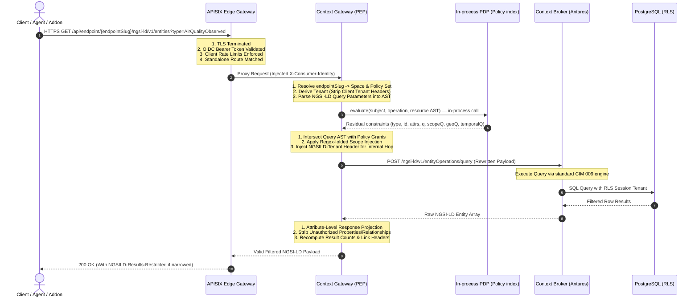

# Architecture Overview

The joinedcontext platform is designed as an open, modular, federated digital twin platform. It guarantees data sovereignty by establishing independent organizational context brokers interconnected via policy-controlled gateways and standardized data space protocols. This document outlines the core operational areas, the end-to-end request flow, and the map of architecture chapters.

## 1. Platform Concept and Operational Areas

The platform structures all responsibilities into four decoupled operational areas:

1. **Platform Access and Policy Firewall:** The perimeter security boundary terminating TLS, verifying OIDC/DPoP credentials, evaluating access policies via an in-process PDP, and rewriting query ASTs (detailed in [05-context-gateway.md](05-context-gateway.md)).
2. **Context Data Plane:** Spec-native ETSI GS CIM 009 context information brokering using Antares in Rust, persisting current state and temporal history in PostgreSQL with Row-Level Security isolation (detailed in [04-context-spaces-and-endpoints.md](04-context-spaces-and-endpoints.md)).
3. **Configuration Plane:** Declarative, GitOps-driven configuration management where Gitea repositories act as the single source of truth, reconciled to runtime state via `jcctl` (detailed in [06-configuration-as-code.md](06-configuration-as-code.md)).
4. **Workloads, Presentation and Tooling:** User interfaces, telemetry ingestion pipelines, and agent façades that interact strictly through standard endpoints (detailed in [08-pipelines.md](08-pipelines.md), [09-portal.md](09-portal.md), and [16-apps-on-demand.md](16-apps-on-demand.md)).

The non-negotiable architectural invariant states: Every request enters a digital twin through that twin's own PEP and is evaluated against that twin's own policies, with the assignee being whoever is on the wire at that hop. No component trusts upstream enforcement.

## 2. Request Flow and Enforcement Pipeline

## 3. Core Component Summary

The core platform runtime consists of memory-safe Rust services and standard open-source engines. For the complete list of core components, technology stacks, container footprints, and pluggable addons, see [Deployment/04-components-and-addons.md](../Deployment/04-components-and-addons.md). Component operational responsibilities, interfaces, and failure behaviors are detailed in [14-components.md](14-components.md).

## 4. Architecture Chapter Map

| Chapter | Specification | Core Question Answered |
|---|---|---|
| **02 Principles** | [02-principles.md](02-principles.md) | What fundamental rules govern all technical decisions? |
| **03 Domain Model** | [03-domain-model.md](03-domain-model.md) | How are digital twin entities, identifiers, and scopes structured? |
| **04 Context Spaces & Endpoints** | [04-context-spaces-and-endpoints.md](04-context-spaces-and-endpoints.md) | How is context data isolated and exposed in multiple formats? |
| **05 Context Gateway** | [05-context-gateway.md](05-context-gateway.md) | How does the PEP rewrite queries and enforce policy decisions? |
| **06 Configuration as Code** | [06-configuration-as-code.md](06-configuration-as-code.md) | How is the twin configured via Git, `jcctl`, and review lanes? |
| **07 Agents & MCP** | [07-agents-and-mcp.md](07-agents-and-mcp.md) | How do autonomous AI agents interact securely with the platform? |
| **08 Data Pipelines** | [08-pipelines.md](08-pipelines.md) | How does Bento process real-time and scheduled telemetry? |
| **09 Portal** | [09-portal.md](09-portal.md) | How are the administrative web UI and REST API built? |
| **10 Dashboards & Visualization** | [10-dashboards-and-visualization.md](10-dashboards-and-visualization.md) | How are high-density spatial dashboards rendered? |
| **11 Data Models** | [11-data-models.md](11-data-models.md) | How are LinkML schemas authored, imported, and mapped? |
| **12 Identity & Access** | [12-identity-and-access.md](12-identity-and-access.md) | How do Keycloak, service identities, and scopes interoperate? |
| **13 Security** | [13-security.md](13-security.md) | What trust zones and BSI TR-03187 controls secure the twin? |
| **14 Components** | [14-components.md](14-components.md) | What are the roles, interfaces, and failure modes of each service? |
| **15 Migration from v2** | [15-migration-from-v2.md](15-migration-from-v2.md) | How do deployments transition from the legacy CIVITAS/CORE v2 platform? |
| **16 Apps on Demand** | [16-apps-on-demand.md](16-apps-on-demand.md) | How are purpose-built applications generated and restricted? |
| **17 Artifact Store** | [17-artifact-store.md](17-artifact-store.md) | Where are rendered schema artifacts, mappings, and builds stored? |
| **18 Data Space Connector** | [18-data-space-connector.md](18-data-space-connector.md) | How are contracts with unknown participants negotiated and turned into Endpoint grants? |
| **19 Agent Runner** | [19-agent-runner.md](19-agent-runner.md) | How does an agent build an application without ever holding a credential? |
| **20 App SDK** | [20-app-sdk.md](20-app-sdk.md) | What does a generated application's code import, and how is it previewed? |

## Related

- [02-principles.md](02-principles.md) — architectural principles governing platform engineering.
- [03-domain-model.md](03-domain-model.md) — structural domain model, organizations, and URN syntax.
- [05-context-gateway.md](05-context-gateway.md) — PEP firewall mechanics and AST query rewriting.
- [14-components.md](14-components.md) — detailed component responsibilities, interfaces, and failure modes.
- [../Deployment/04-components-and-addons.md](../Deployment/04-components-and-addons.md) — component packaging, sizing, and addon integration.
