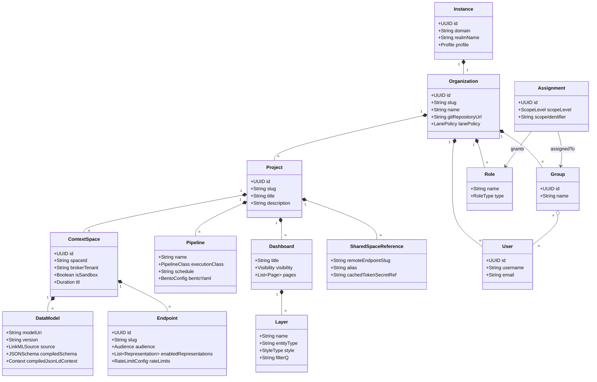
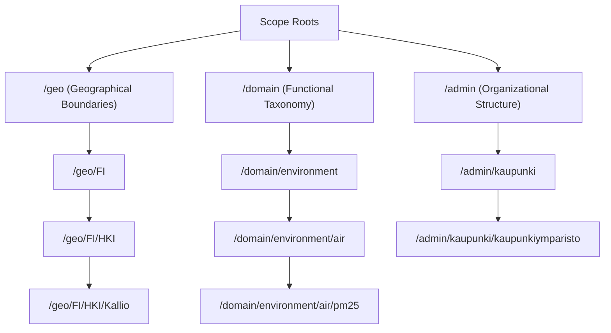

# Domain Model & Identity Specification

This document specifies the structural domain model, entity relationships, identity lifecycle, URN minting standards, and hierarchical scope taxonomy of the joinedcontext platform.

## 1. Domain Entity Model



## 2. Entity Definitions

### Instance

The physical Kubernetes deployment boundary running on a single domain. An Instance maps directly to a dedicated Keycloak realm and Linkerd mesh scope. One Instance serves one Organization (a city, a utility, a company): one configuration repository, one Keycloak subtree, one gateway org domain (PF-01). A neighbouring town or a utility that wants its own configuration runs its own instance, and the two share data through Endpoints under policy, the same way any two twins do.

### Organization

The primary organizational boundary (e.g. `helsingin-kaupunki`). It owns user accounts, organizational groups, global role templates, and exactly one Git repository (the Org Repository) hosted in Gitea.

### Project

A collaborative workspace owned by a specific department or initiative (e.g. `transport`, `waste`). A Project groups related Context Spaces, Pipelines, and Dashboards.

Who may open one is the organization's choice, `Organization.spec.projects.creation` (PF-65): `anyone` lets every signed-in person of the organization start a project, `group: <name>` the members of one `Group` (PF-62), and `org-admin`, the default, keeps it to those who hold `propose` on `Project`. A new project is one `Change` through the same door as every kind, `POST /api/v1/projects` with a `Project` manifest, and the merge request carries two files: `projects/{name}/project.yaml` and `users/assignments/{name}-creator.yaml`, the `RoleBinding` that makes the creator `steward` of the project and nothing more (PF-66). The lane is yellow: an `org-admin` approves it, or, when the setting is `anyone` and the installation runs `lax` (PF-57), it merges by itself, which is how a city lets every department open its own workspace in a minute. Changing that binding afterwards is a red-lane change like any binding (PF-52). Project scope is not a future thing: a `RoleBinding` names exactly one of `spec.scope.organization`, `spec.scope.project` and `spec.scope.contextSpace`, and the creator's binding uses the project one. The name is a DNS-1123 label, unique in the organization and reserved by the open Change (PF-67), because it is the `{space}` segment every URN of the project's spaces begins with. What a project holds, spaces, endpoints, pipelines, apps, service accounts, follows the project: the creator's `steward` binding at project scope covers all of it by additive inheritance (PF-60).

Self-service has a ceiling, because one node fills up: every project opened under the setting starts with the organization's default quota, `Organization.spec.projects.quota` (PF-73), over the dimensions of PF-17 and the ones self-service adds, apps, agent runs per day, entities per space and requests per minute per Endpoint. A project may lower its own numbers in the yellow lane; raising one above the default is a red-lane change an `org-admin` approves, so nobody grows their own project past what the organization gave it. The Portal's verdict refuses the change that would cross a limit before a merge request exists, naming the limit, "pipelines 4 of 3", on the form, the REST API, the assistant and an import alike (PF-74); the reconciler and the agent runner hold the same line at run time; and the Project page shows usage against each limit (PF-75).

A project also ends, and self-service means it ends often. Deleting one is a red-lane `Change` that an `org-admin` or the project's own administrator approves, and it cascades in the open: the merge request removes every space (the broker tenant is dropped after a data export was offered), every Endpoint (its slug retired), every binding and project role, every app with its builds and every service account, so no grant and no reference outlives the project; a `SharedSpaceReference` from another project to one of its Endpoints refuses the deletion until it is removed, and the Change names it (PF-77). The name stays reserved for a cooling period the organization sets, `Organization.spec.projects.nameCooldownDays`, 30 days by default and `0` for none, counted from the commit that removed the project: opening a project under that name again answers when it becomes free (PF-78). Moving a project to another instance is download, import under the target's overlay and a checksum comparison from the bundle index; only when the target reports every manifest equal is the source deleted (MF-42), which is what "easily transferred" means here.

**A project is a registry entry and a repository** ([ADR-N-029](../Decisions/adr-n-029-one-repository-per-project.md)). In layout 2 the project's configuration is a Git repository of its own, and the organization repository holds one registry entry per project, `projects/{slug}.yaml`, naming that repository, the ref this deployment runs and this deployment's parameter values (PF-85, PF-86). The two are one `Project`: the entry says where the project comes from and what this deployment sets, the repository's `project.yaml` says what the project is. The registry slug is the project's name everywhere else, the `{project}` of the resource API, of a namespace and of every rendered id, so one repository may run under two slugs as two projects ([06 §1.3](06-configuration-as-code.md#13-the-project-registry)).

- **Version and parameters.** `project.yaml` carries `spec.version` (semver) and `spec.parameters`, one declaration per knob a deployment sets (`type` of `string`, `integer`, `number`, `boolean` or `secret`, and optionally `default`, `description` and `enum`); a manifest writes `{param:name}` and a mapping `env("JC_PARAM_<NAME>")`. A release is the tag `v{version}` of the project repository, and the registry entry pins one, so staging and production run two versions with two sets of values (CC-88).
- **Creation** creates the repository from the template and its registry entry in one operation, both or neither, and the creator's binding with them (PF-88, PF-66). Because a Change targets one repository (CC-87), the Portal opens the organization Change for the entry and the binding and seeds the repository once that Change is approved.
- **Membership** is forge membership: the project's readers and writers are the forge teams `{slug}-readers` and `{slug}-writers`, and a person without a binding on the project cannot clone its repository (PF-87, [12 §2a](12-identity-and-access.md#reading-the-repository-in-the-forge)).
- **Deletion** archives the repository instead of removing a subtree, keeps the name for the cooling period and removes the registry entry (PF-77, PF-78, PF-88).
- **Duplicate** is a fork, or an import of the project's git bundle, under a new slug with parameters of its own; the copy renders its ids from the new slug and cannot write into the origin (PF-89). **Move** is the git-native export and import, verified by head commit per repository (MF-45, MF-46, [06 §6](06-configuration-as-code.md#a-whole-project-as-git-export-import-duplicate-move-mf-45mf-47-pf-89)).

### Context Space

Its name is the `{space}` segment of every URN it holds, unique in the organization (PF-44), so with many projects the Portal and the assistant propose `{project}-{name}` and accept a bare name only when it is free; a collision names the owning project to those who may read it and says "taken" to everyone else (PF-76).

An isolated data domain mapped 1:1 to an NGSI-LD broker tenant. A Context Space owns its local entities, subscriptions, registrations, and Data Models. A Context Space is owned by exactly one Project.

### Endpoint

An access-controlled view over a Context Space exposed through an unguessable 128-bit random base32 slug (`/api/endpoint/{endpointSlug}`). Endpoints define allowed representations and audience rules.

### Pipeline

An automated ETL flow running Bento (`warpstreamlabs/bento`, MIT). Pipelines ingest data from external protocols (MQTT, HTTP, SQL) and update Context Spaces via standard Endpoints.

### Dashboard & Layer

Declarative visual presentation manifests. A Dashboard contains multiple pages, which render multiple map, table, or chart Layers bound to Endpoints.

### Key Performance Indicator

An indicator is data, not configuration: one NGSI-LD entity of type `KeyPerformanceIndicator` in the project's indicator space, `{project}-kpi` (PF-54), which is an ordinary Context Space with its own Endpoints, Policies and Dashboards. The type follows OASC MIM8 (ecosystem indicators) and names ISO 37120 indicators where one exists; the terms below are the platform's, published in the `@context` `jc-core` renders. What every indicator carries (PF-55):

| Attribute | NGSI-LD kind | Meaning |
|---|---|---|
| `name` | Property (string) | the indicator's short name, the `{localId}` of its URN |
| `calculationFormula` | Property (string) | how the value is computed, e.g. `avg(pm10) over AirQualityObserved` |
| `currentValue` | Property (number or string) with `unitCode` (UN/CEFACT) and `observedAt` | the value as last computed |
| `calculationPeriod` | Property (`{ "start", "end" }`, ISO 8601) | the window the value covers |
| `updatedAt` | Property (DateTime) | when the value was written |
| `derivedFrom` | Relationship (one or many) | the Endpoint URN the sources were read through, and the source entity URNs when they are few |
| `computedBy` | Relationship | the Pipeline URN or the agent run URN that computed it |

```json
{
  "id": "urn:ngsi-ld:KeyPerformanceIndicator:hel.fi:helsinki-kpi:average-pm10",
  "type": "KeyPerformanceIndicator",
  "name": { "type": "Property", "value": "average-pm10" },
  "calculationFormula": { "type": "Property", "value": "avg(pm10) over AirQualityObserved" },
  "currentValue": { "type": "Property", "value": 18.4, "unitCode": "GQ", "observedAt": "2026-09-13T08:00:00Z" },
  "calculationPeriod": { "type": "Property", "value": { "start": "2026-09-13T07:00:00Z", "end": "2026-09-13T08:00:00Z" } },
  "updatedAt": { "type": "Property", "value": { "@type": "DateTime", "@value": "2026-09-13T08:00:12Z" } },
  "derivedFrom": { "type": "Relationship", "object": "urn:ngsi-ld:Endpoint:hel.fi:helsinki:helsinki-all" },
  "computedBy": { "type": "Relationship", "object": "urn:ngsi-ld:AgentRun:hel.fi:helsinki:3f9c2a1e" }
}
```

`jc-core` refuses an indicator whose id is not of this type in a `-kpi` space, or that lacks `calculationFormula`, `derivedFrom` or `computedBy`, and the gateway refuses the same at admission (PF-43). A Pipeline writes indicators on a schedule with the runner's service account through an Endpoint of the space (PL-32, PL-36); the assistant computes one on request, shows the value with its formula and sources, and the person who asked writes it with their own session, so the write is theirs and the Policy of the indicator space decides (PF-55, AG-20).

### When one number is not the indicator (DM-60)

`KeyPerformanceIndicator` holds **one** number for **one** window, with the formula and the
provenance that make it auditable. "Average PM10 over the last hour" is that shape, and so is
almost every indicator a city publishes on a dashboard.

Some are not. "Population by district by age group by year" is one indicator with three
dimensions, and squeezing it into this type gives one of two bad answers: one entity per cell,
each claiming to be a separate indicator, so nothing can ask for the whole table or slice it; or
one entity whose `currentValue` is a nested blob, which no filter reaches into and no export can
give a column. Statistics has a vocabulary for exactly this — the W3C **RDF Data Cube** (`qb`),
which SDMX-shaped data uses — and the shape is worth writing down before somebody invents a
third bad answer:

| | `KeyPerformanceIndicator` | A data cube |
|---|---|---|
| Holds | one value, one window | a table of values over several dimensions |
| Declared by | nothing: the type is fixed (PF-55) | a **Data Structure Definition** in the space, naming its dimensions and its measures |
| One entity is | the indicator | one **observation**, a single cell |
| Asks answered | "what is it now", "how did it move" | the two above, plus "slice it by district", "sum it over age" |
| Use it when | one number is the answer | a dimension of the answer is a question of its own |

**What a cube would look like here.** Nothing about it needs a new protocol: a Data Structure
Definition is a `DataModel` whose class is annotated as the DSD, its dimension slots are
`VocabProperty` or `Relationship` (a district is an entity, an age band is a term of a
vocabulary — §1.1) and its measure slots are plain `Property` with a unit (DM-59). An
observation is then an ordinary NGSI-LD entity in the indicator space, carrying one value of
each dimension and one of each measure, with an id whose `{localId}` is the DSD's name and the
dimension key. The rendered artifacts gain one more formalism beside SHACL and OWL,
`model.qb.ttl`, which is what an SDMX consumer reads; every other surface — the endpoint, the
policy, the filters, the export — is the one it already has, because an observation is an entity.

**Not built.** No model in this platform has more than one dimension today, and none of the
seeded indicators, pipelines or dashboards asks for a slice. Building the DSD annotation, the
generator and the schema surface for no consumer would put a permanent vocabulary into four
components to serve a case nobody has brought yet, and a data cube modelled without a real one
in front of it is a guess committed to the architecture. The shape above is the decision; the
implementation waits for the first model that needs it, and the question that unblocks it is
which indicator that is (T-1186, T-1187, T-1188).

---

## 3. Identity and URN Specification

All entity identifiers in the platform MUST conform to the deterministic URN scheme defined in ADR 001. Random UUIDs are prohibited outside the final local identifier segment to preserve prefix routing and indexing integrity (R34).

### URN Structure

```text
urn:ngsi-ld:{Type}:{orgDomain}:{space}:{localId}
```

| Segment | Meaning | Constraints | Example |
|---|---|---|---|
| `urn:ngsi-ld:` | NGSI-LD URN prefix | fixed literal | `urn:ngsi-ld:` |
| `{Type}` | entity type short name exactly as declared in the published Data Model (the JSON-LD term, not the expanded IRI) | `^[A-Z][A-Za-z0-9]{1,63}$`, PascalCase, Smart Data Models name where one exists | `AirQualityObserved` |
| `{orgDomain}` | the Organization's **verified internet domain** (`Organization.spec.domain`), the same domain that backs its `did:web` identity | lowercase DNS name, dots allowed, no port or path | `hel.fi`, `vodarne-bb.sk` |
| `{space}` | the Context Space name inside that Organization (`ContextSpace.metadata.name`) | `^[a-z0-9][a-z0-9-]{0,62}$` (PF-09) | `air-quality` |
| `{localId}` | local identifier, unique within the space and type | `^[A-Za-z0-9._~-]{1,128}$` (RFC 8141 pchar subset without `:`) | `station-kallio-01` |

Why these four segments: `{orgDomain}` is the only identifier an organisation already owns worldwide, so no registry of issuer codes is needed and two instances can never mint the same URN; `{space}` is unique inside the organisation (PF-09) and names the exact NGSI-LD tenant that owns the entity; `{Type}` matches the entity's `type`, so any URN says what it is, who minted it and where it lives without a lookup. The legacy scheme (`{Typ}:{Razidlo}:{Evidencia}:{Meno}`, ADR 001) had the same shape with a free-form issuer code; joinedcontext pins the issuer to the verified domain.

### Concrete URN examples

- Sensor observation: `urn:ngsi-ld:AirQualityObserved:hel.fi:air-quality:station-kallio-01`
- Traffic flow: `urn:ngsi-ld:TrafficFlowObserved:hel.fi:transport:detector-mannerheimintie`
- Waste container of a utility company: `urn:ngsi-ld:WasteContainer:hsy.fi:waste:c-77492`
- Policy entity (administrative space of the organisation): `urn:ngsi-ld:Policy:hel.fi:admin:public-air-quality`
- Scope definition: `urn:ngsi-ld:ScopeDefinition:hel.fi:admin:geo-fi-hki-kallio`

### Enforcement

The scheme is enforced, not recommended:

1. **Gateway admission (writes).** On `POST /entities`, `entityOperations/*`, `PATCH`/`PUT` with a body id, the Context Gateway parses the id and rejects with 400 (RFC 7807, `type: …/urn-scheme`) when: the URN has more or fewer than four NSS segments; `{Type}` differs from the entity's `type`; `{orgDomain}` is not the domain of the Organization that owns the target space; `{space}` is not the target Context Space of the request (the tenant the gateway resolved, SP-05); `{localId}` violates the charset. Writers cannot mint identifiers for another organisation or another space (R24, GW20).
2. **Federated entities.** Entities returned through a Context Source Registration keep the foreign `{orgDomain}`; the gateway rejects a local write whose `{orgDomain}` is foreign, so remote data can be read and replicated (through a Mapping that mints local ids) but never impersonated.
3. **Configuration time.** `jcctl` validates seed entities, Policy and ScopeDefinition ids, subscription and registration `idPattern`s against the scheme; CI fails the merge request otherwise. Blueprints and the LinkML Editor's example generator only produce conforming ids; a Bento pipeline mints its own with `"urn:ngsi-ld:%v:%v:%v:%v".format(…)` over `env("JC_ORG_DOMAIN")`, the variable the reconciler injects into every pipeline runner from the project's Organization, so a pipeline file never writes a domain of its own:

   ```text
   let domain = env("JC_ORG_DOMAIN")   # injected by the reconciler from the Organization (PF-44)
   root.id = "urn:ngsi-ld:%v:%v:%v:%v".format("Device", $domain, "energie", this.device_id)
   ```

   The domain travels as an environment variable rather than as a function the reconciler would register, because a pipeline file has to stay native Bento that runs unmodified under `bento lint` and `bento test` (PL-03), and stock Bloblang has no function registry a reconciler can extend without shipping a plugin and a forked runner binary.
4. **Resolution.** `urn:ngsi-ld:{Type}:{orgDomain}:{space}:{localId}` resolves to `/cs/{space}/ngsi-ld/v1/entities/{urn}` on the instance that serves `{orgDomain}` (SP-02); another instance finds it through the organisation's `did:web` document, which lists its platform host.
5. **Registrations.** Context Source Registrations anchor their `idPattern` to the full prefix `^urn:ngsi-ld:AirQualityObserved:hel\.fi:air-quality:.*$`, so federation queries route to the one authoritative space (R33, R34).

Organizations declare the domain once (`Organization.spec.domain`); the reconciler verifies ownership by DNS TXT record or by the served `did:web` document before any space of that organisation can accept writes (PF-41). The Portal's reconciler records and reports the verification (T-2377), and the Context Gateway refuses writes when the owner switches the gate on (T-2572):

- **State.** `Organization.status.domainVerification` holds `state` (`pending`, `verified`, `failed`), `method` (`dns-txt` or `did-web`), `checkedAt`, `reason` (on `failed`, in words a person acts on, never the resolver's raw answer), `challenge`: 32 random bytes, base64url, minted once per Organization and kept in the Portal's database, so a restart does not invalidate a published record, and `record`: the record to publish, spelled out as `_joinedcontext.{domain} TXT "jc-verify={challenge}"`. A changed `spec.domain` keeps the challenge and starts the state over at `pending`.
- **Check.** The reconciler resolves the TXT record, or fetches `https://{domain}/.well-known/did.json` with no redirect off `{domain}` and looks for the instance host among its services, over its own egress rule and with a timeout. A failure is a recorded state, never a crash. A `verified` state is checked again once `checkedAt` is 30 days old, a `pending` or `failed` one after ten minutes. The check runs only in a Portal with a database.
- **Gate.** The platform setting `domainVerification` is `report` (the default: the state is recorded and shown, writes are not refused) or `enforce` (a write to a space of an Organization whose state is not `verified` answers `403` naming the Organization). Every existing installation starts unverified, so `enforce` is the owner's switch once the seeds verify. The Context Gateway enforces it, as `JC_GATEWAY_DOMAIN_VERIFICATION`; any other value stops the gateway at start. The state lives in the Portal's database, so the gateway reads it where it already reads the running previews: `GET /internal/domain-verifications` on the Portal's internal listener, with its own ServiceAccount token, every ten seconds ([API/01](../API/01-portal-api.md)). Every space the gateway serves belongs to the Organization of its repository, the one whose `spec.domain` is the gateway's `{orgDomain}`. Under `enforce` the gateway refuses a write on every NGSI-LD door (an endpoint's tree, a space's tree, and the write tools of both MCP façades, which pass through the same path) after the Policy decision, so a caller who may not write at all still learns only that. It fails closed: before the first answer, when the Portal has not confirmed the list for a minute (six missed fetches), or when the list does not name the Organization, the state is unknown and the write is refused; one failed fetch does not stop writes. Reads are never refused.

---

## 4. Scope Hierarchy Taxonomy

Every entity managed within the platform MUST carry one or more `scope` attributes conforming to the three-rooted hierarchical taxonomy defined in ADR 004:



### Taxonomy Rules

- **/geo**: Grounded in international standards (ISO 3166-1, NUTS, UN LOCODE, organisational cadastral codes).
- **/domain**: Grounded in EuroVoc, COFOG, Smart Data Models domains, and ISO 37120 indicators.
- **/admin**: Grounded in organizational units per W3C Organization Ontology (W3C ORG).

All scopes are registered in the broker as `ScopeDefinition` entities carrying `isRoot`, `isChildOf`, and `scopeString` attributes (ADR 005), ensuring runtime discoverability for UI tree components (R19).

---

## 5. Manifest examples of the organization-level kinds

The kinds that carry the identity rules of this chapter are shown here once; `ContextSpace` lives in
[06-configuration-as-code.md](06-configuration-as-code.md#2-manifest-envelope--kinds-catalogue-cc-09-cc-12),
`Endpoint` and `SharedSpaceReference` in [04-context-spaces-and-endpoints.md](04-context-spaces-and-endpoints.md#3-the-endpoint-model).
`Organization` and `Project` are organization-level kinds and carry `namespace: org` (MF-02); every other kind
carries the project slug.

Titles and descriptions on manifests are single plain-text strings in the author's language (UI-50), rendered strictly as text and never as markup. The Portal never asks for per-language variants of a user's own words; its own interface chrome stays translated in locale files. Reading the legacy language map form `{ en: …, sk: … }` is accepted through release `v0.9` and refused from `v1.0`; `jcctl` rewrites it to a single string on the next change. Where a deliberate translation is needed, an optional `translations` map beside `title` may be provided.

### Organization

```yaml
apiVersion: joinedcontext.com/v1alpha1
kind: Organization
metadata:
  name: helsinki              # DNS-1123 label, unique in the Instance
  # The examples in this documentation use Helsinki open data as their demonstration
  # instance. It is an illustration, not a deployment of or for the City of Helsinki.
  namespace: org
  title: "Helsingin kaupunki"
  description: "Pääkaupunki"
spec:
  domain: hel.fi         # verified internet domain, the {orgDomain} of every URN (PF-41)
  gitRepositoryUrl: https://forge.hel.fi/kaupunki/config.git
  locales: [sk, en, de, cs]         # ordered, most preferred first (PF-25)
  defaultLocale: sk                 # the fallback locale, MUST be one of spec.locales (PF-25, PF-26)
  contacts:
    - role: administrative          # administrative | technical | data-protection | security
      name: "Odbor digitalizácie"
      email: digital@example.org
```

### Project

```yaml
apiVersion: joinedcontext.com/v1alpha1
kind: Project
metadata:
  name: air-quality
  namespace: org
  title: "Ilmanlaatu"
spec:
  organizationRef: { kind: Organization, name: helsinki }
  quotas:                           # per Project (PF-17), at most the organization's default (PF-73), checked by Conftest (PF-18)
    contextSpaces: 5
    residentPipelines: 3
    publicEndpoints: 2
    ingestEventsPerSecond: 500
    apps: 3
    agentRunsPerDay: 20
    entitiesPerSpace: 200000
    requestsPerMinute: 600          # per Endpoint
```

In layout 2 the project repository's `project.yaml` also carries the project's version and its deployment knobs (CC-88); the schema of the pinned platform tag does not know the two fields yet:

```yaml excerpt
spec:
  version: 1.4.0                    # semver; the release is the tag v1.4.0 of the project repository
  parameters:                       # one declaration per deployment knob, a subset of JSON Schema
    stationCount: { type: integer, default: 8, description: "Stations the feed reads" }
    region: { type: string, default: uusimaa, enum: [uusimaa, pirkanmaa] }
    ingestToken: { type: secret }   # a secretRef name, set per deployment
```

### Policy

A `Policy` manifest is the authored form of the `Policy` entity of ADR 002; `jcctl` renders it into
`urn:ngsi-ld:Policy:{orgDomain}:{space}:{name}` in the administrative space, and the gateway's in-process PDP
compiles that entity into its grant index (R3, [05-context-gateway.md](05-context-gateway.md#1-execution-pipeline-stages)).
The four residual constraints are NGSI-LD query strings, byte-identical to what `…/access` returns (EP-56); the
gateway parses them, `jc-core` only carries them.

```yaml
apiVersion: joinedcontext.com/v1alpha1
kind: Policy
metadata:
  name: public-air-quality
  namespace: helsinki
  title: "Julkinen ilmanlaatudata"
spec:
  contextSpaceRef: { kind: ContextSpace, name: air-quality }
  effect: permission                          # permission (default) | prohibition (GW4, GW8)
  assigner: did:web:hel.fi
  assignee: { kind: role, id: public }        # user | group | role | serviceAccount | did
  operations: [queryEntity, retrieveEntity, queryTemporal]   # CIM 009 names only (R8)
  information:                                # RegistrationInfo shape (R6)
    - entities:
        - type: AirQualityObserved
          idPattern: "^urn:ngsi-ld:AirQualityObserved:hel\\.fi:air-quality:.*$"
      propertyNames: [pm10, pm25, dateObserved, location]
      relationshipNames: [refDistrict]
  q: "pm10>=0"
  scopeQ: "/geo/FI/HKI"
  geoQ: "georel=within;geometry=Polygon;coordinates=[[[19.10,48.70],[19.20,48.70],[19.20,48.76],[19.10,48.76],[19.10,48.70]]]"
  temporalQ: "timerel=after;timeAt=P-1D"
  validity: { from: "2026-09-01T00:00:00Z", to: "2027-09-01T00:00:00Z" }
```

`operations` takes the CIM 009 Table 4.20-1 operation names, and the five **named operation groups**
of Table 4.20-2 beside them (R8, GW34). A group is a name for the table's own list and nothing more:
the PDP expands it to exactly these operations, so a grant of `retrieveOps` is a grant of
`retrieveEntity` and `queryEntity` and of nothing else, and an operation nobody granted stays refused
(GW-18). A name that is neither an operation nor a group is refused when the manifest is validated;
it is never ignored.

| Group | Writes | Expands to |
|---|---|---|
| `retrieveOps` | no | `retrieveEntity`, `queryEntity` |
| `updateOps` | yes | `updateEntity`, `updateAttrs`, `replaceEntity`, `replaceAttrs` |
| `associationOps` | no | `retrieveEntity`, `queryEntity`, `queryBatch`, `retrieveEntityTypes`, `retrieveEntityTypeDetails`, `retrieveEntityTypeInfo`, `retrieveAttrTypes`, `retrieveAttrTypeDetails`, `retrieveAttrTypeInfo`, `createSubscription`, `updateSubscription`, `retrieveSubscription`, `querySubscription`, `deleteSubscription` |
| `federationOps` | no | everything `associationOps` expands to, plus `retrieveEntityMap`, `updateEntityMap`, `deleteEntityMap`, `createEntityMapQueryEntity` |
| `redirectionOps` | yes | `createEntity`, `updateEntity`, `appendAttrs`, `updateAttrs`, `deleteAttrs`, `deleteEntity`, `mergeEntity`, `replaceEntity`, `replaceAttrs`, `retrieveEntity`, `queryEntity`, `purgeEntity`, `retrieveEntityTypes`, `retrieveEntityTypeDetails`, `retrieveEntityTypeInfo`, `retrieveAttrTypes`, `retrieveAttrTypeDetails`, `retrieveAttrTypeInfo`, `retrieveEntityMap`, `updateEntityMap`, `deleteEntityMap`, `createEntityMapQueryEntity` |

"Writes" is what the change lane and the Portal read to mark a grant as one that can change context
data: a group counts as a write when any operation it stands for writes, which raises the review lane
and never lowers it (AP-09).

### ScopeDefinition

```yaml
apiVersion: joinedcontext.com/v1alpha1
kind: ScopeDefinition
metadata:
  name: geo-fi-hki-kallio
  namespace: helsinki
  title: "Kallio"
spec:
  scopeString: /geo/FI/HKI/Kallio    # one of the three roots of section 4
  isRoot: false
  isChildOf: /geo/FI/HKI             # absent when isRoot is true (ADR 005, R19)
```

## Related

- [01-overview.md](01-overview.md) — architectural overview and domain model placement.
- [04-context-spaces-and-endpoints.md](04-context-spaces-and-endpoints.md) — Context Spaces and Endpoint surfaces.
- [11-data-models.md](11-data-models.md) — LinkML data modeling and entity types.
- [12-identity-and-access.md](12-identity-and-access.md) — users, roles, groups, and service accounts.
- [../Requirements/platform.md](../Requirements/platform.md) — normative platform invariants (PF-01…PF-47).
