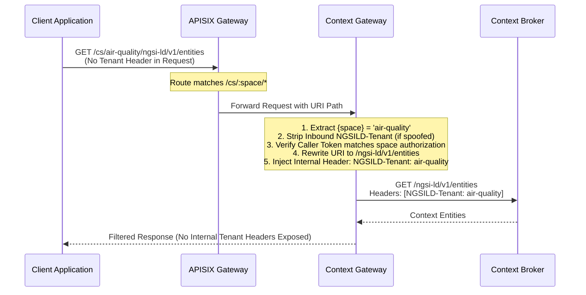
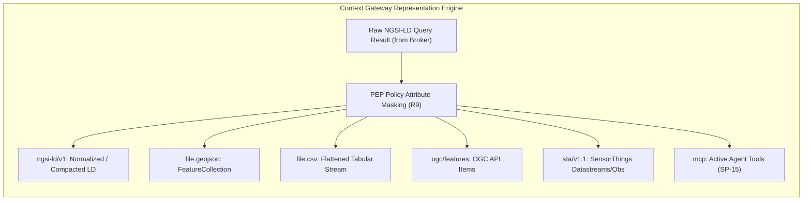
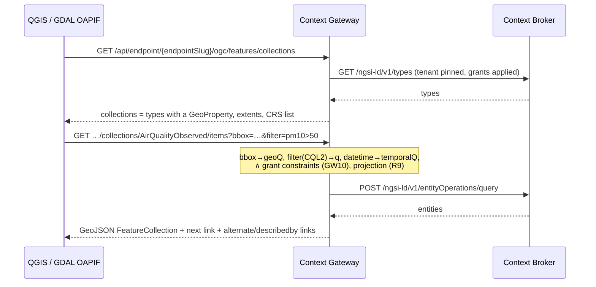
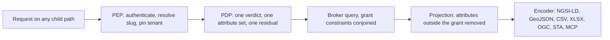

# Context Spaces & Endpoints Surface

This specification establishes the public URL structure, tenancy abstraction, representation transformation pipeline, audience controls, and sharing model for Context Spaces and Endpoints per SP-01–SP-21.

```text
+---------------------------------------------------------------------------------------------------+
|                                 CONTEXT SPACES & ENDPOINTS SURFACE                                |
|                                                                                                   |
|  1. Canonical Context Space Root (Project Owners & Administrators Only):                          |
|     https://{host}/cs/{space}/                                                                    |
|     ├── ngsi-ld/v1/          (Standard ETSI CIM 009 Tree: entities, subscriptions, types)        |
|     ├── mcp                  (Direct Data-Plane Model Context Protocol Streamable HTTP)           |
|     ├── schema/              (index.json, then v{major}/: LinkML, JSON Schema, @context, SHACL…)  |
|     └── dump/                (ZIP of what the caller's grants read, generated per request, SP-13) |
|                                                                                                   |
|  2. Shared & Public Endpoint Surface (Addons, Public APIs, External Consumers, Agents):          |
|     https://{host}/api/endpoint/{endpointSlug}/            (GET → DCAT-AP record of the endpoint)  |
|     ├── ngsi-ld/v1/          (Policy-Narrowed Standard ETSI CIM 009 API)                          |
|     ├── mcp                  (Façade MCP with Grants Rendered into Active Tool Annotations)       |
|     ├── file.{json|csv|xlsx|geojson|zip}  (file-style downloads of the filtered entity set, EP-41…45)|
|     ├── ogc/features/        (OGC API - Features Part 1: collections, items)                      |
|     ├── sta/v1.1/            (SensorThings API v1.1 Read Path Projection)                         |
|     ├── schema/              (Granted view of the model: LinkML, JSON Schema, @context, SHACL, OWL) |
|     ├── access               (Caller's effective grants: AuthZEN JSON, ODRL 2.2, UCAST AST)      |
|     └── .well-known/         (RFC 9728 OAuth Protected Resource Metadata)                        |
+---------------------------------------------------------------------------------------------------+
```

## 1. Context Space Canonical Surface (SP-01–SP-04)

Every Context Space is accessible to project owners via a stable, deterministic base path:

```text
https://{host}/cs/{space}/
```

Where `{space}` is the Context Space name, identical to the `{space}` segment of the entity URN (`urn:ngsi-ld:{Type}:{orgDomain}:{space}:{localId}`, Architecture/03; SP-01).

### Permitted Child Paths

No arbitrary path extensions are permitted. The gateway routes exactly these (SP-04, `crates/context-gateway/src/app.rs`); any other path under a space answers `404`:

- `/cs/{space}`: the space's record, the list of its children in JSON-LD, Turtle or HTML (`handlers/space_surface.rs`). `GET /cs` lists the spaces.
- `/cs/{space}/ngsi-ld/v1/`: Byte-for-byte implementation of the ETSI GS CIM 009 REST specification (SP-03).
- `/cs/{space}/mcp`: Data-plane Model Context Protocol Streamable HTTP endpoint (SP-03, SP-14).
- `/cs/{space}/schema/index.json` and `/cs/{space}/schema/v{major}/{artifact}`: the same schema surface an Endpoint serves (§1a), named by its space. `{major}` is `v` and a whole number; anything else answers `404`.
- `/cs/{space}/dump/`: the space's dump, the `file.zip` bundle (EP-41) over everything in the space the caller's grants read, generated per request and projected as `ngsi-ld/v1/` projects it (SP-13). Past the byte or row ceiling it is `413` whole, never a truncated archive; nothing is stored, so there is no dated or `latest` dump to pin (T-2391).

A space has no `access` child: the caller's grants are an Endpoint's (`/api/endpoint/{slug}/access`).

---

## 1a. Schema surface of an Endpoint (`schema/`)

Consumers of a shared endpoint (partner organisations, open-data users, agents) must be able to learn **what the data contains** without an account on the Portal. Every endpoint therefore publishes the data model in every mainstream formalism, all rendered from the same LinkML source by Model Tools (Architecture/11 §8), all **narrowed to the endpoint's grant**: a type or attribute the endpoint may not read does not appear in any of the formats (EP-06 parity holds for schemas as for data).

```text
/api/endpoint/{endpointSlug}/schema/
├── index.json                       catalogue: the models, their versions, formats, sha256 and links (JSON)
├── v{major}/
│   ├── model.linkml.yaml            LinkML source (granted projection)        text/yaml
│   ├── model.schema.json            JSON Schema draft-07                       application/schema+json
│   ├── context.jsonld               JSON-LD @context (SP-13)                   application/ld+json
│   ├── model.shacl.ttl              SHACL shapes (gen-shacl)                   text/turtle
│   ├── model.owl.ttl                OWL ontology (gen-owl)                     text/turtle
│   ├── model.rdf.ttl                RDF rendering of the schema (gen-rdf)      text/turtle
│   └── model.md                     human documentation (gen-doc)              text/markdown
```

Each artifact also answers to a short name (`linkml`, `json-schema`, `context`, `shacl`, `owl`, `rdf`, `docs`; `handlers/schema.rs::artifact_of`). EP-46 to EP-49 also name an `example.jsonld`, per-type slices, a `latest` redirect and `.jsonld`/`.nt` suffixes for the RDF; the gateway serves none of them, and a request for one answers `404`.

Rules: `Accept` negotiation is honoured on `v{major}/model`: `text/turtle` returns the SHACL, `text/turtle` with an `owl` or `rdf` profile the OWL or the RDF rendering, `text/yaml` the LinkML, `text/markdown` the documentation, `application/ld+json` the `@context`, and anything else the JSON Schema. The suffix form is canonical and cacheable. Every artifact carries a strong `ETag` (sha256 of the bytes) and revalidates, and `Link: rel="describedby"` pointers come from every NGSI-LD, OGC and file representation (EP-46…EP-52). The same artifacts are reachable through the endpoint's MCP as tools (`describe_schema(format=…)`) and as MCP *resources* (`schema://{slug}/v{n}/model.shacl.ttl`), so an agent can pull the SHACL or the LinkML directly (DM-46).

### Who projects, and why the gateway renders the RDF family

A schema on this surface is a projection of the policy set, not a file: two callers of one endpoint see two different documents, and the difference is the point (EP-47). That is what decides where each formalism is produced.

The JSON Schema and the `@context` are **projected**: Model Tools compiled them at publish time, the checkout carries them, and the gateway removes the classes and slots the caller may not read by walking the JSON. What was reviewed is what is served, minus what the grant forbids.

SHACL, OWL, RDF, the LinkML source and the Markdown cannot be projected that way, so the gateway **renders them from the projected model**: the same class and slot set the JSON Schema projection produced, serialised into each formalism. Three consequences follow, and they are why this is the decision rather than a shortcut:

- EP-47 holds by construction. A slot removed from the projection is absent from every formalism because every formalism is built from the projection; no formalism can drift from another or from the data paths.
- The gateway parses no RDF. It emits Turtle, which is text generation; parsing a Turtle document to redact a triple would put an RDF stack in a security path, and a parsed-and-reserialised document is no longer the reviewed bytes anyway, so the argument for serving the committed file falls with it.
- Model Tools does not render one artifact set per grant shape. Grants change without the model changing, so a pre-rendered per-grant set would go stale on the next policy edit, and the number of distinct grant shapes an endpoint faces is unbounded.

The rendered documents name their terms in the model's own URN namespace, `urn:joinedcontext:model:{name}:v{major}:`, so the SHACL, the OWL and the RDF agree about what a slot is without the platform minting a resolvable ontology IRI on somebody else's behalf. A rendered shape is never `sh:closed`: an entity legitimately carries the slots this caller may not read, and a closed shape would declare that entity invalid.

Rendering is per request, from data already in memory, and the cost is a string build over a class list. The artifact store (Architecture/17) keeps the full unprojected set for the model's own lifecycle (DM-44); it is not what an endpoint serves.

## 1b. Access surface of an Endpoint (`access`)

Schemas say what the data *is*; the access surface says what *this caller may do with it*. Every space and every endpoint answers `GET …/access` with the caller's **effective grant document**: the Policy set of the space, partially evaluated with the subject, the endpoint and the time known and the resource unknown. What remains is a residual condition per type and operation, which is exactly what a client needs to pre-filter its own UI, push the filter into its own database, or decide before acting whether a write will succeed. An App with full rights sees `operations: ["*"]` and no residual; a public consumer sees three readable attributes and a geo constraint.

Three representations of the same decision (EP-55…EP-60), all narrowed to the caller like the data itself:

| Representation | Media type | For whom |
|---|---|---|
| **Permissions** (default): one entry per grant, each naming the entity type it reaches, the allowed operations (CIM 009 names), the attributes and the residual `q`/`scopeQ`/`geoQ`/`temporalQ` as NGSI-LD query strings; `prohibitions[]` beside them, and the Endpoint's rate limit | `application/json` (AuthZEN resource-search shape, R51) | apps, agents, dashboards |
| **ODRL 2.2 policy** in the `ngsi-ld:` profile (R52, ADR 003): `permission[]` with `action`, `target` (type + `refinement`), `constraint[]`, `assignee`, `assigner`; `prohibition[]` for explicit denies | `application/odrl+json` (JSON-LD), `text/turtle` | data-space connectors, contract tooling, partner platforms |
| **Grant AST**: the residual condition as a UCAST tree (`and`/`or`/`not`, `eq`/`in`/`gte`/`geo_within`/`scope_under`/`time_between`) plus the attribute projection, i.e. the output of partial evaluation | `application/vnd.joinedcontext.grant-ast+json` | clients that compile the condition into SQL, DuckDB, a JS filter or a map layer filter |

The `ngsi-ld:` profile defines exactly the left operands the gateway serves and reads back, and
nothing else; a document carrying any other term is not in this profile (R52, EP-57). `entities`
is not among them: the type a permission reaches is the `target`, not a refinement of it.

| Left operand | Where it sits | What it narrows |
|---|---|---|
| `ngsi-ld:attrs` | `target.refinement` | the attribute names the grant projects, from the Policy's `propertyNames` and `relationshipNames` |
| `ngsi-ld:id` | `target.refinement` | one entity id |
| `ngsi-ld:idPattern` | `target.refinement` | the anchored id pattern the grant reaches |
| `ngsi-ld:q` | `permission.constraint` | the residual NGSI-LD query |
| `ngsi-ld:scopeQ` | `permission.constraint` | the scope subtree |
| `ngsi-ld:geoQ` | `permission.constraint` | the area, with the ODRL operator `ngsi-ld:within` and its siblings |
| `ngsi-ld:temporalQ` | `permission.constraint` | the time window, when it is not expressible as `dateTime` |
| `dateTime` | `permission.constraint` | the time window as ODRL 2.2's own core operand, with `gteq`/`lteq` |

Rules: the document is computed by the same in-process PDP that enforces requests (EP-06 parity), cached per (subject, endpoint, policy digest) and invalidated with the PDP cache; it never reveals policies that do not apply to the caller (a denied type is absent, not listed as denied, R20). `POST …/access/check` (AuthZEN evaluation) stays for single-decision dry runs. The MCP exposes the same as `describe_access(format)` and resource `access://{slug}` so an agent learns its rights before it plans (AG, MIM0-R11). `ServiceAccount` credentials and App tokens get the same document, which is how the Portal's "Data access" tab and CI's `dataNeeds ⊆ grants` check (AP-06) are computed.

```json
GET /api/endpoint/zt4qm7ge2xdv6ksb3ncf5arw2y/access        Accept: application/json
{
  "subject": { "type": "user", "id": "did:web:hel.fi:users:aino" },
  "resource": { "type": "endpoint", "id": "zt4qm7ge2xdv6ksb3ncf5arw2y", "space": "air-quality" },
  "permissions": [
    {
      "resource": { "type": "AirQualityObserved", "idPatterns": ["^urn:ngsi-ld:AirQualityObserved:hel\\.fi:air-quality:.*$"] },
      "actions": ["retrieveEntity", "queryEntity", "queryTemporal", "updateEntity"],
      "attributes": ["pm10", "pm25", "location", "dateObserved"],
      "constraints": { "geoQ": "georel=within;geometry=Polygon;coordinates=[[…]]", "scopeQ": "/geo/FI/HKI", "temporalQ": "timerel=after;timeAt=P-1D" }
    },
    {
      "resource": { "type": "District" },
      "actions": ["retrieveEntity", "queryEntity"],
      "attributes": ["name", "location"],
      "constraints": {}
    }
  ],
  "prohibitions": [],
  "limits": { "requestsPerMinute": 600 }
}
```

One entry per grant, not per type: two policies reaching the same type are two entries, and the
caller's rights on that type are their union. An unconstrained grant carries `"attributes": "*"`
and empty `constraints` — there is no separate `full` flag to keep in step with them. The
document's identity is in the ODRL representation's `uid`, which is the digest of the grants
themselves; the permissions document carries no digest of its own.

## 2. Tenancy Without Client Headers (SP-05–SP-09)

Clients and external applications MUST NOT provide, read, or configure the `NGSILD-Tenant` HTTP header (SP-05, GW20).



1. **Header Stripping:** The edge gateway strips any inbound `NGSILD-Tenant` header submitted by clients (SP-07).
2. **Tenant Derivation:**
   - On Context Space paths (`/cs/{space}/...`), the tenant is resolved from the `{space}` path parameter.
   - On Endpoint paths (`/api/endpoint/{endpointSlug}/...`), the tenant is resolved from the internal Endpoint configuration mapped to the `{slug}`.
   - For authenticated users, the token's authorized organization and space claims are verified against the derived tenant (SP-06). Mismatches immediately return `404 Not Found` to prevent existence disclosure (R20, SP-06).
3. **Internal Injection:** The Context Gateway injects `NGSILD-Tenant: {space}` exclusively on the internal private mesh hop between the gateway and the context broker (SP-07, GW25).

---

## 3. The Endpoint Model

An Endpoint is a published, policy-narrowed view over a Context Space. Endpoints are declared as manifests in the project repository:

```yaml
apiVersion: joinedcontext.com/v1alpha1
kind: Endpoint
metadata:
  name: air-quality-public
  namespace: helsinki
spec:
  contextSpaceRef: air-quality
  slug: zt4qm7ge2xdv6ksb3ncf5arw2y  # Random base32 >= 128-bit
  audience: public        # project-list | organization | public
  allowedProjects: []     # Populated when audience: project-list
  policyRef: urn:ngsi-ld:Policy:hel.fi:air-quality:public-air-quality
  enabledRepresentations:
    - ngsi-ld
    - mcp
    - geojson
    - csv
    - ogc-features
    - sta
  rateLimits:
    requestsPerMinute: 600
    burst: 50
  fileLimits:            # Ceiling of one file.* download (EP-44)
    maxFileRows: 50000
    maxFileBytes: 33554432
  caching:
    maxAgeSeconds: 60
  projection:            # Never served here, whatever the Policy allows (EP-61)
    hiddenAttributes:
      - calibrationOffset
  viewMappingRef:        # Serve this space as another model, read only (EP-54)
    kind: Mapping
    name: hki-air-quality-to-sdm
```

### Opaque Slug Resolution

Endpoints are addressed by random, unguessable slugs (`/api/endpoint/{endpointSlug}`). The slug is a base32 string derived from at least 128 bits of cryptographic entropy.

The Context Gateway keeps the endpoints in an in-memory map (`ArcSwap<HashMap<String, Arc<Endpoint>>>`, `crates/context-gateway/src/resolver.rs`):

- A slug lookup is one hash lookup; nothing on the request path reads the repository.
- A reaper re-reads the repository checkout every second and swaps the whole table when it changed (`pdp/reaper.rs`), so an Endpoint manifest `jcctl apply` changed is served within EP-19's two seconds (R48).

### Audience Control

- `project-list`: Access is restricted to explicitly listed Projects within the Organization. External and unlisted callers receive `404 Not Found`.
- `organization`: Access is permitted to any authenticated user or service account belonging to the parent Organization.
- `public`: Access is permitted without authentication under the `public` anonymous role grant (GW22).

An Endpoint MAY set `callerRole: true` and list `roles[]` of `{name, subjects}`; a caller it admits holds `endpoint:{project}/{endpoint}` and the matching `endpoint:{project}/{endpoint}/{role}` for that request only, which is how an application's grants stay inside the application (AP-96, AP-97, [16 §12](16-apps-on-demand.md#12-roles-of-an-application)).

---

## 3a. The Endpoint's own DCAT-AP record

`GET /api/endpoint/{endpointSlug}/` is the endpoint's front door, and it answers the same record in three serialisations: DCAT-AP as JSON-LD for a harvester, Turtle for a triple store, HTML for the person who followed the link (EP-27). Nothing about the dataset is authored twice. The CKAN publisher takes its metadata from here (EP-63), the data space connector takes its offer from here, and a citizen reads the page.

The record lists two families of distribution, and the second is what makes the endpoint the single place to learn about a dataset:

| Distribution | From | Carries |
|---|---|---|
| One per enabled representation | `spec.enabledRepresentations` | `dcat:accessURL` under the endpoint, `dcat:mediaType`, `dcat:accessService` naming the endpoint's `dcat:DataService`, and `dcterms:conformsTo` naming the standard it answers (NGSI-LD, OGC API - Features, SensorThings, MCP) |
| One per schema artifact | the schema surface (§1a) | `dcat:accessURL` under `schema/v{major}/`, `dcat:mediaType`, `spdx:checksum` with the sha256 of the projected document, and `dcterms:conformsTo` naming the formalism (LinkML, JSON Schema, JSON-LD, SHACL, OWL, RDF) — EP-68 |

The checksum is the digest of what this caller would download, not of a file on disk: the schema surface projects to the grant, so two callers see two documents and each record names its own. That is the same digest the artifact's `ETag` carries, so a harvester that stored the record can tell whether the artifact it holds is still current without fetching it (EP-51).

Access rights are on the record rather than only in the policy set. `dcterms:accessRights` is `PUBLIC` for a `public` audience and `RESTRICTED` for every other, and a restricted endpoint points at its own `access` document with `odrl:hasPolicy`, which is the pointer the data space connector dereferences to build an offer (EP-69, EP-55, DS-08). A catalogue therefore knows before it harvests whether the dataset it is about to list is one anybody may open.

The record is the granted projection like everything else on the endpoint. A representation or a schema artifact this caller may not read is absent from it, never listed and then refused: listing it would disclose that it exists (R20).

### The catalogue block (EP-78…EP-80)

What a catalogue needs beyond the distributions is authored once, on the Endpoint, in `spec.catalog`. Every member is optional, and the record carries what is declared and nothing it would have to guess:

```yaml excerpt
spec:
  catalog:
    publisher:
      name: { fi: Helsingin kaupunki, sv: Helsingfors stad, en: City of Helsinki }
      uri: https://www.hel.fi/
    contactPoint:
      name: Helsinki open data
      email: opendata@example.org        # a role address, never a person (EP-80)
    license: CC_BY_4_0                   # EU licence table code
    attribution: { en: "Source: City of Helsinki, Helsinki Region Infoshare" }
    themes: [TRAN, REGI]                 # EU data-theme table codes
    keywords: { fi: [tapahtumat], en: [events, culture] }
    spatial: [FI1B1, "https://sws.geonames.org/658225/"]   # a NUTS code or a location IRI
    temporal: { start: 2019-01-01 }
    frequency: DAILY                     # EU frequency table code
    source:
      - url: https://hri.fi/data/en_GB/dataset/helsinki-events
        title: { en: Helsinki events (Linked Events) }
        description: { en: Events of the City of Helsinki, as Linked Events publishes them }
    pipelineRef: { kind: Pipeline, name: helsinki-events }
    applicableLegislation: ["http://data.europa.eu/eli/reg_impl/2023/138/oj"]
```

| `spec.catalog` | Record term | Rule |
|---|---|---|
| `publisher` | `dct:publisher` | a `foaf:Agent` with `foaf:name` per language and the `uri` as its identifier; the Portal prefills the Organization's title and `https://{domain}/` |
| `contactPoint` | `dcat:contactPoint` | a `vcard:Kind` with `vcard:fn` and `vcard:hasEmail` as a `mailto:` IRI; a role address, prefilled from the Organization's `open-data` contact and checked against the organization's members (EP-80) |
| `license` | `dct:license` | the EU licence table IRI, on the dataset and on every distribution; the codes accepted are the ones whose duties are known (below), anything else is refused at validation with the list |
| `attribution` | `dct:rights` | a `dct:RightsStatement` on every distribution, the words the attribution duty asks for |
| `themes` | `dcat:theme` | the EU data-theme table IRIs (`AGRI`, `ECON`, `EDUC`, `ENER`, `ENVI`, `GOVE`, `HEAL`, `INTR`, `JUST`, `REGI`, `SOCI`, `TECH`, `TRAN`) |
| `keywords` | `dcat:keyword` | one language-tagged literal per keyword |
| `spatial` | `dct:spatial` | a NUTS code becomes `http://data.europa.eu/nuts/code/{code}`; an `https://` IRI (a municipality's GeoNames or national register entry) is used as written |
| `temporal` | `dct:temporal` | a `dct:PeriodOfTime` with `dcat:startDate` and `dcat:endDate`, either one alone for an open interval |
| `frequency` | `dct:accrualPeriodicity` | the EU frequency table IRI (`CONT`, `HOURLY`, `DAILY`, `WEEKLY`, `MONTHLY`, `QUARTERLY`, `ANNUAL`, `IRREG`, `NEVER`, `UNKNOWN`) |
| `source` | `dct:source` | the original open dataset the pipeline reads, as a `dcat:Dataset` with its own title and description, which DCAT-AP requires of every dataset it names |
| `pipelineRef` | `prov:wasGeneratedBy` | a `prov:Activity` naming the pipeline of this project that fills the space |
| `applicableLegislation` | `dcatap:applicableLegislation` | an ELI IRI, for a high-value dataset the Implementing Regulation (EU) 2023/138 |

The Endpoint itself is a `dcat:DataService`: its `dcat:endpointURL` is the endpoint's own URL, it `dcat:servesDataset` the record, and every representation distribution names it in `dcat:accessService`. Both serialisations carry the same graph, and the Turtle is written from the JSON-LD so they cannot drift apart. The JSON-LD keeps its compact keys (`dct:title`, `dcat:accessURL`) and declares their prefixes and IRI-valued terms in its own `@context`, so a reader that reads keys and a reader that expands to RDF see the same record; the classes DCAT-AP requires of a referenced value (`dct:LicenseDocument`, `dct:RightsStatement`, `dct:MediaType`, `dct:Standard`, `skos:Concept` with its label) are stated in `@included`. `dcat:mediaType` is the IANA media-type IRI (`https://www.iana.org/assignments/media-types/application/ld+json`) and `dct:format` the EU file-type IRI, because DCAT-AP ranges both over IRIs; a reader that wants the bare media type takes the part after `media-types/`. A dataset with no description of its own, on the endpoint or the space, says which space it serves, because DCAT-AP makes `dct:description` mandatory. The platform pins the SEMIC DCAT-AP 3.0 SHACL shapes in its repository and the fast CI lane validates both serialisations of every record variant against them (EP-78).

### The offer the licence makes (EP-79)

A licence is a policy too, and the record states it as one. `odrl:hasPolicy` carries an `odrl:Offer` whose assigner is the organization and whose permission is `odrl:use` of the dataset, with the duties the licence imposes:

| Licence | Duty on the permission |
|---|---|
| `CC0`, `ODC_PDDL` | none |
| `CC_BY_4_0`, `ODC_BY` | `odrl:attribute` |
| `CC_BYSA_4_0`, `ODC_ODBL` | `odrl:attribute` and share-alike (`cc:ShareAlike`) |

A non-public Endpoint's offer adds a constraint on `odrl:recipient`, `isPartOf` the organization, and its audience class in the `ngsi-ld:` profile (`organization` or `project-list`); it never names a project, a group or a person, because the record is read by callers who hold none of them (EP-69, R20). A restricted Endpoint's record keeps the pointer to its own `access` document beside the offer, so its `odrl:hasPolicy` names both. The access surface's ODRL `Set` (§1b) carries the same duties on every permission, so the offer and the grants cannot tell a consumer two different things (EP-57, DS-03).

The Portal's endpoint page shows the record as a card — who publishes it, under what licence, how often it updates, where it comes from — and the offer as plain sentences ("Anyone may use this data if they credit the City of Helsinki"), with the raw JSON-LD, Turtle and ODRL one link away. The endpoint form has a Catalogue section with a picker for each table-coded member.

---

## 3b. The named projection of a model

One LinkML per Context Space is the truth (DM-01). An Endpoint exposes a subset of it, and that subset is a manifest of its own, `kind: ModelProjection` (MP-01), so the second Endpoint that needs the same view of `Vehicle` references it instead of retyping it, and a change to the view is made once. The projection says what an Endpoint is *about*; the Policy set still says who may read it, and the gateway intersects the two (MP-02, GW10, GW11), so a projection narrows and never widens.

The worked example, end to end. The space's model has two classes:

```yaml
# projects/helsinki/spaces/fleet/datamodels/fleet.linkml.yaml (DM-01)
id: https://hel.fi/models/fleet
name: fleet
classes:
  Vehicle:
    slots: [id, name, type, location, speed, odometer, maintenanceNote]
  User:
    slots: [id, name, type, age, email, badgeNumber]
```

The projection names the subset a partner gets, `Vehicle(id, name, type)` and `User(id, name, type, age)`, with an optional residual filter in NGSI-LD query syntax:

```yaml
# projects/helsinki/spaces/fleet/projections/partner-view.yaml
apiVersion: joinedcontext.com/v1alpha1
kind: ModelProjection
metadata:
  name: partner-view
  namespace: helsinki
spec:
  contextSpaceRef: fleet
  dataModelRef: { kind: DataModel, name: fleet, version: "3" }
  classes:
    - name: Vehicle
      slots: [id, name, type]
    - name: User
      slots: [id, name, type, age]
  filter:                 # Optional; intersected like a REWRITE constraint (GW10)
    q: category=="public"
```

A class absent from `spec.classes` is not exposed at all; a class listed with an empty `slots` list is exposed with identity only (`id`, `type`). CI and `jcctl plan` refuse a projection that names a class or slot version 3 of `fleet` does not have, every offending name listed at once, so an Endpoint that exposes nothing cannot look like one that works.

The Endpoint references it as `spec.projectionRef: { kind: ModelProjection, name: partner-view }` beside its `policyRef`, and so may any number of others; the rest of the Endpoint is what section 3 shows (`contextSpaceRef: fleet`, `audience: project-list` with `allowedProjects: [regional-transport]`, `enabledRepresentations: [ngsi-ld, geojson]`, and a slug minted by the Portal, never typed, EP-75). The member appears in the published `Endpoint` schema with T-0563.

What comes out of the schema surface (MP-03, EP-47) is the projected model, generated, never a second hand-maintained file; two callers with different grants see two different documents, each a subset of this one:

```yaml
# GET /api/endpoint/3ecozggnnhjlp5miouhia53mr2/schema/v3/model.linkml.yaml
id: https://hel.fi/models/fleet
name: fleet
classes:
  Vehicle:
    slots: [id, name, type]
  User:
    slots: [id, name, type, age]
```

### One name, a minted slug

The form asks for one name. `metadata.name` is what a person types; `spec.slug` is minted by the Portal from at least 128 bits of entropy and shown read-only beside the public URL (EP-02, EP-75). The two are different on purpose: EP-03 forbids the slug from encoding the space, project or organization, and a hand-typed slug is exactly how an internal name reaches a public URL. Do not "simplify" them into one field.

### Read set and write set

An Endpoint defines what may be read and, separately, what may be written (EP-73, EP-74). The LinkML editor shows both per class: a read column that is the projection, and a write column carrying the id pattern, the type and the scope constraint. The Endpoint renders two Policies from it, a read grant over the projection and a write grant whose `information[].entities` carries `id`, `idPattern` or `type` and whose `scopeQ` narrows by scope (R6…R8, R24). Nothing outside the write set is writable through the Endpoint, and a write still goes through the Endpoint's Policy like every other write (PF family).

### Alternative considered

A second Context Space holding a `ContextSourceRegistration` back to the first, filtered, gives the same narrowing. It is the wrong default: it duplicates the space, doubles the reconciler's work, and turns the filtered copy into a thing that can drift from the source. The gateway's REWRITE already narrows on the read path with no copy (GW10, GW11), and EP-70 requires an Endpoint over registrations to answer every read over the union. Registrations stay what they are for, federation across sources (section 5a), not narrowing one.

## 4. Multi-Representation Translation Engine

Every representation served by an Endpoint represents an on-the-fly projection of the underlying NGSI-LD entity state, evaluated under the identical Policy rules.



### Representation Mappings

| Path Segment | Representation | Transformation Mechanism | Missing / Unrepresentable Concepts |
|---|---|---|---|
| `/ngsi-ld/v1/` | Canonical NGSI-LD | Passes through broker response after attribute stripping (R9). Supported content types: `application/ld+json`, `application/json`. | Fully spec-native. |
| `/file.geojson` | GeoJSON (RFC 7946) | Maps entity `location` or geometry property to GeoJSON `geometry`. All other properties become GeoJSON `properties`. | Multi-geometry entities require layer selection; relationships are stringified to target URNs. |
| `/file.csv` | Flat Tabular CSV | Flattens nested Property objects into dot-notated column headers (e.g. `temperature.value`). | An array of scalars gets one column per index (`coordinates[0]`); an array holding arrays or objects, such as a polygon's rings, is one cell carrying its JSON, so no geometry widens the table. |
| `/ogc/features/` | OGC API – Features Part 1 | Exposes entity types as OGC Collections (`/collections/{type}/items`). Conformance classes: Core, OpenAPI 3.0, GeoJSON. | CQL-Text queries compile to NGSI-LD `q` parameters; transactions are read-only. |
| `/sta/v1.1/` | OGC SensorThings API v1.1 | Maps SensorThings entities to NGSI-LD equivalents: `Things` → Entity, `Datastreams` → Entity Property, `Observations` → Temporal Property instances. | MultiDatastreams and MQTT batch ingestion are not mapped on read-only endpoints. |
| `/mcp` | Model Context Protocol | Exposes entity queries as dynamic agent tools with active tool schemas reflecting effective grants (SP-15). | Non-query operations omitted unless write grants explicitly exist in Policy. |

---

### OGC API – Features as an endpoint representation

Enabling `ogc-features` on an endpoint makes the gateway serve a complete OGC API – Features service (Part 1 Core, OpenAPI 3.0, GeoJSON; Part 2 CRS; CQL2 basic) generated from the space's DataModels and the caller's grants. There is no GeoServer and no copy of the data: a QGIS request becomes one NGSI-LD query.



| OGC concept | Platform mapping |
|---|---|
| Collection | NGSI-LD entity type with at least one `GeoProperty` in the published DataModel |
| Feature id | entity URN |
| `geometry` | the type's primary GeoProperty (`location` by default, configurable per collection in the Endpoint manifest) |
| `properties` | flattened, policy-projected attributes (EP-37) |
| `bbox`, `datetime`, `filter`, `limit`, `next` | `geoQ`, `temporalQ`, `q` (CQL2 subset), `limit`, `offset`/EntityMap |
| `/api` | per-endpoint OpenAPI 3.0.3 generated from the JSON Schemas (DM-02) |
| writes | none (405); OGC API – Features Part 4 is not claimed |

Normative detail: EP-29…EP-40; wire examples in [API/02](../API/02-endpoint-representations.md#6-ogc-api---features-part-1); conformance testing in [Testing/02](../Testing/02-conformance-tests.md).

## 4a. Representation Parity and Endpoint Configuration

Every representation of one Endpoint answers from the same decision. A request is authenticated by the PEP, the in-process PDP produces one verdict for the operation it stands for, the grant's residual constraints are conjoined into the broker query (GW10), the broker answers, and the projection removes every attribute the grant does not cover (R9). Only then does a translator encode that one projected entity set as compacted JSON-LD, a GeoJSON `FeatureCollection`, CSV rows, an XLSX sheet, an STA observation set or an MCP tool result. Parity is therefore a property of the pipeline rather than a rule each translator has to remember: an attribute hidden in one representation is absent from all of them because they all read the same projected entities, and a caller who may not read a type sees the same empty answer everywhere.



The MCP façade is an encoder like the others: a tool call is turned into the NGSI-LD request it stands for and handed to the same handler the HTTP path uses, so discovery and enforcement cannot drift (EP-25, EP-26, SP-16).

### Configuring one Endpoint

| Field | Effect | When absent |
|---|---|---|
| `spec.enabledRepresentations` | The child paths this Endpoint serves. A path that is not enabled answers `404`, the same answer an unknown slug gets (EP-23). | At least one is required. |
| `spec.rateLimits.requestsPerMinute`, `spec.rateLimits.burst` | Token bucket per consumer IP or authenticated identity, advertised in `RateLimit-*` headers (EP-20). Set only by choice: no door writes one the person did not ask for. | No limit: the gateway counts nothing and sends no `RateLimit-*` fields. The edge's anti-flood bucket still protects the node. |
| `spec.caching.maxAgeSeconds` | `Cache-Control: max-age` on read responses of every representation. Public endpoints are cached publicly, everything else privately, because a shared cache must never serve one caller's projection to another. | Read responses are validated with ETags and not cached by age. |
| `spec.fileLimits.maxFileRows`, `spec.fileLimits.maxFileBytes` | Ceiling of one `file.*` download; the gateway refuses with `413` rather than truncating, because a short file is indistinguishable from a complete one (EP-44). Both bind every format the endpoint serves, the workbook included. Beside them the gateway keeps a ceiling of its own on what one download may read from the broker before it is refused (64 MiB of entity JSON, T-0810): the row ceiling says how many entities a download holds, not how large they are, and the enforcement point is shared. | 100 000 rows and 64 MiB. |
| `spec.projection.hiddenAttributes` | Attribute names this Endpoint never serves, in any representation. Intersected with the caller's policy projection, so it only ever narrows what the Policy already allows (EP-61). | The policy projection alone decides. |
| `spec.viewMappingRef` | A `Mapping` whose **target** model this Endpoint serves. The gateway translates every entity through the Mapping's compiled IR and rewrites `attrs`, `q` and `geoQ` back through its inverse, so the whole surface speaks the target model (EP-54, DM-51). A view Endpoint is **read only**: every method but `GET`, `HEAD` and `OPTIONS` answers `405` with an `Allow` header. | The space's own model is served. |

`hiddenAttributes` is a publication decision, not an authorization one: the Policy set stays the single place where access is granted, and the Endpoint can subtract from it when the same space is published twice with different amounts of detail. Because the subtraction happens in the projection every representation shares, a hidden attribute is missing from the CSV, the GeoJSON, the MCP tool result and the schema surface alike (EP-47).

### Two endpoints, as an example

The two endpoints below illustrate the fields above; they are not manifests the deployment ships. The seeded ones live in `joinedcontext-deployment/components/context-gateway/seed/helsinki/` (`helsinki-endpoint-*.yaml`).

| | `air-quality` | `transport` |
|---|---|---|
| Space | air quality, one `AirQualityObserved` model | public transport, `Vehicle` and `PublicTransportStop` |
| Endpoint | `public-air`, `audience: public` | `public-transport`, `audience: public` |
| Representations | `ngsi-ld`, `geojson`, `csv`, `xlsx`, `sta`, `mcp` | `ngsi-ld`, `geojson`, `csv`, `ogc-features`, `mcp` |
| Anonymous grant | read `AirQualityObserved`, `dateObserved` and the pollutant properties | read `Vehicle` and `PublicTransportStop`, live position and line |
| Hidden from the public endpoint | the raw calibration attributes of the sensor | the driver identifier and the vehicle's internal fleet id |
| Writes | the ingest ServiceAccount only, through `Policy` | the ingest ServiceAccount only, through `Policy` |

Both endpoints enable `mcp`, so an agent asks the same questions as a browser and gets the same projection: the tool list of `public-transport` offers the temporal tools because the space keeps history, and neither endpoint offers a write tool to an anonymous caller because the PDP grants none.

---

## 5. Cross-Project Sharing Model

Projects do not mount shared database volumes or share context broker credentials. Cross-project data exchange operates strictly via Endpoints:

1. **Publication:** Project A declares an Endpoint inside its Context Space with `audience: project-list` and includes `Project-B` in `allowedProjects`.
2. **Subscription:** Project B declares a `SharedSpaceReference` manifest in its own repository subtree:

   ```yaml
   apiVersion: joinedcontext.com/v1alpha1
   kind: SharedSpaceReference
   metadata:
     name: external-air-quality
     namespace: helsinki
   spec:
     endpointSlug: zt4qm7ge2xdv6ksb3ncf5arw2y
     alias: regional-air-data
   ```

3. **Execution:** Workloads and Dashboards in Project B interact with `https://{host}/api/endpoint/zt4qm7ge2xdv6ksb3ncf5arw2y/...` using Project B's authenticated service account token. The Context Gateway verifies Project B's membership in the endpoint's allowed project list.
4. **Auditability:** The owning project retains complete visibility: revoking or updating the Endpoint in Project A immediately halts access for Project B without impacting underlying storage.
5. **Schema discovery and mapping:** on apply, the reconciler reads the endpoint's `schema/` (LinkML, `@context`, example) and commits it into Project B as a read-only foreign DataModel; Project B then maps it to its own model with a `kind: Mapping`, used either to replicate the data through a pipeline or to translate live federated queries in the gateway (DM-48…DM-53). The same flow works across instances (another city, a company, a national platform), and Project A can publish ready-made mappings or a view endpoint that already speaks the consumer's model (EP-53, EP-54). Details: [Architecture/11 §7.5](11-data-models.md#75-mappings-across-context-spaces-and-instances-federation).

### The assistant drafts the publication (EP-72)

"Share the bike stations with the regional transport team, but hide the maintenance notes" is a publication, and the assistant drafts it rather than performing it. Its `propose_endpoint` tool takes the space, a name, the audience (`project-list` unless the person says otherwise, never `public` by default), the projects, the representations, the attributes to hide and the entity types, and the Portal renders the `Endpoint` manifest with a slug it mints itself (26 base32 characters, EP-02) and `projection.hiddenAttributes` for the masked attributes (EP-61), plus the draft `Policy` manifests that grant `retrieveOps` on the named types to the audience (`role: public`, or one `group` per listed project). The run publishes the rendering as a `tool` event named `propose_endpoint` and a `navigate` event that opens the Endpoint form with the manifest as prefill (UI-45): the person reads the card, changes what needs changing, submits, and the write is an ordinary Change in its lane, red when the audience is `public` (CC-63). Nothing is created until the person submits, and nothing is served until the Change is approved. The Portal's "shared with this project" view (PF-53) is where the receiving project sees the endpoint once it is live and declares its `SharedSpaceReference` in one action.

## 5a. Federation: registrations and the hub endpoint

A `SharedSpaceReference` (§5) points at an Endpoint this platform serves. Federation is the other
direction: the broker of one Context Space is told that part of its data lives in another broker,
and answers queries by asking it. The manifest that says so is
`kind: ContextSourceRegistration`, and NGSI-LD already defines what happens next — CIM 009 clause
4.3.6, distributed operations: the broker matches a query against its registrations, forwards to
the ones that could hold an answer, merges what comes back, and protects itself against a loop.

### The manifest (MF-36)

```yaml
apiVersion: joinedcontext.com/v1alpha1
kind: ContextSourceRegistration
metadata:
  name: transport
  namespace: helsinki
  title: "Transport"
spec:
  # The space whose broker learns about the source. The registration is written into this
  # space's tenant and nowhere else.
  contextSpaceRef: hub
  # Where the data actually is. Exactly one of the two.
  endpointRef: { kind: Endpoint, name: transport-internal }   # a space on this platform
  # endpoint: https://other.example/ngsi-ld/v1                # or a broker elsewhere
  # What the source is claimed to hold, in CIM 009's own shape: this is the `information`
  # array of a csourceRegistration, and it is what the broker matches a query against.
  information:
    - entities:
        - type: Vehicle
      propertyNames: [location, speed, occupancy]
  # How this platform talks to the source (PF-48).
  federation:
    identity: serviceAccount
    serviceAccountRef: { kind: ServiceAccount, name: hub-reader }
  # Optional: seen only inside a query, never by a client
  mode: inclusive
  operations: [federationOps]
  expiresAt: '2027-01-01T00:00:00Z'
```

`spec.information` is deliberately the specification's own member rather than a shape of our own:
a registration is a claim about coverage, the broker's matching rules are written against that
claim, and a translation layer between the two would be a second place for a query to stop
matching. The Portal renders the same fields as a form; the file is what the broker gets.

The file lives at `projects/{project}/spaces/{space}/registrations/{name}.yaml`
([Architecture/06 §2](06-configuration-as-code.md#2-manifest-envelope--kinds-catalogue-cc-09-cc-12)) and the
reconciler projects it onto the broker's `POST /ngsi-ld/v1/csourceRegistrations`, in the tenant
of `contextSpaceRef`. The tenant travels as the standard CIM 009 header on that internal hop and
on no other, which is SP-08 and SP-09 unchanged: no client ever sends it and no client ever sees
it. A registration is red in every lane (CC-63): it changes where an answer can come from.

### The hub

A city has one question and several spaces. "What is happening in Helsinki right now" spans
`transport` and `air-quality`, and asking it should not mean two endpoints, two tokens and a join
in the caller.

A **hub** is a Context Space that holds no entities of its own — only registrations to the spaces
that do, and one Endpoint. That Endpoint is an ordinary Endpoint: the same slug, the same policy
set, the same representations, the same MCP surface. What differs is only what its broker tenant
contains, so every read the specification defines answers over the union of the members
(EP-70):

| Read | On a hub |
|---|---|
| `GET /entities?type=…` | forwarded to every registration whose `information` matches, merged |
| `GET /entities/{id}` | forwarded to the registrations that could hold that id, first complete answer wins |
| `GET /types`, `GET /attributes` | the union of what the members report |
| `GET /temporal/entities…` | each member's history, merged on `observedAt` |
| the endpoint's MCP tools | the same reads, so a connector sees one federated dataset |

```text
                    Endpoint  hel-open  (public or token)
                        │
                 Context Space  hub             ← holds only registrations
                    ┌───┴────┐
     CSR transport  │        │  CSR air-quality
                    ▼        ▼
          Space transport   Space air-quality   ← hold the entities
```

The hub is two manifests beside its registrations: the space, and the Endpoint that serves it.
`transport` above registers into this space, and a second registration does the same for
`air-quality`.

```yaml
apiVersion: joinedcontext.com/v1alpha1
kind: ContextSpace
metadata:
  name: hub
  namespace: helsinki
  title: "Helsinki now"
  description: "No entities of its own: registrations to transport and air-quality"
spec:
  isSandbox: false
---
apiVersion: joinedcontext.com/v1alpha1
kind: Endpoint
metadata:
  name: hel-open
  namespace: helsinki
spec:
  contextSpaceRef: hub
  slug: ljjrcgyemyy5t23ps25gcsfyazyqd5yc
  audience: public
  policyRef: urn:ngsi-ld:Policy:hel.fi:hub:public-read
  enabledRepresentations:
    - ngsi-ld
    - mcp
```

Nothing about the hub is a new code path. The gateway applies the hub Endpoint's policy set and
calls the hub's broker tenant; the broker does the forwarding CIM 009 already specifies. That is
the point of the pattern: a hub is a configuration, not a feature.

### Where an answer came from (EP-71)

A merged answer is worth less if a reader cannot tell which city system said what. Two carriers,
both already defined:

- **Per entity**, when the caller asks for system attributes, the broker's own registration
  details travel with the result, and the gateway passes them through rather than flattening
  them away; system attributes (`createdAt`, `modifiedAt`) survive read policy masking so that
  merged entities retain their provenance even under attribute narrowing.
- **Per result in MCP**, a `jc:source` member naming the registration, because a tool answer is
  read by a model that has no other way to attribute it.

The name is the registration's `metadata.name` and never its URL: a hub answer that leaks a
member's internal address tells a public caller where to knock next.

### Partial answers are answers

A member that is down, slow or refusing must not turn the whole question into an error. CIM 009
gives the shape: the response is `207` with `NGSILD-Warning` naming what did not answer, and the
body carries what did. The gateway passes both through unchanged (EP-70). The alternative,
failing the request, means one member's maintenance window takes the city's map down.

### Pagination stability across a federated read (EP-70)

Paging over a union is where a federation shows its seams. Two pages of the same query are two
distributed operations, and between them a member can add, change or delete an entity, so a
naive federation returns an entity twice or skips it entirely.

CIM 009 clause 5.14 answers this with an **EntityMap**: the broker performing the distributed
operation resolves the candidate entity ids once, stores them as a resource, and returns its
URI in the `NGSILD-EntityMap` response header. A caller that sends the same URI back on the
next page is served against the frozen id set instead of a fresh fan-out. The map expires; it
is a pagination aid, not a snapshot of the members' data, so an entity deleted from a member
after the first page is gone from the second page's body even though its id is in the map.

The map belongs to the broker, because the broker is what fans out. The gateway pins the hub
tenant and forwards (§5a, "The hub"); it never queries the registrations itself and so holds no
id set it could stabilise anything against. Its whole part in this is to stay transparent:

- `NGSILD-EntityMap` is not a header a client could use to forge identity or tenancy, so the
  tenancy middleware does not strip it (the stripped set is `NGSILD-Tenant` and the
  `X-`-prefixed identity headers, EP-21) and it reaches the broker as sent.
- The response header naming the map that answered is relayed back unchanged, like
  `NGSILD-Warning` above. The gateway relays every end-to-end response header; it keeps no
  allowlist that a new one would have to be added to.

Antares implements the map (clause 5.14, resources 6.32, 6.34, 6.35) and propagates it to the
registered sources, so a hub over the default broker pages consistently with no gateway-side
mechanism. A gateway-level cache keyed on the query was considered and rejected: it would be a
second candidate map beside the broker's, with its own expiry, able to disagree with the answer
the broker is stabilising against, and it would have to be rebuilt the moment a hub reads
anything the gateway does not parse.

### Direct read and registration scope (PF-48)

A hub space's broker tenant reads member tenants directly through the registration's `tenant`
member (CIM 009 clause 4.3.6.5). The hub Endpoint's policy set is the only gate on a federated
read: the gateway pins the hub tenant, enforces the hub Endpoint's grants, and forwards to the
broker, which executes the distributed query across the registered member tenants. Registering
a member is therefore the act that exposes it to the hub's audience, which is why creating or
modifying a `ContextSourceRegistration` is a Red-lane change signed by a domain steward (CC-63).

To keep this boundary strictly within the steward's domain of control, a
`ContextSourceRegistration` whose member space is outside the hub's project is refused at
validation: a hub may only federate spaces belonging to the same project.

For `spec.federation.identity`:

- **`serviceAccount`** — the direct-read mode where the hub broker reads member tenants directly
  within the same project.
- **`caller`** — requires RFC 8693 token exchange to rewrite the caller's bearer token for the
  member space. Until token exchange is implemented, any request over a space with a registration
  specifying `caller` identity is refused by the gateway with `501 Not Implemented` and an
  RFC 7807 problem document, and nothing is forwarded.

### The federation graph (UI-27, UI-28)

The API serves this (`GET /api/v1/projects/{project}/federation-graph`); the Portal draws no page of it (UI-28), and a tool that draws it reads one shape:

| | |
|---|---|
| **Nodes** | a Context Space, an Endpoint, a `ContextSourceRegistration`, a Pipeline, an App, a `CkanInstance` an Endpoint publishes to (§7), and an external broker a registration names |
| **Edge** | `from`, `to`, a `kind` of `registers`, `serves`, `feeds`, `consumes` or `publishes`, and the manifest it comes from |
| **On a node** | its kind, its name, its title in the reader's locale, a health of `ok`, `degraded` or `unknown`, and the lifecycle phase it last reported (UI-25) |
| **Never on a node** | a token, a `secretRef`'s resolved value, an external broker's credential, or a catalogue's URL; a card shows that a registration authenticates, not with what |

A graph is a projection of the manifests plus the last health each object reported, so it is
derived and holds no state of its own. What it must not become is a second source of truth about
who talks to whom.

## 6. Endpoints in a data space

When the consumer is a participant the organisation has no relationship with, the **data space connector** ([Architecture/18](18-data-space-connector.md)) negotiates an ODRL agreement over the Dataspace Protocol and compiles it into `Policy` entities for the same Endpoint; the consumer then reads through `/api/endpoint/{slug}/…` with an agreement-bound token. The Endpoint's DCAT-AP record (EP-27) is the catalog entry and its access surface (§1b) is the source of the ODRL offer, so nothing is modelled twice.

## 7. Publication to an open-data portal

An open-data catalogue is where a citizen, a journalist or a partner looks first, and the platform's endpoints belong in it. An Endpoint that declares `spec.publish.ckan` becomes one dataset in a CKAN instance, with one resource per representation it already serves. Nothing about the dataset is authored a second time: the metadata is the DCAT-AP record the endpoint answers with (EP-27), so the catalogue and the endpoint cannot drift apart.

```yaml
apiVersion: joinedcontext.com/v1alpha1
kind: Endpoint
metadata:
  name: air-quality-public
  namespace: helsinki
spec:
  contextSpaceRef: { kind: ContextSpace, name: air-quality }
  slug: zt4qm7ge2xdv6ksb3ncf5arw2y
  audience: public
  enabledRepresentations: [ngsi-ld, geojson, csv, ogc-features, sta, mcp]
  publish:
    ckan:
      instanceRef: { kind: CkanInstance, name: open-data }   # where to publish
      organization: helsingin-kaupunki                    # the CKAN organization slug
      name: ilmanlaatu                                 # optional; the endpoint name by default
      license: cc-by                                   # optional; a CKAN licence id (CC-BY 4.0)
      datastore: { representation: csv, refresh: onChange }  # optional row mirror
```

The licence is the one member that may say something the endpoint's record does not: the CKAN licence id the organization chose, used when the Endpoint declares no `spec.catalog.license` and the record therefore names none (§3a).

The instance itself is a manifest like everything else, so a second catalogue is a second file and never a Portal setting nobody can review:

```yaml
apiVersion: joinedcontext.com/v1alpha1
kind: CkanInstance
metadata:
  name: open-data
  namespace: helsinki
spec:
  url: https://data.hel.fi
  organizationDefault: helsingin-kaupunki
  apiTokenRef: { name: ckan-open-data, key: apiToken }
```

### What one Endpoint becomes

| In CKAN | From | Rule |
|---|---|---|
| One dataset (`package`) | the endpoint's DCAT-AP record (EP-27) | title, description, keywords, spatial and temporal coverage, publisher, contact and licence come from there, title and description in the language of the endpoint's space; the reconciler writes no metadata of its own, except the licence `publish.ckan.license` names when the record carries none (EP-63) |
| One resource per representation | `spec.enabledRepresentations` | the resource URL is that representation's own URL under the endpoint, so a download always passes the gateway and its policy set (EP-64) |
| One resource for the schema | the schema surface (§1a) | `schema/index.json`, which lists `model.schema.json`, the SHACL and the rest per model version, so a consumer can validate what it downloaded without the publisher knowing which versions exist |
| One resource per schema artifact | the record's schema distributions (§3a) | every formalism the endpoint serves — LinkML, JSON Schema, `@context`, SHACL, OWL, RDF, the generated documentation — becomes a resource of its own, carrying the sha256 the record declares in CKAN's `hash` field so a download can be checked without asking the endpoint again (EP-68) |
| The dataset's visibility | `spec.audience` | a `public` endpoint becomes a public dataset, anything narrower a private dataset of the organization; the mapping is closed by default, so an audience the publisher does not recognise is private (EP-69, PF-45) |
| Optional DataStore table | the tabular representation | filled through the endpoint's `file.csv`, every row upserted on each `jcctl publish ckan` run (EP-65) |
| The organization | `spec.publish.ckan.organization` | created, when it does not exist, with the `CkanInstance`'s `metadata.title`, else the branding `organisation` name ([Deployment/12](../Deployment/12-branding-and-naming.md)) |

### Why the publisher is an ordinary consumer

The publisher reads the endpoint the way anybody else does: over HTTP, as a ServiceAccount whose grants are the endpoint's own (EP-66). It holds no database connection, no broker credential and no policy of its own. That is what keeps the catalogue safe to publish: a dataset can only ever carry what the endpoint would have served to that account anyway, so a policy narrowed today narrows the next publication too, and a resource URL a citizen clicks is enforced by the gateway rather than by CKAN.

The CKAN API token is resolved from a `secretRef` at reconcile time and lives in memory for the length of the run (EP-67). Withdrawing the `publish` block deletes the dataset through the explicit-deletion path, so a catalogue entry is never orphaned by a manifest edit (CC-19).

### Visibility is the endpoint's, not CKAN's

A dataset is private in CKAN when the endpoint behind it is not public, and the flip happens on the next reconcile rather than by hand: narrowing an endpoint from `public` to `organization` rewrites the dataset in the same run that rewrites its resources. Who may then open a private dataset is decided in Keycloak, not in CKAN: membership of the CKAN organization is the realm role, synced through the CKAN OIDC extension, and the platform creates no CKAN-local users. A DataStore table under a private dataset is private with it, because the row API answers only to a member of the owning organization.

The record itself says the same thing to a harvester that never logs in: `dcterms:accessRights` is `PUBLIC` or `RESTRICTED` from the EU authority list, and a restricted endpoint's record points at its own access document with `odrl:hasPolicy`, which is the offer a data space connector negotiates against (EP-69, DS-08).

### DataStore, when rows are wanted

A CKAN DataStore table gives the catalogue a preview, a filtered API and a SQL surface over the rows. It is optional because it is a copy: the endpoint stays the source. When `datastore` is declared, each `jcctl publish ckan` run reads the endpoint's `file.csv` as the publisher's ServiceAccount and upserts every row, and rows the endpoint no longer returns leave the table (EP-65, EP-44; `crates/jcctl/src/commands/publish_ckan.rs`). The DataStore takes only the `csv` representation; declaring another is refused with the fix named. `publish.ckan.datastore.refresh: onChange`, a refresh driven by the endpoint's subscription, is accepted in the manifest but not wired: today every refresh is a full reload on the next run.

## Related

- [API/02](../API/02-endpoint-representations.md) — referenced above.
- [Testing/02](../Testing/02-conformance-tests.md) — referenced above.
- [Architecture/11 §7.5](11-data-models.md) — referenced above.
- [01-overview](../Architecture/01-overview.md) — where this chapter sits in the whole.
- [00-index](../Requirements/00-index.md) — the normative requirements behind it.
