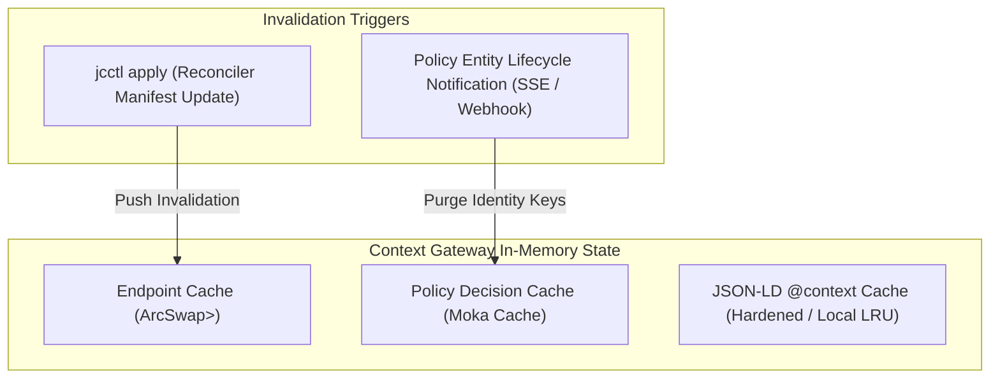

# Context Gateway Internals & Policy Enforcement Point

The Context Gateway is a high-performance security proxy and representation translator implemented in Rust (`axum`, `hyper`, `tower`). It acts as the Policy Enforcement Point (PEP) guarding the context broker, enforcing rules R1–R60 and GW1–GW31.

```text
+---------------------------------------------------------------------------------------------------+
|                                  CONTEXT GATEWAY INTERNALS (PEP)                                  |
|                                                                                                   |
|  Inbound Request (via APISIX Edge Reverse Proxy)                                                  |
|         |                                                                                         |
|         v                                                                                         |
|  Stage 1: Identity & Token Extraction (OIDC Bearer JWT, RFC 9449 DPoP, X-Consumer-Identity)       |
|         |                                                                                         |
|         v                                                                                         |
|  Stage 2: Endpoint / Space Resolver (O(1) in-memory RwLock map; slug -> space + policy metadata)  |
|         |                                                                                         |
|         v                                                                                         |
|  Stage 3: Tenant Pinning & Header Sanitization (Strip NGSILD-Tenant, apply internal tenant)      |
|         |                                                                                         |
|         v                                                                                         |
|  Stage 4: antares-ql Query AST Parser (Strict parse of q, scopeQ, geoQ, temporalQ, attrs)         |
|         |                                                                                         |
|         v                                                                                         |
|  Stage 5: PDP Evaluation & AST Intersection (in-process Policy evaluator, OR-of-ANDs, scope folding)|
|         |                                                                                         |
|         v                                                                                         |
|  Stage 6: Query Dispatch (Rewrite to POST /entityOperations/query if URL length exceeds limits)  |
|         |                                                                                         |
|         v                                                                                         |
|  Stage 7: Downstream Representation Translation & Attribute Projection Masking (R9 Stripping)     |
|         |                                                                                         |
|         v                                                                                         |
|  Outbound Response (Filtered NGSI-LD, GeoJSON, CSV, OGC Features, or MCP Result)                  |
+---------------------------------------------------------------------------------------------------+
```

## 1. Execution Pipeline Stages

### Stage 1: Identity & Token Extraction

The gateway receives requests from APISIX. It validates that the request originated from the meshed ingress via Linkerd mTLS. It extracts the caller identity:

- Verified OIDC claims (`sub`, `iss`, `client_id`).
- Verified Verifiable Presentation claims forwarded by the VCVerifier.
- Service account identities for internal platform components.
- Anonymous callers are assigned the synthetic identity `role:public` (GW22). On an Endpoint with `audience: public` every caller holds that role as well as what its token asserts, so a signed-in person is never granted less than an anonymous one (EP-16).

### Stage 2: Endpoint / Space Resolver

The incoming path is matched:

- `/cs/{space}/*`: Direct space access. Resolves `{space}`.
- `/api/endpoint/{endpointSlug}/*`: Endpoint access. Resolves `{slug}` in the pre-compiled in-memory endpoint cache to extract `contextSpaceId`, `policySet`, `enabledRepresentations`, and `audience`.
- Unknown spaces or slugs terminate immediately with `404 Not Found` (R20).

### Stage 3: Tenant Pinning & Header Sanitization (GW20, SP-05–SP-07)

Any incoming client header matching `NGSILD-Tenant` is unconditionally dropped. The gateway sets the internal tenant header matching the resolved Context Space:

```http
NGSILD-Tenant: {resolved_space_id}
```

This header is exposed only on the internal cluster network to the context broker.

### Stage 4: Query AST Parsing (R56)

The gateway compiles the `antares-ql` parsing engine directly into its binary. Query parameters are parsed into an Abstract Syntax Tree (AST):

- Query filter: `q`
- Scope filter: `scopeQ`
- Geographic filter: `geoQ` (`georel`, `geometry`, `coordinates`, `geoproperty`)
- Temporal filter: `temporalQ` (`timerel`, `timeAt`, `endTimeAt`, `timeproperty`)
- Projections: `attrs`, `pick`, `omit`
- Identifiers: `id`, `idPattern`, `type`

If parameter syntax violates ETSI GS CIM 009 clauses 4.9 or 4.19, the request is rejected with `400 Bad Request` and an RFC 7807 ProblemDetails body.

### Stage 5: PDP Evaluation & AST Intersection (GW10–GW14, ADR 006)

The Policy Decision Point is in-process (ADR-N-003): `Policy` entities from the policy space are compiled into an in-memory grant index and evaluated natively in Rust; no network hop is made per request. An external PDP (OPA) MAY be plugged in behind the same `Pdp` trait for organisations that already operate one, and the AuthZEN-shaped discovery endpoints (R51) keep the PDP swappable.

1. **Policy Matching:** Applicable `Policy` entities matching caller identity and requested operation are retrieved.
2. **Intersection Algebra:**
   `EffectiveQuery = UserQuery ∧ (Grant₁ ∨ Grant₂ ∨ … ∨ Grantₙ)` (GW10)
3. **Conjunctive Merging:**
   Within a single policy grant, constraints are combined with logical `AND`. Across separate matching policies, grants are combined with logical `OR` (GW10).
4. **Scope Folding (R13, R30, ADR 006):**
   To avoid privilege bleed, hierarchical `scopeQ` grants are transformed into anchored regular expressions against the entity `scope` property and conjoined into the `q` parameter:

   ```text
   scope~="^/geo/FI/HKI(/.*)?$"
   ```

5. **Geographic Clamping (GW11):**
   If the user query and the grant both contain geographic boundaries, the gateway determines geometric containment. If disjoint, an empty result is returned immediately without contacting the broker (GW12).

### Stage 6: Broker Query Dispatch (R13, GW14)

If rewritten query parameters exceed HTTP GET URL length thresholds (2048 bytes), the gateway automatically converts the request to an equivalent NGSI-LD batch operation:

```http
POST /ngsi-ld/v1/entityOperations/query
Content-Type: application/json
```

This guarantees that complex disjunctive policy filters never fail due to HTTP 414 URI Too Long errors.

### Stage 7: Response Projection & Masking (R9)

Entities returned by the broker pass through the response projection stage:

- **Attribute Masking:** Any property or relationship present in the entity that is not explicitly granted by the matched policy's attribute whitelist (`propertyNames`, `relationshipNames`) is stripped from the payload (R9).
- **Result Normalization:** The pruned JSON-LD structure is re-validated to ensure it remains a valid NGSI-LD entity.
- **Count Recalculation (R59):** If `count=true` was requested, the gateway recalculates `NGSILD-Results-Count` based on the post-filtered set.
- **Restriction Signalling (R22):** If entities or attributes were pruned **and the request carried `NGSILD-Results-Restricted: true`**, the gateway answers with the header:

  ```http
  NGSILD-Results-Restricted: true
  ```

  The signal is opt-in (R22, GW12). A caller who did not ask is answered as if the result were
  simply what it is, so the header never tells a prober that the space holds more than they saw.
- **Tenant Sanitization (SP-05):** `NGSILD-Tenant` is pinned on the request to the broker and
  removed from the answer, on the space surface as on the endpoint surface. The tenant is an
  internal name and a probe for which spaces exist; it never leaves the gateway.

---

## 2. Reads vs. Writes Enforcement (GW15–GW19)

The gateway enforces fundamentally different validation semantics for read versus write operations:

| Dimension | Read Operations (`queryEntity`, `retrieveEntity`) | Write Operations (`createEntity`, `updateEntity`, `deleteEntity`) |
|---|---|---|
| **Enforcement Model** | **Silent Narrowing (GW15):** The request is rewritten to match only permitted resources. | **Strict Rejection (GW16):** The payload MUST fall 100% inside a single matching policy grant. |
| **Partial Grant Outcome** | Returns subset of matching entities and attributes; missing items are omitted without error (R20). | **Denied Entirely (GW17):** If a single attribute in a PATCH/POST is unauthorized, the entire write is rejected with `403 Forbidden`. |
| **Geographic Validation** | Queries are clamped to the granted polygon (GW11). | The entity's `location` coordinates in the payload are tested for containment inside the granted polygon. |
| **Missing Entity Response** | `GET /entities/{id}` for an unauthorized entity returns `404 Not Found` (R20). | Returns `403 Forbidden` with detailed ProblemDetails specifying unauthorized attributes or scope violations. |
| **Batch Operations** | Returns entities satisfying grants. | Returns `207 Multi-Status` detailing per-entity success or failure (GW18). |

Narrowing starts from a well-formed request (GW31): a `type` that is no NGSI-LD name or a `q` that does not lex is answered `400 BadRequestData` before the PDP adds its constraints, without repeating the value; an empty intersection (GW12) answers well-formed queries only.

Narrowing never rescues a request the specification calls malformed (GW33). A query naming no selector at all — an `id` list or an `idPattern` alone — is `400 BadRequestData` under CIM 009 5.7.2.4, even though the caller's grants would have supplied a type for it: a grant decides which of the well-formed answers a caller sees, never which status code the surface returns. Our own clients name a type rather than relying on the narrowing.

### Conditional writes (R45, GW16)

A grant whose decision depends on the entity as it is **stored** — a policy `q` or a granted
polygon — cannot be settled from the payload alone: between the check and the write the entity
can move out of the grant. The gateway therefore runs such a write as read → evaluate →
conditional write, and the same machinery serves the caller's own `If-Match`.

| Situation | What the gateway does | Answer |
|---|---|---|
| Write on `entities/{id}` with neither `If-Match` nor a state-dependent grant | Forwards | The broker's |
| Caller sent `If-Match` | Retrieves the entity first and compares the strong entity tag (RFC 9110 §13.1.1) | `412` on mismatch, on a weak tag, and when the broker publishes no `ETag`; `If-Match: *` needs only that the entity exists |
| Grant carries a `q` or geo condition | Retrieves the entity, and asks the broker `GET /entities?id={id}&q={grant}` to evaluate the condition on the stored state | `404` when the stored entity is outside the grant (R20: the caller does not learn it exists) |
| The retrieve returned an `ETag` | Forwards the write with `If-Match: {etag}` | `412` from the broker when the entity changed in between, instead of a lost race |

The condition is evaluated by the broker, not re-implemented in the gateway: the gateway sends
the grant's own `q` and keeps what comes back. The geometric half is checked in the gateway,
against the same granted areas a read is filtered by.

Two consequences are deliberate. A broker that publishes no `ETag` makes every `If-Match`
answer `412` rather than being ignored, because a precondition the platform cannot evaluate
must not pass. And a state-dependent grant costs one extra round trip per write, which is why
GW16's advice stands: partition write authority by URN prefix (ADR 001) wherever possible, and
keep conditions for genuinely mobile entities.

---

## 3. Cache Architecture & Revocation Propagation (R40, R48)

To achieve target latencies under 5 milliseconds (R40), the gateway operates an in-process, lock-free caching hierarchy:



### Cache Hierarchy

1. **Endpoint Cache:** Maps slugs to internal spaces and allowed representations. Completely immutable; atomically swapped via `arc-swap` on reconciler updates.
2. **Policy Decision Cache:** High-speed `moka` cache keying `(SubjectID, SpaceID, Operation, TargetType)` to compiled AST filters. Configured with a default TTL of 30 seconds.
3. **Context Cache (R58):** Caches remote JSON-LD `@context` documents with SHA-256 integrity verification to prevent context poisoning attacks.

### Revocation Propagation Protocol (R48)

When a `Policy` entity is updated or deleted in the administrative Context Space:

1. The broker emits an internal subscription notification to the Context Gateway's management listener.
2. The gateway purges all policy decision cache entries matching the affected `assignee` or `space`.
3. Active WebSocket connections (`ngsi-ld-ws`) associated with the invalidated policy are immediately closed with close code `4403 Policy Revoked`.
4. Live MCP sessions receive a `notifications/tools/list_changed` frame within 1 second.

---

## 4. Deployment Modes: Embedded vs. Standalone

The Context Gateway is designed to deploy in two topological configurations:

```text
MODE A: EMBEDDED IN ANTARES BROKER              MODE B: STANDALONE PROXY GATEWAY
+------------------------------------+          +--------------------+      +--------------------+
| Pod: Antares Context Broker        |          | Pod: Context GW    |      | Pod: External CB   |
| +--------------------------------+ |          | (Rust PEP Proxy)   |      | (Scorpio / Stellio)|
| | Context Gateway PEP Module     | |          |                    |      |                    |
| +--------------------------------+ |  HTTP    | Forward Rewritten  | HTTP | Standard ETSI      |
| | In-Process Broker Core Engine  | | -------> | POST /query        | ---> | CIM 009 API        |
| +--------------------------------+ |          |                    |      |                    |
| +--------------------------------+ |          +--------------------+      +--------------------+
| | Direct PostgreSQL Client Layer | |
| +--------------------------------+ |
+------------------------------------+
```

### Mode A: Embedded Mode (Default with Antares)

The Context Gateway pipeline compiles directly into the Antares broker binary as an integrated `tower` service layer.

- **Zero-Copy AST Passing:** The parsed and rewritten AST is passed directly across internal memory pointers into Antares' query compiler without serialization.
- **Native GiST/RLS Query Pushing (GW24):** Scope and spatial constraints bypass regular expression conversion and execute directly against PostgreSQL native `ltree` and PostGIS GiST indexes, resolving the R41 performance bottleneck.
- **Latency:** Sub-millisecond internal gateway processing overhead.

### Mode B: Standalone Mode (Any CIM 009 Broker)

The Context Gateway runs as an independent proxy container in front of external context brokers (Scorpio, Stellio, Orion-LD).

- **Network Decoupling:** Communicates with downstream brokers over HTTP/2 using standard CIM 009 operations.
- **Regex-Folded Compatibility:** Scope constraints are folded into standard `q` expressions per R13.
- **Interoperability:** Verifiable conformance against any compliant context broker without vendor-specific modifications (CC-01).

---

## 5. Performance Budgets & Fail-Secure Design

### Performance Targets

- **Throughput:** ≥ 5,000 requests/second per gateway replica on 2 vCPU / 4 GiB RAM.
- **Latency Overhead:** ≤ 3.5 ms p99 gateway overhead for cached policy decisions (excluding broker execution).
- **Memory Footprint:** ≤ 45 MiB baseline resident set size per replica.

### Fail-Secure Guarantees (R5, GW5)

The gateway enforces a hard fail-closed architecture across all failure conditions:

| Failure Scenario | Gateway Behavior | Client Response |
|---|---|---|
| **Policy index not loaded / stale beyond bound (R48)** | Refuses to evaluate; no request reaches the broker. | `503 Service Unavailable` with RFC 7807 details. |
| **Malformed Policy Entity** | Rejects policy compile; treats caller as unpermitted. | `403 Forbidden` |
| **antares-ql Parser Error** | Rejects unparseable user parameters immediately. | `400 Bad Request` |
| **Unresolved Context Space** | Drops request; prevents broker wildcard queries. | `404 Not Found` (Existence concealed). |
| **Downstream Broker 5xx Error** | Surfaces error without exposing internal topology. | `502 Bad Gateway` |

## 6. Notification egress (R46, GW27)

A subscription is a standing query, and its notifications leave the platform without passing
the request path that would project them. The broker stays policy-free, so the gateway routes
the delivery through itself.

**At creation and on every update.** `POST` and `PATCH` of a `Subscription` are narrowed before
they reach the broker (GW27):

- `entities[].type` is intersected with the granted types; nothing left is `403`.
- `q` becomes `({subscription});({grants})`, the same conjunction a query gets (R12, R13).
- `notification.attributes` is intersected with the granted attributes and the endpoint's
  hidden ones (R9, EP-61).
- a scope grant needs no separate narrowing: each policy's scopes are folded into that
  policy's own `q` term before the constraints are built (R13), so they arrive with the `q`
  above and no `scopeQ` is ever stored.
- `notification.endpoint.uri` is rewritten to
  `{egressUrl}/api/endpoint/{slug}/egress/notifications?to={original uri, percent-encoded}`,
  followed by one `&area={granted geoQ, percent-encoded}` per granted area (GW11).

The areas ride in that URI rather than in the subscription's own `geoQ` because `geoQ` holds one
geometry and a caller may hold several grants; the delivery path applies them the way a read
applies them to an answer, and the stored URI is written by the gateway, so it is as
tamper-resistant as the `to` beside it.

`{egressUrl}` is `JC_GATEWAY_EGRESS_URL` where the deployment names one and the public URL
otherwise. It is the address the broker dials, and it is separate from the public URL for one
reason: with the public URL the delivery leaves the cluster, arrives back through the ingress
and the edge route, and reaches the gateway indistinguishable from any request off the
internet, which is precisely what the delivery path may not be. Pointed at the in-cluster
Service, the hop stays inside the cluster and the NetworkPolicy that admits the broker and
nothing else is what governs it (R46). The audience a token may carry is unaffected: that
stays the public URL (PF-45).

A subscription the gateway cannot narrow faithfully is refused rather than stored half-narrowed:
`501` when the deployment names neither `JC_GATEWAY_EGRESS_URL` nor `JC_GATEWAY_PUBLIC_URL`;
`400` for a `uri` that is neither `http://` nor `https://`; `400` for a `uri` whose host is
`localhost` or an address inside the platform's own networks — loopback, private (RFC 1918,
IPv6 unique local), link-local (the cloud metadata address among them), unspecified, shared
(RFC 6598) — so a grant to write subscriptions is not a way to make the gateway call the
cluster's own services (T-1302). An installation whose subscribers do sit inside the cluster
names them in `JC_GATEWAY_EGRESS_PRIVATE_HOSTS`, a comma-separated list of host names and
addresses the check lets through; the default is empty.

**At delivery.** `POST /api/endpoint/{slug}/egress/notifications` takes the broker's
notification and, before anything leaves:

1. reads the stored subscription named by `subscriptionId` from the broker — the stored form is
   the authority, so a forged request can neither widen the projection nor choose the target;
2. projects every entity in `data` to the subscription's narrowed `notification.attributes`
   minus the endpoint's hidden attributes;
3. re-checks the subscription's `q` against the stored state of each entity, dropping the ones
   that no longer match;
4. drops every entity that does not lie inside one of the `area` geometries the URI records —
   an entity with no readable location does not, the same answer a spatial read gives (GW11);
5. resolves the host of the `to` recorded in the stored subscription and refuses the delivery
   with `403` when any address it resolves to is one of the networks above and the host is not
   in `JC_GATEWAY_EGRESS_PRIVATE_HOSTS`: a public name that later resolves inward is caught here,
   not only at creation;
6. forwards what is left to that `to`, relaying the `receiverInfo` headers the broker attached
   (ADR 009, R27).

Nothing left to deliver is `204` and no outbound request. The delivery path carries no token:
the broker has none to present. It is an in-cluster surface, and its controls are the
NetworkPolicy that lets only the broker reach it and the Linkerd mTLS identity underneath.
Forging a delivery can at worst push attacker-supplied data to a subscriber that already
receives that subscription's notifications; it cannot disclose stored data and cannot redirect
a delivery, because both the projection and the target come from the stored subscription.

A subscriber outside the cluster is reached over TLS: an `https://` notification endpoint is
delivered to with the public roots the image carries, plus the PEM bundle
`JC_GATEWAY_EGRESS_CA_BUNDLE` names when the installation's subscribers sit behind its own CA.
The public roots are read at start-up from `/etc/ssl/certs/ca-certificates.crt`, or from the
file `SSL_CERT_FILE` names, and not compiled into the binary: the base image ships
`ca-certificates`, so a root that is withdrawn or added arrives with the next base image
rather than with a crate release. Either source failing — an unreadable file, a bundle that
holds no certificate — stops the gateway at start-up rather than falling back to a smaller set
of anchors, because a delivery that silently loses a trust anchor is a delivery to somebody
else. The broker hop stays plain `http://` in the cluster, where Linkerd
carries the mTLS.

MQTT (ADR 011) and WebSocket (WS-45) deliveries take the same path once those bindings land.

---

## 7. View mappings (EP-54, DM-51, DM-52)

An Endpoint with `spec.viewMappingRef` serves its space as somebody else's model. The gateway
runs the Mapping's compiled **IR** — the JSON artifact Model Tools produces from the same
specification as the Bloblang, so the two executors cannot disagree (DM-39, DM-52) — in two
directions on every request.

**Out, target to source.** The caller writes in the target model, and the broker only knows the
source model, so the query is inverted before it is forwarded:

| Parameter | What happens |
|---|---|
| `attrs` | each target attribute becomes the source attribute it derives from; a target the mapping does not define is `400` |
| `q` | attribute names are replaced, and a compared value goes through the inverse of the slot's own transform: a `valueMappings` value through the inverse table, a `unitConversion` value through the inverse linear conversion |
| `geoQ` | the `geoproperty` name is replaced |

A slot the IR marks non-filterable — a constant, or an `expr` — has no inverse to rewrite
through, so naming it in `q` is `400` rather than a filter quietly dropped or forwarded under a
name the broker does not know (DM-51).

**Back, source to target.** Every entity in the answer is rebuilt in the target model: `type`
becomes the IR's `targetClass`, each slot is written under its target name with its transform
applied (rename, linear `unitConversion`, `valueMappings` through the forward table, `cast`),
constants are added, and a source attribute the mapping does not derive is dropped — a view
serves the target model and nothing else. Projection and the geo and temporal filters run
before this, on the source names the grants are written in.

**Read only.** `POST`, `PATCH`, `PUT` and `DELETE` on a view Endpoint answer `405` with
`Allow: GET, HEAD, OPTIONS`, before authentication and before anything is forwarded. A write in
the target model would have to be inverted into a source entity, and a mapping is invertible
per slot, not per entity: a required source slot no target slot derives has no value to
reconstruct, and a constant or an `expr` slot has none at all. Writing through a view is
therefore not a feature that is missing, it is one the model cannot be made to have (EP-54).

---

## Related

- [01-overview](../Architecture/01-overview.md) — where this chapter sits in the whole.
- [00-index](../Requirements/00-index.md) — the normative requirements behind it.
