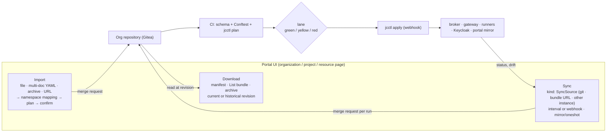

# Configuration as Code (Configuration-as-Code)

joinedcontext platform eliminates runtime configuration mutation in favor of **Configuration-as-Code (CaC)** per CC-01–CC-70. All declarative configuration is stored in Git, validated through CI, and converged to live services by the `jcctl` reconciler.

```text
+---------------------------------------------------------------------------------------------------+
|                                 CITY-AS-CODE CONVERGENCE PIPELINE                                 |
|                                                                                                   |
|  Git Repository (Gitea) ---> CI/CD Gates (Gitea Actions) ---> jcctl Reconciler Daemon           |
|  - Manifests (YAML)          - JSON Schema Validation         - Sync Wave Ordering (0 to 5)       |
|  - LinkML DataModels         - Conftest (Rego) Policy         - Live Diff against Broker & Gateway|
|  - SOPS Secrets              - Deterministic Blueprint Check  - Managed Attribute Ownership (SSA) |
|  - Blueprints & Flows        - jcctl plan on Pull Request   - Zero Direct Broker DB Writes      |
+---------------------------------------------------------------------------------------------------+
```

## 1. Repository Layout (CC-08, CC-85)

An Organization's configuration lives in Git, in one of two layouts. **Layout 1** is one repository holding the organization and every project. **Layout 2** is one *organization repository* plus one *project repository* per project, assembled through the project registry ([ADR-N-029](../Decisions/adr-n-029-one-repository-per-project.md), PF-85). Each repository says which layout it follows in `.jc/layout`, one integer. An organization repository without the file is layout 1, the only layout there was before the file existed; a project repository exists in layout 2 only and always carries the file. A loader refuses a number it does not know, and `jcctl migrate` is the only writer of a layout change (CC-85).

### 1.1 Layout 1: one repository

What a layout 1 repository holds, path by path. Each manifest path is the `PATH_TEMPLATE` of its kind in `jc-core` ([Development/04](../Development/04-manifest-kinds.md#2-standard-kind-catalog)):

```text
org.yaml                                # kind: Organization: metadata, default locales, lane policy
platform-settings.yaml                  # Global quotas, retention rules, allowed entity types
environments/
  {name}.yaml                           # kind: Environment, the overlay one environment renders with (CC-73)
dataspace/
  participant.yaml                      # kind: DataSpaceParticipant, the organization's DID
agentprofiles/
  {name}.yaml                           # kind: AgentProfile (AG-47)
blueprints/
  {name}/blueprint.yaml                 # kind: Blueprint: version, riskClass, allowedRoles,
                                        # parameter schema, templates
policies/
  roles.json                            # compiled from Role and RoleBinding by jcctl (PF-51); generated
users/
  groups/{name}.yaml                    # kind: Group, members by e-mail; synced into Keycloak (PF-62, PF-63)
  roles/{name}.yaml                     # kind: Role, verbs on kinds (PF-49)
  assignments/{name}.yaml               # kind: RoleBinding, a Role to users or groups over a scope (PF-49)
portal/
  forms/{name}.uischema.yaml            # kind: UiSchema per kind (UI-02)
  theme.yaml, navigation.yaml, features.yaml, locales/{sk,en,de,cs}.json
projects/
  {project}/
    project.yaml                        # kind: Project: metadata, quotas, team bindings
    access/serviceaccounts/{name}.yaml  # kind: ServiceAccount (PF-45)
    apps/{name}/app.yaml                # kind: App (AP-01); the source is the App's own repository (AP-72)
    ckan/{name}.yaml                    # kind: CkanInstance (EP-62)
    dashboards/{name}.yaml              # kind: Dashboard and kind: Layer
    datasources/{name}.yaml             # kind: DataSource (MF-35)
    dataspace/agreements/{name}.yaml    # kind: DataAgreement
    pipelines/{name}/
      pipeline.yaml                     # kind: Pipeline
      bento.yaml                        # native, unwrapped Bento stream configuration
    policies/{name}.yaml                # kind: ScopeDefinition
    roles/{name}.yaml                   # kind: Role scoped to this project, project kinds only (PF-68)
    shared/{name}.yaml                  # kind: SharedSpaceReference
    sync/{name}.yaml                    # kind: SyncSource
    spaces/
      {space}/
        space.yaml                      # kind: ContextSpace
        datamodels/
          {name}.yaml                   # kind: DataModel
          *.linkml.yaml                 # authoritative LinkML source
          *.v{n}.schema.json, *.v{n}.context.jsonld   # generated artifacts, committed
          mappings/{name}.yaml          # kind: Mapping
        dataspace/offers/{name}.yaml    # kind: DataOffer
        endpoints/{name}.yaml           # kind: Endpoint
        policies/{name}.yaml            # kind: Policy
        projections/{name}.yaml         # kind: ModelProjection
        registrations/{name}.yaml       # kind: ContextSourceRegistration
        subscriptions/{name}.yaml       # kind: Subscription
        entities/seed/*.json            # plain NGSI-LD entities, never manifests (CC-72)
.jc/
  seed-manifest.txt                     # the paths the installation's seed owns, one per line,
                                        # written by the forge bootstrap and read by its next
                                        # run; not a manifest and read by nothing else (T-2392)
```

Everything above `.jc/` is written by people and by the Portal on their behalf. `.jc/` is the
installation's own bookkeeping: the forge bootstrap seeds a new organization with a starting set
of manifests, and it has to be able to tell a file it wrote last time from a file somebody else
wrote — otherwise correcting a seed file's path leaves the old copy behind, two manifests declare
one identity, and the gateway refuses the whole repository. The record holds paths and nothing
else, is generated from the mounted seed rather than read out of the repository's own manifests,
and a path that is not in it is never the bootstrap's to remove.

### 1.2 Layout 2: the organization repository and one repository per project

Layout 2 cuts the tree of §1.1 at `projects/`. What sits above it stays in the organization repository; what sits under `projects/{project}/` moves to the root of that project's own repository; and the organization repository gains the project registry in its place (CC-85, PF-86).

```text
# the organization repository
org.yaml   platform-settings.yaml             # as in §1.1
environments/  dataspace/  agentprofiles/  blueprints/  policies/  users/  portal/
projects/
  {slug}.yaml                                 # kind: Project, the registry entry (§1.3, PF-86)
.jc/layout                                    # 2
```

```text
# a project repository, one per project
project.yaml                                  # kind: Project, with spec.version and spec.parameters (CC-88)
access/  apps/  ckan/  dashboards/  datasources/  dataspace/  pipelines/  policies/  roles/  shared/  sync/
spaces/{space}/…                              # everything under projects/{project}/ in §1.1
.gitea/workflows/                             # the CI every project repository runs (CC-90)
CODEOWNERS                                    # compiled from the project's roles (CC-41)
.jc/layout                                    # 2
```

The kinds, their paths inside a project and every loader rule stay the same, because no loader reads the repositories one by one. The reconciler, the gateway and the Portal fetch the organization checkout and every registered project checkout at its `spec.ref` and assemble them into the virtual tree `projects/{slug}/…` of §1.1 (CC-86, §3). The registry slug, not the repository's name, is the `{project}` of that tree, so one repository may run under two slugs.

A project repository's readers and writers are the forge teams `{slug}-readers` and `{slug}-writers`, and a project member's forge credential reaches that repository and no other; the organization repository is readable only with a binding at the organization (PF-87, [12 §2](12-identity-and-access.md#2-organization-group--role-model)). An application keeps a repository of its own (AP-72).

### 1.3 The project registry

One file per project in the organization repository, `projects/{slug}.yaml`, names where the project's configuration comes from and what this deployment sets. It is the fleet manifest of [Research/city-as-code-prior-art §9.1](../Research/city-as-code-prior-art.md#91-repo-access-only-their-own-part), and changing it is an organization change in the red lane (CC-87):

```yaml excerpt
# projects/air.yaml in the organization repository (PF-86)
kind: Project
apiVersion: joinedcontext.com/v1alpha1
metadata: { name: air, namespace: org }
spec:
  repository: { name: air }            # a forge repository, or { url: https://…, secretRef: { name: … } } (CC-89)
  ref: v1.4.0                          # the tag, branch or commit this deployment runs
  parameters:                          # this deployment's values over the defaults of project.yaml (CC-88)
    stationCount: 12
    ingestToken: air-ingest-token      # a parameter of type secret is a secretRef name, never a value
```

The registry entry and the project repository's own `project.yaml` are one `Project`: the entry says where the project comes from and what this deployment sets (`repository`, `ref`, `parameters`), `project.yaml` says what the project is (its title, quotas, bindings, `version` and the parameter schema), and the assembly reads the two as one resource under the registry slug. The two carry disjoint fields: `spec.parameters` holds values on the entry and declarations in `project.yaml`, a `version` or `quotas` on the entry is refused, and so is a `ref` in `project.yaml`.

A registry entry that names a git repository outside the forge is mirrored read-only at the pinned ref, and every edit through the Portal is refused with "this project is authored at {url}" (CC-89).

### 1.4 Encrypted secret files (CC-06, ADR-N-012)

A manifest never carries a credential, only a `secretRef` naming one. The values live in
SOPS-encrypted files that end in `.enc.yaml`, or `.enc.yml`, and sit anywhere in the tree,
next to what they serve:

```yaml
# projects/transport/secrets.enc.yaml
parking-mqtt-creds:
    username: ENC[AES256_GCM,data:...,iv:...,tag:...,type:str]
    password: ENC[AES256_GCM,data:...,iv:...,tag:...,type:str]
portal-session-key: ENC[AES256_GCM,data:...,iv:...,tag:...,type:str]
sops:
    age:
        - recipient: age1...
          enc: |
            -----BEGIN AGE ENCRYPTED FILE-----
    lastmodified: "2026-09-06T12:00:00Z"
    mac: ENC[AES256_GCM,data:...,iv:...,tag:...,type:str]
```

What the reconciler enforces when it reads them:

- A top-level name is what `secretRef.name` addresses, and its members are what
  `secretRef.key` addresses. A single-value secret is referenced without a key. Nothing
  nests deeper than that.
- Secret names are repository-global. Two files declaring the same name is an error, not a
  merge in which the last file read wins.
- Every value must be encrypted. A file holding one plaintext value is refused whole,
  because a plaintext credential in Git is exactly what CC-06 forbids.
- These files are not manifests. The loader walks past them, and only the secret store
  reads them — but the run stages them with the manifests: the store reads that one tree, so
  a file the run left behind is a secret the reconciler reports as "not declared in any
  encrypted secrets file" while it sits in the repository.
- The file's own message authentication code is verified before any value is used, so a
  value that was removed, reordered, or replayed from an older revision is refused.
- Decryption happens in memory at apply time, with the age identity mounted next to the
  reconciler: the Portal reads it from the path in `JC_PORTAL_SOPS_AGE_KEY_FILE`, per
  resolution, and holds nothing. The private key is never committed, and a decrypted value is
  never written back to the repository, logged, or repeated in an error message.
- An installation configures one backend: this one, or OpenBao (`JC_PORTAL_OPENBAO_ADDR`,
  ADR-N-012). With neither, every reference is refused with the reason, and the pipeline that
  named it carries that reason on its `StreamDeployed` condition instead of running without
  the credential.

---

## 2. Manifest Envelope & Kinds Catalogue (CC-09, CC-12)

Every configuration file (except native `bento.yaml` and LinkML models, which are referenced from a resource) is a **Kubernetes-style resource**: `apiVersion`, `kind`, `metadata`, `spec`, and a server-computed `status` that is never stored in Git (MF-01…MF-10). The shape is deliberately the Kubernetes one so that any resource, project or organization can be **downloaded**, **imported** and **synced** with tools and habits people already have (`kubectl`-shaped `jcctl`, multi-document YAML, `List` bundles, label selectors, server-side-apply field ownership).

```yaml
apiVersion: joinedcontext.com/v1alpha1
kind: ContextSpace
metadata:
  name: air-quality                 # DNS-1123, unique per kind in the namespace
  namespace: helsinki          # = project slug ("org" for organization-level kinds)
  labels:
    joinedcontext.com/domain: environment
  annotations:
    joinedcontext.com/managed-attributes: "title,description,tags"
    joinedcontext.com/imported-from: "https://udp.example.fi/helsinki@3f9c2e1"
  title: "Air quality"
  description: "Air-quality observations"
spec:
  isSandbox: false
  defaultLocale: sk
  missingUnitCode: fill        # fill (default) | refuse: a write without a quantity's unitCode (DM-06)
# status is computed by jcctl and served by the Portal API only — never committed:
# status:
#   phase: Live
#   observedRevision: 3f9c2e1
#   conditions:
#     - { type: Reconciled, status: "True", reason: Applied, lastTransitionTime: 2026-09-05T10:00:00Z }
```

Rules that make bundles portable: identity is `(group, kind, namespace, name)` and the repository path is derived from it (MF-06); cross-references are typed objects `{kind, name, namespace?}` (MF-07); `status` and secret values are stripped on download and rejected on import (MF-04, MF-24). The resource API mirrors this shape at `/api/v1/projects/{project}/{plural}` with one deliberate difference from Kubernetes: writes return `202 Accepted` and a `Change` resource, because they become a merge request instead of a live mutation (MF-12, CC-03).

### Manifest Kinds Catalogue

| Kind | Target Path in Repository | Schema Definition | Reconciled Component & API |
|---|---|---|---|
| `ContextSpace` | `projects/{p}/spaces/{s}/space.yaml` | `schema/kinds/ContextSpace.json` | Gateway in-memory table (reloaded from Git); tenant resolved per request |
| `DataModel` | `projects/{p}/spaces/{s}/datamodels/` | `schema/kinds/DataModel.json` | Gateway (`schema/` endpoints, reloaded from Git) |
| `Policy` | `projects/{p}/spaces/{s}/policies/` | `schema/kinds/Policy.json` | Gateway in-process PDP (reloaded directly from Git repository by reaper) |
| `ScopeDefinition`| `projects/{p}/spaces/{s}/policies/` | `schema/kinds/ScopeDefinition.json`| Gateway in-process PDP (reloaded directly from Git repository) |
| `Subscription` | `projects/{p}/spaces/{s}/subscriptions/`| `schema/kinds/Subscription.json` | Context Broker (`POST /ngsi-ld/v1/subscriptions` through the space surface, by the Portal reconciler) |
| `ContextSourceRegistration` | `projects/{p}/spaces/{s}/registrations/` | `schema/kinds/ContextSourceRegistration.json` | Gateway federation table (reloaded from Git) & broker tenant registration |
| `Entity` (Seed) | `projects/{p}/spaces/{s}/entities/seed/*.json` | Standard Smart Data Model Schema | Context Broker (`POST /cs/{space}/ngsi-ld/v1/entityOperations/upsert` via `jcctl apply`, CC-72). A seed entity is a plain NGSI-LD entity in a `.json` file, never a manifest with an envelope: nothing writes a `kind: Entity` YAML |
| `Endpoint` | `projects/{p}/spaces/{s}/endpoints/` | `schema/kinds/Endpoint.json` | Gateway in-memory table & APISIX Standalone ConfigMap (reloaded from Git) |
| `ModelProjection` | `projects/{p}/spaces/{s}/projections/` | `schema/kinds/ModelProjection.json` | Context Gateway (R9 projection and the `schema/` surface of every Endpoint that references it, MP-01…MP-03) |
| `DataSource` | `projects/{p}/datasources/` | `schema/kinds/DataSource.json` | Bento input of every Pipeline that references it (MF-35, PL-39) |
| `Pipeline` | `projects/{p}/pipelines/{n}/pipeline.yaml` | `schema/kinds/Pipeline.json` | Kubernetes Bento Runner (ConfigMap / CronJob) |
| `Dashboard` | `projects/{p}/dashboards/` | `schema/kinds/Dashboard.json` | Portal API Database Mirror |
| `Layer` | `projects/{p}/dashboards/` | `schema/kinds/Layer.json` | Portal API Database Mirror |
| `SharedSpaceReference`| `projects/{p}/shared/` | `schema/kinds/SharedSpaceReference.json`| Context Gateway In-Memory Sharing Table |
| `Blueprint` | `blueprints/{n}/blueprint.yaml` | `schema/kinds/Blueprint.json` | Portal API Flow Gallery |
| `Mapping` | `projects/{p}/spaces/{s}/datamodels/mappings/` | `schema/kinds/Mapping.json` | Model Tools (validate, compile → `generated/*.blobl`); Bento via `Pipeline.spec.mappingRef` (DM-33…DM-42) |
| `ServiceAccount` | `projects/{p}/access/serviceaccounts/` | `schema/kinds/ServiceAccount.json` | Keycloak client / Portal API key table (hashes only); Policy entities for grants (PF-34…PF-40) |
| `Environment` | `environments/` (org level) | `schema/kinds/Environment.json` | Merged by every loader before validation; red lane (CC-73…CC-75) |
| `Group` | `users/groups/` (org level) | `schema/kinds/Group.json` | Keycloak groups the reconciler manages, members pruned to the manifest (PF-62, PF-63) |
| `Role` | `users/roles/` (org level) or `projects/{p}/roles/` (PF-68) | `schema/kinds/Role.json` | Portal permission check; `policies/roles.json` in the organization repository (PF-49, PF-51) |
| `RoleBinding` | `users/assignments/` (org level) | `schema/kinds/RoleBinding.json` | Portal permission check; forge `CODEOWNERS` and team permissions (PF-51) |
| `DataSpaceParticipant` | `dataspace/participant.yaml` (org level) | `schema/kinds/DataSpaceParticipant.json` | Connector addon configuration (DID, trust anchors, connector URL) (DS-07) |
| `DataOffer` | `projects/{p}/spaces/{s}/dataspace/offers/` | `schema/kinds/DataOffer.json` | Connector catalog Dataset + ODRL offer for referenced Endpoints (DS-07, DS-08) |
| `DataAgreement` | `projects/{p}/dataspace/agreements/` | `schema/kinds/DataAgreement.json` | Status written by the connector; compiled `Policy` entities (provider) or token `secretRef` in OpenBao (consumer) (DS-09…DS-15) |
| `App` | `projects/{p}/apps/{n}/app.yaml` | `schema/kinds/App.json` | Portal static host / Deployment; renders `Endpoint` + `Policy` from `dataNeeds` (AP-05) |
| `SyncSource` | `projects/{p}/sync/` or `sync/` (org) | `schema/kinds/SyncSource.json` | the sync loop, in the Portal beside the reconciler (`src/server.rs`, MF-27) or `jcctl sync` on the command line |
| `UiSchema` | `portal/forms/{Kind lowercased}.uischema.yaml` | `schema/kinds/UiSchema.json` | Portal UI form arrangement, read straight from the repository (UI-02) |
| `Bundle` (download index) | not stored; generated on download | `schema/kinds/Bundle.json` | Import wizard / `jcctl import` |
| `Change` (server-side) | not stored; returned by resource-API writes | `schema/kinds/Change.json` | Portal API (merge request, lane, plan) |
| `List` | envelope for multi-resource download/import | `schema/kinds/List.json` | all |

`jc-core` defines every kind of this table. A kind it does not define is a kind no component may
write: every loader — `jcctl`, the Portal's sync, the gateway's store — refuses a manifest of an
unknown kind, and it refuses the whole repository with it, so one such file committed anywhere
stops configuration reaching every endpoint. The Portal therefore answers a proposal of a kind
outside the catalogue `400` naming the kind, rather than committing a file that would stop the
next load. Adding a row to this table means defining the kind in `jc-core` in the same change.

A `Subscription` is the one kind of this table whose effect lives in the broker rather than in a
platform table, so it is worth reading whole. It watches entities of one space and posts to an
address the platform calls; the credential that address needs is a `secretRef` the reconciler
resolves at apply time, never a token written into the URL (MF-31, CC-06):

```yaml
apiVersion: joinedcontext.com/v1alpha1
kind: Subscription
metadata:
  name: air-quality-alerts
  namespace: helsinki               # = project slug
  title: "Air-quality alerts"
spec:
  contextSpaceRef: { kind: ContextSpace, name: air-quality }
  entities:
    - type: AirQualityObserved      # a type, an id or an idPattern; at least one of them
  watchedAttributes: [airQualityIndex]
  q: "airQualityIndex>50"
  notification:
    endpoint:
      uri: https://alerts.example.fi/hooks/air-quality
      accept: application/json
      receiverInfo:
        - { key: X-Space, value: air-quality }
      secretRef: { name: alerts-webhook, key: token }
    attributes: [airQualityIndex, location]
    format: normalized
  throttling: 60                    # seconds between two notifications
  expiresAt: "2027-01-01T00:00:00Z" # optional; open-ended without it
  isActive: true
```

The reconciler writes it through the space surface, not at the broker: `POST`, `PATCH` and
`DELETE` on `{platformHost}/cs/{space}/ngsi-ld/v1/subscriptions`, with the Portal's own
service-account token, so a subscription can only watch what that account may read and the
space's policy decides it like any other write (SP-06, SP-07). The address is one setting,
`JC_PORTAL_GATEWAY_URL`; a Portal without it reads subscriptions from the repository and writes
them nowhere, which is what a Portal without a gateway can honestly do.

Three rules make the manifest the truth without the reconciler owning the broker:

- **The id is the manifest's.** A declared subscription is
  `urn:ngsi-ld:Subscription:{orgDomain}:{space}:{name}` — the same URN shape as an entity, so a
  file and a subscription are the same thing under two names, and re-running the reconciler
  updates rather than duplicates.
- **A credential is a header on the hop, never a field in Git.** `notification.endpoint.secretRef`
  is resolved at apply time and sent as the `Authorization` header of `receiverInfo`; the
  manifest may not write that header itself, and the value appears in no plan, no status and no
  log line (MF-31, CC-06, PL-17). A reference that does not resolve stops that subscription
  before any request leaves, with the reference named in its status.
- **Only what the reconciler itself declared is removed.** A subscription is deleted when the
  run before declared it and this one does not — not because its id looks like ours. An
  application writing through the API mints ids in the same URN namespace, and a rule that
  deleted by shape would take those with it. The cost is the other direction: a manifest removed
  while the Portal is down leaves its subscription behind, an orphan a person can see and
  delete, rather than deleting someone else's (CC-72).

### A registration is written at the broker, not through the space surface (T-0345, PF-48)

A `ContextSourceRegistration` is projected by the same reconciler, and by the one other route
that exists: `POST`, `PATCH` and `DELETE` on
`{broker}/ngsi-ld/v1/csourceRegistrations`, with the hub space as the `NGSILD-Tenant` header of
that internal hop and of no other (SP-08, SP-09). The address is one setting,
`JC_PORTAL_BROKER_URL`; a Portal without it reads registrations from the repository and
federates nothing.

It does not go through the space surface, and that is deliberate. A registration is a
control-plane act: registering a member is what exposes it to the hub's audience
([04 §5a](04-context-spaces-and-endpoints.md#5a-federation-registrations-and-the-hub-endpoint)),
which is why the manifest is Red-lane (CC-63) and why there is no NGSI-LD operation for it in
the gateway's table and none in a `Policy`'s vocabulary. A grant that could create a
registration would be a grant that widens every other grant.

Nothing on the hop carries a credential. The member is read by the broker as a tenant of the
same broker, so the registration body carries the member's `tenant` (CIM 009 clause 5.2.9) and
the broker's own address, and never a token or a header of ours. The same three rules as for a
subscription hold: the id is the manifest's (`urn:ngsi-ld:ContextSourceRegistration:{name}`),
only what a previous run declared is deleted, and a member the project does not hold stops that
registration with the reference named in its status.

### How Configuration Reaches Components: Git as the Platform (CC-02, CC-72)

There is no live configuration API on the gateway or context broker. Every platform component reads its declarative configuration directly from the Git repository:

- **Context Gateway:** `store::load` parses repository manifests into in-memory tables (`ArcSwap`) for context spaces, endpoints, service accounts, and federations. Policies are loaded from `projects/{p}/spaces/{s}/policies/` by `store::policies_by_space`. A background reaper reloads the repository checkout every second and swaps the tables, so configuration updates become active within one second of Git changes without any inbound API write.
- **Portal & API:** The Portal reads manifests directly from Git, computes change proposals as Git merge requests, and maintains an in-process mirror for fast UI queries.
- **APISIX Gateway:** Consumes standalone routing configuration rendered directly from Git Endpoint manifests.
- **Pipeline runner:** The Portal reconciler renders each pipeline of the repository and posts it to the resident runner's streams API; the runner holds no configuration of its own.

The one task that cannot be accomplished by reading Git alone is the materialization of dynamic broker state. Specifically, seed entities must be explicitly injected into an empty broker. That is the single live mutation role of `jcctl apply --gateway-url <url>` (CC-72): it reads seed entities from `projects/{p}/spaces/{s}/entities/seed/*.json` and posts them to `POST /cs/{space}/ngsi-ld/v1/entityOperations/upsert` via the Context Gateway. The `Platform` trait (`crates/jcctl/src/platform.rs`) models live entity state in the broker rather than configuration kinds.

### Blueprints are one manifest (CC-23…CC-27, CC-59)

A blueprint carries everything the gallery, the form and the expansion need, so that a
version pins one file rather than a directory:

```yaml
apiVersion: joinedcontext.com/v1alpha1
kind: Blueprint
metadata:
  name: threshold-alert
  namespace: org
  title: "Threshold alert"
spec:
  version: 1.2.0                  # SemVer; an upgrade never rewrites instances (CC-26)
  category: alerting              # gallery grouping (CC-30)
  riskClass: green                # green | yellow | red, the merge lane (CC-59, CC-63)
  allowedRoles: [domain-editor, approver, org-admin]   # who sees it (CC-59)
  parameterSchema:                # JSON Schema draft-07, the complete user surface (CC-24);
                                  # `x-jc-widget` on a property names a picker that fills its
                                  # choices from the platform's own state (Development/05 2.1)
    type: object
    required: [entityType, thresholdValue]
    properties:
      entityType: { type: string, title: "Entity type", enum: [AirQualityObserved] }
      thresholdValue: { type: number, title: "Threshold" }
  templates:                      # each renders exactly one manifest (CC-23)
    - name: subscription
      template: |
        apiVersion: joinedcontext.com/v1alpha1
        kind: Subscription
        metadata:
          name: "alert-{{ entityType | lower }}"
        spec:
          q: "airQualityIndex > {{ thresholdValue }}"
```

Expansion is a pure function of `(blueprint, parameters)` (CC-25): `jcctl` validates the
parameters against `spec.parameterSchema`, renders each template with minijinja in its
sandbox (no filesystem, no environment, undefined values are an error) and writes the
manifests to the repository. Every rendered manifest records where it came from (CC-27,
CC-32):

```yaml
metadata:
  annotations:
    joinedcontext.com/blueprint: threshold-alert
    joinedcontext.com/blueprint-version: 1.2.0
    joinedcontext.com/blueprint-parameters: '{"entityType":"AirQualityObserved","thresholdValue":50}'
```

The parameter annotation is canonical JSON with sorted keys, so re-rendering the same
instance produces the same bytes. Parameters name secrets, they never carry one (CC-06):
a blueprint that needs a credential takes a `secretRef` name as a parameter.

---

## 3. The Reconciler Engine

The reconciler is Rust, and it is one body of code with two front ends. There is no reconciler daemon of its own: the Portal is the daemon.

1. **Command line (`jcctl`):** engineers and CI pipelines run `jcctl validate`, `jcctl plan`, `jcctl apply`, `jcctl drift`, `jcctl export`, `jcctl import` and `jcctl sync`. Running `jcctl` with no arguments prints the full list; there is no `jcctl serve`.
2. **In the cluster (the Portal):** the Portal links `jcctl` as a library rather than shelling out to it, so the same loader decides what a manifest is in both places and the Portal cannot disagree with CI about a repository (`joinedcontext-portal/src/reconciler`). A periodic loop re-reads the manifests from Gitea at the default branch HEAD, compiles their live status and swaps them into an in-memory mirror atomically; a run that cannot load the repository keeps the last revision that did, because serving half a repository reads as deletion. Only one replica reconciles, elected with a PostgreSQL advisory lock, and it is that replica that syncs streams, apps, roles and the Keycloak realm and runs the drift scan; every other replica keeps its own read-only mirror, so a new pod of a rolling update serves while the old one still holds the lock (OPS-51). The `SyncSource` loop runs beside it on the same replica (MF-28, CC-03).

### Assembling the render (CC-86)

In layout 2 every loader starts by assembling. It reads the organization checkout at the default branch, lists `projects/*.yaml`, fetches each registered repository at its `spec.ref`, and mounts each checkout's root at `projects/{slug}/` of one virtual tree, the tree of §1.1. From there the loader is the one it always was. Uniqueness across the organization, one Endpoint slug and one `{space}` segment per organization (PF-44, PF-84), is checked over the assembled tree, so a project repository cannot claim another project's names.

- **A ref that cannot be fetched** leaves that project at the last ref it was fetched at, and the registry entry's `status` names the ref it runs and the error. The rest of the organization renders; one unreachable repository never unloads every project.
- **What triggers a render** is a push to the organization repository, a moved `spec.ref`, or a push to a branch a registry entry tracks (the forge webhook of CC-90). A tag or a commit pinned by the entry never moves by itself.
- **The gateway** reads checkouts and never the forge: the sidecar `jcctl checkouts` keeps each registered project at its ref under `JC_GATEWAY_PROJECTS_DIR`, with the forge's read-only token for the forge's repositories and an entry's own `secretRef` for one outside it (CC-89), and the gateway assembles on every change it sees.
- **`jcctl`** does the same over local checkouts: `jcctl validate` and `jcctl plan` take the organization checkout and find each project checkout by the registry, at its ref, and `jcctl validate --project` checks one project repository alone, which is what its CI runs (CC-90).
- **`jcctl migrate`** is the only writer of a layout change (CC-85): from layout 1 it splits each `projects/{slug}/` into a repository of its own with its history (`git subtree split`), writes the registry entry tracking the project repository's `main`, removes the subtree from the organization repository and sets `.jc/layout` to `2` in both. An import of a bundle from an older layout runs the same migration and lands its result as the Change (MF-47); a newer layout is refused.

### Reconciler Commands

- `jcctl plan`: Computes the delta between declared seed entities in Git and live entities in the broker. Outputs a colorized, field-level diff indicating entities to create, update, delete, or leave unchanged (CC-15, CC-72).
- `jcctl apply`: Replays seed entities into the broker through the Context Gateway (`POST /cs/{space}/ngsi-ld/v1/entityOperations/upsert`) using the ServiceAccount's audience-bound token (CC-18, CC-72). If live broker entities match Git, zero writes are issued. Configuration kinds are read directly from Git by components and are not mutated via an API.
- `jcctl drift`: Runs a non-mutating plan and emits structured metrics/alerts if live state diverges from Git (CC-21).
- `jcctl export`: Writes a project of the repository out as a bundle — `jcctl export --repo-dir <checkout> --project <p> --out-dir <dir>` copies `projects/{p}/` with `status` and secret values stripped, the native files beside their manifests (`bento.yaml`, LinkML, generated artifacts) and a `kind: Bundle` index, so what the CLI produces is what the Portal's download produces and `jcctl import` reads it back (MF-16, MF-17). Adopting live state that no manifest declares is `drift --adopt-dir` (CC-22, CC-68): the configuration kinds live in Git, so there is no live configuration to serialise.

### Sync Waves Ordering (CC-18)

To resolve inter-resource dependencies without complex dependency DAG graphs, `jcctl` reconciles resources in six discrete synchronization waves (research verdict P4: ordering by waves and health, never a free-form DAG):

```text
Wave 0: Organizations, Projects, DataSpaceParticipant (repository roots)
        | (Health check: project namespaces, quotas and the participant DID exist)
        v
Wave 1: ContextSpaces, DataModels, Identity Groups & Roles
        | (Health check: Tenants ready, LinkML compiled)
        v
Wave 2: Policies, ScopeDefinitions, Seed Entities
        | (Health check: Access control active, seed entities upserted to broker)
        v
Wave 3: Context Source Registrations (CSRs), CkanInstances, Endpoints, APISIX Routes
        | (Health check: Slugs active in gateway, routes resolved)
        v
Wave 4: Subscriptions, SharedSpaceReferences
        | (Health check: Brokers listening, notification targets alive)
        v
Wave 5: Pipelines (Bento Runners & CronJobs), Dashboards, Layers
        (Pipelines active, streaming telemetry into Endpoints)
```

Each manifest kind belongs to exactly one wave; the reconciler derives the order from
the kind alone, never from the references inside a spec. Inside a wave the kinds
converge in the order listed here, so a `DataModel` is compiled before the `Mapping`
that targets it and a `ScopeDefinition` exists before the `Policy` that names it:

| Wave | Kinds, in convergence order |
|---|---|
| 0 | `Organization`, `Group`, `Role`, `RoleBinding`, `Project`, `DataSpaceParticipant` |
| 1 | `ContextSpace`, `DataModel`, `Mapping`, `ServiceAccount` |
| 2 | `ScopeDefinition`, `Policy` |
| 3 | `CkanInstance`, `Endpoint` |
| 4 | `SharedSpaceReference`, `DataOffer`, `DataAgreement` |
| 5 | `DataSource`, `Pipeline`, `App`, `SyncSource` |

A `CkanInstance` converges in wave 3 before the `Endpoint`s that publish to it, because
publishing is part of exposing a space: the catalogue connection and its API token have to
resolve before an Endpoint's `spec.publish.ckan` block can be acted on (EP-62, EP-67).

`Bundle` carries no wave: it is an export artifact read by `jcctl import`, not a
resource the reconciler converges (CC-22). Neither does `Blueprint`, which is expanded at
authoring time: what reaches the reconciler is the manifests it rendered, each with a wave
of its own (CC-25). Neither does `UiSchema`: it has no counterpart
outside the repository at all, because the Portal reads the arrangement and draws the form
itself, so there is nothing for the reconciler to converge towards (UI-02).

The `Platform` trait (`crates/jcctl/src/platform.rs`) models this broker interaction: it carries entity read, write, and deletion methods rather than configuration manifest kinds, ensuring that configuration remains exclusively owned by Git while entity state converges through the gateway (CC-04, CC-72).

### Attribute Ownership & Server-Side Apply (CC-69)

`jcctl` implements field-level attribute ownership analogous to Kubernetes Server-Side Apply (SSA):

- Manifests declare managed attributes via the `joinedcontext.com/managed-attributes` annotation.
- The reconciler diffs and updates **only** declared managed attributes.
- Sensor observation attributes (e.g. `temperature`, `pm10`) written by Bento pipelines or external devices are ignored during drift evaluation, preventing live telemetry from being flagged as configuration drift (CC-07, CC-69).

---

## 4. Risk-Classified Interaction Lanes (CC-63–CC-66)

To balance strict governance with operational velocity, configuration changes pass through three risk-classified lanes:

| Dimension | Green Lane (Self-Service) | Yellow Lane (Domain Review) | Red Lane (Governance Review) |
|---|---|---|---|
| **Risk Class** | `riskClass: green` | `riskClass: yellow` | `riskClass: red` |
| **Typical Changes** | Ephemeral sandbox creation, private dashboard adjustments. | New resident pipeline, new data model version, endpoint creation within an existing space. | Public endpoint publication, cross-city federation registration, identity role changes, a standing egress of context data, any resource deletion. |
| **Authoring** | Portal UI generated form or MCP `instantiate_blueprint`. | Portal UI or Git pull request. | Git pull request only. |
| **Approval Gate** | **Auto-Approved:** Conftest policy bot evaluates constraints in CI and auto-merges (CC-63). | **Single Approver:** Approved in-app by the domain owner (CODEOWNERS) (CC-34). | **Full Approval Chain:** Multiple approvals required (Security, Platform Admin, Data Owner). |
| **Latency Budget** | ≤ 5 seconds from form submit to live deployment (CC-65). | Minutes to hours (Human-dependent). | Days (Formal governance cycle). |
| **Drift Action** | Automatically reverted or reaped upon TTL expiry. | Monitored; requires manual in-app resolution. | Monitored; triggers critical platform security alert. |

### The kinds that are Red whatever their spec holds (CC-63, PF-52)

The lane of a change is the lane of its riskiest file, and for these kinds the risk is the kind
itself: no field of the manifest can make the change smaller, so `classify`
(`joinedcontext-portal/src/change.rs`) answers Red before it reads the spec.

| Kind | Why it is Red |
|---|---|
| `ServiceAccount`, `Role`, `RoleBinding`, `Group`, `Policy`, `ScopeDefinition` | they hand out access, and a membership is the binding that names it (PF-52, PF-62) |
| `Organization`, `Project` | they create the scope every other grant is written against |
| `Environment` | one file decides the domain of every URN, the image every workload runs and where a `secretRef` is resolved, for a whole environment at once (CC-73, CC-75) |
| `ContextSourceRegistration`, `SharedSpaceReference`, `DataSpaceParticipant`, `DataOffer`, `DataAgreement` | they reach another organization with the data of this one (MF-36, DS-17) |
| `Subscription` | a standing egress: `spec.notification.endpoint.uri` is an address the platform posts to and `spec.notification.attributes`, empty meaning every granted attribute, says what it posts, for every matching entity, until somebody stops it |
| `CkanInstance` | the same, by copy rather than by notification: the DataStore mirror of an Endpoint writes its rows to the host in `spec.url` with the token in `spec.apiTokenRef` (EP-65…EP-67) |

A `Subscription` and a `CkanInstance` were Yellow until 2026-09-20, which meant that continuous
publication of context data to a host of the proposer's choosing took one approval while a one-off
federation edge over the same data took the full chain. Both were moved to Red, and the reason is
the address in the spec rather than the volume: what leaves the platform on a schedule nobody
watches is reviewed like what leaves it once.

### Sandboxes expire (CC-67, OPS-44, PF-19)

Green-lane speed is safe only because nothing the lane creates is permanent. The namespace of a sandbox, and the Context Space inside it, carry one label and one optional annotation:

```yaml
metadata:
  labels:
    sandbox.joinedcontext.com/lifecycle: unmanaged   # unmanaged | preview
  annotations:
    sandbox.joinedcontext.com/ttl: 72h               # optional, Go duration
```

`unmanaged` is a developer's own sandbox space (CC-67, AG-14); `preview` is the space an App on Demand is previewed against (AP-19). Both values say the same thing to everything that reads the label: not backed by Git, never counted as drift (CC-21), removed without asking.

Age is `metadata.creationTimestamp` and nothing else, because that is the one timestamp no occupant of the namespace can rewrite. The ceiling is 14 calendar days (OPS-44, PF-19). A shorter `ttl` annotation shortens the life of that one sandbox; a longer one is clamped back to the ceiling instead of honoured, so the annotation can never extend a sandbox past the requirement. Deletion removes the namespace with a foreground cascade, which takes the workloads, secrets and service-account tokens inside it along with it.

A namespace without the label is never a candidate. Sandboxes are labelled at creation by the green lane, so an unlabelled namespace is a permanent one, and the reaper has to be wrong in the direction that keeps data.

The `sandbox-reaper` CronJob is what enforces this on a cluster ([Components](../Deployment/04-components-and-addons.md#1-core-components-vs-add-ons-matrix)).

---

## 5. Settings Tiers Specification

To prevent architectural ambiguity over where configuration lives, the platform categorizes all state into three non-overlapping tiers:

| Tier | Characteristics & Scope | Storage Mechanism | Authority & Mutability | Approval Path |
|---|---|---|---|---|
| **Tier 1: Configuration** | Platform structure, access policies, context spaces, endpoints, pipelines, dashboards, and role definitions. | Git Org Repository (`jcctl` reconciled). | Immutable at runtime; changed exclusively via Git commits. | Green / Yellow / Red Lanes. |
| **Tier 2: Preferences** | User-specific UI state: active theme mode, language selection, table column orders, personal view filters, map starting bounding box. | PostgreSQL (`portal` database). | Mutable by authenticated users directly via Portal API. | Zero approvals; immediate write. |
| **Tier 3: Live Context Data** | Dynamic NGSI-LD entities, real-time sensor observations, temporal history, subscriptions state. | Context Broker (PostgreSQL + TimescaleDB). | Mutable by pipelines and authorized API clients under Policy grants. | Policy Firewall PEP evaluation (GW1–GW31). |

---

## 6. Download, Import and Sync, defined by the user in the UI (CC-49–CC-53, MF-16…MF-34)

All three operations are ordinary uses of the resource model above. None of them writes live state: download reads Git, import and sync produce merge requests that the lanes approve and `jcctl` applies.



### Download (MF-16…MF-19)

- Formats: one manifest (`.yaml`/`.json`), a `kind: List` of selected resources or a whole project, or an archive of the repository subtree. A `kind: Bundle` index records contents, source revision, source instance and exporter.
- Any revision: the revision picker is the Git history rendered as plain sentences (CC-35); the download is byte-identical to what `git archive` would produce for that path.
- Always re-importable: `status` stripped, secrets as `secretRef`, generated schema artifacts and native `bento.yaml`/LinkML files included next to their envelopes.
- Self-describing: a whole-project download carries what its files mean. `schemas/kinds/{Kind}.schema.json` is the JSON Schema of every kind it holds, with the description of every field; `schemas/models/{name}/` holds every data model's LinkML source and JSON Schema; `README.md` lists each kind with what it is, how many resources it holds and where its schema is. A person or another tool reads the bundle without this platform's documentation, and an import leaves these files out of the project (MF-41).
- Grants apply: a viewer's download omits what they may not read and says only how many objects were omitted.
- Live entities and history are a separate *data export* through the space's endpoint (`file.{json|csv|geojson}`), so configuration bundles never carry state (CC-07).

### Import (MF-20…MF-26)

1. Upload or paste a URL; the server parses manifests, multi-document YAML, `List` objects and archives.
2. Choose the target: an existing project or "new project from bundle". `metadata.namespace`, typed references and URN prefixes (`{orgDomain}`, `{space}`) are rewritten; the mapping table is shown.
3. Choose the conflict policy: `fail` (default), `skip`, `replace`, `rename`.
4. The server runs schema validation, reference resolution, Conftest gates and `jcctl plan`; the UI shows the diff and the lane it lands in.
5. Confirm → one merge request. Green-lane bundles (for example a sandbox seed) are live in seconds; anything touching public endpoints, policies or federation edges waits for approval.

One repository, every environment (CC-73…CC-75). What differs between `dev`, `staging` and the city's production is not configuration but values: the organization's domain in that environment, the hosts, the image digests, which secret backend answers a `secretRef`, a feature flag. Those live in one overlay per environment inside the repository, `environments/{name}.yaml`, and the loader, `jcctl`, the Portal's sync and the gateway's store alike, merges the overlay named by `JC_ENVIRONMENT` over the manifests before validation, so the same merge request reviews a change and its per-environment values and there is no second repository to keep in step. A manifest carries no host, domain or digest of its own: a URN is written with `{orgDomain}` and rendered at load, an Endpoint slug is minted per environment (EP-27), and a bundle carries the placeholders, which is why an export from one environment imports into another without a rewrite (CC-74). An overlay is a red-lane change and names a secret backend, never a value (CC-75).

```yaml
# environments/staging.yaml
apiVersion: joinedcontext.com/v1alpha1
kind: Environment
metadata: { name: staging, namespace: org }
spec:
  orgDomain: staging.banskabystrica.sk
  hosts: { portal: portal.staging.bb.example, gateway: api.staging.bb.example }
  images:
    context-gateway: "sha256:3f786850e387550fdab836ed7e6dc881de23001b6c2a1e2d48d37fca4b2f1e39"
    portal: "sha256:89e6c98d92887913cadf06b2adb97f26cde4849b1f1a58e18e2a1c2a7b8d1d0f"
  secrets: { backend: openbao, mount: jc/staging }
  features: { publicEndpoints: false }
```

In layout 1, duplicating a project is download + import with a namespace mapping and `rename` (MF-26); in layout 2 it is a fork (below). Disaster recovery is not an import at all: the repository at a revision **is** the organization's export (CC-49), so a restore pushes a mirror of it into the fresh instance's forge, points the reconciler at it and runs `apply` ([Deployment/07 section 3](../Deployment/07-backup-restore.md), CC-50, OPS-11). There is no organization bundle to build, and nothing at organization scope has to be exported by hand. Moving a project to another instance is the same two steps with a check between them: the bundle index carries the SHA-256 of every file, the import at the target reports each file equal or not once the namespace mapping is undone (MF-42), and the source project is deleted, by its red-lane cascade (PF-77), only after every file reported equal (PF-78). In layout 2 a whole project moves as Git instead (below).

### A whole project as Git: export, import, duplicate, move (MF-45…MF-47, PF-89)

In layout 2 a project is a repository, so a whole project travels as one. The YAML bundle stays for a part of a project: one endpoint, a set of pipelines, a space (MF-16).

- **Export** writes a `git bundle` of the project repository with its whole history and tags, one more `git bundle` per application repository of the project, and the registry entry with its parameter schema and this deployment's values reset to their defaults. The `kind: Bundle` index lists each bundle in `spec.repositories`, one entry per repository with its `name`, its `role` (`organization`, `project` or `application`), the bundle's `file` and the `head` commit it ends at, and `spec.files` carries each bundle's SHA-256 (MF-45, MF-42). `jcctl export --format git --repo-dir <project checkout> --project <slug> --out-dir <dir> [--app-dir <name>=<checkout>]...` writes it, and `jcctl import --format git <dir> --out-dir <dir>` clones each bundle and checks each head against the index. Nothing in it is a secret value: a `secret` parameter is a `secretRef` name (CC-88).
- **Import** creates the repositories at the target forge from the bundles and shows the parameter form, generated from the project's parameter schema with the defaults filled in, before it writes the registry entry. It verifies the transfer by head-commit equality, per repository (MF-46). An older `.jc/layout` or `apiVersion` is migrated by `jcctl migrate` and the migrated tree lands as the Change; a newer one is refused (MF-47).
- **Duplicate** is a fork in the forge, or an import of the bundle, plus a registry entry under a new slug with parameters of its own. The copy renders its ids from the new slug, and its teams are its own, so it cannot write into the origin (PF-89, PF-83). Gitea refuses a fork into the owner that holds the origin, so the Portal makes the fork as a migration from the forge's own in-cluster address, history included (`POST /api/v1/projects/{project}/duplicate`).
- **Move** is export, import and a check, in the order that never loses a repository: the target imports and reports every head equal, the target's registry entry goes live, and only then does the source's red-lane cascade archive the source repository (PF-77, PF-78). Until the last step both sides hold the whole history. [Deployment/11](../Deployment/11-moving-a-project.md) is the runbook.

### Sync (MF-27…MF-32)

A `SyncSource` keeps a project (or the organization) aligned with something outside the repository: another Git repository (a shared blueprint library, a regional standard set of data models), a published bundle URL, or another platform instance's resource API (a partner city publishing its endpoint and policy manifests).

```yaml
apiVersion: joinedcontext.com/v1alpha1
kind: SyncSource
metadata:
  name: regional-datamodels
  namespace: helsinki
spec:
  source:
    git: { url: https://git.region.sk/udp/datamodels.git, ref: main, path: models/transport, secretRef: { name: region-git-ro } }
  schedule: { webhook: true }        # pushed by its origin; or { interval: 30m } and no webhook block
  mode: mirror                       # source wins inside the synced subtree; local edits show as drift
  selector: { joinedcontext.com/tier: standard }
  conflictPolicy: replace
  prune: false                       # deletions are never implied (CC-19)
  autoMerge: false                   # true = green lane for this subtree; enabling it is a red-lane change (CC-70)
  webhook:                           # required by schedule: { webhook: true }, refused beside an interval
    secretRef: { name: region-hook }              # what the origin signs the request body with
    previousSecretRef: { name: region-hook-old }  # optional: accepted while the origin's hook is moved
```

A webhook-driven source is pushed by its origin rather than polled, and the credential for that is the source's own.

`spec.webhook.secretRef` is an HMAC secret the reconciler resolves like every other `secretRef` and hands to nobody (MF-44, MF-24). One per source, because the signature covers the body and not the path — a secret shared between sources would let the origin of one force a run of every other, in projects it has no binding in. A `schedule: { webhook: true }` with no `webhook` block is refused when it is written, and every refusal at the webhook route is the same `401`, so the door tells an unauthenticated caller nothing about which sources exist ([API/01 section 10](../API/01-portal-api.md), PF-59).

Every run is an import: same validation, same plan, same lanes, one merge request when the plan is not empty. `status` shows `Synced | OutOfSync | PendingApproval | Error | Paused`, the last source revision and the open merge request; the project page offers **Sync now**, **Pause**, **Detach**. Sync runs with the owner's grants only (CC-04) and reaches a remote instance solely through its public resource API and endpoints (MF-32).

### Parity (MF-33, MF-34)

The same three operations exist as `jcctl export | import | sync …` with JSON output and as configuration-MCP tools (`export_project`, `import_bundle`, `list_sync_sources`, `trigger_sync`). The UI is a client of that API, never a privileged path (CC-48).

## 7. Workspaces and previews (CC-76…CC-81)

A Change is one resource on one branch. A workspace holds several related edits together, lets a person or an agent try them, and brings them back as one reviewed Change. The decision and the alternatives it beat are [ADR-N-024](../Decisions/adr-n-024-workspaces-branch-and-preview.md).

### 7.1 A workspace is a branch

`jc_workspace_open` creates the branch `workspace/{name}` from `main` at revision R: of the project repository for a workspace of one project, and of the organization repository for an organization workspace (CC-87, [ADR-N-029](../Decisions/adr-n-029-one-repository-per-project.md); in layout 1 both are the one repository), and records the workspace in the Portal's database, beside the drafts: name, owner, base revision, scope (a project, a space subtree or a list of resources), TTL, and the preview's state. The record describes a branch, so it does not live on one.

Every proposing operation takes an optional workspace. With one, `propose_with_identity` runs the same validation, permission, own-rights, secret and quota checks (PF-82) and commits to the workspace's branch instead of opening a branch and a pull request of its own. Lists, reads, dry runs and the forms inside a workspace read the workspace's branch overlaid on `main`, so a person sees the state they are building. A draft belongs to one workspace or to none.

Nothing is renamed at rest (CC-77). The pipeline `bikes-ingest` is `bikes-ingest` in the workspace, and every reference, Bloblang mapping, SQL query and dashboard JSON stays as it is, because nothing moved. The Verdict of a check is therefore over the manifest that will be proposed, and its `inputDigest` holds (PF-57).

### 7.2 A preview is one more rendered environment

A preview renders the workspace's branch through the same loader that renders every environment (CC-73, CC-74), with one addition: a render prefix `ws-{name}-` on the three organization-unique identities, the project namespace, the Context Space name and with it the `{space}` segment of every URN, and the Kubernetes and Keycloak object names derived from them. Slugs are minted for the preview. A preview render that still contains an unprefixed organization-unique name fails (CC-78), so a preview cannot write into a space of the main project by construction (PF-83).

The owner's limits on `dev` (ADR-N-024 §10): one running preview per workspace and two on the node, every pipeline paused (PL-40) until a person starts it, and real data only as an opt-in, bounded copy read through the origin's Endpoint with the person's own token. Preview namespaces carry the sandbox labels the reaper already acts on (CC-67).

On `dev` a preview runs inside the shared services, and the prefix is its isolation. Starting it renders the workspace branch through `Repository::load_preview`; a render the loader refuses leaves the preview `error` with the loader's reason. The Portal holds the render, cached by the branch head, and serves every running preview on its internal listener as `GET /internal/previews`: the prefix and the files of the branch. The gateway fetches that list, renders each entry through the same loader and serves the preview's Endpoints beside those of `main`. A preview Endpoint gets a slug of its own, minted as the first 160 bits of SHA-256 over the prefix and the origin's slug in base32 (EP-02), so it stays the same on every render and never equals the origin's. A slug that `main` already serves is never taken over. Pipelines stay paused, so no stream runs. A Kubernetes namespace labelled `sandbox.joinedcontext.com/lifecycle: preview` is created only when a preview holds a workload of its own, such as an App, and the reaper then removes it at TTL. Stopping, discarding or expiring the workspace takes the preview out of the list, and the gateway drops its Endpoints on the next fetch (CC-81). Data reaches a preview only as the person's opt-in copy from the Try it panel: the browser reads through the origin's Endpoint and writes through the preview's on the person's own edge session, at most 1 000 entities per type, each id moved to the prefixed segment, so both Policies decide as they would for any other call of that person.

### 7.3 Bringing a workspace back

Bringing a workspace back is the pull request of its branch (CC-79). A Change targets exactly one repository (CC-87): an operation that has to touch both, such as a new project and its registry entry, is two linked Changes, the organization one in the red lane, and the project one is not applied before it. Git computes base, ours and theirs, and the forge's three-way merge is the only merge engine. The Change is one, its lane is the riskiest over every file, and approval is unchanged: PF-50, PF-58, and an agent never approves (AG-11, AG-82).

A conflict with `main` is a Git conflict on one manifest file. The Portal shows it per field with the plan diff and the person resolves it inside the workspace; no side wins by default, and the merged manifest is checked again before it is proposed (CC-80). An expired workspace loses its preview namespaces and its branch, and nothing of it reaches `main` (CC-81).

### 7.4 Save as and copies across projects

"Make another pipeline like this one" is not a workspace. *Save as* opens the existing form on the existing manifest with a new name and lands an ordinary Change (UI-61). A space copied to another project, or anything copied to another instance, goes through the import door with `rename` (§6); a workspace may be exported like any revision.

## 8. Identity: local names and rendered prefixes

A copied endpoint, project or organization works where it lands only if nothing in it says where it came from. The rule is one: a manifest names itself and every resource of its project by local name, and the loader renders whatever must be unique beyond the project from where the manifest lives (CC-82). `{orgDomain}` and endpoint slugs already work this way (CC-73, CC-74); the same rule now covers four more places.

| Value | Written in the manifest | Rendered by the loader |
|---|---|---|
| Organization domain | `{orgDomain}` in a URN, `did:web:{orgDomain}` as a Policy's `assigner` | the `Environment` overlay's `orgDomain` |
| `{space}` segment of an entity id | nothing, or `spec.urnSegment` on a space that predates the rule | `{project}-{name}` from the Context Space's namespace and local name (PF-84) |
| Space inside a mapping | `env("JC_SPACE")` beside `env("JC_ORG_DOMAIN")` | the target space's rendered segment, one variable per output (PL-57) |
| Endpoint of a SharedSpaceReference | `endpointRef: {project, name}` | the slug this environment minted (EP-77) |
| `{project}` | nothing: the project is where the manifest lives | the registry slug of the project repository (PF-86), never the repository's name |
| A project parameter | `{param:name}` in a manifest, `env("JC_PARAM_<NAME>")` in a mapping | the registry entry's value over the default in `project.yaml` (CC-88) |

The loader refuses under `strict` and reports under `lax` a manifest or mapping file that carries its own project name, its space's rendered segment or the organization's domain as a literal where a rendered value exists, and names the file, the path and the replacement (CC-83). A word that merely contains the name, in a URL or a title, is not a finding. The same refusal covers a literal where a project parameter exists: a project file that writes the value a parameter declares, instead of `{param:name}`, is refused under `strict` (CC-88).

A project's version is `spec.version` of its `project.yaml` (semver), and a release is the tag `v{version}` on the project repository. The registry entry pins one tag, so two deployments of the same project run two versions with two sets of values, and moving a deployment to a new release is an organization change that moves its `spec.ref` (CC-88).

`spec.urnSegment` exists so that no entity id changes: every space created before this rule pins today's segment, and only then may the space take its local name. A space copied to another project gets a new segment by itself, so its data is loaded again under the new ids, and the copy cannot mint ids of, or write into, the space it came from (PF-83).

Import and export keep every rendered value in its placeholder or local form (MF-43). What no copy can carry is reported: the values behind each `secretRef`, the people named in RoleBindings and Policies, the Environment's hosts and certificates, and feed credentials. The import door, Save as across projects and a workspace answer with that list, and each item links to where it is set (CC-84). Nothing in the list blocks the copy; each item blocks the resource it belongs to from going Live, with a plain reason.

## Related

- [ADR-N-024](../Decisions/adr-n-024-workspaces-branch-and-preview.md) — workspaces: a branch and a rendered preview, renamed at render and never at rest.
- [01-overview](../Architecture/01-overview.md) — where this chapter sits in the whole.
- [00-index](../Requirements/00-index.md) — the normative requirements behind it.
