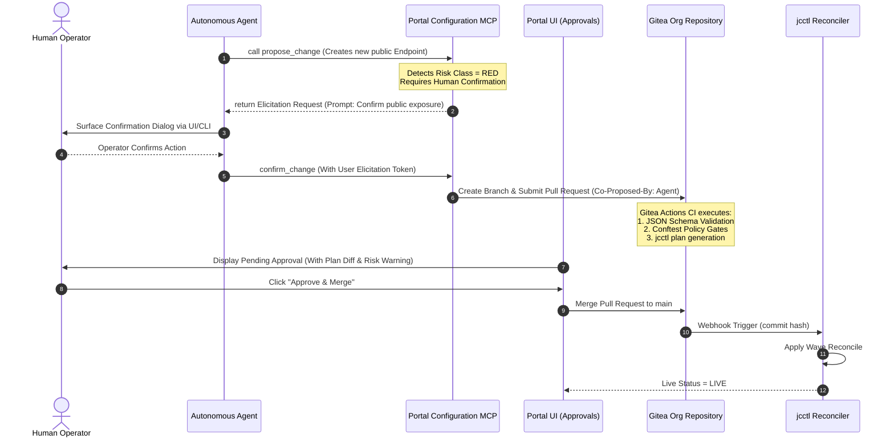

# Autonomous Agents & Model Context Protocol (MCP)

joinedcontext platform natively supports autonomous AI agents as first-class operational actors per CC-45–CC-48 and SP-14–SP-20. Agents interact with the platform exclusively through the standardized **Model Context Protocol (MCP)** using Streamable HTTP.

```text
+---------------------------------------------------------------------------------------------------+
|                                  AI AGENT OPERATIONAL BOUNDARIES                                  |
|                                                                                                   |
|  [ Autonomous Agent (OpenHands SDK / Claude Code / Custom Model) ]                                |
|        |                                                   |                                      |
|        v (OAuth 2.1 Bearer Token)                          v (OAuth 2.1 Bearer Token)             |
|  +-------------------------------+                   +-------------------------------+            |
|  | Context Space Data MCP        |                   | jcctl Configuration MCP     |            |
|  | Endpoint: /api/endpoint/{endpointSlug}/mcp     |                   | Endpoint: /mcp/config         |            |
|  | - Query Entities              |                   | - jcctl plan / drift        |            |
|  | - Describe DataModels         |                   | - List & Inspect Blueprints   |            |
|  | - Subscribe to Context        |                   | - Propose Manifest Changes    |            |
|  +-------------------------------+                   +-------------------------------+            |
|                 |                                                   |                             |
|                 v                                                   v                             |
|  [ Context Gateway (PEP Firewall) ]                  [ Gitea Git PR -> CI Gates -> Lanes ]        |
|  (Evaluated against Policy entities)                 (Never direct broker or DB write)            |
+---------------------------------------------------------------------------------------------------+
```

## 1. Dual MCP Surfaces

The platform exposes two distinct, decoupled MCP surfaces:

### 1. Data-Plane MCP Façade (`/api/endpoint/{endpointSlug}/mcp` or `/cs/{space}/mcp`)

Operates directly over context data (SP-14).

- Exposed by the Context Gateway as a lightweight Streamable HTTP service.
- The tool catalogue is dynamically projected from the caller's effective policy grants (SP-15).
- An agent with read-only grants receives query tools only; write and subscription tools are omitted from the tool list.
- All requests pass through the Context Gateway PEP firewall, applying AST query rewriting and attribute-level response projection (SP-16).

### 2. Configuration-Plane MCP (the Portal, `/api/v1/mcp`)

Operates over platform configuration and lifecycle management (CC-45, AG-60, ADR-N-021).

- Served by the Portal, which already owns the configuration plane (changes, dry runs, the forge, permissions); `jcctl` stays the offline renderer and reconciler and serves no MCP.
- Streamable HTTP, stateless, protocol `2026-07-28`: `server/discover`, `tools/list` filtered by the caller's effective permissions (PF-50) the way the data façade filters by grants, `tools/call` with structured results, `resources/read` for manifests, kinds' schemas, a model's artifacts, drafts and change plans, `prompts/list` for the guided units, the Tasks extension for calls longer than a request.
- Every tool is an operation of the registry (AG-59): the same function the REST route, the assistant and the agent runner call. The tool catalogue below is that registry, `jc_`-prefixed; `GET /api/v1/projects/{project}/ops` lists it for a caller.
- Authorization as on the data façade (AG-32): a bearer whose `aud` names the Portal, RFC 9728 protected-resource metadata, `401` with `WWW-Authenticate`; the edge session is not accepted here. Keycloak carries the audience through the `mcp:portal` client scope until RFC 8707 lands.
- **Strict Invariant:** the Configuration MCP is strictly non-mutating on live data plane state (CC-46). An agent CANNOT directly write to context brokers, databases, or API gateways. All modifications take the form of drafts (AG-61), verdicts (AG-62), Git branch commits and pull requests (CC-03, CC-46); a Yellow or Red proposal asks the person through elicitation (AG-63).

---

## 2. Tool Catalogue Specification

### Data-Plane MCP Tools (`/api/endpoint/{endpointSlug}/mcp`)

The catalogue is the CIM 009 read surface, one tool per operation, so an agent can ask anything a REST client can ask and nothing more (AG-29, AG-84). Every tool is scoped to the one Context Space its URL names; a space, tenant or slug offered as a tool argument is refused rather than ignored (AG-05).

A tool's arguments and its handler are functions of the Endpoint the URL names, never of a server-wide "current endpoint": the façade keeps no such state (SP-19), so one connector may later serve several Endpoints and let the agent name which one it reads without anything built today having to change.

| CIM 009 operation | REST | Tool | Annotations | Arguments |
|---|---|---|---|---|
| Query Entities | `GET /entities` | `query_entities` | `readOnlyHint: true` | every selector and representation argument of the table below |
| Query Entities (POST) | `POST /entityOperations/query` | `batch_query` | `readOnlyHint: true` | the same, as the Query body; `id` is the `ids` list |
| Retrieve Entity | `GET /entities/{id}` | `get_entity` | `readOnlyHint: true` | `id`, plus the projection and representation arguments |
| Query Temporal Evolution | `GET /temporal/entities` | `query_temporal` | `readOnlyHint: true` | the selector table, plus the temporal grammar |
| Query Temporal Evolution (POST) | `POST /temporal/entityOperations/query` | `batch_query_temporal` | `readOnlyHint: true` | the same, as the Query body; the grant operation is `queryTemporal`, and the body is narrowed like the entity batch's |
| Retrieve Temporal Evolution | `GET /temporal/entities/{id}` | `retrieve_temporal` | `readOnlyHint: true` | `id`, the projection arguments, and the temporal grammar |
| Retrieve Available Entity Types | `GET /types` | `list_types` | `readOnlyHint: true` | `details` |
| Retrieve Entity Type Information | `GET /types/{type}` | `get_type` | `readOnlyHint: true` | `type`; the grant operation is `retrieveEntityTypeInfo`, not the `retrieveEntityTypeDetails` the list takes |
| Retrieve Available Attributes | `GET /attributes` | `list_attributes` | `readOnlyHint: true` | `details` |
| Retrieve Attribute Information | `GET /attributes/{attrId}` | `get_attribute` | `readOnlyHint: true` | `attrId`; the grant operation is `retrieveAttrTypeInfo` |
| Query Subscriptions | `GET /subscriptions` | `list_subscriptions` | `readOnlyHint: true` | `limit`, `cursor`, `count` |
| Retrieve Subscription | `GET /subscriptions/{id}` | `get_subscription` | `readOnlyHint: true` | `id` |
| Create Subscription | `POST /subscriptions` | `create_subscription` | `destructiveHint: true` | `subscription` (JSON object), Yellow lane, elicitation before it is created (§3) |
| Upsert Entity | `POST /entities` | `upsert_entity` | `destructiveHint: true` | `entity` (JSON object), requires an explicit write grant |
| Effective grants (EP-55) | `GET /access` | `describe_access` | `readOnlyHint: true` | `format` (`permissions` default, `odrl`, `grant-ast`) |
| Schema surface (EP-46) | `GET /schema/...` | `describe_schema` | `readOnlyHint: true` | `entityType`, `format`, `version` |

Retrieve Entity Map (`GET /entityMaps/{id}`) has no tool either, and the Endpoint surface does not
serve it: an entity map names the context sources an answer was assembled from, with their URLs, and
an Endpoint names a federated member without ever disclosing where it lives (EP-71, AG-85). Federated
paging is reached with the `entityMap` argument of a query instead, which carries the map's id back to
the broker without reading the map out to the caller.

Context source registrations, their subscriptions, `jsonldContexts` and `info/sourceIdentity` have no
tool, because the Endpoint surface does not serve them: a registration is a manifest a person
proposes (UI-28), not a read of context data, and the `@context` documents an Endpoint admits are its
own configuration. An agent that needs them reads the Configuration MCP instead.

#### The shared read parameter table (AG-84)

One table, two surfaces: the REST read surface forwards these unchanged
(`crates/context-gateway/src/query.rs`, `PASSTHROUGH`) and every entity-selecting tool takes them as
arguments under the same names. Where CIM 009 takes a comma-separated string, the tool takes a JSON
list and the gateway joins it, because a list is what a schema can bound and a client can build
without quoting rules. Every bound below is published in the tool's JSON Schema and refused before a
broker request is built (AG-31).

| Argument | JSON type and bound | Meaning |
|---|---|---|
| `type` | string, or a list of at most 50 strings, or a type selection expression string of at most 1024 characters (`A,B` or, `A;B` and, parentheses) | entity type selection |
| `id` | list of at most 100 NGSI-LD URNs | entity ids |
| `idPattern` | string, at most 256 characters, a regular expression | id pattern; valid only beside `type`, `attrs`, `q` or `georel`, never alone |
| `attrs` | list of at most 256 attribute names | attribute projection and selector |
| `pick`, `omit` | lists of at most 256 member names, `id`, `type` and `scope` included | member projection |
| `q` | string, at most 4096 characters | the NGSI-LD query language whole: `==`, `!=`, `>`, `>=`, `<`, `<=`, `~=`, `!~=`, ranges `..`, value lists, `;` for and, `&#124;` for or, parentheses, attribute paths `a.b`, trailing paths `a[b]`, existence `a` and `!a`, relationship and language-map forms |
| `csf` | string, at most 1024 characters | context source filter; only on an Endpoint that federates |
| `geometry`, `coordinates`, `georel`, `geoproperty` | enum; string of at most 8192 characters; string of at most 256; attribute name, `location` when absent | geo query: `near;maxDistance==`, `near;minDistance==`, `within`, `contains`, `intersects`, `equals`, `disjoint`, `overlaps` |
| `scopeQ` | string, at most 1024 characters | scope query: `/a/b`, `+`, `#`, `;`, `,` |
| `lang` | string, at most 64 characters | language filter for a LanguageProperty |
| `datasetId` | list of at most 50 URNs, `@none` allowed | dataset instances |
| `join`, `joinLevel` | enum `inline`, `flat`, `@none`; integer 1…3 | linked entity retrieval |
| `containedBy` | list of at most 50 URNs | loop protection for a hierarchical join |
| `entityMap`, `entityMapRetrieve` | boolean; URN | federated paging; only on an Endpoint that federates |
| `local` | boolean | a local-only answer |
| `limit`, `cursor`, `count` | integer 1…1000; integer ≥ 0; boolean | paging; the structured result carries `total` and `nextCursor` |
| `details` | boolean | on `list_types` and `list_attributes`: each row's members |

Representation arguments, on every tool that returns entities, `get_entity` and `retrieve_temporal`
included:

| Argument | Values |
|---|---|
| `format` / `options` | `normalized` (the default), `simplified`/`keyValues`, `concise`, `sysAttrs`; on the temporal tools also `temporalValues` and `aggregatedValues` |
| `geometryProperty` | which GeoProperty becomes the geometry of a GeoJSON answer |
| `accept` | `json` (the default), `json-ld` (the body carries `@context`), `geo+json` (a FeatureCollection) |
| `context` | one or more `@context` URLs, the REST `Link` header's value: `https` only, from the Endpoint's own allow-list, and never fetched on an agent's say-so beyond what the REST path already fetches |

`geoproperty` and `geometryProperty` are served on both surfaces, each with the rule that keeps it
narrow (T-2299, AG-85). Neither is a passthrough, because each moves the attribute a decision is
taken on:

- `geoproperty` rides with the geo compound and never alone. Where no grant draws an area, the
  caller's `geoproperty` goes upstream beside its own `georel`, `geometry` and `coordinates`. Where
  a grant draws one, that area was written for the GeoProperty the grant is about, which is CIM
  009's default `location`; a caller's `geoproperty` naming another attribute is refused `400
  BadRequestData` with the parameter named (CIM 009 clause 5.5.2), never applied to the grant's own
  polygon. Otherwise an entity whose `location` is outside the granted area and whose
  `homeLocation` is inside it would come back.
- `geometryProperty` is admitted only when the attribute it names is one the grant covers and the
  endpoint does not hide; otherwise `400` naming the parameter. A value the broker copies into a
  GeoJSON `geometry` is not that attribute any more and the answer narrowing no longer sees it, so
  the check happens before the request is sent. A request for a member the caller may not read is a
  bad request rather than an empty answer: the attribute's existence is not the secret, its value
  is.

Both are the same refusal in the same words on the REST surface and in the tool, because the rule
lives in the shared handler and the parameter table, not in either door (AG-84).

Two arguments of these tables are not served yet, on either surface, and a tool refuses them as
unknown until they are (T-2299): `accept` and `context`. `accept` changes the shape the answer
narrowing reads — a FeatureCollection is not a list of entities, so the projection has to be proved
over that shape before a tool may ask for it — and `context` needs the Endpoint allow-list this
table names, which no Endpoint manifest carries today. Each arrives on both surfaces in one change,
with its rule (AG-85).

The temporal grammar, on `query_temporal`, `retrieve_temporal` and the temporal batch: `timerel`
(`before`, `after`, `between`), `timeAt`, `endTimeAt`, `timeproperty` (`observedAt`, `createdAt`,
`modifiedAt`, `deletedAt`), `lastN`, `aggrMethods` (`totalCount`, `distinctCount`, `sum`, `avg`,
`min`, `max`, `stddev`, `sumsq`) and `aggrPeriodDuration` (an ISO 8601 duration) (AG-30).

Never an argument, on any tool: `space`, `tenant`, `NGSILD-Tenant`, `endpoint`, an upstream URL and
`via`. The space is the URL's (AG-05); the rest are the deployment's, not a caller's.

What an answer must not lose, because a REST client does not lose it: the result count
(`NGSILD-Results-Count`) as `total`; the next page (`Link rel="next"`) as `nextCursor`; every
`NGSILD-Warning` as `warnings[]`; a partial federated answer as `partial: true` with the failing
sources named and their URLs withheld; and a refusal as the tool error carrying the REST
ProblemDetails' `type`, `title` and `detail`, in the same words (AG-84).

`describe_schema` answers the JSON formalisms as the document itself (`summary`, `json-schema`, `context`) and every text formalism (`linkml`, `shacl`, `owl`, `rdf`, `markdown`) as `{ "format", "mediaType", "document" }`, the same bytes the REST route `/api/endpoint/{slug}/schema/v{major}/{artifact}` serves for the same token. With no `format` it answers `summary`, which names LinkML as the
formalism to load (`recommended: "linkml"`) and lists every artifact with its `format`, `mediaType`,
`bytes`, `sha256` and resource URI, LinkML first: LinkML is the source the others are rendered from
(ADR-N-010), so it is the one document that cannot disagree with the model. SHACL is for validating
what an agent is about to write, RDF and OWL for a reasoner, JSON Schema for building a form, and
`markdown` for a person to read. `entityType` narrows the answer to one type, or to the list of classes an agent needs (`["User", "Vehicle"]`, at most 64); a type the caller may not read is refused exactly as an unknown one is, by name, whether it stands alone or in a list, so the argument is no way to ask which types exist (EP-47, SP-15, SP-20). A rendered document over 1 MiB is refused with the words that name `entityType` and `version` as the way to narrow it, and is never truncated: half a SHACL file is not SHACL, and a model that silently lost its last classes is the one thing a schema surface must not serve (AG-29).

Three properties hold across the whole catalogue:

1. **The tool list is the grant list.** A tool whose operation the caller does not hold is not advertised, and calling it by name answers exactly as calling a tool nobody ever defined does (SP-15, SP-20).
2. **Temporal is the same grammar.** `timerel`, `timeAt`, `endTimeAt`, `lastN`, `aggrMethods` and `aggrPeriodDuration` are forwarded to the broker's `/temporal/entities` unchanged, under the same policy decision that governs the REST path, so history is neither a second query language nor a second authorization path (AG-30).
3. **Arguments are validated before anything is called.** Each tool publishes a JSON Schema draft-07 with `additionalProperties: false`, and the server validates the arguments against it before it builds a broker request; an unknown field is a tool error, never a silently dropped parameter (AG-31, AG-21). Values are checked as well as names: an `id` that is not an NGSI-LD URN and a `type` that is not an NGSI-LD type name are refused by name, because an argument that cannot denote anything is a bad request and answering it with an empty result tells the caller it was accepted (AG-21).
4. **The structured half of a result is an object.** Every tool publishes an output schema, and `structuredContent` matches it: entities under `entities`, a schema or access document under its own name, and `restricted: true` beside them when the policy narrowed what came back (AG-13, R22). A bare list matches no output schema, and every client that reads the structured half by name reads nothing from one.

The same server lists resources (`resources/list`, `resources/read`):

| Resource URI | What it holds |
|---|---|
| `ngsi-ld://{space}/types/{type}` | the type's current entity set, as the caller may read it |
| `ngsi-ld://{space}/entities/{id}` | one entity, projected to the grant |
| `schema://{endpointSlug}/v{n}/{artifact}` | a rendered schema artifact; `{artifact}` is the `format` name the summary publishes (`linkml`, `json-schema`, `context`, `shacl`, `owl`, `rdf`, `markdown`), and the REST file name (`model.shacl.ttl`) names the same document (EP-52) |
| `access://{endpointSlug}` | the caller's effective grant document (EP-60) |

The Portal's own server addresses its resources under `jc://` (AG-81):

| Resource URI | What it holds |
|---|---|
| `jc://schemas/{Kind}` | the kind's JSON Schema, as the registry generates it |
| `jc://{project}/{plural}/{name}` | one manifest of the project, as the caller may read it |
| `jc://{project}/drafts/{Kind}/{name}` | a draft and the verdict of its last check |
| `jc://{project}/changes/{changeId}` | a change's plan, when the caller reads the kind it proposes |
| `jc://{project}/datamodels/{name}/linkml` | the model's LinkML source (the JSON Schema and the `@context` are the endpoint façade's renderings, EP-47) |
| `jc://-/{plural}/{name}` | a resource of the organization itself — `Role`, `RoleBinding`, `Group`, `Organization`, `Project`, `AgentProfile`, `ServiceAccount` — which belongs to no project |

`-` heads the organization's own resources because it is not a DNS-1123 label and so can never be
a project's name; a project called after the organization stays unambiguous. Reading one asks the
permission the REST route asks, so a caller who may not read `RoleBinding` is answered as if it
were not there (PF-59).

The endpoint's DCAT-AP record (EP-27) is the server description an MCP client shows before any tool runs, so the catalogue entry a person reads and the description an agent reads are the same document.

### Configuration-Plane MCP Tools (the Portal, `/api/v1/mcp`; every row an operation of the registry, AG-59)

One registry, every door (ADR-N-021): the table below is `GET /api/v1/projects/{project}/ops` written out, and the Portal's own pages, its REST routes, this MCP server and the assistant call the same functions. An operation the caller's role refuses is not listed to them and is refused when called by name (AG-64, SP-15).

| Operation | Kind | Lane | Annotations | What it does |
|---|---|---|---|---|
| `jc_catalog_search` | `*` | Green | `readOnlyHint: true` | Find spaces, endpoints, and data models matching search keywords |
| `jc_change_approve` | `Change` | Red | `destructiveHint: true` | Approves and merges a change proposal |
| `jc_change_list` | `Change` | Green | `readOnlyHint: true` | Lists open change proposals and merge requests for review |
| `jc_change_reject` | `Change` | Yellow | `destructiveHint: false` | Rejects a change proposal with a reason and closes its merge request |
| `jc_datasource_check` | `DataSource` | Green | `readOnlyHint: true` | Dry-runs a DataSource manifest and probes the external feed |
| `jc_datasource_propose` | `DataSource` | Yellow | `destructiveHint: false` | Proposes creation or update of a DataSource manifest, from a draft when one is named |
| `jc_draft_drop` | `*` | Green | `destructiveHint: true` | Discards a shared draft (AG-61) |
| `jc_draft_get` | `*` | Green | `readOnlyHint: true` | Reads one shared draft with its verdict (AG-61) |
| `jc_draft_list` | `*` | Green | `readOnlyHint: true` | Lists the shared drafts of a project (AG-61) |
| `jc_draft_put` | `*` | Green | `destructiveHint: false` | Writes the shared draft of a manifest every window, assistant run and MCP client sees (AG-61) |
| `jc_endpoint_propose` | `Endpoint` | Yellow | `destructiveHint: false` | Renders an Endpoint and its draft Policy manifests from a request to share data, and proposes them when it is given a manifest or a draft |
| `jc_kpi_compute` | `Endpoint` | Green | `readOnlyHint: true` | Folds an attribute over context entities and renders a KeyPerformanceIndicator entity |
| `jc_manifest_dry_run` | `*` | Green | `readOnlyHint: true` | Dry-runs candidate manifest changes and returns validation result and plan diff |
| `jc_model_infer` | `DataModel` | Green | `readOnlyHint: true` | Infers a draft LinkML data model from sample data bytes or text |
| `jc_model_propose` | `DataModel` | Yellow | `destructiveHint: false` | Proposes creation or update of a DataModel manifest, from a draft when one is named |
| `jc_pipeline_propose` | `Pipeline` | Yellow | `destructiveHint: false` | Proposes creation or update of a Pipeline manifest, from a draft when one is named |
| `jc_pipeline_test` | `Pipeline` | Green | `readOnlyHint: true` | Tests candidate pipeline mapping and validation on runner without writing |
| `jc_resource_delete` | `*` | Red | `destructiveHint: true` | Proposes removing a resource by kind and name, its name typed back; refused while other resources reference it |
| `jc_resource_get` | `*` | Green | `readOnlyHint: true` | Reads one resource's manifest and status by kind and name |
| `jc_resource_list` | `*` | Green | `readOnlyHint: true` | Lists the resources of one kind in the project, optionally of one context space |
| `jc_resource_propose` | `*` | Yellow | `destructiveHint: false` | Proposes creating or changing a resource of any kind from its manifest or a draft; the change waits for a person's approval |
| `jc_space_complete` | `ContextSpace` | Yellow | `destructiveHint: false` | Opens an endpoint or folder that partly defines a space and completes LinkML, data source, and pipeline drafts (MCP clients pass the files) |
| `jc_space_propose` | `ContextSpace` | Yellow | `destructiveHint: false` | Proposes creation or update of a ContextSpace manifest, from a draft when one is named |

Three properties hold across this catalogue too. The lane is the operation's, not the caller's: a `Yellow` operation leaves a change for a person to approve, a `Red` one needs the red lane's approval, and nothing an agent calls approves itself (AG-63). An operation that only renders a manifest writes nothing, which is why `jc_kpi_compute` is `readOnlyHint: true`: it answers with what a person then submits. The annotation says what the operation can do, not what its lightest path does — `jc_endpoint_propose` renders from parameters and opens a change from a manifest or a draft, so it is not read-only, and an agent runtime asks a person before calling it (AG-07, AG-63). And the arguments are validated against the operation's own JSON Schema, `additionalProperties: false`, before the body runs (AG-31).

---

## 3. Human-in-the-Loop Elicitation & Confirmation Flow

When an agent initiates an operation classified as `destructiveHint: true` or targeting a Yellow/Red interaction lane, the MCP server invokes the **Elicitation Protocol** (MCP form-mode confirmation) before creating a pull request or executing changes:

### The shape both servers use (AG-08, AG-63)

Both MCP servers are one stateless `POST`, so neither can hold a server→client request open while a person decides. The elicitation is therefore a **result the client carries back**, the same shape on the configuration plane and on the data plane (ADR-N-021):

```json
{ "isError": false, "status": "input_required",
  "structuredContent": { "elicitation": {
    "elicitationId": "eli-…", "mode": "url" | "form",
    "url": "https://portal…/…",  "schema": { … },
    "message": "<what this call would do, in one sentence>",
    "expiresIn": 600 } } }
```

The client shows it to the person and repeats the **same** `tools/call` with `params.elicitation = { "elicitationId": "eli-…", "action": "accept" }`; `"decline"` (or `"cancel"`) answers a refusal and nothing runs. The id is what makes the second call the person's rather than the model's: the **server** mints it, it is one-shot, it belongs to the token's subject, it expires in ten minutes, and it is bound to the operation and to a digest of the arguments it was asked about — different arguments need a new question. A confirmation the model can compose itself (a boolean argument in the same call) proves nothing, because the model writes both calls.

On the data plane this gates `create_subscription`, which outlives the conversation that made it, and every other tool annotated `destructiveHint: true`. The nonce lives in the server that minted it, so a gateway running more than one replica needs the question and its answer to reach the same one, or a shared store for them.



---

## 4. Agent Identity, Attributability & Audit (CC-44)

1. **Discrete Service Accounts:** Agents MUST NOT share credentials with human users or use generic "system-bot" accounts. Each agent runs under a dedicated Keycloak service account issuing scoped OAuth 2.1 tokens.
2. **Audit Attribution:** When an agent commits a change to Git:
   - **Git Author:** Set to the agent's service principal: `Agent-Optimizer <agent-optimizer@service.joinedcontext.local>`.
   - **Git Trailer:** Carries the `Co-Proposed-By:` metadata containing the identity of the human operator who authorized the task:

     ```text
     feat(transport): optimize streetlight dimming schedule

     Co-Proposed-By: Mikko Laine <mikko.laine@example.org>
     Signed-off-by: Agent-Optimizer <agent-optimizer@service.joinedcontext.local>
     ```

3. **Grounded Tool Results (CC-47):** Every query result returned to an agent carries exact provenance metadata:
   - Evaluated Git commit hash.
   - Broker timestamp.
   - `isRestricted: true/false` flag indicating whether results were policy-pruned.

---

## 5. Defense Against Indirect Prompt Injection

Digital twin contexts process external telemetry from public sensors, citizen reports, and third-party APIs. This data MUST be treated as an untrusted attack vector for indirect prompt injection.

### Security Controls

1. **Data Is Never Instruction:** Responses from the Data-Plane MCP are tagged strictly as structured data payloads (`role: tool_result`). Agent runtime environments MUST apply system prompts instructing models to treat context observations as untrusted string literals.
2. **Read-Only by Default:** Agent tokens are denied write access by default. An agent cannot modify an entity or pipeline unless an explicit `Policy` entity exists granting that operation to the agent's service account.
3. **No Dynamic Execution:** Tools execute fixed Rust and Go routines. Agents cannot submit arbitrary code, SQL queries, or shell scripts to the platform.
4. **Sandboxed Workspaces:** For testing complex multi-action tasks, agents are provisioned ephemeral **Sandbox Context Spaces** (CC-67). Sandboxes are completely isolated, assigned a strict TTL, and automatically destroyed without affecting production data.

## 6. Agents that build apps

The `app-from-prompt` blueprint lets an agent generate a complete application for a user. The agent derives the app's `dataNeeds` from `describe_schema`, the user confirms the list, and the reconciler renders a dedicated Endpoint and `Policy` set from it, so the generated code can reach exactly that and nothing else. The Agent Runner executes the `builder` profile within an ephemeral, credential-free workspace mediated by `jc-agent-proxy`, which injects model, gateway, and forge credentials per request while enforcing strict token budgets and path scoping (ADR-N-020, [Architecture/19-agent-runner.md](19-agent-runner.md)). Generated applications run as a single container behind the APISIX `openid-connect` edge login (ADR-N-019). Details in [Architecture/16](16-apps-on-demand.md), [Architecture/19](19-agent-runner.md), and AP-01…AP-55.

## 7. Connecting from a phone

The Data MCP is a remote MCP server, so a person adds it to the Claude or ChatGPT mobile app as a custom connector and asks the city a question without installing anything. Two shapes of endpoint, two experiences:

- **A `public` Endpoint has a public MCP.** `tools/list` and every read tool answer with no token at all, under the same synthetic `public` role the other representations use (EP-16, GW22). Adding the connector is one paste of the URL. Only `create_subscription` and any representation that is not public still ask for a login.
- **Everything else is an OAuth 2.1 login.** The route publishes protected-resource metadata under RFC 9728 and answers an unauthenticated call with `401` plus `WWW-Authenticate: Bearer resource_metadata="https://{host}/api/endpoint/{endpointSlug}/.well-known/oauth-protected-resource"`. The client reads that document, finds the Keycloak realm as the authorization server, runs an authorization-code flow with PKCE S256 and `resource=https://{host}/api/endpoint/{endpointSlug}/mcp` (RFC 8707), and returns with a token whose audience is that endpoint and no other.

```text
GET /api/endpoint/{endpointSlug}/.well-known/oauth-protected-resource

{
  "resource": "https://{host}/api/endpoint/{endpointSlug}/mcp",
  "authorization_servers": ["https://idm.{host}/realms/{organization}"],
  "scopes_supported": ["ngsi-ld:read", "ngsi-ld:subscribe"],
  "bearer_methods_supported": ["header"]
}
```

The reconciler renders one Keycloak client per endpoint that enables `mcp`, named `mcp-{endpointSlug}`: public client, PKCE S256 mandatory, no client secret, the redirect URIs of the known mobile clients, and dynamic client registration off. A mobile app therefore never holds a secret, and a token minted for one endpoint is refused by every other (PF-45, PF-46, AG-32).

Setting it up:

1. Portal, Endpoints view, copy the endpoint's MCP URL.
2. In the mobile app, add a custom connector and paste the URL.
3. A public endpoint connects immediately. A private one opens the Keycloak login in the app's browser, and the organization's own login rules apply.
4. Ask. "Which of the buses is nearest to the station" is a `query_entities` call with a `georel` argument, and "what was the air quality at station X yesterday" is a `retrieve_temporal` call. Both answers are projected to the grant, so the phone never sees an attribute the endpoint hides.

## 8. What an agent may reach

An autonomous agent or assistant conversation operates under strict least-privilege scoping governed by the `AgentProfile` manifest (AG-70, MF-40, UI-56). An agent holds no ambient authority; its capabilities are constrained by its assigned profile and bounded dynamically by the permissions of the human operator who initiated the run.

### The profile access block

The `kind: AgentProfile` manifest carries an optional `spec.access` block defining permitted registry operations, resource kinds, and context space endpoints:

```yaml
# spec of an AgentProfile, the access block only
access:
  operations: [jc_catalog_search, jc_endpoint_propose]
  kinds:
    - kind: ContextSpace
      verbs: [read]
    - kind: Endpoint
      verbs: [read, propose]
  endpoints:
    - name: helsinki-bikes
      verbs: [read]
```

Internet hosts stay in `spec.egress.allow` (AG-65). The Assistant page access view displays the declared network egress hosts alongside the access rules.

### Dynamic intersection at call time

An agent run never gains broader authority than the human operator who initiated it. At the moment of every tool invocation or data fetch, the platform calculates the run's effective access as the strict intersection of two boundaries:

1. The static constraints defined in `AgentProfile.spec.access`.
2. The effective permissions of the initiating user within the active project (`GET /api/v1/projects/{project}/permissions/me`, PF-51).

If the initiating user lacks permission to execute an operation or propose a change, the agent cannot execute that action, even if the `AgentProfile` permits it. Conversely, permissions held by the user that are omitted from `spec.access` are unavailable to the agent. A profile can only narrow authority; it can never widen it.

When an `AgentProfile` omits the `spec.access` block entirely, a safe default is enforced: the agent is restricted to operations annotated with `readOnlyHint: true` and possesses zero write or proposal capabilities.

### Tool filtering and execution gates

The tool catalogue presented to an agent model (`tools/list` over the Portal MCP or the in-process assistant loop) is dynamically filtered to the effective intersection set (AG-60, AG-64). Tools exceeding the effective access are omitted from discovery.

If an agent attempts to call a tool outside its effective access, the operation is blocked at the gateway before the backing function executes. The platform records the blocked invocation on the run timeline as a `tool` event with `status: "failed"` and an error describing the permission denial (AG-56).

### Validation and governance

The `access` block is validated strictly during manifest admission (MF-40):

- Operation names must match `^jc_[a-z0-9_]+$` and correspond to registered operations in the platform registry.
- Resource kinds must match known platform kinds (`ContextSpace`, `Endpoint`, `DataModel`, `Pipeline`, `App`, `Dashboard`).
- Kinds verbs must only include `read` and `propose`.
- Endpoints verbs must only include `read` and `write`.
- Endpoint names must be valid DNS-1123 labels.
- Wildcards are strictly forbidden across operations, kinds, and endpoint lists.

The Assistant page provides a visual access inspector (UI-56) that displays the effective capabilities of each profile for the currently signed-in user alongside allowed egress hosts. Editing an `AgentProfile` generates a declarative merge request through the standard change flow, requiring domain steward or administrator approval before changes take effect.

## 9. The assistant is a loop over the registry

The Portal's assistant runs no intent switch. Each turn it is given the operations of §2's configuration-plane table that this person may call — the registry filtered by the profile's access block and by the person's own grants, the same two halves the call itself checks (AG-64, AG-70) — and it calls them by name. A call is a fenced JSON block naming the operation and its arguments; the Portal runs it through the one registry function, publishes a `tool` event with the input and the output, and hands the answer back to the model for the next turn (AG-56). `describe_tool` returns one operation's input schema, so the prompt carries a line per operation and the detail only where it is needed.

Three tools have no manifest behind them, because what they do is the conversation itself:

| Tool | What it does |
|---|---|
| `jc_ui_navigate` | Opens a page for the person: a page kind out of an enum and the names that page needs, rendered into a route the Portal builds. A route outside the enum is refused before the `navigate` event exists (UI-59). The pages are `spaces`, `space`, `models`, `model`, `endpoints`, `endpoint`, `policies`, `shared`, `draft`, `activity`, `approvals`, `approval`, `explore`, `entity`, `entities`, `ckan`, `assistant`, `app` and `resource`; `entities` takes `endpoint`, `type` and an optional `q`, and opens that endpoint's grid already narrowed, because a person who asked a question wants the rows that answer it and not the list to filter by hand (UI-64, UI-67). |
| `jc_ask` | Asks the person one question with a JSON Schema, a default and its options, and waits for the answer (AG-80). `pick` names a kind and the platform fills the options from what the person may read (AG-83); `multiple` takes several answers (UI-73). A single answer renders as buttons, so the usual answer is one click (UI-57). |
| `describe_tool` | The input and output schema of one operation the person may call. |

What the assistant may never do is unchanged by this: it proposes, it does not approve (AG-63), every write is a draft or a Change a person submits, and a call an entity's own data wrote is refused however it came to be written (AG-20).

While it works, the person watches. The assistant edits the draft the open form is editing, and the form shows each change as it lands, marks what the assistant wrote and never overwrites the field the person has in hand (UI-58, UI-47, AG-61). The panel keeps the last three routes as breadcrumbs (UI-59), so "create a data model for bike counters" is a conversation the person walks through — which space, which base model, which unit — and ends with a checked draft whose Propose is theirs to click.

## Related

- [Architecture/16](16-apps-on-demand.md) — referenced above.
- [01-overview](../Architecture/01-overview.md) — where this chapter sits in the whole.
- [00-index](../Requirements/00-index.md) — the normative requirements behind it.
