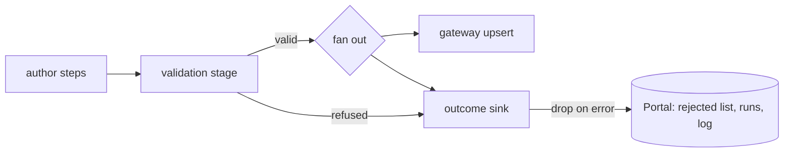

# Data Pipelines (Bento Integration Engine)

joinedcontext platform adopts **Bento** (`warpstreamlabs/bento`, MIT license) as its unified data integration and stream processing engine. It supersedes Apache NiFi (reversing legacy ADR 038) and rejects `redpanda-data/connect` due to proprietary licensing restrictions.

```text
+---------------------------------------------------------------------------------------------------+
|                                     BENTO PIPELINE ARCHITECTURE                                   |
|                                                                                                   |
|  1. Resident Stream Pipelines (High-Frequency / Real-Time):                                       |
|     Sources: MQTT v5, WebSockets, AMQP, Kafka, Webhooks                                           |
|     Runtime: Bento Streams Mode inside Project "pipeline-runner" Deployments                      |
|     Lifecycle: Continuous process, multi-stream ConfigMap directory, hot reload                   |
|                                                                                                   |
|  2. Scheduled Batch Pipelines (Periodic ETL / Pull Ingestion):                                    |
|     Sources: REST APIs, SQL Queries, File / S3 Dumps (period >= 30 s)                               |
|     Runtime: Kubernetes CronJobs running standalone Bento containers                              |
|     Lifecycle: Ephemeral, runs to completion, scale-to-zero by design                             |
+---------------------------------------------------------------------------------------------------+
```

**What runs today.**

The Portal reconciler deploys one kind of pipeline: a **resident Bento stream** whose steps are runner processors or `bloblang` compute, reading a `DataSource` or an endpoint query (`eligible` in `joinedcontext-portal/src/reconciler/streams.rs`). Everything else on this page is specified and partly written, not running:

- A pipeline with `mapping`, `wasm` or `container` compute is never deployed; it stays `Pending`.
- The class rules of §1 and the derived-pipeline renderer of §3 (`runtime_of`, `cron_job` in `crates/jcctl/src/pipelines.rs`, `crates/jcctl/src/pipelines_derived.rs`) exist in jcctl and are called by its tests alone.
- Scheduled CronJobs come from the `pipeline-runner` component's `scheduled` release, one per entry of its Helm values `pipelines:` (`components/pipeline-runner/charts/cronjob/templates/pipelines.yaml`), not from `Pipeline` manifests.
- No `compute/` crate, no `analysis-runner` image and no build lane for either exists in any repository.

## 1. Resident vs. Scheduled Execution Matrix

Pipelines declare their operational profile via `spec.class` in the manifest envelope. If set to `auto`, the platform determines execution topology automatically:

| Ingestion Trigger / Cadence | Pipeline Class | Execution Target | Scaling & Resource Behavior |
|---|---|---|---|
| **Real-time Push:** MQTT, WebSockets, AMQP, Kafka, Webhook listeners (`http_server`) | `resident` | Project `pipeline-runner` Deployment (**Bento Streams Mode**). | Continuous execution; streams created and replaced over the runner's API. One runner pod per project; the deployment configures no autoscaling (PL-12). |
| **High-Frequency Polling:** API/database polling more often than every 30 seconds (period < 30 s). | `resident` | Project `pipeline-runner` Deployment (stream using Bento `generate` input with `interval`). | Stays in memory; at this cadence the per-run pod start (10–30 s) would exceed the period. |
| **Scheduled Polling and Batch:** period ≥ 30 s, hourly/daily/weekly sync, bulk exports. | `scheduled` | Native Kubernetes **CronJob** running `bento -c bento.yaml`. | Ephemeral; scale-to-zero when idle; strict concurrency control (`Forbid`). |

---

### The 30-second rule and the one-minute cron floor

The period is `spec.period`, a duration string in Bento's own notation (`250ms`, `15s`,
`45s`, `5m`, `1h`), because the reconciler copies it straight into
`input.generate.interval`. A pipeline with no `spec.period` is push-based: an MQTT or
subscription input that is driven by its source rather than by a clock.

`auto` picks the class from the pipeline's period: **push-based or shorter than 30 seconds → resident**, **30 seconds or longer → scheduled**. Kubernetes CronJob schedules have one-minute granularity, so the scheduled class is rendered in two ways:

| Period | Rendered as |
|---|---|
| 30 s ≤ period < 60 s | CronJob `* * * * *`; the generated `bento.yaml` gets `input.generate.interval: {period}` and `input.generate.count: floor(60 / period)`, so one job performs 2 fetches (30 s) and exits; `concurrencyPolicy: Forbid`, `startingDeadlineSeconds: 30` |
| period ≥ 60 s, expressible as cron | CronJob with `spec.schedule`, the cron expression; `count: 1` |
| period ≥ 60 s, not expressible as cron (e.g. every 90 s) | CronJob at the largest divisor (every minute) with `interval`/`count` as above |

Trade-off named for operators: a sub-minute scheduled pipeline pays a pod start (image cached: 3–10 s) every minute; its only advantage over resident is releasing memory between minutes. `class: resident` MAY be set explicitly on any pipeline when latency matters more than memory; `class: scheduled` MAY be forced on a slow poll that happens to be declared as a stream. Today the reconciler records the stream's phase and the runner's answer in `status` (`StreamDeployed`, `StreamWriting`); it records no class or schedule, because it renders none.

## 2. Bento Streams Mode Architecture

In resident mode, all streaming pipelines for a given Project execute inside a dedicated, isolated deployment called the **Project Pipeline Runner**:

```mermaid
flowchart TD
    subgraph K8s["Project Pod: pipeline-runner (transport)"]
        CM["ConfigMap (/streams/{name}, the deployment's seed)"]
        
        subgraph Process["Single Bento Process (Streams Mode)"]
            SP1["Stream: mqtt-traffic-loop-01"]
            SP2["Stream: ws-tram-positions"]
            SP3["Stream: parking-sensor-feed"]
        end
        
        CM -.->|-w reload of a changed file| Process
        PR["Portal reconciler"] -->|PUT / POST / DELETE /streams/{name}| Process
    end

    MQTT["City MQTT Broker"] --> SP1
    WS["Transit WebSocket"] --> SP2
    REST["Parking REST Feed"] --> SP3

    Process -->|NGSI-LD Upsert over HTTPS| CGW["Context Gateway PEP"]
```

### Streams Mode Properties

- **Memory Footprint:** Each idle Bento stream consumes between 15 MiB and 30 MiB of RAM. A single 1 GiB pod easily hosts 30–50 concurrent streaming pipelines.
- **Dynamic Stream Reloading:** Bento runs `-w -r /streams/resources.yaml streams /streams/{name}…`, one argument per seeded stream file (`values/runner/base-values.yaml.gotmpl`); `-r` loads the shared resources, `-w` reloads a changed file. The Portal reconciler creates, replaces or deletes each approved stream over the runner's REST API (`PUT`, then `POST` on a `404`, and `DELETE` on `/streams/{name}`), so a stream starts, restarts or stops without a pod restart and without disturbing its siblings.
- **Approved pipelines become streams (PL-47):** the Portal reconciler renders every approved `Pipeline` that reads a `DataSource` into one stream file: the input of §6, the inline mapping (PL-41), an `unarchive` of the mapping's array so one poll writes many entities, and an upsert through `spec.targetEndpoint` with the project pipelines client interpolated from the runner's environment (PL-16). It creates or replaces the stream over the runner's REST API on every sync (a restarted runner is whole again within one interval; the static ConfigMap stays the deployment's seed), then sets `status.phase` from the runner's answer. `Live` is the runner's word, never Git's: a manifest the runner refuses is `Error` with the runner's reason.
- **Failure Isolation:** An unhandled error in one stream terminates only that stream. Bento isolates memory heaps across streams, preventing cascading crashes.

---

## 3. Pipeline Manifest Specification

A pipeline is defined in Git via two files within `projects/{p}/pipelines/{name}/`:

1. `pipeline.yaml`: Envelope containing platform metadata, execution class, schedule, and secret references.
2. `bento.yaml`: Native, unwrapped Bento configuration.

### `pipeline.yaml` (Envelope)

```yaml
apiVersion: joinedcontext.com/v1alpha1
kind: Pipeline
metadata:
  name: smart-meter-mqtt
  namespace: helsinki
spec:
  class: resident             # resident | scheduled | auto
  enabled: true               # false pauses it: the stream leaves the runner (PL-40)
  targetEndpoint: urn:ngsi-ld:Endpoint:hel.fi:energy:ep-smart-meters
  secretRefs:
    - name: mqtt-credentials
      key: password
      envVar: MQTT_PASSWORD
  quotas:
    maxMemoryMb: 128
    cpuMillicores: 250
```

`spec.enabled: false` is how the Portal's Pause button and an author in Git stop a pipeline without deleting it: the change goes through the same review as any other edit (CC-35), the reconciler deletes the stream from the runner, and `status` says phase `Pending` with the reason `Paused`; flipping it back starts the pipeline again (PL-40).

### `bento.yaml` (Stream Logic: MQTT to NGSI-LD Upsert)

```yaml
input:
  mqtt:
    urls:
      - "tcp://mqtt.hel.fi:1883"
    topics:
      - "sensors/energy/+/reading"
    client_id: "joinedcontext-pipeline-smart-meter"
    user: "hki-collector"
    password: "${MQTT_PASSWORD}"

pipeline:
  processors:
    - mapping: |
        let domain = env("JC_ORG_DOMAIN")   # injected by the reconciler (PF-44, Architecture/03 section 3)
        root.id = "urn:ngsi-ld:%v:%v:%v:%v".format("Device", $domain, "energy", this.device_id)
        root.type = "Device"
        root.consumption = {
          "type": "Property",
          "value": this.kwh_value.number(),
          "observedAt": this.timestamp
        }
        root.location = {
          "type": "GeoProperty",
          "value": {
            "type": "Point",
            "coordinates": [this.lon.number(), this.lat.number()]
          }
        }

output:
  http_client:
    url: "https://context-gateway.joinedcontext.svc.cluster.local/api/endpoint/zt4qm7ge2xdv6ksb3ncf5arw2y/ngsi-ld/v1/entities"
    verb: "POST"
    headers:
      Content-Type: "application/ld+json"
      Authorization: "Bearer ${SERVICE_ACCOUNT_TOKEN}"
    rate_limit: "pipeline_egress"

rate_limit_resources:
  - label: "pipeline_egress"
    local:
      count: 500
      interval: "1s"
```

---

### Sources, steps and outputs (PL-52…PL-56)

From `joinedcontext.com/v1alpha2` a Pipeline is the shape Bento runs ([ADR-N-023](../Decisions/adr-n-023-pipeline-sources-steps-outputs.md)): sources, an ordered list of steps, outputs. Two feeds merged, cleaned and written to two spaces:

```yaml
apiVersion: joinedcontext.com/v1alpha2
kind: Pipeline
metadata:
  name: bikes-merged
  namespace: helsinki
spec:
  class: resident
  period: 30s
  sources:
    - dataSourceRef: { kind: DataSource, name: citybikes-gbfs }
    - dataSourceRef: { kind: DataSource, name: citybikes-legacy-api }
  steps:
    - kind: bloblang
      bloblang: |
        root = this
        root.id = "urn:ngsi-ld:%v:%v:%v:%v".format("BikeHireDockingStation", env("JC_ORG_DOMAIN"), "helsinki", this.station_id)
    - processor:
        dedupe: { cache: pipeline_changes, key: '${! json("id") }' }
  outputs:
    - targetEndpoint: urn:ngsi-ld:Endpoint:hel.fi:helsinki:ep-bikes-ops
    - targetEndpoint: urn:ngsi-ld:Endpoint:hel.fi:helsinki-kpi:ep-kpi-write
      mode: update-attrs
```

It renders as one stream:

```yaml
input:
  broker:
    inputs:
      - <the input of citybikes-gbfs, as PL-47 renders it>
      - <the input of citybikes-legacy-api>
pipeline:
  processors:
    - mapping: |
        root = this
        …
    - dedupe: { cache: pipeline_changes, key: '${! json("id") }' }
output:
  broker:
    pattern: fan_out
    outputs:
      - <the upsert through ep-bikes-ops, PL-47>
      - <the update-attrs through ep-kpi-write>
```

One source renders as its own input with no `broker`, and one output as its own output, so a `v1alpha1` Pipeline — `source`, `compute`, `output` and `targetEndpoint` — reads as `sources: [source]`, `steps: [compute]`, `outputs: [{ targetEndpoint, mode }]` and renders the same bytes it rendered before (PL-54). It keeps running unchanged, and the Portal writes it back as `v1alpha2` the first time somebody edits it.

A conditional path is a step: `branch`, `switch` and `workflow` carry their own processors in their configuration, so the manifest never stores edges and the studio never offers free wiring. Admission reads the pipeline's grant once per source (read) and once per output (write), and each source's secrets keep their own names (PL-55).

The studio draws the same list: a lane with the sources on the left, the steps in order, the outputs on the right; a palette of the runner's processors inserts a step between two nodes, a selected node shows its own Bento block as YAML, and the test trace paints each step by its processor index (PL-56).

### Model-to-model mappings in a pipeline

A pipeline's own Bloblang handles the last mile (unpacking the source frame, splitting batches, timestamps). The step that produces the target entity SHOULD be a `kind: Mapping` (LinkML-Map, [Architecture/11 §7](11-data-models.md#7-mappings-with-linkml-map)) referenced from the compute step (`spec.compute.mappingRef`), so the target entity is schema-checked by construction. The reconciler does not deploy a `mapping` pipeline yet (see *What runs today*); the excerpt shows the manifest and what the rendering is meant to produce:

```yaml
# pipeline.yaml (excerpt)
spec:
  compute:
    kind: mapping
    mappingRef: { kind: Mapping, name: sdm-airquality-to-bb }
  # rendered bento.yaml gets:  processors: [ <pipeline's own bloblang>, { mapping: <generated/sdm-airquality-to-hki.blobl> } ]
```

### Derived pipelines: entities in, entities out

A pipeline's source does not have to be an external system. A **derived pipeline** reads entities from a Context Space, computes something from them and writes the result back, into the same space (a derived attribute or a new entity type) or into another space, even one owned by another project or organization when that owner has granted the pipeline's ServiceAccount write access through an Endpoint. Nothing new is needed on the write side: PL-18…PL-20 already apply; the source side gets `spec.source`:

```yaml
# pipeline.yaml
apiVersion: joinedcontext.com/v1alpha1
kind: Pipeline
metadata:
  name: district-air-index-daily
  namespace: helsinki
spec:
  class: scheduled
  schedule: "10 0 * * *"                   # once a day, after midnight
  source:
    endpointRef: { kind: Endpoint, name: air-quality-internal }   # read grant, same or another space
    query: { type: AirQualityObserved, attrs: [pm10, pm25, refDistrict], temporalQ: { window: P1D } }
    # add ids: [urn:ngsi-ld:AirQualityObserved:hel.fi:air-quality:station-kallio-01, …] to read only those entities (PL-42)
    # resident alternative: trigger: { subscription: { type: AirQualityObserved, watchedAttributes: [pm10, pm25] } }
  compute:
    kind: wasm                             # bloblang | mapping | wasm | container
    module: ./compute                      # Rust crate beside the pipeline, built in CI to wasm32-wasip1
    function: process
  targetEndpoint: urn:ngsi-ld:Endpoint:hel.fi:air-quality:ep-derived   # write grant; may point into another space
  output:
    type: AirQualityIndexDaily
    mode: upsert                           # upsert | update-attrs (same entity, new attributes)
```

**Not deployed today.** The Portal reconciler deploys only `bloblang` compute. It renders an endpoint query as a `generate` clock followed by an `http` processor that fetches `…/entities` with `limit=1000`, ignores `temporalQ`, and renders a `trigger.subscription` as a change gate on the polled page, not as a subscription (`src/reconciler/streams.rs`). The rest of this subsection is the renderer in `crates/jcctl/src/pipelines_derived.rs`, which nothing outside its tests calls yet.

The design renders the Bento config from this: a `scheduled` source becomes an `http_client` input that queries the endpoint (paging, `temporalQ` as given); a `subscription` trigger becomes an NGSI-LD subscription on the space whose notifications the gateway delivers to the runner's `http_server` input; the `compute` step becomes the processor below; the output is the ordinary endpoint writer.

**What each half renders.** A `query` source becomes an `http_client` input on the source
endpoint's own NGSI-LD tree, `GET .../entities` or `GET .../temporal/entities` when `temporalQ`
is given, with `type`, `attrs`, `q`, `scopeQ` and `geoQ` as query parameters and the
ServiceAccount token in the `Authorization` header. One run fetches one page: `limit` is
rendered and `offset` is not, because Bento's `http_client` has no pagination of its own, so a
query whose result outgrows one page needs a narrower `q` or a shorter window until a paging
input exists.

A `trigger.subscription` becomes two things. In the runner it is an `http_server` input on
`path: /notify` accepting `POST`; Bento streams mode prefixes a stream's HTTP endpoints with the
stream id, which is the pipeline name, so the runner receives notifications at
`http://pipeline-runner.{project}.svc.cluster.local:4195/{pipeline}/notify`. On the platform it
is one CIM 009 subscription, created through the source endpoint like every other write, whose
`notification.endpoint.uri` is that address:

```json
{
  "id": "urn:ngsi-ld:Subscription:{orgDomain}:{space}:{pipeline}",
  "type": "Subscription",
  "entities": [{ "type": "AirQualityObserved" }],
  "watchedAttributes": ["pm10", "pm25"],
  "notification": {
    "format": "normalized",
    "endpoint": {
      "uri": "http://pipeline-runner.helsinki.svc.cluster.local:4195/district-air-index/notify",
      "accept": "application/json"
    }
  }
}
```

The subscription is a standard NGSI-LD resource with a standard URN, so a broker swap replays it
like anything else and no broker-specific call is involved (CC-16).

**Where the module digest comes from.** `compute.module` is a path to source, which the build
lane compiles for `wasm32-wasip1` and publishes to the artifact store; the digest it publishes
comes back as the `joinedcontext.com/module` annotation on the Pipeline manifest, in the same
commit (PL-34a). The reconciler renders `wasm: { module_path, function }` against that digest and
against nothing else, so a pipeline whose module has not been built yet renders no processor and
no runtime rather than running the previous module. This is the same rule an App follows for its
image (AP-13a) and it exists for the same reason: the thing that runs is the thing CI signed.

**Compute steps.** Four kinds, from lightest to heaviest; use the first that fits:

| `compute.kind` | Runs as | Fit | Rules |
|---|---|---|---|
| `bloblang` | Bento `mapping` processor | arithmetic, reshaping, thresholds | inline as `spec.compute.bloblang` in `pipeline.yaml`, rendered as the last `mapping` processor (PL-41), so the Portal's editor edits it in place; or in the author's own `bento.yaml` when the field is absent |
| `mapping` | compiled LinkML-Map (PL-29) | schema-to-schema derivation | output type is schema-checked by construction |
| `wasm` | Bento `wasm` processor, module `wasm32-wasip1` | real computation in Rust (indices, interpolation, statistics, geometry) | not deployed yet, and no build lane exists; the design: a crate in `compute/` next to the pipeline, built and tested in CI (`cargo test`, then golden tests through `bento test`), module pinned by digest in the artifact store (ADR-N-015); no network, no filesystem, no clock beyond the message; memory limit per invocation |
| `container` | Kubernetes Job from the CronJob (scheduled only) | heavy or library-bound compute (raster, GDAL, ML inference) | not deployed yet; the design: image built in CI, signed and pinned by digest (AP-13 rules); reads the source endpoint and writes the target endpoint with the pipeline's ServiceAccount token; same NetworkPolicy as runners (PL-23) |

**Provenance and loop guard.** Every derived entity or attribute carries `derivedFrom` (Relationship to the source entities, or to the source type when aggregated) and `computedBy` (Property, the pipeline URN and the module digest). A resident derived pipeline must not trigger itself: the reconciler rejects a pipeline whose `output.type`/attributes intersect its own `trigger.subscription` unless `spec.allowFeedback: true` is set and the change is yellow lane.

The intersection is decided on the type, because the type is the only thing both sides declare. A
pipeline whose `output.type` differs from its trigger's type cannot feed itself and is accepted
without further question. When the two types are the same it is refused, in either mode: `upsert`
rewrites the whole entity, and `update-attrs` names no attribute list, so nothing in the manifest
says which attributes the compute writes and the reconciler will not guess that they miss the
watched ones. `allowFeedback: true` states that the author knows and accepts the loop, which is
why PL-37 puts that change in the yellow lane rather than letting it merge on a green one.

**Example WASM module**, as the design has it: a `compute/src/lib.rs` in the configuration repository beside the pipeline, whose whole contract is one function over one JSON message. No repository holds one yet:

```rust
#[no_mangle]
pub extern "C" fn process(ptr: *const u8, len: usize) -> *const u8 {
    let input: Vec<Observation> = read_json(ptr, len);          // notifications or query page, already NGSI-LD
    let by_district = group_by(&input, |o| o.ref_district.clone());
    let out: Vec<AirQualityIndexDaily> = by_district.into_iter().map(daily_index).collect();
    write_json(&out)                                             // entities for the output writer
}
```

In the design, golden tests live beside the module (`compute/tests/` for the Rust logic, `tests/*.yaml` for `bento test` end to end), so the same input page always yields the same entities.

### KPI pipelines: one indicator per run (PL-45, PL-46)

An indicator is the smallest derived pipeline: read one page of one type, fold it into one number, write one `KeyPerformanceIndicator` entity into the project's `{project}-kpi` space ([Architecture/03 §2](03-domain-model.md#key-performance-indicator), PF-54). The studio offers it as the `kpi` preset: a `scheduled` pipeline whose source is an endpoint query and whose compute is whatever the author writes, Bloblang for arithmetic, a script when a library is needed. Both variants below compute the same indicator, the average number of available bikes over every `BikeHireDockingStation` of the `helsinki` space, and write the same entity; the runner does not care which one produced it.

**Bloblang.** The reconciler renders the query into a `generate` clock and an `http` processor that fetches the page as one message (an array), so the mapping sees every station at once and folds it; no `unarchive` is rendered for a mapping that yields one object (PL-47 splits arrays only).

```yaml
# pipeline.yaml
apiVersion: joinedcontext.com/v1alpha1
kind: Pipeline
metadata:
  name: bikes-available-avg
  namespace: helsinki
spec:
  class: scheduled
  schedule: "*/15 * * * *"
  source:
    endpointRef: { kind: Endpoint, name: helsinki-all }
    query: { type: BikeHireDockingStation, attrs: [availableBikeNumber] }
  compute:
    kind: bloblang
    bloblang: |
      let domain = env("JC_ORG_DOMAIN")
      let stations = this.filter(s -> s.availableBikeNumber.value.type() == "number")
      let now = now()
      root.id = "urn:ngsi-ld:KeyPerformanceIndicator:%v:helsinki-kpi:bikes-available-avg".format($domain)
      root.type = "KeyPerformanceIndicator"
      root.name = { "type": "Property", "value": "bikes-available-avg" }
      root.calculationFormula = { "type": "Property", "value": "avg(availableBikeNumber) over BikeHireDockingStation" }
      root.currentValue = {
        "type": "Property",
        "value": if $stations.length() == 0 { 0 } else { $stations.map_each(s -> s.availableBikeNumber.value).sum() / $stations.length() },
        "unitCode": "C62",
        "observedAt": $now
      }
      root.calculationPeriod = { "type": "Property", "value": { "start": $now.ts_sub_iso8601("PT15M"), "end": $now } }
      root.updatedAt = { "type": "Property", "value": { "@type": "DateTime", "@value": $now } }
      root.derivedFrom = { "type": "Relationship", "object": "urn:ngsi-ld:Endpoint:%v:helsinki:helsinki-all".format($domain) }
      root.computedBy = { "type": "Relationship", "object": "urn:ngsi-ld:Pipeline:%v:helsinki:bikes-available-avg".format($domain) }
  targetEndpoint: urn:ngsi-ld:Endpoint:hel.fi:helsinki-kpi:kpi-writer
  output:
    type: KeyPerformanceIndicator
    mode: upsert
```

`C62` is the UN/CEFACT code for "one" (a count); an empty page writes `0` rather than dividing by it. The studio tests this mapping on a page of `helsinki-all` before Propose is enabled (PL-43, PL-49): `sample.url` is the endpoint's own entities URL with the query, `format: json`, and the trace shows the one entity the fold produced and the validation `jc-core` applies to an indicator (PF-43).

**Container (design, not built).** The same indicator as a script, for the case where pandas or a model is wanted. No `analysis-runner` image exists yet, the reconciler deploys no `container` compute, and the `Pipeline` kind does not accept `compute.runtime` or `compute.script` today (its `compute` holds `kind`, `module`, `function`, `mappingRef` and `bloblang`), so the manifest below is refused until the kind grows them. The manifest changes only in `compute`:

```yaml
  compute:
    kind: container
    runtime: python            # python | node | rust; picks the analysis-runner image, pinned by digest in the deployment
    script: compute/main.py    # committed beside pipeline.yaml
```

```python
# compute/main.py — stdin: the source page as NGSI-LD JSON; stdout: the entities to write; exit code: the verdict
import json, os, sys
from datetime import datetime, timedelta, timezone

page = json.load(sys.stdin)
values = [s["availableBikeNumber"]["value"] for s in page
          if isinstance(s.get("availableBikeNumber", {}).get("value"), (int, float))]
now = datetime.now(timezone.utc)
domain = os.environ["JC_ORG_DOMAIN"]
iso = lambda t: t.strftime("%Y-%m-%dT%H:%M:%SZ")
print(json.dumps([{
    "id": f"urn:ngsi-ld:KeyPerformanceIndicator:{domain}:helsinki-kpi:bikes-available-avg",
    "type": "KeyPerformanceIndicator",
    "name": {"type": "Property", "value": "bikes-available-avg"},
    "calculationFormula": {"type": "Property", "value": "avg(availableBikeNumber) over BikeHireDockingStation"},
    "currentValue": {"type": "Property", "value": sum(values) / len(values) if values else 0,
                     "unitCode": "C62", "observedAt": iso(now)},
    "calculationPeriod": {"type": "Property", "value": {"start": iso(now - timedelta(minutes=15)), "end": iso(now)}},
    "updatedAt": {"type": "Property", "value": {"@type": "DateTime", "@value": iso(now)}},
    "derivedFrom": {"type": "Relationship", "object": f"urn:ngsi-ld:Endpoint:{domain}:helsinki:helsinki-all"},
    "computedBy": {"type": "Relationship", "object": f"urn:ngsi-ld:Pipeline:{domain}:helsinki:bikes-available-avg"},
}]))
```

In the design, the reconciler renders a `container` compute into one CronJob in the project namespace (PL-35, PL-46). The Job has one container from the `analysis-runner` image the deployment pins for `runtime` (`ghcr.io/marek-mraz-jc/joinedcontext-analysis-runner-python@sha256:…`), the script mounted from a ConfigMap the reconciler fills from the merged commit, and an entrypoint that does the three steps the script must not: fetch the page (`GET {sourceEndpoint}/ngsi-ld/v1/entities?type=…&attrs=…` with the pipeline's ServiceAccount token, one page, PL-42 `ids` when set), pipe it to the script's stdin, and POST the array the script printed to `{targetEndpoint}/ngsi-ld/v1/entityOperations/upsert?options=update`. Stderr is captured as the run's error; a non-zero exit writes nothing.

```yaml
apiVersion: batch/v1
kind: CronJob
metadata:
  name: pipeline-bikes-available-avg
  namespace: helsinki
spec:
  schedule: "*/15 * * * *"
  concurrencyPolicy: Forbid
  jobTemplate:
    spec:
      activeDeadlineSeconds: 60
      backoffLimit: 0
      template:
        spec:
          restartPolicy: Never
          serviceAccountName: pipeline-bikes-available-avg
          containers:
            - name: compute
              image: ghcr.io/marek-mraz-jc/joinedcontext-analysis-runner-python@sha256:…
              args: ["/compute/main.py"]
              env:
                - { name: JC_ORG_DOMAIN, value: hel.fi }
                - { name: JC_SOURCE_URL, value: "https://context-gateway.joinedcontext.svc.cluster.local/api/endpoint/{source-slug}/ngsi-ld/v1/entities?type=BikeHireDockingStation&attrs=availableBikeNumber" }
                - { name: JC_TARGET_URL, value: "https://context-gateway.joinedcontext.svc.cluster.local/api/endpoint/{target-slug}/ngsi-ld/v1/entityOperations/upsert?options=update" }
                - { name: JC_CLIENT_ID, valueFrom: { secretKeyRef: { name: pipeline-bikes-available-avg-sa, key: client-id } } }
                - { name: JC_CLIENT_SECRET, valueFrom: { secretKeyRef: { name: pipeline-bikes-available-avg-sa, key: client-secret } } }
              volumeMounts: [{ name: compute, mountPath: /compute, readOnly: true }]
              resources: { limits: { cpu: "1", memory: 512Mi } }
              securityContext: { runAsNonRoot: true, readOnlyRootFilesystem: true, allowPrivilegeEscalation: false }
          volumes:
            - name: compute
              configMap: { name: pipeline-bikes-available-avg-compute }
```

The Job's NetworkPolicy is meant to be the scheduled pods' (PL-23): today `pipeline-scheduled` in `components/pipeline-runner/networkpolicies.yaml` lets them reach the gateway on 8080 and DNS, nothing else; a script that opens a socket elsewhere times out. `rust` differs in one place: in the design, CI builds `compute/src/main.rs` into a binary published beside the module store, and the image runs that binary with the same stdin and stdout contract. The `analysis-runner` images carry only the interpreter and its standard data libraries, so a script cannot pull a dependency at run time; a library it needs is a change to the image family, proposed like any other image (AP-13).

Whichever kind computed it, the indicator lands as the same entity with the same provenance, so a dashboard, the assistant and `jcctl` read it without knowing how it was made.

**Into another indicator space.** `{project}-kpi` is the default, not the only place: a subject gets its own indicator space when the author names one, `transportation-kpi` beside `helsinki-kpi`, read by an application that shows transport data and its indicators side by side (PF-54). The rule the admission check keeps is the suffix: an indicator's id names a space ending with `-kpi`. The target is an Endpoint of that space, and the runner's ServiceAccount needs a write Policy on it (`upsertBatch`, `createBatch`, `queryBatch` on `KeyPerformanceIndicator`) and the Endpoint's slug among its token audiences; the second is an entry in the runner's Keycloak client values today, not a manifest.

**On every change (PL-51).** A schedule recomputes whether anything moved; `spec.source.trigger.subscription` recomputes when something did:

```yaml
spec:
  class: auto
  period: 10s                                   # how often the source is looked at; the compute runs only on a change
  source:
    endpointRef: { kind: Endpoint, name: helsinki-all }
    query: { type: BikeHireDockingStation, attrs: [availableBikeNumber] }
    trigger:
      subscription: { type: BikeHireDockingStation, watchedAttributes: [availableBikeNumber] }
```

Streams mode renders it as a change gate in front of the compute: the clock reads the page with the watched attributes, a `mutation` writes a hash of every entity's id and watched values to the message's metadata, a `branch` reads the hash the stream last passed from the runner's shared `pipeline_changes` cache (`catch` clears the miss of a first run), a mapping drops the page when the two are equal, and a `cache` step stores the new hash before the compute. The compute therefore runs once per change of a watched value, at most one period after it; a runner restart empties the cache, so its first page passes. A notification-fed input (an NGSI-LD subscription on the source space posting to the runner) would remove the polling; it is not rendered, because the runner takes no inbound traffic (PL-23).

**From the assistant (AG-74).** "Keep the average number of free bikes updated every 15 minutes in transportation-kpi" or "recompute it on every change" is one `draft_kpi_pipeline` call:

```json
{
  "tool": "draft_kpi_pipeline",
  "name": "bikes-available-avg",
  "title": "Average available bikes",
  "type": "BikeHireDockingStation",
  "attribute": "availableBikeNumber",
  "agg": "avg",
  "unit": "C62",
  "sourceEndpoint": "helsinki-all",
  "targetSpace": "transportation-kpi",
  "every": "15m"
}
```

`onChange: true` (with `watchedAttributes`, the folded attribute when omitted) takes the place of `every`. The Portal writes the Bloblang of the preset above for the aggregate, drafts the Pipeline, and, when `transportation-kpi` does not exist yet, drafts its `ContextSpace`, its `Endpoint` and the two Policies (the runner writes, `public` reads); it tests the pipeline on a page of the source read through the run's endpoint (an empty page when the source is another endpoint) and keeps the verdict on the draft; then it opens the pipeline form on the draft. The person proposes the set; nothing runs before the change is approved. The indicator card of `compute_kpi` offers **Keep it updated**, which sends the same request with the card's type, attribute and aggregate filled in.

## 4. Scheduled Ingestion Example: CronJob CSV Fetch

Periodic batch loads run today as the `pipeline-runner` component's `scheduled` release: one CronJob per entry of its Helm values `pipelines:`, running `/bento -c /config/bento.yaml` (`components/pipeline-runner/charts/cronjob/templates/pipelines.yaml`). The chart renders `input.generate` as the trigger of each run, so the configuration carries no `input` of its own and the fetch is the first processor; a configuration with an `input` is refused when the chart renders (PL-27). The reconciler does not create these CronJobs from `Pipeline` manifests yet.

```yaml
# the `config` of one entry under `pipelines:` in the scheduled release's values
pipeline:
  processors:
    - http:
        url: "https://shmu.sk/data/air_quality_daily.csv"
        verb: "GET"
    - unarchive:
        format: csv
    - mapping: |
        let domain = env("JC_ORG_DOMAIN")
        root.id = "urn:ngsi-ld:%v:%v:%v:%v".format("AirQualityObserved", $domain, "air-quality", this.StationID)
        root.type = "AirQualityObserved"
        root.pm10 = {
          "type": "Property",
          "value": this.PM10.number()
        }

output:
  http_client:
    url: "https://context-gateway.joinedcontext.svc.cluster.local/api/endpoint/ep-air-quality/ngsi-ld/v1/entityOperations/upsert"
    verb: "POST"
    headers:
      Content-Type: "application/json"
      Authorization: "Bearer ${SERVICE_ACCOUNT_TOKEN}"
```

---

## 5. Security & Isolation Controls

1. **Authentication at Egress:** Pipelines write data exclusively through the Context Gateway PEP using standard HTTP requests authenticated with a Keycloak service-account token (client credentials) whose `Policy` grant on the target space is created in the same commit as the pipeline (CC-61). Kubernetes ServiceAccount tokens are never accepted by the gateway. Direct connections to internal PostgreSQL databases are blocked by NetworkPolicies.
2. **Secret Management:** Secrets are injected into pipelines using environment variable expansion (`${MQTT_PASSWORD}`). Credentials originate from SOPS-encrypted files or OpenBao. Plaintext credentials NEVER exist in Git (CC-06). What resolves them, and where the value lands:

   - The **Portal's reconciler** resolves them, not `jcctl`: `jcctl apply` converges through the `Platform` trait and speaks to Kubernetes nowhere, while the reconciler already stages the repository every sync and already writes the objects of an App. Which backend answers is a deployment setting and never a manifest field: `JC_PORTAL_SOPS_AGE_KEY_FILE` names the age identity that decrypts the repository's own `*.sops.yaml`, `JC_PORTAL_OPENBAO_ADDR` (with `JC_PORTAL_OPENBAO_ROLE`) reads KV v2 instead. Neither set, and a pipeline that declares a reference is not deployed — with the reason on the Pipeline, rather than a stream that starts and cannot connect.
   - The values land in **one Secret per runner**, `pipeline-secrets`, whose keys are the `envVar` names of `spec.secretRefs` (Pipeline) and `spec.secrets` (DataSource, PL-50). The runner mounts it with `envFrom: [{ secretRef: { name: pipeline-secrets, optional: true } }]`, so Bento interpolates `${MQTT_PASSWORD}` from its own environment exactly as PL-16 requires, and a runner deployed before the first secret exists still starts.
   - A runner serves the projects a deployment gives it, so two pipelines naming one `envVar` with **different** references collide. The second is refused with the clash named, rather than served a value belonging to the other pipeline.
   - An environment variable is read once, when the pod starts, so the reconciler stamps the Secret's content hash on the runner's pod template. A changed credential rolls the runner; an unchanged one rolls nothing.
   - The value is in the Secret and nowhere else: not in the stream the Portal posts to the runner, not in a ConfigMap, not in a plan, a log line or an activity entry (PL-17).
3. **Network Isolation:** Every Project Pipeline Runner deployment runs within its own network policy boundary (`components/pipeline-runner/networkpolicies.yaml`): the runner reaches the gateway on 8080, the Portal's internal listener on 9090, the ingress controller, DNS, and any public address on 443 with every private range excepted. Its NetworkPolicy opens no application port; the Portal reaches the streams API on 4195 through the Linkerd proxy's inbound port 4143, which `pipeline-runner-allow-linkerd` admits and the mesh's inbound policy governs. Egress is not narrowed to the hosts a pipeline declares.
4. **Lint and test (PL-21, PL-22):** The platform repository's CI runs `bento lint` and `bento test` over the example pipelines in `examples/ingestion`. A project's `bento.yaml` never passes through that lane: the runner lints it in the pipeline test (PL-43), which returns the lint errors with their line numbers before the pipeline is proposed (§7). The organization repository's CI checks manifests (`jcctl validate`) and the author's role bindings, not Bento.
5. **Ids that cannot claim another organization:** the runner's environment carries `JC_ORG_DOMAIN`, resolved by the reconciler from the project's Organization, and a mapping mints `urn:ngsi-ld:{Type}:{orgDomain}:{space}:{localId}` from that variable rather than from a literal (PF-42, PF-44, [Architecture/03 §3](03-domain-model.md#3-identity-and-urn-specification)). A pipeline that writes a domain of its own is refused at admission by the gateway, not silently accepted.

## 6. External Feeds: the `DataSource` Kind (MF-35, PL-39)

A pipeline that reads the city's own spaces names an `endpointRef` and the reconciler renders the
input for it (section 3). A pipeline that reads the world outside had, until now, only one place
to say where that world is: the `input` block the author writes by hand in `bento.yaml`. Three
pipelines reading the same MQTT broker repeated the same host, the same topic prefix and the same
credential three times, and the Portal could offer nothing better than a YAML editor for it.

`kind: DataSource` is that connection, declared once. It holds where the feed is, how to
authenticate to it and nothing else: no mapping, no schedule, no target. A `DataSource` on its own
moves no data, and one is worth writing only because several pipelines, or a person who does not
write Bento, will use it.

```yaml
apiVersion: joinedcontext.com/v1alpha1
kind: DataSource
metadata:
  name: mqtt-mesto
  namespace: helsinki
  title: { fi: "Kaupungin MQTT-välittäjä", en: "City MQTT broker" }
spec:
  type: mqtt                 # mqtt | http | websocket | gtfs-rt | any input the runner ships (PL-50)
  mqtt:
    urls: ["tls://mqtt.hel.fi:8883"]
    topics: ["sensors/aq/+/reading"]
    qos: 1
    cleanSession: false
    username: hki-collector
    passwordRef: { name: mqtt-mesto, key: password }   # secretRef, never a literal (CC-06)
  tls:
    insecureSkipVerify: false
    caCertRef: { name: city-ca, key: ca.crt }
```

The file lives at `projects/{project}/datasources/{name}.yaml` and is served at
`/api/v1/projects/{project}/datasources` like every other kind (MF-11). Exactly one connection
block is present and it is the one `spec.type` names; a manifest with two, or with none, is
refused by the schema.

### What each type becomes

The reconciler renders the connection into the Bento input the runner speaks. Bento's own field
names are used wherever they exist, so an author reading the generated `bento.yaml` recognises it.

| `spec.type` | Bento input | Rendered from |
|---|---|---|
| `mqtt` | `mqtt` | `urls`, `topics`, `qos`, `cleanSession`, `username`, `passwordRef`; `client_id` is `jc-{project}-{pipeline}` |
| `http` | `http_client` | `url`, `verb`, `headers`, `authorization`, `timeout`; how often it is fetched stays with the pipeline's class and `spec.period` (section 1) |
| `websocket` | `websocket` | `url`, `openMessage` |
| `gtfs-rt` | `http_client` plus a `protobuf` processor | `url` and `feed`; the GTFS-realtime descriptor set ships in the runner image, so no pipeline carries one |
| any other input of the runner | that input, verbatim | `spec.input`, the input's own document (PL-50, below) |

The `gtfs-rt` type is the one case where a `DataSource` contributes a processor as well as an
input: the feed arrives as protobuf and every consumer would otherwise decode it again. The
decoder is prepended to the author's processors and nothing else about them changes.

### Credentials

A connection field that carries a credential is a `secretRef` and there is no field to write a
credential into: `passwordRef`, `caCertRef` and `authorization.headerRef` take
`{ name, key, envVar? }` and the schema has no `password`, `token` or `apiKey` member at all
(CC-06, PL-14). The reconciler resolves each reference at apply time, injects it into the runner
of every pipeline that references the source, and writes only the interpolation into the
generated config (PL-15, PL-16):

```yaml
input:
  mqtt:
    urls: ["tls://mqtt.hel.fi:8883"]
    topics: ["sensors/aq/+/reading"]
    client_id: "jc-helsinki-air-quality-ingest"
    user: "hki-collector"
    password: "${DS_MQTT_MESTO_PASSWORD}"
```

`envVar` defaults to `DS_{name}_{key}` upper-cased with `-` as `_`, so two sources never collide
in one runner; an explicit `envVar` wins where a legacy `bento.yaml` already expects a name.

A feed that wants its key in a header of its own names that header. `authorization.header` is the
header the credential is written into and defaults to `Authorization`; `scheme` is the word in
front of the value and defaults to `Bearer` for `Authorization` and to nothing for any other
header, because a vendor key header takes the bare key and rejects a scheme in front of it. An
explicit `scheme` always wins, so a header that does want one can say so.

```yaml
  http:
    url: "https://api.digitransit.fi/map/v2/hsl/gbfs/en/station_status.json"
    authorization:
      header: digitransit-subscription-key
      headerRef: { name: hsl-gbfs, key: key }
```

renders as `digitransit-subscription-key: ${DS_HSL_GBFS_KEY}`, and the credential itself stays
where it was: in the secret store, resolved by the reconciler, never in the manifest (CC-06,
MF-35). An API key in a vendor header is the common shape of an open-data feed, and without this
field such a feed could only be declared by writing the key into `headers` as a value, which is
exactly what MF-35 forbids.

### Any input the runner ships (PL-50)

The four typed connections above are the well-trodden path: a form with a handful of fields,
a scheme fence, a credential slot. They are not the limit. The runner is Bento, and Bento ships
sixty-odd inputs (`bento list inputs` in the pinned image: `amqp_0_9`, `aws_s3`, `csv`, `file`,
`kafka`, `nats`, `redis_streams`, `sftp`, `sql_select`, … the list jc-core holds as
`jc_core::kinds::bento_inputs::INPUTS`, read from the image and not from a manual). A `DataSource` may name any of
them as `spec.type` and then carries that input's own configuration, verbatim, as
`spec.input`:

```yaml
spec:
  type: kafka
  input:
    addresses: ["kafka.hel.fi:9093"]
    topics: ["sensors.air"]
    consumer_group: jc-helsinki-air
    tls: { enabled: true }
    sasl:
      mechanism: SCRAM-SHA-512
      user: hki-collector
      password: "${DS_KAFKA_HEL_PASSWORD}"
  secrets:
    - { name: kafka-hel, key: password, envVar: DS_KAFKA_HEL_PASSWORD }
```

The rules, all checked when the manifest is validated (`jcctl validate`, the Portal's Check),
so a broken source is a refused manifest and never a crash-looping stream:

1. `spec.type` is one of the four typed names, or a name in the runner's list. Anything else is
   refused, and the refusal carries the list.
2. A typed name has its block (`mqtt`, `http`, `webSocket`, `gtfsRt`) and no `input`; a runner
   name has `input`, a non-empty mapping, and none of the typed blocks. `spec.tls` belongs to
   the typed four; a runner input carries its own `tls` member the way Bento documents it.
3. Every field the runner documents as a secret (`password`, `secret`, `token`, `root_cas`,
   `client_secret`, `connection_string`, `private_key_pass`, … per input, from
   `bento list --format json-full`) holds exactly one `${VAR}` interpolation, and `VAR` is the
   `envVar` of an entry in `spec.secrets` (`{ name, key, envVar }`, the `secretRef` of MF-35).
   A literal in such a field is a parse error, the same way a `password` member is one on the
   typed blocks (CC-06, PL-16). The same holds for every `${VAR}` anywhere else in `input`:
   `VAR` names an entry of `spec.secrets`. The runner interpolates its whole environment, which
   holds its own client credentials, so an interpolation naming anything else is refused.
   A credential inside a connection string the runner does not mark secret (`dsn`, `url`,
   `urls`) is held to the same rule: the password of a `user:password@` part and the value of
   a `password=` parameter are a `${VAR}` naming `spec.secrets`, never a literal.
4. The reconciler renders `input: { <type>: <spec.input> }` byte for byte and injects the
   named secrets into the runner as environment variables (PL-15); nothing is prepended.
5. A file-reading input (`csv`, `file`, `file_tail`, `parquet`) names paths under `/data/`,
   the runner's files volume (the claim `pipeline-runner-files`, mounted at `/data` in the
   resident runner and kept across a redeploy); a path anywhere else is refused. A file gets there with `kubectl cp` today; the
   Portal's upload is a task of its own.
6. An input that ends on its own once it has read what there is (a file, a query, a bucket
   listing: `csv`, `file`, `parquet`, `sql_select`, `sql_raw`, `generate`, `sequence`,
   `read_until`, `aws_s3`, `azure_blob_storage`, `gcp_cloud_storage`, `sftp`, `hdfs`,
   `redis_scan`, `gcp_bigquery_select`, `azure_table_storage`, `cassandra`, `stdin`,
   `subprocess`) may back a `scheduled` pipeline; a broker or socket input (`kafka`, `nats`,
   `amqp_*`, `mqtt`, `redis_pubsub`, `websocket`, `socket_server`, …) never terminates and is
   `resident` (PL-04, the rule of T-0140 checked per input rather than assumed).

In the Portal, the Data Sources form offers the runner's inputs grouped the way an operator
thinks (message brokers; files and object stores; databases; HTTP, sockets and streams;
cloud queues; utility), each with the runner's one-line summary, and the form for the chosen
input is generated from that input's field tree (`ui/src/schemas/bento-inputs.json`, written
by `ui/scripts/bento-inputs.mjs` from the pinned image) through the design-system widgets:
required fields first, advanced ones folded, and every secret field a `secretRef` picker that
writes the interpolation into `input` and the reference into `secrets`. The typed four keep
their own forms.

### How a pipeline references one

```yaml
spec:
  class: resident
  source:
    dataSourceRef: { kind: DataSource, name: mqtt-mesto }
  targetEndpoint: urn:ngsi-ld:Endpoint:hel.fi:air-quality:ep-air
```

Resolution rules the reconciler enforces, all of them at plan time so a broken reference is a
failed plan and never a crash loop:

1. The reference resolves inside the pipeline's own project. A `DataSource` of another project is
   refused: a connection is owned by the team that owns its credentials.
2. A reference that names no existing `DataSource` fails the plan, naming the manifest and the
   missing name.
3. `dataSourceRef` and `endpointRef` are mutually exclusive: a pipeline reads the outside world or
   the platform's own spaces, not both in one input.
4. The author's `bento.yaml` MUST NOT declare an `input` of its own when `dataSourceRef` is set.
   Two inputs in one config is a merge nobody can review; the reconciler refuses it instead of
   choosing.
5. The author's `pipeline.processors` are copied through untouched (PL-03), except for the decoder
   the `gtfs-rt` type prepends. The output is always the rendered upsert through
   `spec.targetEndpoint` with the runner's OAuth client, whatever the author wrote.
6. Editing a `DataSource` re-renders every pipeline that references it, in the same change. The
   plan lists them, so a host change is reviewed together with everything it moves.

## 7. Testing a pipeline before proposing it

A mapping is tested where it will run, on the project's pipeline runner, and never on the Portal (PL-43, MF-38): the Portal's image carries no Bento, and a test that ran elsewhere would prove something else. `POST /api/v1/projects/{project}/pipelines/test` takes the candidate Pipeline manifest and a sample, and the Portal renders a harness with the renderer of §3 and §6: the `DataSource` input becomes a `generate` input that emits the sample once (for a sample URL, one `generate` tick drives an `http` processor, so a fetch obeys the runner's own egress policy, PL-23), the processors stay byte for byte, a `catch` at the end turns a failed message into an error record with the message it failed on, and the output becomes an `http_client` POST to the Portal's capture route for this test. The harness is created as an ephemeral stream through the runner's streams API (`POST /streams/pipeline-test-{id}`, §2), the Portal waits at most three seconds for the captured messages, deletes the stream, and answers the trace:

```json
{
  "input": { "events": 1, "bytes": 412, "sample": { "station_id": "01", "pm10": 18.2, "timestamp": "2026-09-13T07:00:00Z" } },
  "mapping": [ { "id": "urn:ngsi-ld:AirQualityObserved:hel.fi:air-quality:01", "type": "AirQualityObserved", "pm10": 18.2 } ],
  "validation": [ { "index": 0, "ok": true, "problems": [] } ],
  "errors": [ { "stage": "lint", "line": 12, "message": "expected string, got number" } ]
}
```

An error of stage `mapping` also carries `step`: the index into `spec.steps` of the step the
message failed at, counted as the manifest writes them (PL-52), so a lane with several processors
says which one threw rather than only that the mapping did. The harness stamps it: before every
author step it writes that step's index into the message's metadata unless the message has already
failed, so the number that survives to the capture route is the step the failure happened at, not
the last step to run. Nothing else carries a `step`: a `lint` error belongs to the document and a
`runner` error to the stream, and both leave it absent. A reader that does not understand `step`
reads the trace exactly as before.

```json
{ "stage": "mapping", "step": 2, "line": null, "message": "expected string, got number" }
```

A mapping that yields an array is split into one entity per element before validation, the same `unarchive` the reconciler renders (PL-47), capped at 20 so a feed of thousands answers in the same three seconds (PL-48). When the candidate reads an `http` DataSource the studio offers that URL as the sample: the runner fetches it under its own egress policy and the first test runs on the live feed with no file. The same harness with no compute is the dry run's feed probe for an `http` DataSource (MF-39): `probe.records`, `probe.bytes` and the first record, beside the plan, before anything is proposed. The studio does not propose a `bloblang` pipeline whose mapping has not passed the test since it last changed (PL-49): Propose stays disabled with the reason until the test is green for the text in the editor.

Nothing is written: no Git, no broker, no endpoint, no `secretRef` resolved. The runner refuses a harness that does not lint, and its answer carries the line numbers the trace reports; a processor that throws is a `mapping` error naming the message. One test stream per project at a time, three seconds, then gone. The studio (§7 of Architecture/09) runs the test on the manifest being edited, draws the stages, paints the step an error names red and the steps behind it grey (PL-56), underlines an error at its line, and drafts the `DataSource`, the type and the Bloblang mapping from a dropped CSV or JSON sample so the first test runs before anything is typed (PL-44).

## 8. The workbench, validation and the log

The workbench ([ADR-N-034](../Decisions/adr-n-034-pipeline-workbench.md), PL-58) is one page with six steps: source, sample, mapping, mapped output, validation, target and save. Each step is one operation of the registry, so the page, the API (`POST /api/v1/projects/{project}/ops/{name}`), MCP and the assistant run the same code and see the same output (PL-63). Sampling and trying a mapping run on the project's runner and need propose on Pipeline, like the §7 test; validating writes nothing and needs read on Pipeline:

| Step | Operation | Answers |
|---|---|---|
| Source and sample | `jc_pipeline_sample_source` | the first 20 records of the picked `http` DataSource, fetched once on the runner under its egress policy, or of a sample file or URL; their fields and count. A DataSource with a credential or one that streams (MQTT, a socket) has no dry-run sample (MF-38), and the answer asks for a file instead; an Endpoint is read with the caller's own token (the workbench through the gateway, an agent with `query_endpoint`) and passed in as the sample |
| Mapping and mapped output | `jc_pipeline_try_mapping` | the §7 trace of the candidate over the sample: every mapped record, and each error at its step and line; the same answer as the pipeline test for the same input |
| Validation | `jc_pipeline_validate` | one verdict per record (at most 100) against the model of the space the pipeline writes into, or of a space named directly: each rule broken by its SHACL component and path (PL-59); a space that names no model answers 409 |
| Target and save | `jc_pipeline_propose` | the Change the person sends, naming the target space |

### What the stage checks (PL-59, PL-60)

The target space's one model (DM-61) carries a JSON Schema of its classes in key-value form (DM-02). The Portal compiles that schema into a schema of the normalized entity a pipeline writes: per class, `id` and `type` required, `type` the class name, each declared attribute an object of its NGSI-LD kind (`Property` with a `value`, `Relationship` with an `object`, `LanguageProperty` with a `languageMap`, `GeoProperty` with a GeoJSON `value`), the value checked against the slot's schema, required slots required, and no other attribute unless the model is open. Those are the constraints the model's SHACL shapes carry (`sh:closed`, `sh:minCount`, `sh:maxCount`, `sh:datatype`, `sh:in`), rendered from the same LinkML (DM-43), so a refusal names its SHACL component and path, and never quotes the value it refused:

```json
{ "index": 3, "ok": false, "problems": [ { "rule": "sh:datatype", "path": "pm10", "message": "pm10 is not of the slot's datatype" } ] }
```

The reconciler renders the same schema into the stream: after the author's steps, a `switch` on the type runs Bento's `json_schema` processor with the class's schema, and a mapping checks the id against `urn:ngsi-ld:{type}:{JC_ORG_DOMAIN}:{JC_SPACE}:` (PF-42, PL-57). The schema comes from the artifacts at the version the space's `dataModelRef` pins; a new version is a new render. A pipeline whose space has no model renders no stage, and `jcctl validate` warns about the space (DM-61).

### Where a refused record goes (PL-61, PL-62)



The output is a `switch`: a record the stage refused goes only to the outcome sink, a valid one fans out to the gateway upsert and the sink. The sink is an `http_client` to the Portal's internal outcome route with the runner's own client credential, wrapped in `drop_on` so a Portal that does not answer loses a log line and never holds back a write. Each line carries the pipeline, the run, the record id, the step, the outcome (`sent`, `rejected`, `failed`) and a message; a refused record also carries the record, which the Portal masks before it stores it. A run is one tick of the pipeline's clock, or one UTC hour for a source that never ends.

The Portal keeps the newest 1000 rejected records and the newest 5000 log lines per pipeline, and the counts per run. `GET /api/v1/projects/{project}/pipelines/{name}/rejected` and `GET …/runs` answer them with read on the pipeline; "Retry after fix", which needs `propose` on `Pipeline` because it writes, replays the kept records once through the pipeline's current stream on the runner (the §7 harness with the real output): a record that passes now is written, one that still fails comes back with its rule.

## Related

- [Architecture/11 §7](11-data-models.md) — referenced above.
- [PL-31…PL-38, PL-45…PL-46](../Requirements/pipelines.md) — derived pipelines, compute steps and the KPI preset.
- [ADR-N-006 §6](../Decisions/adr-n-006-bento-pipelines-supersede-nifi.md) — compute steps addendum.
- [ADR-N-034](../Decisions/adr-n-034-pipeline-workbench.md) — why one workbench and a validation stage.
- [01-overview](../Architecture/01-overview.md) — where this chapter sits in the whole.
- [00-index](../Requirements/00-index.md) — the normative requirements behind it.
