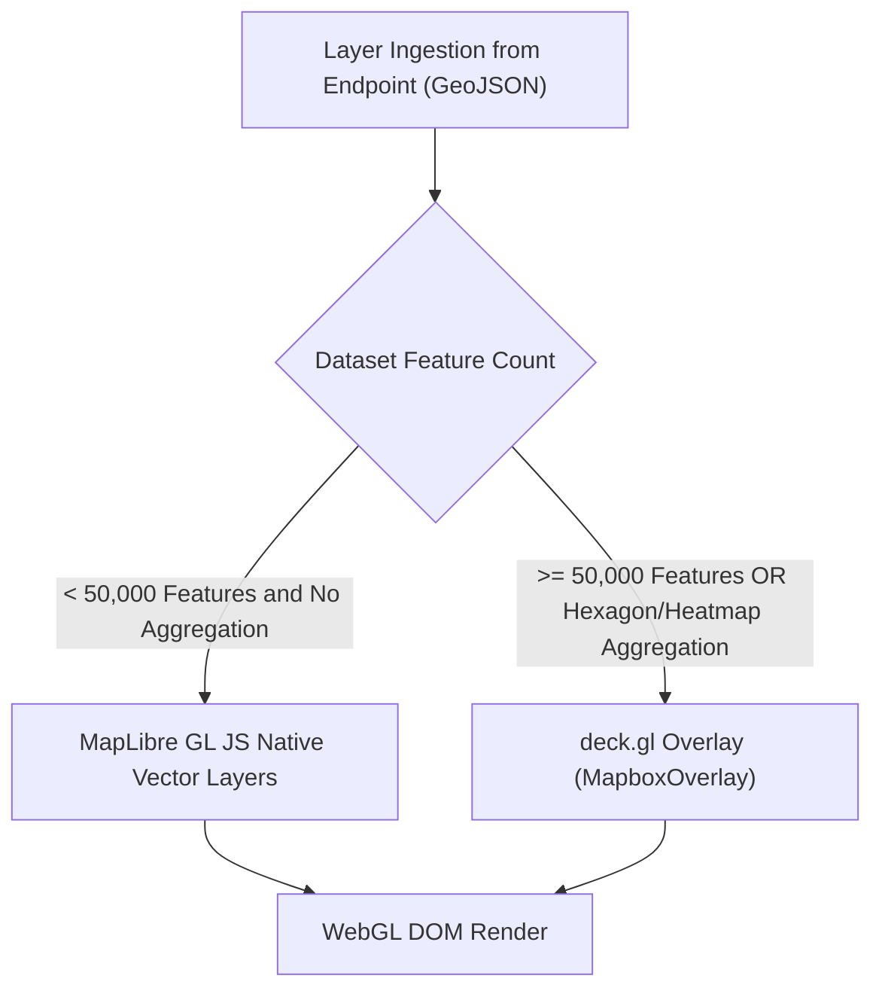

# Dashboards & Geospatial Visualization

The platform provides a declarative dashboarding and geospatial presentation engine built directly into the Portal UI. Visualizations query Endpoints through standard GeoJSON and temporal representations, eliminating proprietary data stores.

```text
+---------------------------------------------------------------------------------------------------+
|                                   DASHBOARD & LAYER ARCHITECTURE                                  |
|                                                                                                   |
|  Dashboard Manifest (kind: Dashboard)                                                             |
|  ├── Page 1: Map View (MapLibre GL JS + deck.gl Overlay)                                          |
|  │   ├── Layer 1: Air Quality Sensors (Style: circle, colorBy: pm10, native MapLibre)             |
|  │   └── Layer 2: Organisational Traffic Flow (Style: line, sizeBy: intensity, native MapLibre)          |
|  └── Page 2: Analytics View                                                                       |
|      ├── Widget 1: Historical Temperature Chart (STA / Temporal API)                              |
|      └── Widget 2: Asset Inventory Grid (entity grid widget)                                      |
+---------------------------------------------------------------------------------------------------+
```

## 1. Manifest Specifications: `Dashboard` & `Layer`

Dashboards and Layers are authored as declarative YAML manifests inside `projects/{p}/dashboards/`:

### `kind: Dashboard`

```yaml
apiVersion: joinedcontext.com/v1alpha1
kind: Dashboard
metadata:
  name: air-quality-overview
  namespace: helsinki
spec:
  title: "Air Quality Overview"
  visibility: public        # private | project | organization | public
  pages:
    - title: "Mapa staníc"
      layout: full-map
      layers:
        - air-quality-stations
        - organisational-districts
    - title: "Analýzy"
      layout: grid-2x2
      widgets:
        - widgetType: temporal-chart
          endpointRef: ep-air-quality
          entityId: "urn:ngsi-ld:AirQualityObserved:hel.fi:air-quality:station-01"
          property: pm10
        - widgetType: grid
          endpointRef: ep-air-quality
          entityType: AirQualityObserved
          grid:
            columns:
              - attr: pm10
                format: number
              - attr: temperature
                format: number
            pageSize: 25
            history:
              enabled: true
```

A widget of `widgetType: grid` is the entity grid the Portal's data explorer and a generated
application render, configured by the same object (UI-71, SDK-30): `endpointRef` and `entityType`
say what it reads and `grid` is `EntityGridConfig` without its `source` and `type`, which those two
fields decide. The grid pages and filters at the endpoint, opens an attribute's metadata and its
history, and takes a correction where that endpoint's Policy allows one — a dashboard never widens
what the grant permits. `spec.pages[].widgets[].entityType` and `spec.pages[].widgets[].grid` are
absent on every other widget type.

### `kind: Layer`

```yaml
apiVersion: joinedcontext.com/v1alpha1
kind: Layer
metadata:
  name: air-quality-stations
  namespace: helsinki
spec:
  sourceEndpointRef: ep-air-quality
  entityType: AirQualityObserved
  style: circle             # circle | heatmap | hexagon | icon | line | fill
  visible: true
  filter:
    q: 'pm10>0'
    scopeQ: '/geo/FI/HKI/#'
  colorBy:
    property: pm10
    palette: "YlOrRd"
    domain: [0, 100]
  sizeBy:
    property: pm10
    range: [4, 18]
  popupProperties:
    - stationName
    - pm10
    - temperature
```

Both kinds are typed in `jc-core` and validated wherever a manifest is written or loaded (MF-09, `schemas/kinds/Dashboard.json`, `schemas/kinds/Layer.json`): a dashboard has at least one page and every page names a layer or a widget; a `grid` widget names its Endpoint and a PascalCase entity type, and its `grid` object is checked by the same rules the SDK's `parseGridConfig` applies; a layer names its Endpoint by `metadata.name`, a PascalCase entity type, ordered `domain`/`range` pairs and non-empty popup properties; `visibility` defaults to `private`, `style` to `circle`, `visible` to `true`. Whether a `visibility: public` dashboard reads only through `audience: public` Endpoints (UI-19) is checked by the Portal, which sees both manifests, and again by the dashboard view before it asks for data.

---

## 2. MapLibre GL JS vs. deck.gl Selection Rule

To balance rendering performance and visual fidelity, the visualization engine strictly enforces the **50k Feature Threshold Rule**:



### 1. MapLibre GL JS Native Layers (< 50,000 features)

- Used for discrete points, lines, and boundary polygons (`ui/src/components/dashboards/rendering.ts`).
- Draws GeoJSON sources over the raster basemap of §5.
- Supports crisp vector styling, label collisions, and smooth zoom transitions.

### 2. deck.gl Layers (≥ 50,000 features or complex aggregations)

- Integrated over MapLibre using `@deck.gl/mapbox` `MapboxOverlay`.
- Used for high-density spatial datasets (e.g. city-wide parking telemetry, GPS tracks, lidar point clouds).
- Supported Layer Types:
  - `HexagonLayer` for density aggregation.
  - `HeatmapLayer` for spatial heatmaps.
  - `ScatterplotLayer` for large point sets and `GeoJsonLayer` for large line and polygon sets (`DeckGlOverlay.tsx`).

---

## 3. Layer Queries

A layer's query is its manifest's, not a control the viewer sets: the Portal takes the Layer's static `filter` (`q`, `scopeQ`, `geoQ`), adds the bounding box of the current viewport, and requests the Endpoint's GeoJSON projection (`ui/src/routes/DashboardsPage.tsx`):

```text
GET /api/endpoint/{endpointSlug}/file.geojson?type=AirQualityObserved&q=pm10>=25&scopeQ=/geo/FI/HKI/#
```

The dashboard view has no filter panel. Changing what a layer shows is a change to its manifest.

---

## 4. Public Dashboards & Endpoint Audience Rules

To prevent data leaks and broken references:

- **Audience Enforcement:** A Dashboard marked `visibility: public` MUST bind exclusively to Layers whose `sourceEndpointRef` points to an Endpoint configured with `audience: public`.
- **Write-time check:** The Portal refuses a write that leaves a public dashboard reading through an Endpoint that is not public, with `400` naming UI-19 (`src/dashboards.rs`, called from `src/api/mutate.rs`), and the dashboard view refuses to fetch such a layer. No CI workflow checks it.

### Dashboards and Applications (AP-64)

Dashboards and Applications on Demand serve complementary visualization needs but adhere to strict architectural separation:

- A **Dashboard** is a declarative configuration manifest (`kind: Dashboard` and `kind: Layer`) organizing map and analytics pages bound to Endpoints, rendered natively in the Portal UI. Dashboards are authored via form or YAML, declare layers over existing Endpoints, and involve zero generated code.
- An **Application** is a purpose-built web tool generated by an AI agent from a prompt and confirmed `dataNeeds` (Architecture/16). It consists of a kit specification (`spec.json`) or full-stack application code, deployed behind the APISIX edge login.

The Portal's dashboard surface never generates application code, and the Applications generator never creates Dashboard manifests (AP-64). Both may query the same Endpoint simultaneously.

## 5. Basemap Platform Route & In-Browser Artifacts

### Basemap Platform Route (AP-67)

To prevent location data leakage to third-party services and adhere to sandboxed preview frame isolation, MapLibre GL JS layers MUST NOT load basemap tiles or styles directly from external tile providers. All basemap assets route through two Portal routes (`src/api/basemap.rs`):

- `GET /api/v1/projects/{project}/basemap/{style}/{z}/{x}/{tile}`, where `{tile}` is `{y}` with an optional `.png`, `.jpg` or `.jpeg` (none means PNG). AP-67 writes it `{y}.{ext}`; the URL on the wire is the same.
- `GET /api/v1/projects/{project}/basemap/{style}/style.json`

The routes take no session, because a sandboxed preview holds none and a basemap carries none of the platform's data (AP-67). They answer any origin (`Access-Control-Allow-Origin: *`), only for a project that exists, and at most 600 requests a minute per client IP, so they are not a general proxy. `z` must be a whole number up to the configured maximum zoom, and `x` and `y` must each be below 2^z; anything else answers `400` before the upstream is asked. Operators configure the upstream with `JC_BASEMAP_URL` (an `https` template), `JC_BASEMAP_ATTRIBUTION` (required when the URL is set), `JC_BASEMAP_MAX_ZOOM`, and `JC_BASEMAP_KEY_FILE`, the path of a mounted file holding the provider's key, which the Portal substitutes upstream and never sends to a browser. The Portal caches tiles on disk (`JC_BASEMAP_CACHE_DIR`, bounded by `JC_BASEMAP_CACHE_MAX_BYTES` and `JC_BASEMAP_CACHE_TTL_SECS`). If no upstream is configured, both routes answer `404` problem details: an application map built on the SDK draws its data over a plain background with a notice, and the Portal's dashboard map falls back to the plain background without one.

### In-Browser Artifact Generation (AP-66)

Generated Applications export on-screen data as PDF, PNG, CSV or GeoJSON through the app SDK (`sdk/src/artifact.ts`), built in the browser from what the view already holds, with no backend job and no new network host. The Portal's own dashboards have no export. Today only the PDF carries a stamp (the Endpoint name, the filters and the export time), and it carries the basemap attribution only when the caller passes one; the template's export button passes neither the filters nor the attribution. AP-66 asks for a stamp on every format and the attribution on every PDF, so the SDK falls short of it there.

## Related

- [01-overview](../Architecture/01-overview.md) — where this chapter sits in the whole.
- [00-index](../Requirements/00-index.md) — the normative requirements behind it.
