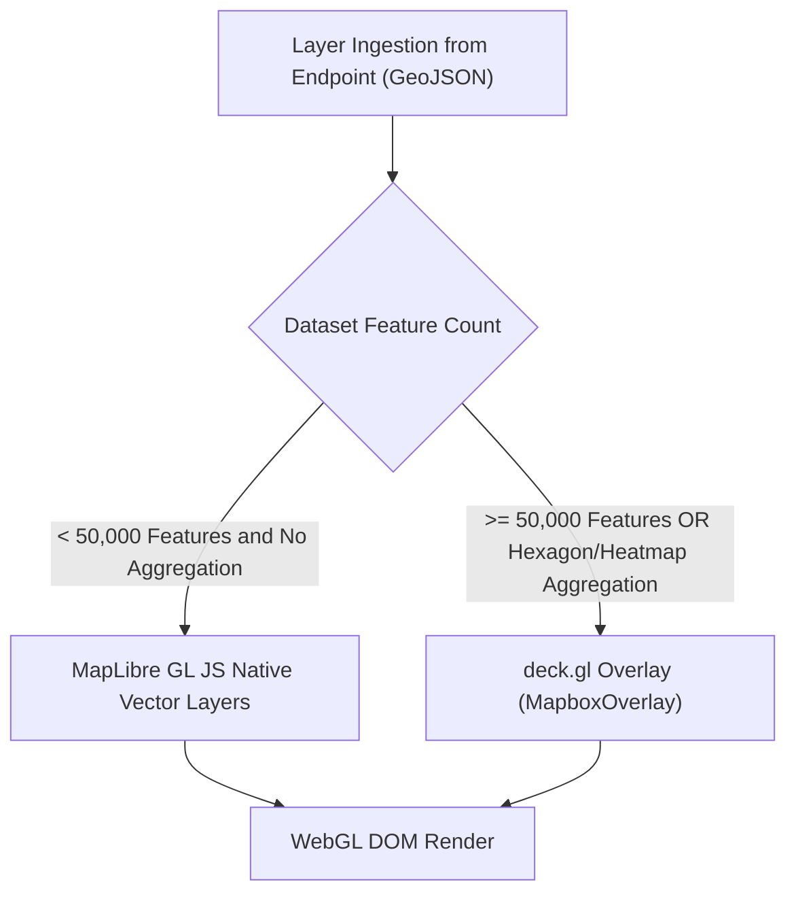

# Dashboards & Geospatial Visualization

The platform provides a declarative dashboarding and geospatial presentation engine built directly into the Portal UI. Visualizations query Endpoints through standard GeoJSON and temporal representations, eliminating proprietary data stores.

```text
+---------------------------------------------------------------------------------------------------+
|                                   DASHBOARD & LAYER ARCHITECTURE                                  |
|                                                                                                   |
|  Dashboard Manifest (kind: Dashboard)                                                             |
|  ├── Page 1: Map View (MapLibre GL JS + deck.gl Overlay)                                          |
|  │   ├── Layer 1: Air Quality Sensors (Style: circle, colorBy: pm10, native MapLibre)             |
|  │   └── Layer 2: Organisational Traffic Flow (Style: line, sizeBy: intensity, deck.gl PathLayer)      |
|  └── Page 2: Analytics View                                                                       |
|      ├── Widget 1: Historical Temperature Chart (STA / Temporal API)                              |
|      └── Widget 2: Asset Inventory Grid (AG Grid Table)                                           |
+---------------------------------------------------------------------------------------------------+
```

## 1. Manifest Specifications: `Dashboard` & `Layer`

Dashboards and Layers are authored as declarative YAML manifests inside `projects/{p}/dashboards/`:

### `kind: Dashboard`

```yaml
apiVersion: joinedcontext.com/v1alpha1
kind: Dashboard
metadata:
  name: air-quality-overview
  namespace: helsinki
spec:
  title: "Air Quality Overview"
  visibility: public        # private | project | organization | public
  pages:
    - title: "Mapa staníc"
      layout: full-map
      layers:
        - air-quality-stations
        - organisational-districts
    - title: "Analýzy"
      layout: grid-2x2
      widgets:
        - widgetType: temporal-chart
          endpointRef: ep-air-quality
          entityId: "urn:ngsi-ld:AirQualityObserved:hel.fi:air-quality:station-01"
          property: pm10
        - widgetType: grid
          endpointRef: ep-air-quality
          entityType: AirQualityObserved
          grid:
            columns:
              - attr: pm10
                format: number
              - attr: temperature
                format: number
            pageSize: 25
            history:
              enabled: true
```

A widget of `widgetType: grid` is the entity grid the Portal's data explorer and a generated
application render, configured by the same object (UI-71, SDK-30): `endpointRef` and `entityType`
say what it reads and `grid` is `EntityGridConfig` without its `source` and `type`, which those two
fields decide. The grid pages and filters at the endpoint, opens an attribute's metadata and its
history, and takes a correction where that endpoint's Policy allows one — a dashboard never widens
what the grant permits. `spec.pages[].widgets[].entityType` and `spec.pages[].widgets[].grid` are
absent on every other widget type.

### `kind: Layer`

```yaml
apiVersion: joinedcontext.com/v1alpha1
kind: Layer
metadata:
  name: air-quality-stations
  namespace: helsinki
spec:
  sourceEndpointRef: ep-air-quality
  entityType: AirQualityObserved
  style: circle             # circle | heatmap | hexagon | icon | line | fill
  visible: true
  filter:
    q: 'pm10>0'
    scopeQ: '/geo/FI/HKI/#'
  colorBy:
    property: pm10
    palette: "YlOrRd"
    domain: [0, 100]
  sizeBy:
    property: pm10
    range: [4, 18]
  popupProperties:
    - stationName
    - pm10
    - temperature
```

Both kinds are typed in `jc-core` and validated wherever a manifest is written or loaded (MF-09, `schemas/kinds/Dashboard.json`, `schemas/kinds/Layer.json`): a dashboard has at least one page and every page names a layer or a widget; a `grid` widget names its Endpoint and a PascalCase entity type, and its `grid` object is checked by the same rules the SDK's `parseGridConfig` applies; a layer names its Endpoint by `metadata.name`, a PascalCase entity type, ordered `domain`/`range` pairs and non-empty popup properties; `visibility` defaults to `private`, `style` to `circle`, `visible` to `true`. Whether a `visibility: public` dashboard reads only through `audience: public` Endpoints (UI-19) is checked by the Portal, which sees both manifests, and again by the dashboard view before it asks for data.

---

## 2. MapLibre GL JS vs. deck.gl Selection Rule

To balance rendering performance and visual fidelity, the visualization engine strictly enforces the **50k Feature Threshold Rule**:



### 1. MapLibre GL JS Native Layers (< 50,000 features)

- Used for discrete points, simple lines, and boundary polygons.
- Utilizes native GPU-accelerated vector tile and GeoJSON source renderers.
- Supports crisp vector styling, label collisions, and smooth zoom transitions.

### 2. deck.gl Layers (≥ 50,000 features or complex aggregations)

- Integrated over MapLibre using `@deck.gl/mapbox` `MapboxOverlay`.
- Used for high-density spatial datasets (e.g. city-wide parking telemetry, GPS tracks, lidar point clouds).
- Supported Layer Types:
  - `HexagonLayer` & `GridLayer` for 3D dynamic density aggregation.
  - `HeatmapLayer` for real-time spatial heatmaps.
  - `TripsLayer` for temporal vehicle movement trajectories.

---

## 3. DataModel-Driven Filter Generation

The dashboard layer connects directly to the Context Space's compiled LinkML DataModel:

1. **Attribute Discovery:** The LinkML schema exposes all properties, numeric ranges, and enumerated values for an entity type.
2. **Filter Controls:** Filter selection panels are auto-generated from schema definitions:
   - Numerical attributes (`type: number`) generate slider and range controls.
   - Categorical attributes (`type: string`, `enum`) generate multi-select checkbox lists.
   - Geometry attributes generate spatial bounding-box tools.
3. **Query Compilation:** When an operator adjusts a UI filter, the Portal UI compiles settings directly into standard NGSI-LD `q`, `scopeQ`, and `geoQ` query strings, which are submitted to the Endpoint's GeoJSON projection:

   ```text
   GET /api/endpoint/{endpointSlug}/file.geojson?type=AirQualityObserved&q=pm10>=25&scopeQ=/geo/FI/HKI/#
   ```

---

## 4. Public Dashboards & Endpoint Audience Rules

To prevent data leaks and broken references:

- **Audience Enforcement:** A Dashboard marked `visibility: public` MUST bind exclusively to Layers whose `sourceEndpointRef` points to an Endpoint configured with `audience: public`.
- **CI Verification:** Gitea Actions CI validates this constraint on every pull request. If a public dashboard references an internal or project-restricted endpoint, the CI check fails with a fatal validation error.

### Dashboards and Applications (AP-64)

Dashboards and Applications on Demand serve complementary visualization needs but adhere to strict architectural separation:

- A **Dashboard** is a declarative configuration manifest (`kind: Dashboard` and `kind: Layer`) organizing map and analytics pages bound to Endpoints, rendered natively in the Portal UI or routed to an addon (such as Grafana for SensorThings API temporal charts). Dashboards are authored via form or YAML, declare layers over existing Endpoints, and involve zero generated code.
- An **Application** is a purpose-built web tool generated by an AI agent from a prompt and confirmed `dataNeeds` (Architecture/16). It consists of a kit specification (`spec.json`) or full-stack application code, deployed behind the APISIX edge login.

The Portal's dashboard surface never generates application code, and the Applications generator never creates Dashboard manifests (AP-64). Both may query the same Endpoint simultaneously.

## 5. Basemap Platform Route & In-Browser Artifacts

### Basemap Platform Route (AP-67)

To prevent location data leakage to third-party services and adhere to sandboxed preview frame isolation, MapLibre GL JS layers MUST NOT load basemap tiles or styles directly from external tile providers. All basemap assets route through authenticated Portal API endpoints:

- `GET /api/v1/projects/{project}/basemap/{style}/{z}/{x}/{y}.{ext}`
- `GET /api/v1/projects/{project}/basemap/{style}/style.json`

The route authenticates callers using platform session cookies or bearer tokens. Coordinate parameters (`z`, `x`, `y`) are validated against integer bounds before querying upstream sources. Upstream providers are configured in deployment environment settings (URL template, attribution text, zoom range, and optional API keys stored in `secretRef`, never disclosed to clients). The Portal caches tiles on disk up to a configured storage ceiling with TTL eviction. Mandatory attribution is displayed on the map canvas. If no basemap upstream is configured, the route returns HTTP 404 (`application/problem+json`); vector layers render against a neutral background with a clear notice (AP-67).

### In-Browser Artifact Generation (AP-66)

Visualizations support exporting on-screen data as artifacts (PDF, PNG, CSV, GeoJSON). Artifacts are synthesized in the client browser using Web APIs, requiring no separate backend export jobs or external network connections. Every artifact is stamped with the Endpoint identifier, active filter parameters, and creation timestamp. PDF exports include basemap attribution (AP-66).

## Related

- [01-overview](../Architecture/01-overview.md) — where this chapter sits in the whole.
- [00-index](../Requirements/00-index.md) — the normative requirements behind it.
