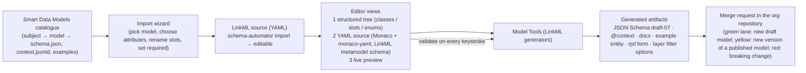
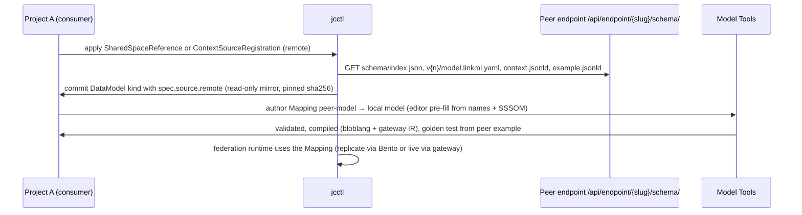

# Data Modeling with LinkML

joinedcontext platform adopts **LinkML** (Linked Data Modeling Language) as its authoritative modeling language, superseding legacy JSON-Schema-only and EMF/Ecore tooling per ADR-N-005.

```text
+---------------------------------------------------------------------------------------------------+
|                                      LINKML COMPILATION WORKFLOW                                  |
|                                                                                                   |
|  Source Model: schema.linkml.yaml (YAML-based authoring)                                          |
|        |                                                                                          |
|        +---> gen-json-schema ---> compiled.schema.json (JSON Schema draft-07 for forms & gate)   |
|        |                                                                                          |
|        +---> gen-jsonld-context -> context.jsonld (Semantic IRI resolution & JSON-LD expansion)   |
|        |                                                                                          |
|        +---> gen-doc -----------> HTML Model Reference Documentation (Human browsable)            |
+---------------------------------------------------------------------------------------------------+
```

## 1. Authoring Models in LinkML

DataModels are authored as clean, human-readable YAML files inside `projects/{p}/spaces/{s}/datamodels/`:

```yaml
id: https://joinedcontext.com/models/environment/air-quality
name: AirQualityObserved
title: "Air Quality Observation Model"
prefixes:
  linkml: https://w3id.org/linkml/
  sosa: http://www.w3.org/ns/sosa/
  geojson: https://purl.org/geojson/vocab#
  # Every prefix a mapping uses is declared, or the CURIE dangles in every artifact (DM-59).
  unece: https://vocabulary.uncefact.org/UnitMeasureCode#
  qudt-unit: http://qudt.org/vocab/unit/
  qudt-quantkind: http://qudt.org/vocab/quantitykind/
imports:
  - linkml:types
default_range: string

classes:
  AirQualityObserved:
    description: "An observation of air quality conditions at a specific location."
    class_uri: "sosa:Observation"
    slots:
      - id
      - type
      - location
      - pm10
      - temperature
      - dateObserved

slots:
  id:
    identifier: true
    range: uriorcurie
  type:
    designates_type: true
    range: string
  location:
    range: GeoJSONGeometry
    required: true
    slot_uri: "geojson:geometry"
  pm10:
    range: float
    minimum_value: 0
    unit:
      ucum_code: "ug/m3"
      exact_mappings: ["unece:GQ", "qudt-unit:MicroGM-PER-M3"]
      has_quantity_kind: "qudt-quantkind:MassConcentration"
    slot_uri: "sosa:hasSimpleResult"
  temperature:
    range: float
    unit:
      ucum_code: "Cel"
      exact_mappings: ["ucefact:CEL", "qudt-unit:DEG_C"]
      has_quantity_kind: "qudt-quantkind:Temperature"
  dateObserved:
    range: datetime
    required: true
    slot_uri: "sosa:resultTime"
```

### 1.0 A unit says two things (DM-06, DM-59)

A measurement is a number and a unit, and the unit has to satisfy two readers who want
different things:

- **The wire.** NGSI-LD carries `unitCode`, and its value is a UN/CEFACT common code — `CEL`,
  `GQ`, `MTS`. Three characters, no meaning a machine can look up, and the value every
  NGSI-LD client already expects.
- **The graph.** A federated read aligns two organisations' measurements, and two opaque codes
  cannot be compared. The QUDT unit IRI can: it dereferences, it carries `qudt:ucumCode`, and
  its quantity kind says what dimension is being measured, so `qudt-unit:DEG_C` and a partner's
  `qudt-unit:DEG_F` are visibly the same kind of thing and a conversion is defined between them.

So a unit carries both, in the fields LinkML already defines for them: `ucum_code` for the UCUM
symbol, `exact_mappings` for the UN/CEFACT code and the QUDT unit IRI side by side, and
`has_quantity_kind` (`qudt:hasQuantityKind`) for the dimension. Nothing new is invented, and no
field means two things: `has_quantity_kind` is the *kind* (Temperature), never the unit
(`DEG_C`), which is what QUDT itself means by the two.

Every prefix those mappings use is declared in the model's `prefixes`, `qudt-unit` and
`qudt-quantkind` among them. A CURIE under an undeclared prefix is a dangling string in every
artifact that carries it, and the generators refuse it rather than render it (DM-59).

The UN/CEFACT code is recorded as `ucefact:{code}` (the prefix
`https://vocabulary.uncefact.org/UnitMeasureCode#`). The crosswalk from "the author picked
microgram per cubic metre" to `GQ`, `qudt-unit:MicroGM-PER-M3` and
`qudt-quantkind:MassConcentration` lives in **one** place, the code list of §1.0.1, and every
surface reads it: the editor's picker, Model Tools' inference and import, the gateway's check,
the pipeline's conversion and every display. The model then records the choice, and the
generators read the model. A second hand-written table anywhere would be a crosswalk that can
disagree with the one an author actually used, so there is none.

#### 1.0.1 The code list (DM-06, DM-59)

The list is **UNECE Recommendation 20**, *Codes for Units of Measure Used in International
Trade*, Revision 17 (2021), every code not deleted from it (about 1,800), as UN/CEFACT publishes
it in `uncefact/vocab-codes`. It is vendored once, in the platform repository, as
`crates/jc-core/data/unece-rec20.json`, generated by `tools/units/generate.py` from that list
joined with QUDT v3.5.2's own `qudt:uneceCommonCode`, `qudt:ucumCode`, `qudt:hasQuantityKind`,
`qudt:hasDimensionVector`, `qudt:conversionMultiplier` and `qudt:conversionOffset`. Both sources
are pinned by URL and SHA-256 in the file itself. Nobody maps a code by hand: a hand table once
wrote hectopascal as `HPA`, which Rec 20 calls a hectolitre of pure alcohol (hectopascal is
`A97`). One entry is:

```json
{ "code": "GQ", "name": "microgram per cubic metre", "symbol": "µg/m³", "deprecated": false,
  "ucum": "ug.m-3", "qudt": "MicroGM-PER-M3", "quantityKinds": ["Density", "MassDensity"],
  "dimension": "A0E0L-3I0M1H0T0D0", "factor": 1e-09, "offset": 0.0, "frequent": true }
```

`factor` and `offset` are QUDT's `conversionMultiplier` and `conversionOffset`: a value in the
unit is `(value + offset) × factor` in the SI unit of its dimension. Two units convert into each
other only when they share QUDT's `dimension` and at least one of the `quantityKinds`: a percent
and a minute of arc are both dimensionless and still not one thing. A unit without a `factor`
(a decibel, a piece) never converts. When QUDT gives one code two units that convert
differently, the one whose symbol is Rec 20's is taken, or none. `deprecated` codes stay valid
on the wire and are not offered to a new model. `frequent` marks the municipal set a picker
shows first (µg/m³, °C, %, km/h, kWh, hPa, …). Each repository carries a **generated** copy,
never an edited one: the Portal UI, Model Tools and the SDK. A check in each repository's CI
fails when its copy differs from the source. Nothing is fetched at runtime. The platform reads
the list through `jc_core::units` (`lookup`, `validate`, `convert`).

#### 1.0.2 The unit on the wire, in a pipeline and on screen (DM-06)

- **On the wire.** Each Property of a slot that declares a unit carries `unitCode` with exactly
  that code. The gateway reads the code from the space's model, the `x-unit.exactMappings` of
  its generated JSON Schema (`ucefact:GQ`), and checks every write through an Endpoint or the
  space's own surface before the broker is asked: another code is refused with `400`, naming
  the attribute, the expected code with its symbol and name, and the code it found, and never
  the entity. A missing `unitCode` is filled with the model's code, in the normalized form and
  in the concise one, and the answer names what was filled in the header
  `JC-Unit-Code-Filled: pm10=GQ, temperature=CEL`. A space whose `spec.missingUnitCode` is
  `refuse` refuses it instead (the default is `fill`). Batches, attribute fragments, one
  attribute's value, the instances of a multi-attribute and temporal instances are checked the
  same way; a deletion by `urn:ngsi-ld:null` carries no unit and is left alone. An Endpoint that
  serves a view (EP-54) writes in the target model, which its Mapping converts, so these rules
  do not apply to it. Reads stay CIM 009 conformant: `unitCode` comes back as stored.
  The JSON Schema and the SHACL shapes describe the entity in its key-value form, which carries
  no `unitCode`, so neither states the code as a constraint; the gateway is the one place it is
  enforced.
- **In a pipeline.** A source in another unit is converted in the mapping, with the factors of
  the list, before the entity is written: a space never stores one attribute in two units. A
  conversion between two quantity kinds (a temperature into a concentration) is refused when
  the mapping is designed, not when it runs.
- **On screen and in exports.** The symbol and name come from the list, in the reader's language
  where a translation exists and in English otherwise. The grid, entity forms, KPI tiles,
  dashboards, applications (SDK `formatValue`), CSV headers, OGC properties and STA's
  `unitOfMeasurement` read it.

### 1.1 Which kind an attribute is, by the shape of its data (DM-05)

NGSI-LD 1.8 has seven attribute kinds and a model that reaches for `Property` every time loses
what the other six were added for: an enumerated term stops being resolvable, a localised name
stops being one value per language, an ordered list stops being ordered. The kind is one LinkML
annotation, `ngsi_ld_kind`, and it is decided by the shape of the data and by nothing else:

| The data is | Kind | LinkML beside it | The `@context` entry |
|---|---|---|---|
| a number, a string, a boolean, a timestamp | `Property` (the default) | `range` | the term's IRI |
| a point, a line, an area | `GeoProperty` | `range: GeoJSONGeometry` | the term's IRI |
| the id of another entity of the model | `Relationship` | `range: <the class>`, `inverse`, §1.2 | `@type: @id` |
| the id of an entity outside the model | `Relationship` | `range: uriorcurie` (an external reference, DM-69) | `@type: @id` |
| a term from a controlled vocabulary | `VocabProperty` | `range: <the enum>` | `@type: @vocab` |
| a name or a description a person reads, per language | `LanguageProperty` | `range: string` | `@container: @language` |
| several values whose order is part of the meaning | `ListProperty` | `multivalued: true` | `@container: @list` |
| a nested document this model does not describe | `JsonProperty` | `range: string` | `@type: @json` |

Two of these are choices rather than readings, and they are worth stating:

- **`VocabProperty` over an enum of strings.** Both carry "one of these values". The difference
  is whether the value resolves: a `VocabProperty` expands its value against the vocabulary, so
  a federation partner reading `pollutantType: pm10` gets an IRI it can look up, where a plain
  `Property` gives it the five characters. Use `VocabProperty` whenever the enum's members have
  IRIs (`permissible_values` with `meaning`), and a plain `Property` for a closed list that is
  only ever displayed — a status word the organisation invented and nobody else reads.
- **`JsonProperty` is the last resort, not the escape hatch.** It says "this is JSON and the
  model does not describe it", so nothing validates it, no form can be generated for it, no
  filter can reach inside it and no export can give it a column. Model the document as a class
  of its own if its shape is known even roughly; keep `JsonProperty` for a payload that is
  genuinely opaque to this platform, such as a vendor blob passed through to a partner.

`ListProperty` implies `multivalued: true`: the kind says the values are ordered, and a slot
that holds one value has no order to preserve. `ListRelationship` is **not** a kind here — CIM
009 1.8 does not define one, and an ordered set of entity ids is a `ListProperty` whose range is
`uriorcurie`, which renders `@type: @id` beside `@container: @list`.

What each kind becomes downstream is the generators' business and is written once, in §2: the
`@context` entries above, the JSON Schema shape (a language map is
`additionalProperties: {type: string}`, a geometry is its own object, the rest is what the range
renders), and the `x-ngsi-ld-kind` keyword that carries the kind itself to the editor and to the
export (DM-20). A kind is never repeated in the term definition: JSON-LD 1.1 rejects a term
carrying a key it does not know, and an invalid `@context` expands to nothing.

### 1.2 Relationships between classes (DM-64…DM-73)

A relationship is a foreign key with a name at each end. The owner asked for a model editor in
which a person declares one-to-one, one-to-many, many-to-one and many-to-many as in a regular
database, and for the platform to be strict about it. Everything below follows from four
decisions: both ends are declared, the cardinality is two `multivalued` flags, one end is stored,
and a broken relationship is refused rather than warned about.

**Declared on both ends (DM-64).** A School has many Users, and a User belongs to one School:

```yaml
classes:
  School:
    slots: [name, users]
  User:
    slots: [name, school, courses]
  Course:
    slots: [title, students]
slots:
  users:                      # the source end, on School
    range: User
    multivalued: true
    inverse: school
    inlined: false
    slot_uri: rozvoj:users
    annotations:
      ngsi_ld_kind: Relationship
      on_delete: restrict
  school:                     # the inverse end, on User: stored, required
    range: School
    inverse: users
    required: true
    inlined: false
    slot_uri: rozvoj:school
    annotations:
      ngsi_ld_kind: Relationship
  courses:                    # User N:M Course, stored on the source end
    range: Course
    multivalued: true
    inverse: students
    inlined: false
    slot_uri: rozvoj:courses
    annotations:
      ngsi_ld_kind: Relationship
      on_delete: cascade
  students:
    range: User
    multivalued: true
    inverse: courses
    inlined: false
    slot_uri: rozvoj:students
    annotations:
      ngsi_ld_kind: Relationship
```

**Which end is the source (DM-64).** The source is the end that carries `on_delete`. The editor
writes it on every relationship it creates, `restrict` included, so the direction is in the
model and not in the order of the file. A hand-written pair with no `on_delete` takes the end
declared first under `slots` as its source, and a pair with `on_delete` on both ends is refused.
The direction matters for one-to-one and many-to-many, where it decides which end is stored.

**Cardinality is two flags (DM-65).** Read from the source class A to its range B:

| A's slot multivalued | B's slot multivalued | Cardinality | Stored on | A UML reader sees |
|---|---|---|---|---|
| no | no | one-to-one | A (the source) | `0..1 — 0..1` |
| yes | no | one-to-many | B | `0..1 — *` |
| no | yes | many-to-one | A | `* — 0..1` |
| yes | yes | many-to-many | A, one `datasetId` per target | `* — *` |

`required` turns `0..1` into `1` and `*` into `1..*`. It is allowed on the stored end only: a
School whose `users` were required could not be created before its first User, and a User
could not be created before its School existed.

**One end is stored (DM-67).** The "many" side holds the id, as a foreign-key column would, so
there is one source of truth and no pair of copies that can drift. The stored end is an ordinary
NGSI-LD Relationship attribute. For User → School it is
`"school": {"type": "Relationship", "object": "urn:ngsi-ld:School:…"}`. For many-to-many it is
the multi-attribute form, one instance per course with its own `datasetId`. The computed end is
a query: the Users of a School are `GET …/entities?type=User&q=school=="urn:ngsi-ld:School:…"`.
The Portal's grid, forms and assistant show it as a read-only list of links. The gateway never
adds it to an entity it answers, because an attribute the entity does not hold would make every
read a CIM 009 reader makes differ from the standard (the owner's read-surface rule).

**Delete rules (DM-66, DM-71).** A delete of an entity that stored ends reference runs the rule
of each such relationship first, as the gateway's own writes, and deletes the entity last:

| Rule | A single stored end | A many-valued stored end (N:M) |
|---|---|---|
| `restrict` (default) | `409`, the slot and how many still reference it | the same |
| `cascade` | the referencing entities are deleted too | the one link instance is removed; the entity stays |
| `set-null` | the attribute is removed from them | the one link instance is removed |

A rule that would leave a `required` end empty is refused as `restrict` is. So a School whose
Users all require one cannot be deleted by `set-null`: move them first, or declare `cascade`.
A step that fails stops the delete: the entity stays, and the answer says how many referencing
entities were already deleted or changed, so a person can finish or undo by hand.

**Strict at the model (DM-68, DM-69).** The editor's diagnose, the Portal's save route and Model
Tools' generation refuse the same list: a range that is not a class, a class range on a slot that
is not a Relationship, a primitive range on a Relationship, a missing or non-reciprocal inverse,
one slot serving two relationships, `required` on a computed end, and an unknown delete rule. The
one Relationship that takes no inverse is the external reference, `range: uriorcurie` or no
range at all (how Smart Data Models writes one). It points
outside the model, as Smart Data Models' `refDevice` does, so there is no class to check a target
against and no inverse to declare. Every class-range relationship is a relationship in full.

Each refusal carries one `rule`, the same identifier in the editor, the save route, Model Tools
and the gateway:

| `rule` | Where | Refused when |
|---|---|---|
| `range-not-a-class` | model | a Relationship's range is no class of the model or an import |
| `class-range-not-relationship` | model | a slot has a class range and is neither a Relationship nor a nested value (`JsonProperty` or `inlined: true`) |
| `primitive-range` | model | a Relationship declares a primitive range other than `uriorcurie`, or an enum |
| `inverse-missing` | model | a class-range Relationship names no `inverse`, or names a slot that does not exist |
| `inverse-not-reciprocal` | model | the inverse names another slot back, or sits on a class other than the range |
| `slot-in-two-relationships` | model | one slot is an end of two relationships |
| `required-on-computed-end` | model | `required` is set on the end that is not stored |
| `on-delete-unknown` | model | `on_delete` is not `restrict`, `cascade` or `set-null` |
| `on-delete-on-both-ends` | model | both ends of one pair carry `on_delete`, so neither is the source |
| `target-missing` | write | the object is no entity of the space |
| `target-wrong-type` | write | the object is an entity of another type |
| `single-end-many-targets` | write | a single end holds more than one object |
| `required-end-missing` | write | a required stored end is absent or emptied |
| `target-taken` | write | a one-to-one or one-to-many target is stored by another source |
| `restrict` | delete | an entity is still referenced under `restrict`, or a rule would empty a required end |

**Strict at every write (DM-70).** The gateway checks each write of an Endpoint against the
space's model. It checks that each target exists in the space and has the range's type, that a
single end holds one target, that a required end is present, and that a one-to-one or
one-to-many target is not stored by another source. The last check is a query of the space
right before the write (the computed end's query of DM-67). A refusal is CIM 009's
`BadRequestData` with the members `slot`, `rule` and `object`, and it never names an entity or a
value the writer cannot read.

**The race window (DM-70, DM-71).** The broker holds no relationship rules, by the owner's decision
of 2026-09-25 (T-2858): its store stays CIM 009 and nothing else. So the two checks that would
need a constraint in the store are reads followed by writes, and each has a window:

| Check | What slips through the window | How long the window is |
|---|---|---|
| `target-taken` | two writes that name the same one-to-one or one-to-many target both succeed | from the gateway's query to the broker's write of the same request |
| a delete rule | a reference written after the gateway read the referencing entities survives the delete and points at nothing | the time the gateway spends applying the rule to the referencing entities it found |

Neither is reported by the write that caused it. Both leave data a later read can see: a
target named by two sources, or a Relationship whose `object` is no entity of the space.

**Models saved before these rules (DM-73).** The seeded models hold class-range Relationships
without an inverse (`refDistrict: CityDistrict`). The editor shows the refusal and one fix: a
multivalued inverse on the target class. The fix keeps the stored end where the data already
is: a single slot becomes many-to-one, a multivalued one many-to-many. The seeds are migrated in
the batch that turns the refusal on, so no seeded space stops publishing.

**Generated artifacts (DM-72).** §2 renders each relationship into JSON Schema (`object`
patterned on the target's URN prefix, `minItems`), SHACL (`sh:class`, `sh:nodeKind sh:IRI`,
`sh:minCount`, `sh:maxCount 1`), the `@context` (`@type: @id`) and OWL (`owl:inverseOf`,
`owl:FunctionalProperty` on a single end).

---

## 2. Compilation Pipeline & Artifacts

CI pipelines compile LinkML definitions into two runtime artifacts committed to Git alongside the source:

### 1. JSON Schema draft-07 (`gen-json-schema`)

- Validates entity write payloads at the Context Gateway PEP.
- Powers dynamic form generation in the Portal UI via `react-jsonschema-form` (RJSF) per stack verdict S4.
- Generates structural typing definitions for TypeScript and Rust clients.

### 2. JSON-LD `@context` (`gen-jsonld-context`)

- Maps local short-name attributes (e.g. `pm10`, `location`) to globally unambiguous RDF ontology IRIs (e.g. `sosa:hasSimpleResult`, `geojson:geometry`).
- Enables semantic vocabulary interoperability across federated digital twins via expansion and compaction (ADR 008).

---

## 3. Smart Data Models & External Standards Alignment

The platform prioritizes reuse over custom creation. Reuse here means **consuming a vocabulary**,
not sharing ownership of the model: the organisation's LinkML document is the source, and the
Smart Data Models `schema.json` is a *generated artifact* downstream of it (§2), never the thing
a model is kept in step with. The wizard of §6.1 fetches the catalogue's `schema.json` once, to
discover terms and bind their IRIs; what it produces and what the repository then holds is
LinkML, with the upstream cited per term (§3.1) and its commit pinned in `spec.source` (DM-08).

- **FIWARE / Smart Data Models Integration:** LinkML models MUST bind the Smart Data Models term IRIs (`slot_uri`, `class_uri`) where the catalogue has a term for what the model means (e.g. `Environment`, `Transportation`, `WasteManagement`), and MUST mint their own terms, under their own prefix, where it does not (MIM2-R1, DM-04, DM-16).
- **INSPIRE & XÖV Alignment:** Geospatial attributes adhere to INSPIRE standards; administrative citizen schemas map to XÖV standards (e.g. XFall, XMeld) using LinkML's semantic slot mappings (`slot_uri`, `exact_mappings`).

### 3.1 Reusing a term you did not define (DM-58)

Binding an upstream `slot_uri` is a claim: this slot *is* that term. A federation partner reading
our `@context` resolves the IRI and reads the upstream definition, so a local model that keeps
the IRI and changes the range, the unit or the permissible values has not extended a standard —
it has made two incompatible things answer to one name, and the disagreement surfaces at the
partner rather than here.

Reuse is therefore **add-only**:

| Want | Do |
|---|---|
| the upstream term as it is | bind its `slot_uri`, keep its range, unit and cardinality |
| something the upstream catalogue has no term for | a slot with an IRI in the project's own namespace |
| something near but not the same | own IRI, plus an SSSOM `skos:closeMatch` or `narrowMatch` (§7.6) |

`jcctl model validate` is where this is caught, not review: the import wizard already records
which repository, path and commit every borrowed artifact came from (DM-08), so the check reads
the upstream definition and compares it field by field. A borrowed term that cannot be resolved
is reported as unchecked; silence would read the same as agreement.

This is the whole of "promotion" in this platform. A model does not climb a hierarchy of
profiles: it lives in a space, it has a lifecycle (`draft → published → deprecated → retired`,
DM-26) and every change to it goes through the three lanes CC-63 defines (§6.4). There is no
fourth lane between yellow and red, and no core-versus-profile layer for a term to be promoted
into — a term either is the upstream one, in which case it is bound, or is ours, in which case
it is named in our namespace and mapped.

---

## 4. Versioning & Immutable Context URLs (SP-13)

Schema drift that silently alters the meaning of historical observations is prohibited:

- Every LinkML model revision is assigned a discrete Semantic Version (`1.0.0`, `1.1.0`).
- The Context Gateway serves published artifacts under version-pinned, immutable URLs on the Endpoint that publishes them (SP-13). The version segment is the model's **major**, never its full version (DM-22), and the file names are the ones the generator writes:

  ```text
  https://{host}/api/endpoint/{slug}/schema/index.json
  https://{host}/api/endpoint/{slug}/schema/v1/context.jsonld
  https://{host}/api/endpoint/{slug}/schema/v1/model.linkml.yaml
  https://{host}/api/endpoint/{slug}/schema/v1/model.schema.json
  https://{host}/api/endpoint/{slug}/schema/v1/model.shacl.ttl
  ```

  `model.owl.ttl`, `model.rdf.ttl` and `model.md` are served the same way. SP-04 gives a space a `schema/` child of its own beside `ngsi-ld/v1/`, `mcp` and `dump/`; the gateway routes `/cs/{space}`, `/cs/{space}/ngsi-ld/v1/*` and `/cs/{space}/mcp` and no more (`context-gateway` `src/app.rs`), so every URL above is the Endpoint's until the space's children are built. There is no unversioned alias and nothing redirects to "latest" — a caller reads `index.json` to learn which majors exist and then pins one, which is what makes a live subscription's `Link` header safe to keep.

### 4.1 `kind: DataModel`

The LinkML file is the source (DM-01); the manifest is the platform's handle on it: which
version is current, which lifecycle state it is in, where it came from and which artifacts
were generated beside it (DM-02, DM-08, DM-22, DM-26).

```yaml
apiVersion: joinedcontext.com/v1alpha1
kind: DataModel
metadata:
  name: hki-air-quality
  namespace: helsinki
  title: { fi: "Ilmanlaatu", en: "Air quality" }
spec:
  contextSpaceRef: air-quality              # the space this model belongs to; with metadata.namespace it
                                         # determines the repository path projects/{p}/spaces/{s}/datamodels/ (MF-06)
  linkml: ./hki-air-quality.linkml.yaml   # the authoring source, relative to this manifest (DM-01)
  version: 2.1.0                         # semantic version; the major is the served schema/v{major} (DM-22)
  lifecycle: published                   # draft | published | deprecated | retired (DM-26)
  classes: [AirQualityObserved]          # NGSI-LD entity types this model defines
  source:                                # provenance of an imported model (DM-08); absent for a hand-authored one
    repository: https://github.com/smart-data-models/dataModel.Environment
    path: AirQualityObserved
    commit: 9f1c2b7d4e6a8c0b2d4f6a8c0e2b4d6f8a0c2e4b
  artifacts:                             # generated beside the source in the same commit (DM-02)
    jsonSchema: ./json-schema/hki-air-quality.v2.json
    context: ./context/hki-air-quality.v2.jsonld
    docs: ./docs/hki-air-quality.md
    example: ./examples/hki-air-quality.example.jsonld
```

Rules the reconciler and CI enforce on this manifest: `contextSpaceRef` names an existing
ContextSpace in `metadata.namespace`, and together with it derives the repository path (MF-06);
`version` is a full semantic version and
its major matches the `v{major}` in every artifact path (DM-22); only `published` models may be
referenced by an Endpoint, Pipeline or Dashboard (DM-26); a `retired` model stays resolvable at
its versioned URLs but accepts no new references; every path is relative to the manifest and
inside the space directory, so a bundle stays importable into another namespace (MF-07).

A model that no single space owns leaves `spec.contextSpaceRef` out (ADR-N-039, DM-75). In
namespace `org` (MF-02) it is an **organization model** at `datamodels/{name}/` of the organization
repository, which every project of the organization reads and only red-lane Changes to that
repository edit. In a project's namespace it is a **project model** at
`projects/{p}/datamodels/{name}/`. A space's one model uses either kind by `import` at a pinned
major, `org.{name}.v{major}` or `project.{name}.v{major}` (DM-76). A project shares its model
upwards only through a promotion that an organization-scope approver approves (DM-77), and a
project bundle carries copies of the organization models it imports (MF-49, MF-50).

---

## 5. Gateway Validation at the Trust Boundary

When an entity creation or update request is processed by the Context Gateway:

1. **Schema Check:** The payload is validated against the compiled JSON Schema draft-07 definition. If attributes violate declared types, minimum values, or missing required fields, the write is rejected with `400 Bad Request`.
2. **Context Resolution (R58):** The gateway resolves the payload's `Link` context header against its local hardened context cache, ensuring all attributes map to valid ontology terms.
3. **Unknown Attribute Policy:** Payloads containing undeclared attributes are rejected unless the LinkML model explicitly sets `open_world: true`.

---

## 6. The LinkML Editor (Portal UI)

Users never hand-write a data model from scratch. The Portal ships a **LinkML Editor** whose primary path is *import a Smart Data Model, adapt it, publish it*; the secondary path is *author a new model in LinkML*. Everything the editor produces is a manifest change under `projects/{p}/spaces/{s}/datamodels/` and follows the ordinary lane flow (CC-32, CC-63).



### 6.1 Import from Smart Data Models (primary path)

1. **Catalogue browsing.** The editor lists Smart Data Models subjects (`dataModel.Environment`, `dataModel.Transportation`, …) and their models from the official catalogue index; the list is cached by Model Tools and refreshed daily. Search is by model name, attribute name and description, in the user's UI language where the catalogue provides translations, English otherwise. Attribute names are not in the index: the catalogue publishes no document carrying the attributes of all 1118 models, only each model's own `schema.json`, so they are filled one subject at a time when the wizard opens it (about fifteen requests for `dataModel.Environment`) and cached until the index is refetched. Attribute search therefore covers the subject in view, which is how the wizard browses anyway, and the first paint of the catalogue stays one fetch.
2. **Fetch.** For the chosen model the wizard fetches the official artifacts from the model's repository (`schema.json`, `context.jsonld`, `model.yaml`, `examples/example-normalized.jsonld`) and, from the catalogue's `data-models` repository, the **shared commons** (`common-schema.json`). Every catalogue schema is an `allOf` of that document and one inline branch, and single attributes such as `address` reference it too, so a fetch that skips it imports a model missing `name`, `owner`, `dataProvider` and the rest of what a federation partner sends (DM-11). The catalogue writes the reference against `smart-data-models.github.io`; the same file is served from the `data-models` repository, which the DM-10 allowlist already covers, so the commons are read from there and the allowlist stays one host wide. Fetching happens server-side in Model Tools with an allowlist of the Smart Data Models GitHub organisation only; the pinned commit of each fetched artifact is recorded in the manifest (`spec.source.commit`, and `spec.source.commons` for the commons, which live in their own repository on their own commit) so an import is reproducible.
3. **Resolve.** References into the commons are replaced by what they point at, and by nothing else: a `$ref` naming any other document stays a `$ref`, so no reference in a fetched schema can turn into a fetch of its own.
4. **Convert.** `schemauto import-json-schema` (LinkML schema-automator) turns `schema.json` into a LinkML schema; the wizard post-processes it: `class_uri`/`slot_uri` are filled from `context.jsonld` so every slot keeps its canonical Smart Data Models IRI; `description` and enum `permissible_values` are carried over; the unit is read out of the description's `Units:'…'` clause, which is the only place the catalogue states one, and written as the whole block DM-59 asks for — a spelling the crosswalk does not carry leaves the slot with no unit rather than a guessed one; NGSI-LD system attributes (`id`, `type`, `location`, `observedAt`, `@context`) map to the platform's shared `ngsi-ld-core` LinkML import; a nested object keeps its shape as a class of its own with class-local attributes, rather than losing it to a range LinkML cannot resolve.

   The `ngsi_ld_kind` of an attribute is read from three places, in this order (DM-05). The upstream `@context` first, because a term typed `@type: @id` is a statement rather than a guess. Then the shape of the value, which settles the geo, object and list attributes. The description last and only where the shape says nothing: Smart Data Models annotates no kinds and writes them as the first word of the description instead (`"Relationship. A reference to the device(s) which captured this observation"`), which is the only place a Relationship such as `refDevice` is named. Reading a kind out of prose is a heuristic, so it is a narrow one: the whole first word, one of the seven kind names, a full stop after it. Anything else leaves the attribute a Property.
5. **Adapt.** The user picks the attributes actually used (unused optional slots are kept but marked `deprecated` rather than deleted, so federation partners' payloads still validate), sets `required`, adds local slots under the organisation's own namespace (never under the Smart Data Models IRI prefix: a local slot without a `slot_uri` is minted as `{model name}:{slot}` with the prefix `{model name}: {model id}/` declared on first use, DM-04), and writes titles/descriptions as language maps (sk, en, de, cs).
6. **Publish.** Saving produces the LinkML source plus all generated artifacts in one commit (CC-25: generated output is committed, not rendered at apply time), and opens the merge request.

### 6.2 Author a new model (secondary path)

The structured view offers three panels: **Classes** (entity types; a class with `class_uri` bound to an NGSI-LD type), **Slots** (attributes; range, required, multivalued, unit, pattern, min/max, `slot_uri`), **Enums** (permissible values with IRIs). A slot's *NGSI-LD kind* (Property, GeoProperty, Relationship, LanguageProperty, ListProperty) is a LinkML annotation `ngsi_ld_kind` and drives how the generators render the `@context` (`@type: @id` for Relationships, `@container: @language` for LanguageProperties) and how forms and filters treat the attribute. The YAML view is Monaco with `monaco-yaml`, validated and autocompleted against the LinkML metamodel JSON Schema; the two views edit the same document and stay in sync.

### 6.3 Live preview (what "generate the rest" means)

On every change the editor calls Model Tools and shows, side by side:

| Preview tab | Generator | Used later by |
|---|---|---|
| JSON Schema draft-07 | `gen-json-schema` | Context Gateway write validation (§5), Portal forms (rjsf), CI manifest validation |
| `@context` | `gen-jsonld-context` (+ the `ngsi_ld_kind` post-processor) | `schema/v{n}/context.jsonld` (SP-13), pipelines, federation |
| Example entity | `gen-python` + example generator, or the imported Smart Data Models example re-validated | documentation, pipeline golden tests, agent `describe_schema` |
| Form | rjsf rendering of the JSON Schema with the model's `uiSchema` manifest | create/edit entity dialogs in the Portal |
| Filter & layer options | slot classification (numeric → range filter/`sizeBy`; enum → select/`colorBy`; datetime → temporal; GeoProperty → map layer) | Dashboards and Layers (chapter 10) |
| Documentation | `gen-doc` (Markdown) | `model.md` on the schema surface, rendered in the Portal |
| SHACL / OWL / RDF | `gen-shacl`, `gen-owl`, `gen-rdf` | `schema/v{n}/model.shacl.ttl`, `model.owl.ttl`, `model.rdf.ttl` on the space and on every endpoint (§8); external validators, ontology tooling, federation partners |
| RDF Data Cube | `gen_qb.py` (Model Tools, the `qb` field of `POST /generate`); the gateway renders the served one from the projection | `schema/v{n}/model.qb.ttl`, on a model that declares a Data Structure Definition only (DM-60; [Architecture/03 §2](03-domain-model.md#when-one-number-is-not-the-indicator-dm-60)); SDMX-shaped statistical consumers. A model without one has no `qb` field and the file answers `404` |
| Diff vs previous version | JSON Schema structural diff | version classification (§6.4) and the merge request description |

Preview never touches the broker; publishing does not either, the reconciler does, after merge.

### 6.4 Versioning rules enforced by the editor

- Additive change (new optional slot, new enum value, description text) → minor version, **green** lane when the model is still `draft`, **yellow** when it is `published`.
- Breaking change (removed or renamed slot, narrowed range, new required slot, changed `slot_uri`) → major version, **red** lane; the editor refuses to save a breaking change under the same major version and shows the affected consumers (endpoints, pipelines, dashboards, subscriptions that reference the model version).
- A published version is immutable (SP-13); the editor opens it read-only and offers "create new version".

### 6.5 Model Tools, the one non-Rust runtime component

LinkML and schema-automator are Python and have no Rust implementation. They run as **Model Tools**: a versioned OCI image (`linkml`, `schema-automator`, `pysmartdatamodels`, the `ngsi_ld_kind` post-processor) that is invoked in two places only:

| Caller | How | Why |
|---|---|---|
| Gitea Actions (CI) | container step, `jcctl model generate` shells out to it | authoritative generation; generated artifacts committed to the repository must match (CI fails on diff) |
| Portal API (preview) | short-lived HTTP call to a stateless `model-tools` Deployment (2 replicas, 256 MiB, no persistent state, no network egress except the Smart Data Models allowlist) | sub-second live preview in the editor |

Model Tools holds no credentials, reads no platform state and writes nothing; its only inputs are the LinkML document and, for imports, a Smart Data Models model reference. This keeps the "custom code is Rust/TypeScript" rule intact for everything that has state or authority; Model Tools is a pure function packaged as a tool. If a Rust LinkML generator reaches parity later, it replaces the image without any manifest change.

The image is `ghcr.io/marek-mraz-jc/joinedcontext-platform/model-tools`, built from `tools/model-tools/` in the platform repository, signed and pinned by digest like every other image (DM-19). It listens on **8080** as uid `10001`, writes nothing outside `/tmp`, and answers five routes:

| Route | Body | Answers |
|---|---|---|
| `GET /healthz` | — | `{"status", "generatorVersion"}`, which is what a readiness probe reads |
| `GET /catalog?refresh=&subject=` | — | the Smart Data Models index, cached with a daily refresh (DM-12); `subject=` fills that subject's attribute names |
| `POST /generate` | `{"source", "imports"?}` | the artifact set of one LinkML document; `imports` maps each `org.{name}.v{major}` or `project.{name}.v{major}` the document imports, directly or through another import, to that model's LinkML (at most 32, DM-76), and an import left out is an `errors` entry naming it, never a file Model Tools looks for |
| `POST /import-sdm` | `{"model"}` | the same set, plus the LinkML an import produced |
| `POST /infer-schema` | `{"file", "format"}`, the sample base64 in JSON | a draft model from one sample: `linkml`, `operations`, `detectedTypes`, `matches`, `untyped`, `rows` (§6.7, DM-54, DM-55) |

The Portal's three routes in [API/01 §11](../API/01-portal-api.md) are these, proxied, and the field names are identical on both sides. The catalogue cache is per replica and in memory; nothing Model Tools holds has to survive a restart or be shared with the other replica, which is what DM-18's "stateless" means here.

The two callers must run the same image (DM-19), so the configuration repository names it once, in `platform-settings.yaml` at its root:

```yaml
modelTools:
  image: ghcr.io/marek-mraz-jc/joinedcontext-platform/model-tools@sha256:6f1c…
  generatorVersion: linkml-1.11.1
```

`image` is what the deployment runs and what a CI container step starts. `generatorVersion` is the string that image puts in every answer, and `jcctl model generate|diff` reads `/healthz` and refuses to write or compare a single artifact when the two disagree, naming both versions. Two generators writing the same committed artifacts produce a diff whose cause is invisible in the diff, which is the failure the pin exists to prevent; a reachable Model Tools of the wrong version is therefore an error, never a fallback. Bumping the pin is one commit that also carries every artifact the new generator renders differently, which is what makes the change reviewable and what DM-19 means by red-lane.

The command line is [API/03 §4](../API/03-jcctl.md); `jcctl model` takes the service URL from `--url` or `JC_MODEL_TOOLS_URL` and never from a manifest, so a repository cannot point generation at a service of its own choosing.

### 6.6 What the editor deliberately does not do

- No visual UML canvas in the first release; the structured tree covers class/slot/enum editing, and a canvas would be a second editor for the same document (YAGNI). Revisit if users ask.
- No ad-hoc mapping language (legacy JSONata). Model-to-model transformations are **LinkML-Map** specifications (§7); last-mile technical transformations are Bloblang inside Bento pipelines. The editor never offers a third language.
- No import of arbitrary XSD/Ecore in the UI; `schemauto` supports more importers, and they are reachable through `jcctl model import --from xsd` for expert users.

### 6.7 A model from a sample (DM-54, DM-55)

The third way into the editor is a file. A person drops a CSV, an Excel sheet, a JSON document or a PDF with tables on the Models page or on the assistant's drawer; the Portal posts it to `POST /api/v1/tools/infer-schema` (API/01 §11), which is Model Tools' `POST /infer-schema` proxied, and the answer is a draft model in two forms that say the same thing: the LinkML source, and the ordered editor operations (§6.2's `applyOperations`) that build it. The Portal shows the draft first, as a preview: the class, the slots with their inferred ranges and units, the Smart Data Models attributes they matched, and the columns it could not type. "Populate the editor" applies the operations to the visual editor, where every inferred value is an ordinary field a person corrects; "Save model" is the same Change as for any authored model (CC-32, CC-71).

What inference does, in order:

1. **Shape.** One class per sheet, or per top-level object of a JSON document; a JSON array is one class of its elements. The class name is the file's stem in PascalCase, the sheet's name for a workbook, the `type` value when the sample already carries one.
2. **Slots.** One per column or key; the header reduced to a LinkML name (`^[A-Za-z_][A-Za-z0-9_]*$`), the original kept as the slot's `title`. `id`, `type` and `@context` are the entity's own and are not slots.
3. **Ranges.** From the values: `integer`, `float`, `boolean`, `datetime` (RFC 3339 and the common date forms), otherwise `string`; `minimum_value` and `maximum_value` over the numbers seen; a `pattern` when every value matches one obvious form (a plate, a postcode, an ISO week). A latitude/longitude pair, a WKT point or a GeoJSON value is one slot of kind `GeoProperty`; a column of URNs is a `Relationship`.
4. **Units.** A UN/CEFACT common code (DM-06) from the header (`pm10_ugm3`, `temperature (°C)`, `speed_kmh`) or from the catalogue attribute the slot matched.
5. **Alignment.** Every slot name is looked up in the local Smart Data Models index (§3, DM-07); a match binds `slot_uri` and takes the catalogue's unit and description, and the class is suggested as an adaptation of that model when most of its slots match one.

The answer names what it could not decide: a column with mixed values stays a `string` and is listed under `untyped` with the reason, so the person sees it in the preview instead of finding it in the gateway's refusal later. The parse is in memory and alone (DM-55): 10 MiB at most, no file written, external entities and remote references off in the Excel and PDF readers, no network call; the catalogue lookup reads the index Model Tools already holds. `jcctl model infer --file sample.csv` is the same call from the command line, JSON out (DM-32).

### 6.8 Saving a model (DM-56, DM-57)

The editor holds a document in the browser; Git holds the file DM-01 names. Two ways to join them were on the table:

| Option | Shape | Keeps | Costs |
|---|---|---|---|
| A repository file API, scoped to the model's source | `GET`/`PUT …/datamodels/{name}/source`, every `PUT` a Change | the manifest small, one truth (the file), the resource API unchanged | one more route, with its own path confinement |
| An inline document in the manifest (`spec.linkmlSource`) | the manifest carries the YAML; `jcctl apply` writes the file | one API | two copies of every model in Git that can drift, a manifest that grows with the model, and a schema the gateway and the mirror have to read both ways |

The platform takes the first: **DM-56**. The route is the file, and the file is the only place the model lives.

```text
GET /api/v1/projects/helsinki/datamodels/helsinki/source
→ 200 text/yaml, the content of projects/helsinki/spaces/helsinki/datamodels/helsinki.linkml.yaml

PUT /api/v1/projects/helsinki/datamodels/helsinki/source
Content-Type: text/yaml
<the edited LinkML document>
→ 202 application/json, a Change (MF-12)
```

What one `PUT` does, in order: the Portal parses the text and classifies the change against the published version (§6.4, DM-22), refusing a breaking change under the same major; it calls Model Tools `POST /generate` (§6.5) and refuses a source that does not compile, with the messages; it computes the manifest the new version needs (`spec.version`, `spec.classes`, `spec.artifacts`); and it opens one Change whose commit writes the source at `spec.linkml`, the manifest, and the four generated artifacts beside them (DM-02), in the lane DM-24 assigns (a draft is green, an additive change to a published model yellow, a breaking one red). Nothing touches the broker: the reconciler publishes after the merge, as for every other Change (CC-32). The assistant and `jcctl` make the same call with the same body (DM-31), which is what lets a model drafted from a sample (§6.7) or by a conversation reach the repository without a path of its own.

A model the project does not hold yet takes the same route (**DM-57**). The editor names the draft and picks the space it belongs to, and `PUT …/datamodels/{name}/source?space=helsinki` creates what the update path assumes: the manifest (`contextSpaceRef` from the parameter, `spec.linkml: ./{name}.linkml.yaml`, the classes and the version of the text), the source file beside it, and the four artifacts, in one green Change. Without a `space` the create is `400`, because the file's folder is the space's; with a name the project already carries it is the update above, so a `PUT` never silently forks a second model under one name. This is what lets a model inferred from a dropped sample (§6.7) be proposed from the editor it appeared in.

The route is confined: the path it reads and writes is the manifest's `spec.linkml`, resolved under the space's `datamodels/` folder and nowhere else; a manifest of another project, a `spec.linkml` that leaves the folder, or a name the project does not have is `404` or `400`, never a read of a file the caller did not name. The mirror keeps holding manifests only; the source is read from the repository when the editor opens, which is one Gitea call per open and none per keystroke.

---

## 7. Mappings with LinkML-Map

Two different jobs hide behind the word "transformation", and the platform gives each its own tool:

| Job | Examples | Language | Where it runs |
|---|---|---|---|
| **Model-to-model derivation** (both sides are LinkML models) | Smart Data Model → organisation model; canonical model → flattened open-data view; model v1 → v2 migration; partner city's vocabulary → ours | **LinkML-Map** `TransformationSpecification` (`kind: Mapping`) | Model Tools (authoring, validation, derived-schema inference); **compiled to Bloblang** for execution in Bento; applied by `jcctl` for one-off migrations |
| **Last-mile technical transformation** (one side is not a model: a vendor payload, an MQTT frame, a CSV, a broker envelope) | parse a sensor's proprietary JSON, split a batch file, add `observedAt` | **Bloblang** (native Bento) | Bento pipelines |

The boundary is the same as the ADR-N-010 split between canonical model, derived views and target-specific adapters. A pipeline typically has both: a few lines of Bloblang to unpack the source, then `mappingRef` to a LinkML-Map that produces the target entity.

### 7.1 Why LinkML-Map for model-to-model

- **Schema-aware on both ends.** The specification names the source class and the target class; Model Tools validates every `populated_from` and every expression against the two LinkML schemas at authoring time, and can *infer* the target schema from the specification (`linkml-map derive-schema`). A blind JSON→JSON function (JSONata, jq, raw Bloblang) cannot tell you at save time that you referenced a slot that does not exist or dropped a required one. This closes the "nothing validates that a transformation produces schema-valid output" gap structurally.
- **One ecosystem.** Model, validation, mapping and vocabulary alignment (SSSOM, `exact_mappings`) are all LinkML-shaped YAML edited in the same editor, versioned and lane-reviewed the same way (principle 9, technological consistency).
- **Reviewable.** A `slot_derivations` block reads like a mapping table; reviewers see *which target slot comes from which source slot*, not an expression tree.

### 7.2 What LinkML-Map deliberately cannot do here

Its expression language is small by design (field access, concatenation, arithmetic, unit conversion, enum value mapping, simple conditionals). Aggregation across nested collections, grouping, joins and anything stateful are **not** mapping concerns: they belong in Bloblang inside the pipeline (or, for genuine business rules, in Rust code with tests). Model Tools rejects a specification that tries to smuggle them in through a `native` escape hatch unless the pipeline owner marks the block `native: bloblang` explicitly (DM-38), the reviewer then sees exactly where the schema guarantee stops.

### 7.3 `kind: Mapping`

```yaml
apiVersion: joinedcontext.com/v1alpha1
kind: Mapping
metadata:
  name: sdm-airquality-to-bb
  namespace: helsinki
  title: { fi: "SDM AirQualityObserved → HKI ilmanlaatu", en: "SDM AirQualityObserved → HKI air quality" }
spec:
  contextSpaceRef: air-quality       # the space this mapping belongs to (MF-06)
  source: { kind: DataModel, name: sdm-airqualityobserved, version: "1" }
  target: { kind: DataModel, name: hki-air-quality, version: "2" }
  transformation:                 # verbatim LinkML-Map TransformationSpecification
    id: https://hel.example.fi/mappings/sdm-airquality-to-bb
    class_derivations:
      BBAirQuality:
        populated_from: AirQualityObserved
        slot_derivations:
          id:          { populated_from: id }
          pm10:        { populated_from: pm10 }
          pm25:        { populated_from: pm2p5 }                     # rename
          temperatureC:
            populated_from: temperature
            unit_conversion: { target_unit: Cel }                  # source declares its unit in LinkML
          observedAt:  { populated_from: dateObserved }
          label:
            expr: "{stationName} + ' (' + {areaServed} + ')'"
          qualityBand:
            populated_from: airQualityLevel
            value_mappings: { good: A, moderate: B, unhealthy: C }  # enum_derivation
  vocabularyAlignment: { sssomRef: { kind: Mapping, name: sdm-to-hki-terms } }   # optional SSSOM set
  artifacts:                      # the two compiled forms of this one specification (DM-52)
    bloblang: generated/sdm-airquality-to-bb.blobl     # what Bento runs
    gatewayIr: generated/sdm-airquality-to-bb.ir.json  # what the Context Gateway interprets
  tests:
    - input:  examples/sdm-example.jsonld
      expect: examples/hki-example.jsonld
```

### 7.4 Lifecycle in the platform

1. **Author** in the LinkML Editor's *Mappings* tab: pick source and target models, the editor pre-fills `slot_derivations` from identical names and `exact_mappings`/SSSOM alignments, the user completes the rest; live preview shows the transformed example entity and the derived target schema diff. What the preview shows is what the proposal carries: the tab sends the input example and the expected output beside the manifest as `files` (`API/01 §4`), so the Change commits `spec.tests[]` and the two documents they name in one merge request and the golden test of DM-39 has something to read the moment it is approved. A Mapping proposed without them is refused by jc-core, which is the point.
2. **Validate** (Model Tools, CI): specification valid against the LinkML-Map metamodel; every source slot exists; every required target slot is populated; expressions type-check; unit conversions have declared units; golden tests pass.
3. **Compile** (Model Tools, CI): `TransformationSpecification` → **Bloblang** mapping (`generated/{name}.blobl`) committed next to the spec, plus a compile report listing every derivation and its Bloblang line. The compiler is small because the source language is small: renames, `expr` arithmetic/concatenation, `value_mappings` → `match`, `unit_conversion` → multiply/offset constants, `cast`s, `populated_from` on nested objects → dot paths; `native: bloblang` blocks are pasted verbatim. Unsupported constructs fail compilation (never silent fallback).
   **What does not compile.** `joins` is refused. A join resolves a row of another class through a key, and the reference engine answers it from an object index the Bento `mapping` processor does not have: it sees one message. Compiling one would emit a read that is null wherever the specification means a value, which is the silent wrong entity the closed compiler exists to prevent, so it fails with a message naming the derivation and pointing at the pipeline. Enrich ahead of the mapping processor (a Bento `cache` or `branch`), or carry the referenced object inline in the source payload and read it as a nested path. This is the split [§7.2](#72-what-linkml-map-deliberately-cannot-do-here) and DM-38 already draw, and DM-36 lists `joins` on single-valued references as a construct the compiler must support; the contradiction is [open question 21](../OPEN-QUESTIONS.md).

   `range: boolean` is refused for a different reason. The reference engine casts with Python's `bool()`, which is truthiness, so `bool("false")` is true where Bloblang's `.bool()` parses the text and answers false, and the two would disagree exactly where nobody looks. Every cast that is emitted matches the reference engine on purpose, `integer` included: it is Python's `int()`, so a number truncates towards zero rather than rounding down (`-4.7` is `-4`, not `-5`) and a string must be an integer literal or the mapping fails, because `int("-4.7")` raises rather than truncating. DM-39's golden tests are what keep the two engines on the same answer, and they are the gate that caught the truncation of a decimal string in the first place.

   **Where the two artifacts live.** `spec.artifacts.bloblang` and `spec.artifacts.gatewayIr` name them, both relative to the manifest, both committed and both reviewed. Naming them rather than deriving the paths is the same rule DM-02 applies to a DataModel's artifacts: what runs is what a reviewer approved, not what a compiler would produce now. A Mapping used only in replicate mode may carry the Bloblang alone; a `viewMappingRef` or a live `mappingRef` without `gatewayIr` is refused at apply time, because the gateway has nothing to interpret.

4. **Use**: a `Pipeline` references it with `spec.mappingRef` and the reconciler injects the compiled Bloblang as a `mapping` processor into the rendered `bento.yaml` (Bento remains the only runtime, Bloblang the only runtime language); for a v1→v2 migration of entities already written, DM-41 asks for `jcctl model migrate --mapping {name} --space {space}` to apply the same compiled mapping through the gateway in planned batches — `jcctl` has no `migrate` verb yet, so today a major-version migration is a `Pipeline` that reads the space through its Endpoint and writes the mapped entities back; agents call `describe_mapping`/`preview_mapping` on the data MCP.
5. **Guarantee**: because the mapping compiles from a schema-checked specification and the gateway validates writes against the target JSON Schema (DM-27), a pipeline that uses only `mappingRef` cannot emit an entity that violates the target model. The `native` blocks are the only place where that guarantee is suspended, and they are visible as such in review.

### 7.5 Mappings across context spaces and instances (federation)

The schema surface (§8) exists so that a *machine* can learn a peer's model before touching its data. The reconciler uses it whenever a space starts consuming another space, in this instance or another:



1. **Discovery on initialisation.** When a `SharedSpaceReference` or a `ContextSourceRegistration` points at a remote endpoint, the reconciler fetches the peer's `schema/index.json` and LinkML (+ `@context`, example) and commits them as a **foreign DataModel** (`spec.source: { remote: { url, sha256, fetchedAt } }`, lifecycle `mirrored`, read-only in the editor). Only the granted projection is visible to us, which is exactly what we can query. A `SyncSource`-style schedule re-fetches and opens a merge request when the peer publishes a new version (DM-48…DM-50).
2. **Inbound mapping (their model → ours).** The editor offers "Map to local model" on the foreign model and pre-fills from identical names, `exact_mappings` and SSSOM. The result is an ordinary `kind: Mapping` whose source is the foreign model. Two runtimes consume it:
   - **replicate**: a Bento pipeline pulls or subscribes to the peer endpoint and applies the compiled Bloblang, so the data lands in a local space as local entities (any Mapping, `native` allowed);
   - **live**: the `ContextSourceRegistration` carries `spec.mappingRef`; the Context Gateway translates federated responses on the fly and rewrites outgoing queries (attribute names, `q`, enum values) through the **inverse** of the Mapping. Live mode accepts only the invertible subset (renames, `value_mappings`, linear `unit_conversion`, `cast`); `expr` slots are returned but not filterable, `native` blocks are rejected (DM-51). The gateway executes a compiled **mapping IR** (JSON) of the same specification, and DM-39's golden tests run against both executors so Bento and gateway can never disagree.
3. **Outbound mapping (ours → theirs, "the other way around").** We publish, next to our schema, the mappings we maintain from our model to common targets (Smart Data Models, a partner's model, an older version of our own): `schema/v{n}/mappings/{target}.linkml-map.yaml` plus their compiled artifacts. A consumer can download them (EP-53), and an Endpoint may carry `spec.viewMappingRef` so the gateway serves the data **already transformed** into the target model, schema surface included (EP-54). A city that models locally but wants to look like Smart Data Models to the world gets that with one Endpoint.
4. **Symmetry.** The peer does steps 1–2 with our endpoint; both sides keep their own model and their own Mapping under review. No one is forced onto a shared schema, and the mappings are versioned facts in Git rather than tribal knowledge in an integration script.

#### The mirror schedule, and which URL is fetched (DM-48, DM-49)

Both reference kinds carry the schedule their mirror runs on, in the shape `kind: SyncSource`
already uses, so the repository has one interval vocabulary rather than two:

```yaml excerpt
spec:
  schedule:
    interval: 24h
```

`interval` takes the `s`, `m`, `h` and `d` suffixes `SyncSource` takes. Leaving `schedule` out
means 24 hours (DM-49). `webhook: true` is refused here: a peer in another organisation has no
reason to call us, and a schedule that can never fire would stop mirroring silently instead of
saying so.

The URL the reconciler fetches is derived, never written by hand, and the three cases are
different:

- a **`SharedSpaceReference`** names an Endpoint this instance serves ([Architecture/04
  §5](04-context-spaces-and-endpoints.md#5-cross-project-sharing-model)), so its surface is
  `{publicUrl}/api/endpoint/{endpointSlug}/schema/`;
- a **`ContextSourceRegistration` with `endpointRef`** resolves that Endpoint in the repository
  and uses its slug the same way;
- a **`ContextSourceRegistration` with `endpoint`** points at a broker elsewhere, which may be
  any NGSI-LD implementation and need not be a joinedcontext instance at all. Its surface is the
  NGSI-LD base with the trailing `/ngsi-ld/v1` removed. An `endpoint` that does not end there is
  a broker whose surface cannot be derived, and an `endpoint` that is not `https://` is not
  fetched at all — both are flagged in the plan and the reference stands without a model, which
  is what DM-48 asks for.

#### What a live view does with a computed slot (DM-51, DM-52)

DM-51 says an `expr` slot is returned but not filterable, and both halves live in the IR. The
non-filterable half is a flag. The returned half needs the expression itself, so the compiled
entry carries it as a small typed tree rather than as source text:

```json
{
  "target": "label",
  "kind": "expr",
  "filterable": false,
  "expression": {
    "binary": "+",
    "left": { "slot": "stationName" },
    "right": { "const": "!" }
  }
}
```

A node is one of six forms. `{"slot": name}` reads a source attribute and `{"const": value}` is
a literal; `{"binary": "+|-|*|/"}` and `{"compare": "==|!=|<|<=|>|>="}` each take a `left` and a
`right`; `{"boolean": "and|or"}` takes `operands`; `{"unary": "-|not"}` takes `operand`. That is
the whole vocabulary, because it is the whole of what the Bloblang compiler accepts: the two
artifacts are rendered from one validated parse, so the gateway cannot be handed an expression
Bento would refuse. Carrying the tree rather than the text is what keeps it that way, because
nothing downstream has to parse a language.

Three consequences are worth writing down.

The IR is version 2. A gateway runs exactly the version it was built for (DM-52), so a
repository holding version-1 artifacts recompiles them; the `expr` entry is the only one whose
shape changed.

An `attrs` written in the target model now asks the source for what a computed slot reads.
Before, a caller who asked only for a computed attribute got back an entity without the inputs
the expression needs, so the attribute could not be produced; the gateway walks the tree and
adds those source slots to the request it forwards.

A computed slot is left out of the answer when its inputs are absent, or when its operands are
of types the expression cannot combine, such as a string added to a number or compared with
one. NGSI-LD has no null attribute and a view must not invent a value, which is the rule a cast
the gateway cannot perform already follows.

---

### 7.6 SSSOM for vocabulary alignment

Where two organisations (or a Smart Data Model and a local model) mean the same thing with different terms, the alignment is recorded as an SSSOM mapping set (`subject_id`, `predicate_id`, `object_id`, `mapping_justification`, `confidence`, `author`) under `datamodels/alignments/*.sssom.tsv`, exposed under the space's `schema/` child once SP-04's children are routed, and mirrored into the LinkML `exact_mappings`/`close_mappings` of the affected slots. SSSOM never executes anything; it feeds the Mappings editor's pre-fill and the federation partners' understanding of our terms ([ADR-N-010](../Decisions/adr-n-010-linkml-data-models.md)).

---

## 8. Rendered artifacts, the endpoint schema surface and the artifact store

The LinkML source answers one question for every consumer: *what does this data contain?* Rather than leaving the answer to whoever can read YAML, the platform renders the model once into every mainstream formalism and publishes the whole set next to the data.

### 8.1 What is rendered

| Artifact | Generator | Who uses it |
|---|---|---|
| `model.linkml.yaml` | source (projection for endpoints) | modellers, LinkML tooling, other joinedcontext instances (import wizard) |
| `model.schema.json`, `{Type}.schema.json` | `gen-json-schema` | gateway write validation, Portal forms, OpenAPI for OGC (EP-40), typed clients for apps (AP-23) |
| `context.jsonld` | `gen-jsonld-context` + `ngsi_ld_kind` | every NGSI-LD client, federation |
| `model.shacl.ttl`, `{Type}.shacl.ttl` | `gen-shacl` | consumers validating what they receive (pySHACL, TopBraid), data-space connectors, open-data portals |
| `model.owl.ttl` | `gen-owl` | ontology tooling (Protégé), semantic integration with partner vocabularies |
| `model.rdf.{ttl,jsonld,nt}` | `gen-rdf` | triple stores, SPARQL users, catalogues that harvest schema-as-RDF |
| `model.md` | `gen-doc` | humans; rendered in the Portal and served raw |
| `example.jsonld` | Smart Data Models example or generated | documentation, golden tests, agents |
| `index.json` | Model Tools | catalogue: types, versions, formats, sizes, sha256, generator versions, source commit, and for an endpoint projection `redacted: true` when anything was left out of it — never the names of what (EP-47, API/02) |

Everything comes out of one Model Tools run with one recorded generator version, so SHACL, JSON Schema and `@context` never disagree (DM-43).

### 8.2 Where it is served

- `/cs/{space}/schema/v{n}/…`, the full model for project members, is SP-04's child path and is not routed yet; a member reads the full model through an Endpoint of the space that grants it.
- `/api/endpoint/{slug}/schema/v{n}/…`, the **granted projection** (EP-46…EP-52): types, slots and enum values the endpoint's policies do not allow are absent from every format, computed from the same policy decision as data requests. A partner who only sees three attributes sees a SHACL shape with three property shapes.
- **MCP**: `describe_schema(entityType, format)` returns any of the formats, and the same files are MCP resources `schema://{slug}/v{n}/{artifact}`, so an agent can hand the SHACL to its own validator or load the LinkML into its own tooling without scraping HTTP.
- Every data response links back: `Link: rel="describedby"` to the JSON Schema and the SHACL of each returned type; the DCAT-AP record lists the artifacts as `dct:conformsTo` and as distributions.

### 8.3 Where it is stored: the artifact store (RustFS)

Rendering happens at publish time, not per request. The reconciler runs Model Tools after merge and uploads the set to the platform's **artifact store**, an S3-compatible object store whose default implementation is **RustFS** (Apache-2.0, Rust, S3 API; ADR-N-015). The gateway serves `schema/` by streaming objects from the store with the sha256 from `index.json` as `ETag` and an in-memory LRU in front (the artifacts are small and immutable). Keys are deterministic (`schemas/{org}/{project}/{space}/{model}/v{n}/…`, `endpoints/{slug}/schema/v{n}/…`), published prefixes are object-locked, and `jcctl artifacts rebuild` regenerates everything from Git byte-identically, so the store is a derivative that can be lost and rebuilt (PF-29…PF-33). The same store holds compiled Bloblang mappings (§7), RDF dumps, cached `file.*` exports, app build outputs and export bundles: one component for every rendered thing, Git for every authored thing. Details in [Architecture/17](17-artifact-store.md).

## Related

- [Architecture/17](17-artifact-store.md) — referenced above.
- [01-overview](../Architecture/01-overview.md) — where this chapter sits in the whole.
- [00-index](../Requirements/00-index.md) — the normative requirements behind it.
