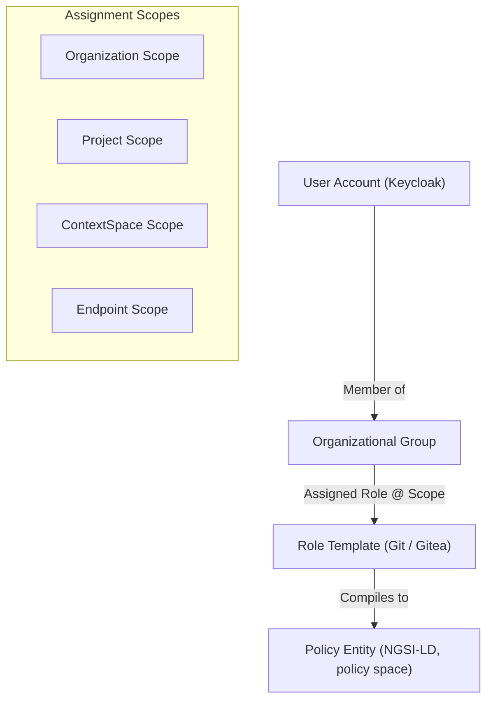

# Identity & Access Management (IAM)

The platform centralizes authentication and organizational hierarchy inside Keycloak while maintaining policy evaluation strictly outside identity tokens.

```text
+---------------------------------------------------------------------------------------------------+
|                                    IDENTITY ARCHITECTURE STACK                                    |
|                                                                                                   |
|  Keycloak (OIDC / OAuth 2.1 / OID4VCI Credential Issuer / User & Group Store)                     |
|         |                                                   |                                     |
|         v (OIDC Tokens / JWTs)                              v (OID4VP Verifiable Presentations)   |
|  APISIX Gateway (routes, limits, header hygiene)     FIWARE VCVerifier (OID4VP, not deployed yet)  |
|         |                                                   |                                     |
|         v                                                   v                                     |
|  Context Gateway (Identity Extracted -> Evaluated against Policy Entities by the in-process PDP)             |
+---------------------------------------------------------------------------------------------------+
```

## 1. Identity Stack Specification (I1–I4)

The platform enforces four non-negotiable identity rules:

- **I1, Pure OIDC & OID4VCI:** Keycloak is deployed strictly as an OpenID Connect provider and Verifiable Credential issuer. Keycloak Authorization Services (UMA) and fine-grained resource policy servers are explicitly disabled.
- **I2, Decoupled Verifiable Presentations:** External Verifiable Presentations (OID4VP) are to be processed by FIWARE VCVerifier, which exchanges a valid presentation for a short-lived internal JWT that the ordinary APISIX plugins consume. No environment deploys it: OID4VP is the design this rule fixes, and today every caller arrives with a realm token.
- **I3, Peer Federation Identity:** Peer digital twins in a federation NEVER receive local Keycloak user accounts. Peer identities are established via W3C Decentralized Identifiers (`did:web`) verified against the European Trusted Issuers Registry (TIR).
- **I4, Zero Permissions in Tokens:** Authentication tokens carry identity assertions exclusively (`sub`, `iss`, `client_id`, `email`). Tokens NEVER contain permissions, role lists, or scope grants. All authorization is decided by the Context Gateway's own in-process PDP against the `Policy` entities of the policy space ([ADR-N-003](../Decisions/adr-n-003-context-gateway-in-rust.md)); the legacy OPA sidecar it replaced is gone (13 §5).

---

## 2. Organization, Group & Role Model



### Assignment Scopes

1. **Organization Scope:** Grants administrative rights across the entire Organization repository (e.g. Organization Administrator).
2. **Project Scope:** Scopes access to a specific Project (e.g. Project Lead, Pipeline Developer).
3. **ContextSpace Scope:** Grants read/write permissions over a specific Context Space (e.g. Air Quality Domain Steward).
4. **Endpoint Scope:** Restricts access to a single published Endpoint (e.g. Consumer).

A `RoleBinding` names one of the first three scopes (PF-49); the fourth is what a `Policy` on the Endpoint grants to data readers, not a binding. Scopes inherit additively (PF-60), the way the legacy platform's data pools did: a binding at organization scope holds in every project and every context space, a binding at project scope holds in every context space of that project, a binding at context-space scope holds there alone. A wider binding is never narrowed by a narrower one, so a steward of the organization who is also an editor of one project keeps the steward's verbs in that project; and no scope reaches another project. `GET /api/v1/projects/{project}/permissions/me` lists each grant with the scope it was inherited from, so a person sees why they may do something here.

Reading is a verb (PF-59). `read` joins `propose`, `approve` and `delete` in a rule, and `propose` on a kind implies `read` on it, so every role written before the verb existed keeps working. What answers under `read` is everything that shows configuration: lists and gets of the resource API, `export`, `/revisions`, `permissions/me` and the MCP resources. A project the caller has no `read` on answers `404`, never `403`, on every one of them, the one answer for "missing" and "not yours" (R20), so a name is not disclosed by refusing it. The `viewer` role of the taxonomy is the seeded `read` on every project kind; whether every signed-in person holds it is the organization's setting, `Organization.spec.projects.visibility: organization | members` (PF-61). Administrators see everything: `org-admin` at organization scope reads every Endpoint of every project, which is the organization-level Endpoints page, and nobody else is offered that page: it answers `404` to anyone who is not an administrator of the organization (PF-61). The gateway is untouched by all of this: reading context data stays a `Policy` on the Endpoint (R1), never a binding.

People are the one thing a rule names that is not a manifest (ADR-N-031). A person lives in Keycloak, so `propose` cannot reach them, and the kind `Person` takes verbs of its own: `create`, `update`, `disable` and `delete`. `disable` covers enable, sign-out and removing a second factor as well; `update` covers the name, the e-mail and a password reset. These three verbs are valid on `Person` alone, `Person` is valid in an organization role alone, and `read` on `Person` lists and opens people. The taxonomy seeds `people-admin` with all five at organization scope, and `org-admin` holds it (PF-91).

---

## 2a. Roles as code

PF-49…PF-52.

Who may change configuration is itself configuration: three kinds in `users/` of the Organization repository, versioned, reviewed in the red lane, and compiled by the reconciler into every place that enforces them. Keycloak keeps identity (login, `sub`, e-mail); nothing about permissions lives in a token (I4), and since PF-62 nothing about membership lives only there either.

```yaml
# users/groups/air-quality-team.yaml
apiVersion: joinedcontext.com/v1alpha1
kind: Group
metadata: { name: air-quality-team, namespace: org }
spec:
  description: The air quality domain, measurement and modelling
  members:
    - { user: jana.kovacova@example.org }
    - { user: peter.novak@example.org }     # not in Keycloak yet: a warning, in force at first login
```

A `Group` is the people a binding names at once (PF-62). The reconciler owns the Keycloak group it creates for each manifest, marked `managed-by: joinedcontext`: members are added and pruned to match, a rename follows the manifest, and an edit made in the Keycloak console is overwritten on the next reconcile and reported as drift, the same shape as every other drift the reconciler reports (PF-63). A Keycloak group without the mark is somebody else's and is left alone. So a fresh environment recreates membership from the repository, a membership change is a merge request in the red lane like a `Role` or a `RoleBinding`, and a `subjects[].group` in a binding or a `ServiceAccount` names a manifest, refused at validation when none exists (PF-64), where today it would silently match nobody. A group the identity provider owns, such as the realm's default group every signed-in person joins, is bound with `{ group: platform-readers, source: provider }`: the mark is in the manifest, reviewed in the red lane with the binding, validation accepts that group without a manifest, and the reconciler never creates, edits or prunes it (PF-64, PF-63). Only a `RoleBinding` subject carries the mark; an App's or an Endpoint's roles name `Group` manifests alone. The one binding still read from Keycloak is the bootstrap administrators' group of the platform settings file (PF-52), because it has to exist before the first manifest does.

```yaml
# users/roles/pipeline-developer.yaml
apiVersion: joinedcontext.com/v1alpha1
kind: Role
metadata: { name: pipeline-developer, namespace: org }
spec:
  rules:
    - kinds: [Pipeline, DataSource, Mapping]
      verbs: [propose]                       # read | propose | approve | delete; propose implies read; Person also create | update | disable
    - kinds: [Endpoint]
      verbs: [propose]
      constraints:
        - { field: spec.audience, notIn: [public] }   # a public endpoint is another role's
---
# users/assignments/ovzdusie-developers.yaml
apiVersion: joinedcontext.com/v1alpha1
kind: RoleBinding
metadata: { name: ovzdusie-developers, namespace: org }
spec:
  subjects: [{ group: air-quality-team }, { user: jana.kovacova@example.org }]
  role: pipeline-developer
  scope: { project: ovzdusie }              # organization | project | contextSpace
  validity: { notAfter: "2026-12-31T23:59:59Z" }
```

What a person may do inside one application is not a `RoleBinding`: an App declares its own roles and members, and the gateway holds them on the app's endpoint only ([16 §12](16-apps-on-demand.md#12-roles-of-an-application), ADR-N-027).

PF-56. The roles every organization starts from, seeded into `users/roles/` by the forge bootstrap and extended by proposing further `Role` manifests (red lane, PF-52):

| Role | Kinds | Verbs | Who |
|---|---|---|---|
| `viewer` | every project kind | `read` | every signed-in person of the organization when `projects.visibility` is `organization`, nobody when `members` (PF-61): reads spaces, endpoints, pipelines and dashboards, proposes nothing (PF-50) |
| `model-editor` | `DataModel`, `Mapping` | `propose` | the data modeller |
| `pipeline-editor` | `Pipeline`, `DataSource` | `propose` | the integration developer |
| `endpoint-editor` | `Endpoint` | `propose` | the person who publishes data |
| `app-editor` | `App` | `propose` | the person who builds applications |
| `steward` | every project kind | `propose`, `approve` (`approve` on `Endpoint` only for `spec.audience` not in `[public]`) | the domain lead; approves the yellow lane |
| `publisher` | every project kind; `Endpoint` | `read`; `approve` on `Endpoint` for `spec.audience` in `[public]` | who may let data out to the public (PF-71) |
| `org-admin` | every kind, `Role` and `RoleBinding` included | `propose`, `approve`, `delete` | the organization administrator; approves the red lane (CC-70) |
| `build-lane` | `App`, constrained to `status.build` | `propose` | the build lane's `ServiceAccount`, `service-account-jc-build-lane`, and nobody else: it writes `status.build` of an App whose `spec` and `metadata` it leaves as they are on `main` (AP-73, [ADR-N-028 §5](../Decisions/adr-n-028-applications-build-on-the-forge.md#5-security-analysis)) |

A constraint names a `spec.` field or `metadata.name` and carries exactly one of `in`, `notIn`, `equals` and `pattern`. `pattern` is a regular expression of at most 256 characters that the whole value must match, as if written between `^(?:` and `)$`; the Portal (Rust `regex`) and the forge's Conftest (Rego `regex.match`, RE2) share the syntax both engines accept, and neither backtracks, so a pattern cannot stall an approval. A constraint on `metadata.name` confines a rule to resources named a certain way: the `development` profile's `janitor` role approves and deletes only what the live journeys and the recorded takes name as theirs (`t1234-…`, `…-0915`), so the sweep that removes their residue needs no demo person's rights and no person gains a delete (T-2627). The one exception is `{ field: status.build }` with no operator, on a rule of `App` with `propose` alone. It says whose field that is, and it narrows the rule to writing it: such a rule authorizes no other proposal (AP-73).

An editor role proposes and nothing else: `approve` and `delete` stay with the steward and the administrator, and a role of the taxonomy never names a verb outside its kinds. Publishing is its own right (PF-71, PF-72): the steward approves the Endpoints of their domain for the organization and for named projects, and a Change that makes an Endpoint public, on creation or by flipping its audience, or widens the Policy a public Endpoint reads, needs an approval by a binding whose `approve` on `Endpoint` satisfies `spec.audience in [public]`, the `publisher` or `org-admin`, in the red lane with the name typed back (EP-76). The constraint is evaluated on the head manifest of the Change, so an update that turns `organization` into `public` is caught the same as a creation, on every door: the Portal names the missing role, "Approving a public Endpoint needs publisher", the assistant answers the same sentence, and an import bundle is held file by file (T-0832). An organization that wants nobody but its administrators to publish seeds no `publisher` binding at all. The bootstrap administrators' group of the platform settings file is what exists before the first `org-admin` binding is proposed.

Nobody grants above their own rights (PF-52, AG-77). A proposed `RoleBinding` is checked against its proposer where it applies: every verb its `Role` names on every kind must be one the proposer holds on the binding's scope, the organization, the project or the context space; a proposed `Role` is checked the same way on the organization, and a `ServiceAccount` through each of its `roles` that names a `Role` of the organization, on that role's scope (its other roles are the gateway's templates, which grant data access through Policies, CC-60). The refusal is `403` and names what the proposer lacks, "a binding may not grant more than its proposer holds: missing approve on Pipeline, delete on Role", on every channel, because the check sits in the one propose function the form, the REST route, `jc_resource_propose` and the assistant all reach. The approver of such a change is held to the same check, and approving the removal of a `Role`, a `RoleBinding` or a `ServiceAccount` needs `delete` on its kind as well as `approve`. Every change to a `Role`, a `RoleBinding` or a `ServiceAccount` takes the red lane with the name typed back. The bootstrap administrators' group holds everything and so passes.

An administrator's own change is approved as it is proposed (PF-58). When a person proposes with their Portal session and a binding covering the project grants them `approve` and `delete` on every kind of every file the change touches, the propose door calls the approve button's own function in the same request, as that person, and the change merges; the commit says `Approved in the Portal by {email}, its author, as an administrator of {kind}`. The red lane still takes its typed name, at propose (`?confirm=`); without it the change waits, and its author approves it on its approval page with the name typed. This is not a new right: it spares a second click to someone who could approve the change and delete what it touches anyway, and it moves no other boundary. An agent run, a bearer caller and MCP never approve on propose, whoever started them (AG-11, AG-82). A steward, holding `approve` without `delete`, or a person whose bindings cover only some of the change's kinds, proposes a change that waits for another approver, and the propose dialog says "Waits for an approver: you hold approve but not delete on {kind}" before the click (PF-70). The bootstrap administrators' group is not a binding and does not count, so its members approve as any other approver. A grant proposed this way is still held to PF-52 first, so nobody auto-approves a binding above their own rights.

Roles per project (PF-68…PF-70). A project's steward writes the roles their own project needs, at `projects/{project}/roles/{name}.yaml`, in the project's namespace, the way they write its spaces and pipelines: a role for the team that may propose pipelines but not endpoints, a role for the intern who reads and proposes dashboards only. Such a role names project kinds only, never `Role`, `RoleBinding`, `Group`, `Organization` or `Project`, and only the verbs its proposer holds on those kinds in that project, by the same "nobody grants above their own rights" check as every binding (PF-52). A binding at project or context-space scope may name an organization role or a role of that project; a project role cannot be bound at organization scope or in another project, so nothing a steward writes reaches beyond their project (PF-69). The steward approves those roles and the project's bindings in the red lane, because they hold `approve` on `Role` and `RoleBinding` at project scope, and the approver is held to PF-52 like the proposer, so a steward without `delete` cannot approve a role that grants it (PF-70). A name used both in `users/roles/` and in a project is refused at validation: a project role shadows nothing (PF-68). The forge's `CODEOWNERS`, `policies/roles.json` and the Portal's check resolve a role by its namespace, the organization's or the project's, which is also why an organization kind imported with a project namespace is wrong rather than merely odd (T-0820).

```yaml
# projects/ovzdusie/roles/pipeline-author.yaml
apiVersion: joinedcontext.com/v1alpha1
kind: Role
metadata: { name: pipeline-author, namespace: ovzdusie }
spec:
  rules:
    - kinds: [Pipeline, DataSource]
      verbs: [propose]            # the steward holds propose on both here, so this is within their rights
---
# users/assignments/ovzdusie-authors.yaml
apiVersion: joinedcontext.com/v1alpha1
kind: RoleBinding
metadata: { name: ovzdusie-authors, namespace: org }
spec:
  subjects: [{ group: air-quality-team }]
  role: pipeline-author           # resolved in the project the scope names
  scope: { project: ovzdusie }
```

Where each of these is edited is one rule: by its scope ([09 §14](09-portal.md#14-organization-and-project-management), UI-75…UI-81). The organization's roles, groups, organization-scope bindings and the `Organization` manifest are on the **Organization** page. A project's own roles and its project and space bindings are on that project's **Settings**. A role of an application is on the App's page. Keycloak holds identity and nothing else, so neither page sends anyone to its console.

What a denied verb looks like in the Portal is one rule (UI-44): the control stays where it is, disabled, and says why, "Disabled: your role does not permit 'propose' on 'Endpoint' in this project", by pointer and by keyboard. A control that vanishes teaches nobody which role to ask for; a disabled one with the reason is the request form. The Portal's check is still the only enforcement: the same request sent directly is `403` (PF-50).

### Reading the repository in the forge

A Portal session is not a forge session. The forge carries its own "Sign in with keycloak" button against the same realm, and the account it creates on first login belongs to no team, which on a private repository is a `404` (PF-79). Two things close that gap. The forge's OpenID Connect source reads a `groups` claim and maps each group onto a team of the organization (`--group-claim-name groups --group-team-map …`); the platform seeds `platform-readers` as a Keycloak default group, so every person of the realm carries it and lands in the forge team `readers`, which holds read on every repository of the organization. The reconciler's managed groups (PF-63) map the same way onto the teams it compiles from the bindings, so a person who may propose a project's manifests reads that project's history in the forge with the identity they already have.

**Per project, in layout 2** ([ADR-N-029](../Decisions/adr-n-029-one-repository-per-project.md)). Each project repository is read through its own teams: the reconciler keeps two Keycloak groups per registered project, `{slug}-readers` and `{slug}-writers` (carrying `managed-by: joinedcontext`), and the forge teams of the same names, and the same group→team mapping, applied by the forge's admin command at deploy, joins each group to its team (PF-87). A person is in `{slug}-readers` when a binding in force at the organization or at the project grants `read` on some kind, and in `{slug}-writers` when it grants `propose`; a `group` subject counts through its `Group` manifest's members. A binding scoped to one context space does not reach the repository, which holds every space of the project. The forge applies a membership at the person's next sign-in to it. A team carries access to its own project repository and to no other, so a project member's forge credential reaches that repository and nothing else, and git works over HTTPS with that credential; the Portal never proxies git. The seeded `readers` team narrows accordingly: it reads the organization repository only for a person holding a binding at the organization, so a person bound to one project sees neither the organization's roles and environments nor any other project. An `org-admin` is an owner of the forge organization. A writer may push branches with git; `main` stays protected in every project repository and merging stays the Portal's approval (PF-80, PF-88).

Read is where a team stops (PF-80). A team never carries write, merging is the Portal's approval and the repository's branch protection, and `Owners` stays the bootstrap administrator alone: the forge is where a person reads the configuration and the review, not a second door into changing it. The Portal's own links carry that through, going to `/git/user/oauth2/keycloak?redirect_to=<path>` rather than to the file directly: the forge starts the Keycloak sign-in at once, the Keycloak session the Portal already holds answers it without a prompt, and one click opens the file (PF-81). `keycloak` is the name the Gitea chart gives the auth source (`components/gitea`).

### The platform's own forge identities

The forge is where people read; the platform writes to it with three machine users, none of them an administrator, each with a token minted on itself (PF-106). `jc-portal` writes the configuration's repositories and nothing else: a collaborator with `write` on the organization repository, and in layout 2 a member of a team that may create a project repository and writes the project repositories (CC-85). It opens every Change's branch and merges it once the Portal approved it. `jc-gateway` reads the same repositories and nothing else. The generated applications live in an organization of their own, `{org}-apps`, where `jc-apps` creates and writes their repositories (AP-75) and the build lane runs; `jc-apps` holds nothing in the configuration's organization. A leaked token therefore reaches one repository with one verb, or the applications' organization, and never the forge. None of the three has a usable password, and none sits in a team that includes all repositories, since such a team would undo the narrowing.

`main` of the organization repository carries one branch protection rule, converged by the forge bootstrap on every apply (PF-105): only `jc-portal` may push or merge, a stale approval is dismissed, and nothing merges over an outdated base. It asks for no forge approval: the Verdict is the Portal's (CC-41), and a forge approval would only be the Portal approving itself. When another Change merged first, the Portal brings the branch up to date and merges only if the updated head still passes the Change's checks, and otherwise returns the Change to review with the reason. The bootstrap's seed commits as `jc-portal` too, so the rule has no exception for the site administrator to go through.

The reconciler compiles the bindings three ways, so the Portal, the forge and CI cannot disagree: `CODEOWNERS` and team permissions in Gitea (CC-41), `policies/roles.json` for the Conftest gate the repository's CI runs on every merge request (CC-59), and the Portal's own check on every write and approval before a `Change` exists (PF-50). The UI reads `GET /api/v1/projects/{project}/permissions/me` and hides what it denies; it never decides. `policies/tests/` holds the cases the model must keep true, run as tests in CI. A principal with no binding sees nothing of the project (`404`, PF-59), and the only binding that comes from Keycloak is the bootstrap administrators' group named in the platform settings file.

## 3. Service Identities

Bento is one writer among many. A department's own script, a vendor's IoT platform pushing NGSI-LD directly, a partner's ETL, a QGIS user with a bearer token, an agent: each needs an identity, a set of grants and a credential that can be rotated and revoked without a ticket. The platform models this with one Kubernetes-style kind and one Portal page.

```yaml
apiVersion: joinedcontext.com/v1alpha1
kind: ServiceAccount
metadata:
  name: vendorx-parking-push
  namespace: helsinki
  title: { fi: "VendorX pysäköinti – suora kirjoitus", en: "VendorX parking – direct write" }
spec:
  owner: { user: "jana.k@bb" }                    # accountable human, notified on expiry/anomaly
  purpose: "VendorX cloud pushes ParkingSpot updates every 10 s"
  roles:                                          # same role templates as humans (§2), scoped
    - { role: space-writer, scope: { contextSpace: parking }, types: [ParkingSpot], operations: [createEntity, updateAttrs] }   # CIM 009 clause 4.20 names only (R8)
  credentials:
    - kind: oauth-client         # Keycloak confidential client, client_credentials → short-lived JWT (preferred)
      name: main
    - kind: api-key              # for systems that cannot do OAuth (devices, legacy ETL); hashed at rest, shown once
      name: legacy-push
      expiresAt: "2027-03-01T00:00:00Z"
      ipAllowList: ["203.0.113.0/24"]
  limits: { requestsPerMinute: 1200 }
  # delegation: token-exchange  # only a client that reads for a person, e.g. jc-agent-proxy (ADR-N-038, AG-95)
# status (never in Git): keycloak clientId, keyIds, lastUsedAt per credential, rotation state
```

- **ServiceAccount** is a principal like a user: it appears in `assignee` of compiled `Policy` entities, in audit logs and in the AuthZEN introspection endpoints. Grants come from the same role templates and scopes as humans; the manifest can only bind roles the requesting human holds (CC-60, as for Apps).
- **Credentials** are never in Git. The manifest declares that a credential *exists*; the reconciler creates the Keycloak client or the API key, the secret is shown once in the Portal (or written to OpenBao for automation), and the Portal API stores only `argon2id(key)`, key id, expiry and last-used. API keys are prefixed `jc_{keyId}_…` so the gateway resolves the ServiceAccount by key id before hashing, and are accepted only as `Authorization: Bearer` over TLS; they never cross a request boundary as query parameters.
- **Direct writers** reach the platform only through the gateway (`/cs/{space}/ngsi-ld/v1` for members, or an Endpoint with write grants); the broker, the database and the message bus have no external listener. MQTT devices go through the broker's MQTT bridge, which authenticates them with the same ServiceAccount credentials (username = account, password = api key) and applies the same Policy set.
- **Rotation and revocation** are Portal actions: *Rotate* issues a new key with an overlap window (default 24 h) and shows both as active until the old one is dropped; *Revoke* is immediate at the gateway (the PDP's principal cache is invalidated by the Portal API event). Expiring keys notify the owner 14 and 3 days ahead; unused keys (90 days) are flagged.
- **Delegation** (`spec.delegation: token-exchange`, absent by default) marks the one kind of account whose tokens may carry a person as their subject: a token its client obtained by exchanging a person's own (RFC 8693) is decided as that person, never with the account's roles, and a person-subject token from any other account is `403` (ADR-N-038, AG-95). The realm enables the exchange on that client alone.
- **Pipeline runners** are ServiceAccounts rendered by the reconciler from the `Pipeline` manifest (`oauth-client`, roles from `spec.access`), so a pipeline's identity appears on the same page as everything else.
- **Autonomous agents** are ServiceAccounts with `roles` restricted to the lanes they may use (AG-xx) and short-lived OAuth 2.1 tokens.
- **The Portal's reconciler** holds the platform-owned account. Its Keycloak client is `portal-reconciler`, separate from the login client on purpose, with `manage-users` and `query-groups` in `realm-management` and nothing else, so the client people log in with cannot write anybody into a group.

### One identity provider for everyone: users, apps, workloads

Keycloak is the only place identities come from. Humans log in through OIDC at the edge: the APISIX `openid-connect` plugin in front of the Portal (`portal.{domain}`) and of every app (on its own host `{name}.apps.{domain}`, ADR-N-037) holds the session and hands the upstream `X-Userinfo` and `X-Access-Token` (ADR-N-019); `kubectl`-style CLIs use the device flow. Everything that is not a human is a `ServiceAccount` with an `oauth-client` credential, and that includes the platform's own components and any third-party service an organization runs in the clusters:

| Caller | Credential | Calls |
|---|---|---|
| Portal → Context Gateway, Gitea, RustFS | platform ServiceAccount `portal` (client credentials) | resource API reads/writes on behalf of the reconciler; user-initiated calls forward the **user's** token instead |
| the Portal's reconciler → the realm's groups | client `portal-reconciler` (`manage-users`, `query-groups`) | brings the realm's platform-owned groups to what `users/groups/` says (PF-63), and nothing else |
| the Portal → the Keycloak admin API | the login client `portal-api` (`manage-clients`) | provisioning every published App's client and the federated client of every `ServiceAccount` bound to a workload (PF-47) |
| Bento runners, derived pipelines, `container` compute | ServiceAccount rendered from the `Pipeline` | writes through the target Endpoint |
| Apps on Demand (`service`, `fullstack`) | the edge login (APISIX `openid-connect`, client `edge`) for the user **plus** the app's own ServiceAccount for background calls | the app Endpoint only |
| Data space connector, Agent Runner, conformance runners | their ServiceAccounts | Endpoints, MCP surfaces |
| Any other service in the cluster (a department's own microservice, a vendor's adapter, a GIS server) | a `ServiceAccount` manifest in that department's project | whatever Endpoints its roles grant; it may also *offer* an OIDC-protected API of its own registered as a Keycloak client so other services call it with the same tokens |

Rules that make this work everywhere: tokens are short-lived JWTs from `client_credentials`, audience-bound to the service they are for (RFC 8707 `resource`); APISIX forwards the bearer token untouched and strips forged identity headers; it does not verify tokens (its `openid-connect` plugin cannot check ES256, [Deployment 10 §4](../Deployment/10-edge-routing-apisix.md)). The Portal and the Context Gateway verify issuer, signature, audience, `exp` and `nbf` themselves, and the gateway maps `azp` to the ServiceAccount; service-to-service calls carry `Authorization: Bearer` and nothing else (no static API keys between cluster services, API keys exist only for external systems that cannot do OAuth); Linkerd mTLS gives transport identity, the token gives authorization identity, both are required. Workloads running in the cluster bind their pod identity to the ServiceAccount (`spec.workload: { kubernetes: { namespace, serviceAccount } }`) and hold no secret at all (PF-47, below).

### Workload identity without a secret (PF-47)

A pod already holds a credential Kubernetes rotates for it: its projected ServiceAccount token. Keycloak 26.6 accepts that token as a client assertion (federated client authentication, supported since 26.6.0), so a workload bound to a `ServiceAccount` manifest gets a platform token without a client secret existing anywhere.

- **The realm** declares one identity provider of type `kubernetes`, alias `kubernetes`, whose issuer is the cluster's service-account issuer (`https://kubernetes.default.svc.cluster.local` on k3s). Keycloak reads the issuer's JWKS through it.
- **The client** is the account's derived client `{project}-{name}`, which the Portal's reconciler writes: `clientAuthenticatorType: federated-jwt`, the attributes `jwt.credential.issuer: kubernetes` and `jwt.credential.sub: system:serviceaccount:{namespace}:{serviceAccount}`, `client_credentials` only, and the audience mappers of PF-47. Keycloak still generates a secret for every confidential client; with this authenticator it opens nothing (a `client_secret` request is `401`), and the reconciler never reads it.
- **The pod** mounts a projected token with `audience` set to the realm issuer (`https://idm.{domain}/realms/{instance}`) and a short `expirationSeconds`, and asks for a token with the assertion alone. Keycloak finds the client by the assertion's subject, so the request carries no `client_id` (with one, Keycloak answers `client_id parameter does not match sub claim`):

```text
POST /realms/{instance}/protocol/openid-connect/token
grant_type=client_credentials
client_assertion_type=urn:ietf:params:oauth:client-assertion-type:jwt-bearer
client_assertion=<contents of the projected token file>
```

The answer is an ordinary access token whose `azp` is the account's client, so the gateway and the Portal map it as they map every other account. Checked against Keycloak 26.6.4 on 2026-09-25: a token of another ServiceAccount, another audience, an expired token and one signed by another key are each refused with `invalid_client`. A projected token is not single-use, so the same file answers until it expires; its `expirationSeconds` is the window a copied token is worth, and the kubelet rewrites the file before that.

### What the gateway checks in a token

Three claims decide, and the gateway reads nothing else about who is calling ([PF-45](../Requirements/platform.md), [PF-46](../Requirements/platform.md)):

| Claim | Rule |
|---|---|
| `iss` | exactly the configured realm issuer; a token from another realm is not a token |
| signature, `exp`, `nbf` | verified against the realm JWKS cached in process. An unknown `kid` triggers at most one refresh per minute whatever the request rate, so invented `kid` values cannot turn a PEP into a load generator against Keycloak; a token that arrives while that window is closed is rejected. The realm signs ES256 ([AR-11](13-security.md#2-bsi-tr-03187-conformance-matrix)), so a verifier that handles only RSA is not a verifier here |
| `aud` | must contain the resource being called: the endpoint slug on `/api/endpoint/{slug}/…`, the space name on `/cs/{space}/…`, or the full resource URI (`{publicUrl}/api/endpoint/{slug}`, `{publicUrl}/cs/{space}`) when the deployment configures a public URL |

A token that fails any of the three is `401` with `type: …/unauthorized`. The audience rule is what makes a token useless anywhere but the one place it was issued for: an endpoint slug carries 128 bits of entropy ([EP-02](../Requirements/endpoints.md)), so a token minted for one endpoint names it and nothing else. Two tokens carry the wider audience `context-gateway`, the gateway's own name, which the gateway accepts on every endpoint it serves: the edge session's (the `edge` client's access token, ADR-N-019), because a person's session cannot name an endpoint that is proposed and approved after they logged in; and the agent proxy's (the `{project}-agent-proxy` client, AG-49), because a builder run reads through whichever endpoint the person picked, one approved yesterday through the Portal as well as one of the seed. The Policy decision stays per endpoint, so the wider audience widens the door and not the grant: the proxy's `ServiceAccount` holds the `public` role and reads what an anonymous caller reads.

`azp` names the Keycloak client that obtained the token, and the gateway maps it to a `ServiceAccount` manifest to learn the roles the PDP evaluates. The client id is derived, never chosen: **`{project}-{metadata.name}`**, both DNS-1123 labels, so it survives credential rotation and is the same string in Keycloak, in the manifest and in the audit log. `status.keycloakClientId` records it, but the gateway does not need live status to resolve it. An `azp` no `ServiceAccount` in the repository names is `403`, even when the token verifies perfectly: a valid token from an account the configuration does not know is an account with no grants.

A human token carries `preferred_username` and no `azp` of a service account; it takes the user path, with `realm_access.roles` and `groups` as the subject the PDP sees.

### What the Portal checks in a service account's token

The Portal maps `azp` the same way, for the same reason: a workload's rights to the configuration live in its own manifest and nowhere else ([PF-45](../Requirements/platform.md), [PF-49](../Requirements/platform.md)). A bearer token the Portal verified (issuer, signature, `exp`, `nbf`, and `aud` naming the Portal's own client, `portal-api`) is a `ServiceAccount` when its `azp` is the derived client id of exactly one account in the repository and its `preferred_username` is Keycloak's name for that client's service account, `service-account-{azp}`. Its rights are then the `roles` of that manifest that name a `Role` (§2a), each on the scope written beside it, as a `RoleBinding` naming a person would give them; the account's other roles are the gateway's templates and grant nothing in the Portal. A `RoleBinding` never has to name an account, so a workload's configuration rights have one home, the manifest the PF-52 check already reads when the account is proposed.

`approve` is never among them, whatever the role says: a workload proposes and a person approves (PF-58). A token no single account explains (an id two accounts derive, a client no manifest derives, the edge's token) keeps the person path of §2a, bindings by `user` and `group`: that is how the build lane's platform client, which has no manifest, holds its one rule as `service-account-jc-build-lane` (the table in §2a).

The audience is what keeps the two doors apart. An account that acts on the Portal has a client whose audience mapper names `portal-api` and no endpoint slug, so its token opens the Portal API and the MCP door (`/api/v1/mcp`) and is `401` at every endpoint; an account that reads or writes context data has a client audienced to its endpoints and is `401` at the Portal. A workload that needs both holds two accounts.

- **PF-45** [S] — every non-human caller is a `ServiceAccount` with an audience-bound `client_credentials` token.
- **PF-46** [S] — the PEP serving the request verifies issuer, signature, expiry and audience, and maps `azp` itself; the edge is not the verifier ([ADR-N-018](../Decisions/adr-n-018-token-verification-in-the-peps.md)).

### Portal page: Project settings, Service accounts

The **Service accounts** tab of Project settings, and of the Organization page for namespace `org` ([09 §14](09-portal.md#14-organization-and-project-management), UI-80). One table per project (organization administrators see all projects): account, owner, roles and scope, credentials with type, expiry, last used, requests in the last 24 h, status. Actions: create (a blueprint writes the manifest and opens the change), edit roles (lane by widening: yellow; write to a public-facing space: red), rotate, revoke, download a client configuration snippet (curl, Python, Node, Bento input, QGIS) pre-filled with the endpoint or space URL. The same data is available to agents on the configuration MCP (`list_service_accounts`, `rotate_credential` with elicitation) and through `jcctl get serviceaccounts`.

---

## 4. AuthZEN Discovery Endpoints (R51, R16, R17)

To allow client applications and AI agents to determine their effective access permissions prior to issuing operations, the Context Gateway exposes OpenID AuthZEN 1.0 compliant discovery endpoints:

### 1. `POST /access/check` (Dry-Run Authorization Check)

Evaluates whether a prospective action on a specific resource would be permitted:

```json
{
  "subject": { "id": "did:web:hel.fi:users:aino" },
  "action": { "name": "updateEntity" },
  "resource": {
    "type": "AirQualityObserved",
    "id": "urn:ngsi-ld:AirQualityObserved:hel.fi:air-quality:station-01"
  }
}
```

**Response:**

```json
{
  "decision": true,
  "context": {
    "reason": "policy_grant_matched",
    "matchedPolicyId": "urn:ngsi-ld:Policy:hel.fi:air-quality:policy-editor-air"
  }
}
```

### 2. `GET /access/permissions` (Effective Grants Introspection)

Served on every space and endpoint as `…/access` (Architecture/04 §1b, EP-55…EP-60): the Policy set partially evaluated for the caller, returned as AuthZEN permissions JSON, as an ODRL 2.2 policy in the `ngsi-ld:` profile, or as a UCAST grant AST for clients that compile the residual into their own filters. The same PDP that enforces requests produces the document, so what it says the caller may do is exactly what the gateway will let through.
Returns the aggregated list of all entity types, ID patterns, scopes, and attributes the authenticated caller is authorized to access across the target space.

## Related

- [01-overview](../Architecture/01-overview.md) — where this chapter sits in the whole.
- [00-index](../Requirements/00-index.md) — the normative requirements behind it.
