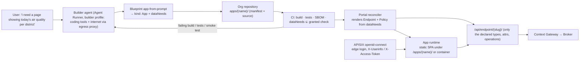
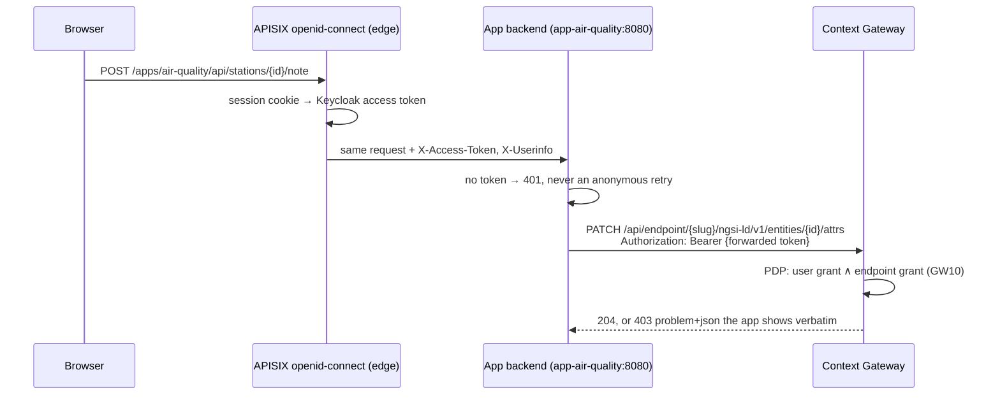

# Apps on Demand

An **App** is a small, purpose-built application (a citizen-facing map, a department dashboard, a form for field workers, a report page) that a user asks for and an AI agent generates. Apps are ordinary consumers of the platform: each one reaches context data only through **its own Endpoint**, whose grants are derived from what the app declares it needs and nothing more. Apps never talk to the broker, the database or the Portal API's privileged routes; they are deployed, versioned and reviewed through the same manifests and lanes as everything else.



## 1. What an App is

An Application is not a Dashboard (AP-64). A Dashboard is a declarative manifest of layers over Endpoint data, rendered by the Portal (Architecture/10), optionally routed to an addon (Grafana). An Application is generated code, written on the App SDK for `static` ([20-app-sdk](20-app-sdk.md)) or in the workspace for `fullstack`, built from a prompt against one Endpoint, and served by the Portal behind the edge login. The Applications section never generates Dashboard manifests, and the Dashboard surface never generates an application. Both may exist for the same Endpoint.

| Aspect | Decision |
|---|---|
| Manifest | `kind: App` in `projects/{p}/apps/{name}/app.yaml`, source code beside it (`src/`) or in a dedicated repository of the org forge referenced by `spec.source` |
| Kinds of apps | `static` (built by the in-cluster build lane, [20-app-sdk §6.0](20-app-sdk.md#60-where-the-build-runs): a Vite/React SPA on the SDK, plain HTML with no build step, either one with functions; served by the Portal's static host under `https://{host}/apps/{app}/`), `service` (OCI image built in CI, Deployment behind APISIX under the same path) and `fullstack`, the default for agent-built apps: one OCI image with a Rust `axum` backend that serves the React build and holds the server-side logic, behind the APISIX `openid-connect` login front like every other app (§5) |
| Data access | exactly one `Endpoint` per app, generated by the reconciler from `spec.dataNeeds` (types, attributes, operations, scope/geo/temporal constraints); the app receives the slug at build time; nothing else is reachable |
| Identity | `static` apps are public OIDC clients (PKCE) and act with the **user's own token**, so the user's grants intersect with the app's endpoint grants (both must allow); `service` apps additionally get a Keycloak service account for background calls, granted only through the same endpoint; `fullstack` apps carry no auth code at all: the edge (APISIX `openid-connect`, client `edge`) logs the user in against Keycloak and hands the backend `X-Userinfo` and `X-Access-Token`, and the backend calls the app endpoint with that token (§5) |
| Visibility | `private` (author), `project`, `organization`, `public` (anonymous users hit the endpoint under the `public` role, GW22), and `roles`: only a person holding one of the app's roles opens it (§12) |
| Lifecycle | `draft → preview → published → retired`; preview runs in a sandbox space (CC-67) with synthetic or copied seed data; publishing is a lane decision |
| Where it runs | inside the platform (same host, CSP-locked, served by APISIX); no external hosting is required, none is forbidden |

## 2. `dataNeeds`, least privilege by declaration

The agent does not write policies. It declares what the app reads and writes; the reconciler turns that into an Endpoint and the `Policy` entities behind it, in the same commit as the app (CC-61). Reviewers see the grant, not generated Rego.

```yaml
apiVersion: joinedcontext.com/v1alpha1
kind: App
metadata:
  name: air-quality-today
  namespace: helsinki
  title: "Air quality today"
  annotations:
    joinedcontext.com/generated-by: "agent:app-builder@bb"     # attribution (AG-17)
    joinedcontext.com/prompt-digest: "sha256:…"               # the request that produced it, stored in apps/{name}/PROMPT.md
spec:
  kind: fullstack                    # static | service | fullstack
  source: { path: ./src }            # or { git: {url, ref, path} }
  build: { rust: "1.90", node: "22" }   # Rust axum backend + Vite/React UI in one image
  visibility: public
  dataNeeds:
    - contextSpaceRef: { kind: ContextSpace, name: air-quality }
      types: [AirQualityObserved, District]
      attrs: [pm10, pm25, airQualityIndex, location, name, refDistrict]
      operations: [queryEntity, retrieveEntity, queryTemporal]      # CIM 009 names (R8)
      temporalQ: { window: P1D }                                     # today only
      geoQ: { within: { scopeRef: /geo/FI/HKI } }
      representations: [ngsi-ld, geojson]           # Endpoint.enabledRepresentations vocabulary (EP-08)
  limits: { requestsPerMinute: 600, maxFileRows: 20000 }
  csp: { connectSrc: [self], frameAncestors: [none] }               # defaults; only the app's own endpoint is reachable
```

Rendering rules:

- One `Endpoint` named `app-{name}` with `audience` = the app's visibility, `enabledRepresentations` = `dataNeeds[].representations`, rate limits from `spec.limits`.
- One `Policy` per `dataNeeds` item: `assignee` = the endpoint's caller role, held only through the app's endpoint (§12; the service account for `service` apps, the `public` role for `public` ones), and one `Policy` per role for an item that names `roles`, `operations`, `information` (types, attrs), root `q`/`scopeQ`/`geoQ`/`temporalQ` from the constraints. Write operations (`createEntity`, `updateEntity`, …) make the change **red lane** and require the target types to be owned by the same project.
- CI proves `dataNeeds ⊆ what the requesting user may grant` (CC-60): a user cannot give an app more than they hold. CI also greps the built bundle for any host other than the app's own endpoint and fails on a hit.
- Changing `dataNeeds` after publication re-renders the endpoint and is reviewed like any policy change; widening is yellow, adding writes or going public is red.

## 3. Generation flow (blueprint `app-from-prompt`)

1. **Request.** The user selects a published Endpoint, describes the desired application in the Portal ("Applications → New application"), and chooses full-stack (`fullstack`) or static (`static`) architecture.
2. **Needs derivation.** The Portal fetches the endpoint's published schema and access rules, presenting the derived `dataNeeds` checklist for user confirmation. The user may trim the list, but cannot expand it (AP-22).
3. **Execution as an AgentRun.** Submitting the request creates an `AgentRun` record in the Portal database. A `static` application starts from the SDK template app, previewed at once; one model call made by the Portal through the proxy writes the whole application over it within a minute, and an editing agent with file tools handles every later instruction, no workspace ([Architecture/20 §3](20-app-sdk.md#4-the-first-run-and-the-editing-agent), AP-56…AP-60). A `fullstack` application launches an isolated workspace Job. The run streams live thoughts, tool calls, and structured interview questions to the Portal UI via Server-Sent Events (SSE). The workspace interacts exclusively through `jc-agent-proxy`, which injects credentials on the fly without disclosing them to the agent (ADR-N-020, [Architecture/19-agent-runner.md](19-agent-runner.md)).
4. **Scaffold and Verify.** The agent generates the application source on its isolated branch (`agent/app-{name}/{runId}`), executes local builds, runs test suites (`cargo test`, `vitest`, `playwright`), and commits code with verified human co-attribution trailers.
5. **Preview.** The built application is deployed in `preview` state behind the platform edge login. Read-only applications bind directly to the real space's narrowed Endpoint; applications requiring write operations are bound to an isolated sandbox space (AP-19). The user evaluates the application within a sandboxed iframe.
6. **Publish.** The user clicks "Publish", creating a merge request in Gitea to transition the manifest to `published`. Governance lanes evaluate the merge request according to audience and write privileges.

### The blueprint's parameters

The Portal starts the generation the way it starts every other blueprint: `POST /api/v1/projects/{project}/flows` with the blueprint name, the version the form was generated from and the parameters below (API/01 §13). There is no separate builder API, so a deployment without the Agent Runner simply has no `app-from-prompt` blueprint in `GET /api/v1/blueprints`, and the Portal says so instead of offering a button that leads nowhere.

| Parameter | What it is |
|---|---|
| `name` | the app's name, a DNS-1123 label; it becomes `apps/{name}/` and the app's own path |
| `kind` | `static`, `service` or `fullstack`; `fullstack` is the default the blueprint produces (AP-25) |
| `prompt` | what the user asked for, stored verbatim as `PROMPT.md` next to the source (AP-24) |
| `endpoint` | the Endpoint the app is bound to; the app reads this one surface and no other (AP-04) |
| `dataNeeds` | the confirmed list, in the shape §2 renders from |

The endpoint is a parameter rather than a free choice of space, and the two things that follow from it are the point of the form. `dataNeeds` is derived from what that Endpoint actually publishes, which is already the projection its Policy allows, so a generated app cannot ask for an attribute the endpoint hides; the user may trim the derived list but never widen it, which is what AP-22 means by "the confirmed list is the grant, not the prompt". And the app's `visibility` is taken from the Endpoint's `audience` rather than asked for, so an app is never reachable by an audience wider than the data behind it.

The prompt is a description, not an instruction the platform obeys: it reaches the builder agent as text and cannot name a type, an attribute or a host that the confirmed `dataNeeds` does not already carry.

## 4. Autonomous build: the builder agent

From the confirmed `dataNeeds` to a tested preview nothing needs a human hand. The Agent Runner addon (ADR-N-014, ADR-N-020, [Architecture/19-agent-runner.md](19-agent-runner.md)) executes the `builder` profile in an ephemeral workspace mediated by `jc-agent-proxy`:

| | `steward` profile | `builder` profile |
|---|---|---|
| Purpose | data curation, pipelines, blueprints through MCP | writes, builds, tests and repairs app source code |
| Tools | Data MCP, Configuration MCP | the same, plus coding tools in an ephemeral workspace: shell, `cargo`, `pnpm`, `git`, test runners, headless browser (Playwright) |
| Network | LLM endpoint and platform gateway only | the same, plus the internet through the platform egress proxy: allow-listed package registries (`crates.io`, `registry.npmjs.org`, `ghcr.io`), documentation hosts; every request logged with the agent identity |
| Data | real spaces, within the agent's grants | only the sandbox space of the app under construction, synthetic data |
| Writes | manifests through merge requests | commits under `apps/{name}/` on the app's branch; never `main`, never another path |

The loop the builder runs:

1. **Scaffold** from the `app-from-prompt` blueprint: Rust `axum` backend, React UI, typed client for the app endpoint (§3 step 3).
2. **Implement** handlers and screens from the prompt and the confirmed `dataNeeds`.
3. **Build and test in the workspace**: `cargo build`, `cargo test`, `cargo clippy`, `pnpm build`, `vitest`, Playwright against the app started in the workspace with the sandbox endpoint.
4. **Commit and push** the branch; CI runs the same checks plus SBOM, secret scan and the host allow-list (AP-11…AP-13).
5. **Preview**: the reconciler deploys the image behind the edge login; the builder logs in as the sandbox test user and runs a smoke test against the preview URL.
6. **Repair**: a failed step returns the log to the builder, which fixes and repeats from step 3, up to the step limit of AG-25; after that the last failing log goes to the user.
7. **Publish** per lane (AP-20): the builder may merge green-lane apps (non-public, read-only, own project) itself; yellow and red lanes wait for a person.

The builder acts as `agent:app-builder@{org}` (AG-17); the workspace holds a forge token scoped to the app's branch, the sandbox endpoint slug and nothing else (AG-27), and is destroyed after the loop (AG-28).

## 5. Login in front of the Portal and every app: APISIX openid-connect

One login front for everything a person opens in a browser (ADR-N-019): the `openid-connect` plugin of APISIX in session mode on the Portal routes (`portal.{domain}`) and on every app route, `static` apps included. No app pod carries a sidecar and no app contains login code (AP-26).

- **Client**: one confidential OIDC client `edge` in the organization's Keycloak realm, redirect URIs `https://portal.{domain}/*` and `https://{domain}/apps/*`. Its tokens are signed RS256 by per-client override, because lua-resty-openidc verifies RS/HS only while the realm default stays ES256 (T-0252). Its secret and the session secret reach APISIX as environment variables from Kubernetes Secrets (AP-27).
- **Session**: the plugin's encrypted cookie, `Secure`, `HttpOnly`, `SameSite=Lax`; path `/` on the Portal host, `/apps/{name}/` on an app route (`/apps/` on the shared surface); `logout_path` `/apps/{name}/logout` (and `/logout` on the Portal) ends the edge and the Keycloak session front-channel; the cookie lifetime is bounded by the realm's SSO idle time (AP-29).
- **Routing**: `app-{name}` routes (`/apps/{name}/*`) are rendered by jcctl for every App, at a higher priority than the shared `apps-surface`; `service`/`fullstack` apps upstream to `app-{name}:8080`, `static` apps to the Portal's static host. The route strips `X-Userinfo` and `X-Access-Token` from the client request and the plugin sets them from the session; non-public routes use `unauth_action: auth`, `visibility: public` routes `unauth_action: pass` (AP-28).
- **Data calls**: the app calls its endpoint with `X-Access-Token`, so the grant is the intersection of user and endpoint (GW10); background jobs use the app's service account (AP-08). Public apps call the endpoint anonymously.
- **Audience**: `visibility` is enforced by the endpoint and its policy; the edge only decides whether an anonymous request may pass.
- **Generated apps**: the builder prompt of `app-from-prompt` carries this contract; an app that ships an OIDC library or a login route fails CI (AP-23).

The reconciler names its objects from the app, so a second run of an unchanged app writes the same objects and changes nothing:

| Object | Name | Notes |
|---|---|---|
| Deployment, Service, NetworkPolicy | `app-{name}` | the Service listens on 8080, the app container's port, the one the APISIX upstream points at |
| Secret | `app-{name}-endpoint` | key `endpoint-slug`, reconciler-owned (EP-02) |
| Endpoint | `app-{name}` | one per app, slug generated once and kept (EP-02) |
| Policy | `app-{name}-{n}` | `n` is the 1-based position of the `dataNeeds` item it compiles |

The four Kubernetes objects are server-side applied under the field manager `portal-app-reconciler`, one namespace, four kinds and no others: the Portal's Role grants nothing else, and the reconciler refuses to build a request for another kind before RBAC is asked. A `retired` app has the same four deleted, and deleting what is not there succeeds, so a retirement that failed halfway is re-run without a special case (AP-21, CC-18). No OIDC client is written per app: the `edge` client is an installation object of the `apisix` component, and the Portal needs no `manage-clients` grant on the realm for apps.

Only `preview` and `published` apps render a pod; a `draft` has none and a `retired` one has its objects deleted (AP-18, AP-21). The app image is pinned by digest (AP-13): `status.build` on the App manifest, `{ digest, commit, sdkVersion, builtAt }`, which the build lane writes back in the commit that publishes the artifact (AP-13a), so the reconciler reads the digest from Git like everything else and an app whose build has not finished yet renders no pod rather than a pod running last week's code. The source is what the repository keeps, `projects/{project}/apps/{name}/`; the built bundle is not committed, it lives in the artifact store under `apps/{org}/{project}/{app}/{sha}/` (Architecture/17 §2), and the host serves the digest `status.build` names and nothing else (AP-72). The field has one writer, the build lane's `ServiceAccount`, whose only right is `propose` on `App` constrained to `status.build` (AP-73); a person, an agent or an import that sets it, or that still carries the old `joinedcontext.com/image` annotation, is refused the way every hand-written `status` is (MF-25). Until the store's uploader exists, the build lane publishes into the host's build directory keyed by commit and writes the same field (AP-74), so nothing in the manifest changes when the store arrives. The app container publishes port 8080 with a readiness probe on `/healthz`; the NetworkPolicy admits ingress from APISIX only, so the port is not a door for anyone else.

The app container reads its own configuration from four environment variables the reconciler sets, so the generated code holds no address of its own:

| Variable | Value |
|---|---|
| `JC_BIND_ADDRESS` | `0.0.0.0:8080`, the pod port APISIX upstreams to (AP-26) |
| `JC_BASE_PATH` | `/apps/{name}/`, the path the app is served under |
| `JC_ENDPOINT_URL` | `https://{host}/api/endpoint/{slug}/`, the only data surface it may call (AP-04) |
| `JC_ANONYMOUS` | `true` on a `public` app, where an absent `X-Access-Token` is normal (AP-28) |

Two constraints follow from the endpoint being singular. Data needs that name two context spaces cannot compile, because one app has one endpoint and an endpoint has one space (AP-04). And an attribute list is granted as both `propertyNames` and `relationshipNames`: the manifest declares `attrs` as one flat list, and until the space's DataModel is available to the reconciler nothing tells a property from a relationship. A property name in the relationship whitelist matches no relationship, so the grant is not widened by it.

Why the plugin and not the sidecar ADR-N-017 chose: the owner wants one login mechanism for the Portal and every app, no extra container per pod, and no chance that a generated app carries its own authentication. The price is that an app image runs only behind an OIDC-aware proxy (ADR-N-019).

## 6. The two reference apps

Two apps ship with the platform and are built by hand rather than by an agent: `hsl-transport` and `air-quality`. They read the demonstration instance's open data, which is Helsinki's; the instance illustrates the platform and is not a deployment of or for the City of Helsinki. They exist so that every rule above has one worked instance a reader can open, and so that the isolation tests have a real pod to probe. Between them they cover both halves of the login front: one is public and never sees a user, the other requires a Keycloak login and writes back through its endpoint.

| | `hsl-transport` | `air-quality` |
|---|---|---|
| Context Space | `transport` | `air-quality` |
| Fed by | the HSL high-frequency positioning feed, through a DataSource and a Bento pipeline | the HSY open air-quality data, the same way |
| `spec.kind` | `fullstack` | `fullstack` |
| `spec.visibility` | `public` | `project` |
| Login | none; the sidecar passes anonymous requests through (AP-28) | Keycloak; the sidecar is the only entrance and forwards the user's token |
| Reads | `Vehicle`: `location`, `bearing`, `speed`, `refLine` for 30 buses | `AirQualityObserved`: `pm10`, `pm25`, `airQualityIndex`, `location`, `name`, plus 24 hours of temporal history |
| Writes | none | `stewardNote` on one station, operation `updateAttrs` |
| Lane at publication | yellow, because `public` widens the audience (AP-20) | red, because the app can change data (AP-09) |
| Live updates | Server-Sent Events from the app's own backend | none; the browser reloads |
| Screen | MapLibre map, one marker per bus, the line colour of `refLine` | station list with the latest metrics, a 24 hour chart, a note box for stewards |

### Where the source lives

A reference app is platform code, not a citizen's app, so it lives in the `joinedcontext-portal` repository beside the reconciler that renders it and moves with it in one commit:

```text
joinedcontext-portal/
  apps/
    air-quality/
      app.yaml            # kind: App, the manifest the reconciler reads
      Cargo.toml          # its own crate, a member of the portal's cargo workspace
      src/main.rs         # axum backend, serves the UI build and the app's own routes
      ui/                 # React + Vite, built into ui/dist and embedded in the binary
      tests/              # notes_api_tests.rs and the Playwright flow under tests/e2e/
    hsl-transport/
      …                   # the same shape
```

Each app is a workspace member, so `cargo fmt`, `cargo clippy --workspace --all-targets` and `cargo test --workspace` cover them with no change to the CI lanes. Nothing in an app crate depends on the Portal library: an app must run unchanged outside the platform, against a plain Keycloak and a plain endpoint, or the sidecar decision of §5 buys nothing.

A citizen's app generated by the builder agent still lives where AP-01 and AP-02 put it, in the organization's own repository under `projects/{p}/apps/{name}/`. The reconciler reads both the same way; only the repository differs.

### The manifests

`air-quality`, the one with a login and a write:

```yaml
apiVersion: joinedcontext.com/v1alpha1
kind: App
metadata:
  name: air-quality
  namespace: helsinki
  title: "Air quality"
  description: "Stations, their latest values and 24 hours of history; a steward may add a note."
spec:
  kind: fullstack
  source: { path: ./apps/air-quality }
  build: { rust: "1.90", node: "22" }
  visibility: project
  dataNeeds:
    - contextSpaceRef: { kind: ContextSpace, name: air-quality }
      types: [AirQualityObserved]
      attrs: [pm10, pm25, airQualityIndex, location, name, stewardNote]
      operations: [queryEntity, retrieveEntity, queryTemporal, updateAttrs]
      temporalQ: { window: P1D }
      representations: [ngsi-ld, geojson]
  limits: { requestsPerMinute: 300, maxFileRows: 5000 }
```

`hsl-transport`, public and read-only:

```yaml
apiVersion: joinedcontext.com/v1alpha1
kind: App
metadata:
  name: hsl-transport
  namespace: helsinki
  title: "Buses live"
  description: "The position of 30 buses on a map, updated as they move."
spec:
  kind: fullstack
  source: { path: ./apps/hsl-transport }
  build: { rust: "1.90", node: "22" }
  visibility: public
  dataNeeds:
    - contextSpaceRef: { kind: ContextSpace, name: transport }
      types: [Vehicle]
      attrs: [location, bearing, speed, refLine]
      operations: [queryEntity, retrieveEntity]
      representations: [ngsi-ld, geojson]
  limits: { requestsPerMinute: 1200, maxFileRows: 5000 }
```

Neither manifest carries `joinedcontext.com/generated-by` or `joinedcontext.com/prompt-digest`. Those annotations are the attribution of an agent that wrote the code (AP-03), and claiming them for hand-written source would make the provenance trail a lie.

### Live updates without a streaming endpoint

An Endpoint has no subscription or streaming surface, and the reference apps do not add one. `hsl-transport` polls its own endpoint on the server side, holds the last known position of each bus in memory and pushes changes to every connected browser as Server-Sent Events on `{JC_BASE_PATH}api/stream`. One poll loop serves every viewer, so a hundred open maps are still one query per interval, and the browser never learns the endpoint URL.

### The write path

The note box of `air-quality` is the only write either app performs, and it is the reason the app has a login at all.



Two properties matter more than the code. The app never holds a token of its own for a write, so a caller who is not signed in cannot borrow the app's authority; a missing `X-Access-Token` is a `401` from the app and never a retry without it. And the effective grant is the intersection of the two: a viewer who is signed in but holds no steward role reaches the same endpoint and is refused by the PDP, so the app's hidden note box is a convenience and the gateway is the control.

The note itself is one attribute, `stewardNote`, on the station entity. It is declared by the space's Data Model like any other attribute, which is what makes it visible in the schema surface and projectable by a Policy; an app cannot invent an attribute the model does not declare.

## 7. Runtime and isolation

- **Full-stack and service apps** run as one Deployment of the app container alone, behind the edge login (§5); the app image contains the Rust binary with the React build embedded, so one image is the whole app.
- **Static apps** are built by a Job in the apps namespace that holds no platform credential (AP-80, AP-81) and served from the Portal's static host at `/apps/{name}/` with a strict CSP (`connect-src 'self'`, `frame-ancestors 'none'` unless the app is meant to be embedded), Subresource Integrity on the build output, and no access to Portal session cookies (separate path scope; the app obtains its own token through PKCE or is anonymous).
- **Service apps** run as a Deployment in the instance namespace with default-deny NetworkPolicy: egress only to APISIX (their endpoint) and the OIDC issuer; no broker, database or forge access; resource limits from `spec.limits`; image built in CI, signed, SBOM attached (ADR-N-001 supply-chain rules).
- **Tokens:** the app never receives a long-lived secret. Static apps use the user's PKCE token (audience = the endpoint, RFC 8707); service apps use client credentials whose token is audience-bound to their endpoint only.
- **Observability:** per-app request counts, error rates and rate-limit hits are labelled with `app={name}` at the gateway; the App page shows them (CC-35 spirit).
- **Retirement:** `retired` removes the route and the endpoint in one explicit deletion (CC-19); the source stays in Git.

## 8. Forms that write through the endpoint

An application that edits data uses the SDK's `<EntityForm>` (AP-61…AP-63). It names an entity type and the attributes a person may change, and builds the inputs from the endpoint's JSON Schema, which the Portal derives from the LinkML DataModel of the space: a `float` slot with `minimum_value: 0` is a number input that refuses a negative, an enum slot is a select over its `permissible_values`, a `pattern` becomes the input's pattern, a required slot is required. The pass gets the same schema in its pack (AP-58), so the model names attributes the schema declares or the specification fails validation before a preview exists (AP-59).

A save is one request through the app's endpoint and nothing else: `PATCH /api/endpoint/{slug}/ngsi-ld/v1/entities/{id}/attrs` with the changed attributes as NGSI-LD Properties for a picked entity, `POST /api/endpoint/{slug}/ngsi-ld/v1/entities` for a new one. The gateway evaluates the write against the endpoint's Policies in full (GW16): the caller's grants intersect with the endpoint's, the payload has to fall inside one grant, and a write outside it is `403` with an RFC 7807 problem. The form shows the problem beside its inputs and keeps what the person typed; nothing reloads. The SDK sends the caller's identity the way the surface it runs on provides it:

| Where the form runs | How the write carries the person | Who evaluates it |
|---|---|---|
| A published `static` app on the platform origin (`/apps/{name}/`) | the platform session cookie and the CSRF header, same origin | the gateway, through the app's endpoint |
| A `fullstack` app behind the edge login | `X-Access-Token` set by APISIX from the session (§5) | the gateway, through the app's endpoint |
| The sandboxed preview of a run (AP-50) | a `postMessage` to the page that framed it; the Portal page performs the write with the reviewer's session against the app's sandbox space (AP-19) and posts the answer back | the gateway, through the sandbox endpoint |

The bridge of the last row is deliberately narrow. The frame has no origin and no session, which is the point of the sandbox; a token inlined into the preview document would give the model's code a credential, and a cookie cannot reach a frame without an origin. So the SDK in the frame sends `{ kind: "jc-request", id, method, path, body }` for every read and write, and the host page accepts it only from the frame it created, only for paths under `/api/endpoint/{slug}/` of the slug the preview was built for, reads always and writes only for the operations the run's confirmed data needs name, and answers `{ kind: "jc-response", id, status, body }` (SDK-18). A message that fails any of those checks is dropped and counted; nothing is forwarded. The preview therefore writes into the sandbox space with the reviewer's own grants, which is what a reviewer wants to see before publication: the form working, or the `403` the steward's role will get.

## 9. SDK capabilities, basemap routing, and in-browser artifacts

A static application is code on the App SDK (`joinedcontext-portal/sdk/`, AP-56, [20-app-sdk](20-app-sdk.md)).

### SDK capabilities (AP-65)

The SDK lists what it offers in `API.md`: components, hooks, their options, export formats and the basemap. The code pass hands that file to the model in the pack (AP-58), so generated code uses only what the SDK exports. Generated static applications run against the SDK and the endpoint's entity API; runtime CDN dependencies, remote module imports and package managers are prohibited (AP-49, SDK-12).

### In-browser artifacts (AP-66)

An application can generate artifacts directly in the browser (PDF reports, CSV tables, GeoJSON feature collections, or PNG chart images). Artifacts are synthesized strictly from data already fetched and rendered on screen, without contacting any external network host or uploading data to server endpoints. Every artifact is stamped with the source Endpoint name, active filter parameters, and creation timestamp. PDF exports include basemap attribution.

### Basemap platform route (AP-67)

Map views require a basemap. Fetching tiles or vector styles directly from public third-party tile providers (such as OpenStreetMap or OpenFreeMap) leaks user coordinates and viewing activity to external parties and violates preview frame sandbox isolation. All basemap tile and style requests route through the Portal API:

- `GET /api/v1/projects/{project}/basemap/{style}/{z}/{x}/{tile}` — the last segment is the Y coordinate with its extension, `0.png`
- `GET /api/v1/projects/{project}/basemap/{style}/style.json`

The routes need no session: a basemap carries none of the platform's data, and the sandboxed preview frame holds no session to send (AP-63). They answer any origin, because that frame has none, and they are still not a proxy: only the configured style is served, only coordinates in its zoom range are fetched, and each client is rate-capped. The Portal writes the absolute style URL into the SDK configuration of the document it serves (`basemap` beside `slug`), and the SDK's map loads that URL and nothing else; without it the map draws on a plain background. Coordinate parameters (`z`, `x`, `y`) are validated against numeric bounds before any upstream request is made. Upstream provider settings (URL template, attribution text, zoom range, and optional credential keys as `secretRef`) are defined in deployment configuration and never exposed to client browsers. The Portal provides a local disk tile cache with a configured storage ceiling and TTL eviction. Attribution is mandatory. If no basemap upstream is configured, the route returns HTTP 404 Problem Details (`application/problem+json`); the map layer renders data points over a neutral canvas background with an explicit status message.

## 10. Lifecycle of the application and run pair

Every generation run couples an `App` manifest with an `AgentRun` execution record, maintaining strict synchronization across lifecycle phases.

### Atomic creation (AP-68)

Submitting the generation form issues `POST /api/v1/projects/{project}/agent-runs`, which writes one row: the run and the draft application it builds are the same record in the Portal's database, so an application exists from the first second of generation and there is never half a pair. The row records the initiating user (`created_by`), the time, the prompt, the target Endpoint and the confirmed `dataNeeds`. The `App` manifest is written to Git only when the run is published, through a merge request (AP-20). A second request for an application name whose run is still live is refused with `409 Conflict`, because two runs writing one name is how a person loses work; once that run has ended, a new run continues the application as its next version.

### Resumption without tickets (AP-69)

Generation runs are durable and survive browser navigation or disconnects. Navigating to `/projects/{project}/apps/{name}` in the Portal loads the application and reconnects to its active run. The conversation history is replayed from sequence 0, and the live Server-Sent Events stream resumes using the standard `Last-Event-ID` header (AG-45). The run ticket is never transmitted to or stored in the browser; all interactions pass through the authenticated Portal API.

### Draft visibility and isolation (AP-70)

Draft applications appear in the project Applications catalog with their real-time state badge (`building`, `needs you`, `failed`, `ready to publish`). However, the public or edge route `/apps/{name}/` answers only for `published` applications (AP-18). Drafts cannot be embedded or accessed outside the platform. The only interface for interacting with a draft application is the sandboxed preview iframe (AP-50, AP-63).

### Automated lease reaping (AG-66)

The Portal executes an internal background reaper loop on a periodic schedule. Runs exceeding their configured wall-clock lease (`expires_at`) are automatically transitioned to `expired`. The reaper terminates the associated Kubernetes Job pod, invalidates the run ticket hash in the database, and annotates the draft `App` with the expiration reason. Reaping occurs strictly via the background loop and is never dependent on user page visits.

### Lifecycle state matrix

| Lifecycle Step | App Phase | Run Status | Trigger / Event | Platform Action |
|---|---|---|---|---|
| Creation | `draft` | `queued` | `POST …/agent-runs` | One database row holds the draft application and its run (AP-68). |
| Initialization | `draft` | `starting` | Job scheduled / pack assembled | Workspace Job pod scheduled or the code pass's pack assembled. |
| Interview | `draft` | `interviewing` | Agent emits `question` | User questionnaire rendered in chat; run pauses until answered (AG-44). |
| Build / Spec | `draft` | `building` | Model call / workspace compilation | Code pass writes the application files (AP-56); workspace runs compiler. |
| Verification | `draft` | `testing` | Transpile / test suite | Portal transpiles and checks imports (AP-59, SDK-12); workspace test runners execute. |
| Preview | `draft` | `previewing` | Preview document ready | Sandboxed iframe mounted (AP-50). Route `/apps/{name}/` stays unservable (AP-70). |
| Publish Proposal | `draft` | `awaiting_approval` | User clicks "Publish Application" | Change proposal and Gitea merge request created (AP-20). |
| Published | `published` | `published` | Merge request merged | Reconciler provisions APISIX edge route; application live at `/apps/{name}/` (AP-18). |
| Build Failure | `draft` | `failed` | Compiler error or invalid spec unrecovered | Run failed with no page: draft catalog entry marks failure with diagnostic excerpt. |
| Lease Expired | `draft` | `expired` | Wall-clock limit exceeded unattended | Lease expired unattended: background reaper terminates Job, invalidates ticket, updates draft (AG-66). |
| User Cancel | `draft` | `cancelled` | User cancels run | Workspace stopped, ticket invalidated, commits preserved (AG-52). |

## 11. What is deliberately not offered

- No app store or marketplace in the first release; apps are per organization and shareable by exporting the `apps/{name}/` bundle (MF-16).
- No server-side code of a generated `static` app outside its functions, which run in the isolated `jc-functions` runtime with the caller's grants ([20-app-sdk §3](20-app-sdk.md#3-functions-and-their-runtime)), and no arbitrary egress for any app; an app that needs an external API declares it as a pipeline instead, so the data enters a space and the app reads it through its endpoint.
- No bespoke permission language for apps: `dataNeeds` compiles to the existing `Endpoint` + `Policy` model; if it cannot be expressed there, the app does not get it.

Normative requirements: [AP-01…AP-87, AP-90…AP-99](../Requirements/apps.md). User steps: [User-Guide/11-apps](../User-Guide/11-apps.md).

## 12. Roles of an application

An application names the roles a person can hold in it and who holds them, and the platform enforces them where it already enforces everything else: the gateway refuses the data, the static host refuses the page, and the application only tells the person (ADR-N-027, AP-90…AP-99). Roles as code in `users/` (Architecture/12 §2a) decide who may change configuration; application roles decide what a person may do inside one application, and neither grants the other.

```yaml excerpt
apiVersion: joinedcontext.com/v1alpha1
kind: App
metadata: { name: alerts, namespace: helsinki, title: { en: "Alerts", sk: "Upozornenia" } }
spec:
  kind: static                             # source, build and the rest as in §2
  visibility: roles                        # only a person holding a role below opens it
  roles:
    - { name: viewer, title: { en: "Viewer", sk: "Čitateľ" }, description: "Reads the alerts" }
    - { name: editor, title: { en: "Editor", sk: "Editor" }, description: "Writes the steward's note" }
  access:
    - { role: viewer, subjects: [{ group: helsinki-operations }] }
    - { role: editor, subjects: [{ user: jana.kovacova@example.org }] }
  dataNeeds:
    - contextSpaceRef: { kind: ContextSpace, name: helsinki }
      types: [Alert]
      operations: [queryEntity, retrieveEntity]
    - contextSpaceRef: { kind: ContextSpace, name: helsinki }
      types: [Alert]
      attrs: [stewardNote]
      operations: [updateAttrs]
      roles: [editor]                      # the gateway refuses this write to everyone else
```

### Held on the app's endpoint only

A `Policy` names a context space, not an endpoint, so a grant made to a person directly would follow them to every surface of the space. The reconciler therefore writes the roles into the Endpoint it generates, and the gateway hands them out on that Endpoint and nowhere else:

| The reconciler renders | Held by | Policies that name it |
|---|---|---|
| `Endpoint app-{name}` with `callerRole` | every caller the endpoint admits, as `endpoint:{project}/app-{name}` | one per `dataNeeds` item without `roles` |
| the same Endpoint's `roles[]`, copied from `spec.access` | a caller matching a subject of role `r`, as `endpoint:{project}/app-{name}/r` | one per role `r` of an item with `roles` |

The gateway matches a `user` subject against `preferred_username`, which is the e-mail because the realm sets `registrationEmailAsUsername`, and a `group` against the `groups` claim; the roles exist for the one request through that endpoint. A token that asserts a role starting with `endpoint:` has it dropped, so no realm role can impersonate one. Before this section the base grant named the role `app-{name}`, which no token carries, so a `project` or `organization` application read nothing (ADR-N-027 §1).

### Who opens it, and what it learns

The static host resolves the person's roles on every request, from the identity the Portal verifies on the edge's `X-Access-Token` (`sub`, `email`, `name`, `groups`) against `spec.access` of the published manifest; nothing about roles is cached in the bundle or read from the request. With `visibility: roles` a person holding none gets a `403` page with the application's title, its roles and their titles, and the sentence "Ask a steward of the project helsinki to add you to one of these roles", in the person's language. It never names a member. The index it serves carries the person in `#jc-config`, and `Cache-Control: private, no-store` keeps it out of every shared cache:

```json
{ "slug": "…", "space": "helsinki", "user": { "id": "5f0c…", "name": "Jana Kováčová", "email": "jana.kovacova@example.org", "roles": ["editor"] } }
```

`me()` and `useMe()` return that `user`, `null` for an anonymous visitor ([20-app-sdk §1.1](20-app-sdk.md#11-the-data-client)); a function gets the same object as `request.user`, set by the host and never taken from the caller's body or headers.

### The review and the page

A `dataNeeds` item with a write and no `roles` stays red lane and the review says "everyone who can open alerts can updateAttrs Alert" (AP-09). The App page lists the roles with their descriptions and the members of each, users and groups, with "Add member" and "Remove"; each proposes the manifest change through the one propose function, and a person without `propose` on `App` sees both disabled with the reason (PF-50, UI-44).

`visibility: roles` is refused on `service` and `fullstack` apps: their requests go from the edge to the pod and never pass the static host that enforces it. Such an app reads the identity the edge hands it and decides for itself, and its data grants still follow the endpoint roles above.

## Related

- [AP-01…AP-41](../Requirements/apps.md) — referenced above.
- [User-Guide/11-apps](../User-Guide/11-apps.md) — referenced above.
- [ADR-N-017](../Decisions/adr-n-017-fullstack-apps-oauth2-proxy-builder-agent.md) — full-stack apps, oauth2-proxy login front, builder agent profile.
- [AG-26…AG-28](../Requirements/agents.md) — builder profile of the Agent Runner.
- [01-overview](../Architecture/01-overview.md) — where this chapter sits in the whole.
- [00-index](../Requirements/00-index.md) — the normative requirements behind it.
