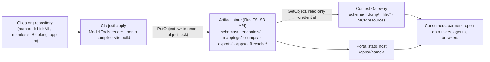

# Artifact Store

The platform has three kinds of state and gives each one home: **authored** state lives in Git (manifests, LinkML, Bloblang, app source), **runtime** state lives in PostgreSQL and the broker (preferences, sessions, entities), and **rendered** state lives in the artifact store. Rendered state is everything a machine produced from the first two and that has to be served fast, unchanged and for years: schema artifacts in every formalism, compiled mappings, RDF dumps, export bundles, app builds, cached file downloads.

## 1. Why an object store, and why RustFS

- **The gateway must not render.** Generating SHACL or an XLSX per request would put Python generators and unbounded CPU on the hot path of a component sized for thousands of requests per second. Rendering at publish time and streaming bytes keeps the gateway a byte pump with an `ETag`.
- **Immutability is the feature.** Versioned schema URLs are promises to partners (SP-13, DM-26). Object lock in compliance mode makes "published artifacts never change" a property of the storage, not a convention.
- **One store for every rendered thing.** Dumps, exports, app builds and file caches would otherwise each grow their own PVC, backup and quota story.
- **RustFS** is the default because it matches the stack rule (Rust, one static binary, small footprint), is Apache-2.0 (MinIO's community distribution ended in 2025 and its licence is AGPL), and speaks plain S3, which is all the platform uses. It is a young project; the platform therefore depends only on the core S3 subset listed in PF-30 so that Garage, SeaweedFS, Ceph RGW or a cloud bucket are a values change away (OPEN-QUESTIONS 12).

## 2. Layout and ownership

| Prefix | Written by | Read through | Immutability | Lifecycle |
|---|---|---|---|---|
| `schemas/{org}/{project}/{space}/{model}/v{n}/` | jcctl after merge (Model Tools) | `/cs/{space}/schema/`, space MCP resources | object lock | forever (retired versions stay resolvable) |
| `endpoints/{slug}/schema/v{n}/` | jcctl on model publish and on Policy change (projection per policy digest) | `/api/endpoint/{slug}/schema/`, endpoint MCP resources | object lock per digest; superseded digests deleted after grace period | follows the endpoint |
| `mappings/{org}/{project}/{name}/{rev}/` | CI (Model Tools compile) | reconciler injects into Bento | write-once | follows the Mapping |
| `dumps/{org}/{project}/{space}/{date}.nq.gz` | scheduled dump job | `/cs/{space}/dump/` | object lock | retention from space manifest |
| `exports/{org}/{project}/{rev}.zip` | jcctl export | Portal download, `import` of another instance | write-once | 30 days default |
| `apps/{org}/{project}/{app}/{sha}/` | CI (build); the digest is written to `App.status.build` (AP-13a) | Portal static host `/apps/{name}/`, the digest `status.build` names only (AP-72) | write-once | last N releases |
| `filecache/{slug}/{sha256(query)}/` | gateway (only cache writer) | `file.*` on `If-None-Match` miss | none | 24 h lifecycle rule; purgeable |

Every key starts with the owning organization (or endpoint slug, which resolves to one), so quota, audit and cascade deletion work by prefix (PF-31).

## 3. Access model

- Two credentials per organization, and no shared key: a **writer** (`jcctl`, CI) that may `PutObject` under that organization's five prefixes, and a **reader** (Context Gateway, Portal API) that may `GetObject` there. Neither may delete, neither names a resource outside its own prefixes, and the reader carries no write action at all (PF-32).
- The Portal's reconciler mints both on every sync, with the store's root credential, which no other workload holds. Each secret key is **derived** — `HMAC-SHA256(root secret, "joinedcontext/artifact-store/v1/{org}/{role}")` — rather than drawn and stored: the same organization always gets the same pair, so a credential can be re-issued or verified without keeping one anywhere, and rotating the root secret rotates every organization's credential at once. The access key is `jc-{org}-{writer|reader}`, and so is the policy attached to it.
- Readers and writers are workloads, never people: browsers, apps and agents receive bytes through gateway paths where policy, rate limits and audit apply. Pre-signed URLs are not used (PF-32).
- Network: the store is reachable only inside the mesh (Linkerd mTLS, default-deny NetworkPolicy); it has no ingress route. Port 9000 is the S3 API and the only port open on it, and three pods reach it: the Context Gateway, the Portal, and the bucket bootstrap Job of the `artifact-store` component. `jcctl` and a CI lane run outside the cluster, so the writer credential is minted for them but no route carries them to the store yet.
- The reader reaches its consumers as a Kubernetes Secret the reconciler writes into the instance's own namespace, `artifact-store-reader-{org}`, with `ACCESS_KEY_ID` and `ACCESS_SECRET_KEY`; a workload's `artifactStore.credentialsSecretRef` names it. Written with the reconciler's own field manager, so an edit in the cluster is corrected on the next sync, and derived, so a rotation of the root secret rewrites every one of them without a migration (T-0925).
- The **writer** is never written anywhere. The one process that holds the root secret re-derives it whenever `jcctl` or a build lane asks, and a key that can replace an artifact has no reason to sit in a namespace a serving pod reads (PF-32, CC-06).

## 4. Operations

- **Deployment**: core component `artifact-store` (RustFS Helm chart, single-node with a PVC by default; erasure-coded multi-node for production sizes), bucket `jc-artifacts` with versioning and object lock enabled at creation by the reconciler's bootstrap job. Values block `artifactStore: { endpoint, bucket, region, credentialsSecretRef, pathStyle }` is the only coupling.
- **Backup**: low priority (OPS-09 scope) because every object is reproducible: `jcctl artifacts rebuild --repo-dir <path> --out-dir <dir> [--space <name>] [--revision <sha>]` re-renders schemas, recompiles mappings and re-exports from Git; dumps are the exception and are mirrored to the CNPG backup bucket if retention matters.
- **Quota**: per-organization byte quota enforced by the reconciler on write (it lists the prefix size from `index.json` totals rather than walking the bucket), shown in the Portal with the other quotas.
- **Observability**: request counts, bytes and latency per prefix from the gateway; store health from the RustFS metrics endpoint; alert on object-lock policy drift.

Requirements: PF-29…PF-33, DM-43…DM-47, EP-46…EP-52. Decision record: [ADR-N-015](../Decisions/adr-n-015-artifact-store-rustfs.md).

## Related

- [ADR-N-015](../Decisions/adr-n-015-artifact-store-rustfs.md) — referenced above.
- [01-overview](../Architecture/01-overview.md) — where this chapter sits in the whole.
- [00-index](../Requirements/00-index.md) — the normative requirements behind it.
