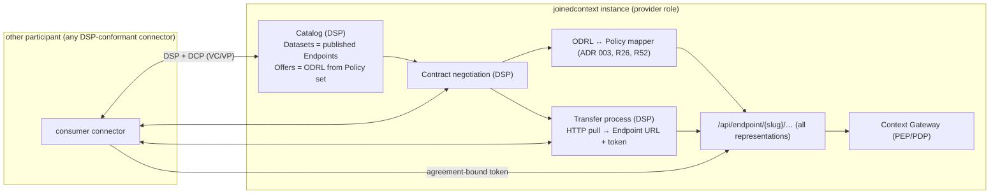

# Data Space Connector

Endpoints share data with people and systems the organisation already knows. A **data space connector** shares data with participants the organisation does not know yet: another city's twin, a national platform, a company in a Gaia-X or IDSA-style data space. The connector negotiates the contract; the Endpoint still serves the data. Nothing new touches the broker.

## 1. Where the connector sits

| Layer | Responsibility | Component |
|---|---|---|
| Identity | who the participant is: `did:web:{orgDomain}` (the same domain as the URN scheme, PF-41), Verifiable Credentials issued by Keycloak OID4VCI (I1), presented through the Decentralized Claims Protocol (DCP) | Keycloak, wallet of the organisation |
| Contract | catalog, offers, negotiation, agreements, transfer processes per the IDSA/Eclipse **Dataspace Protocol (DSP)** | connector addon `dataspace-connector` |
| Policy | translating an ODRL agreement into `Policy` entities and back | ODRL mapper in the Context Gateway (ADR 003) |
| Data | serving the data under the agreement | the Endpoint (EP-01…EP-60), unchanged |

The connector never reaches the broker, the database or a space directly. It has two outputs only: a set of `Policy` entities (through a Git change, like every other grant) and a transfer token whose audience is one Endpoint. Everything the connector can grant, the Endpoint enforces (EP-06); everything the connector cannot grant does not exist.

### Implementation

The addon is **post-MVP** and no engine is chosen (DS-06): nothing here ships a chart or a component today. The engine is picked when a data-space partner appears, and it must publish a signed image under a vendor or organisation namespace like everything else this platform pulls (DEP-08). Whatever engine is picked sits behind the same `kind: DataSpaceParticipant` manifest and must cover catalog, negotiation and transfer; the TMForum product catalog stays out, because the platform has its own catalog in the DCAT-AP records of Endpoints (EP-27). Any DSP-conformant counterpart works as the remote side.

The rest of this chapter is the design that engine has to fit: it is normative for the release that adds the connector, and describes nothing running in the MVP.

## 2. Provider role: publishing an Endpoint into a data space

1. **Participant.** The organisation declares `kind: DataSpaceParticipant` once: DID, credential issuer, trust anchors (which credential issuers and which data space authority to accept), connector base URL. Verifying `spec.domain` (PF-41) already makes `did:web:{orgDomain}` resolvable.
2. **Offer.** `kind: DataOffer` names one or more Endpoints and an ODRL offer template: permitted actions (mapped from the Endpoint's readable operations and attributes through the access surface, EP-57), constraints (purpose, geographic region, time window, attribution), duties (attribution, deletion after N days) and the price or `free`. The reconciler publishes the offer as a DSP Dataset whose DCAT-AP record is the Endpoint's own (EP-27) and whose `odrl:hasPolicy` is the offer.
3. **Negotiation.** The consumer's connector requests, the provider accepts automatically when the request equals the offer (green lane, no human), or an authorised person accepts a counter-offer in the Portal (**Data space → Requests**), or an agent proposes acceptance through the configuration MCP with elicitation (red lane, AG). Every state change is a DSP message stored as a `kind: DataAgreement` status update.
4. **Agreement → Policy.** The ODRL mapper compiles the agreement into `Policy` entities: `assignee` = the consumer's participant DID (a principal like a user or ServiceAccount), `operations` and `information` from the permission, `q`/`scopeQ`/`geoQ`/`temporalQ` from constraints, validity from the agreement period. The change lands in the org repository as a commit authored by the connector's ServiceAccount, reviewed by the lane rules of the space (CC-6x), so a contract can never widen a grant beyond what the offer allowed (MIM3-R10).
5. **Transfer.** DSP transfer type `HttpData-PULL`: the connector returns the Endpoint URL and a short-lived token bound to the agreement (audience = the Endpoint, RFC 8707, claims `agreementId`, `participant`). The consumer then uses the Endpoint like anyone else: `ngsi-ld/v1`, `ogc/features`, `sta/v1.1`, `file.*`, `mcp`, `schema/`, `access`. Push transfers are pipelines: `kind: Pipeline` with the agreement as `spec.access` and the consumer's sink as output.
6. **Audit and end.** Every gateway audit record for such a call carries `agreementId`; usage counters feed the DSP transfer status; termination or expiry of the agreement invalidates the `Policy` entities in one reconcile and the PDP cache within 5 s (OPS-45).

Because Datasets are Endpoints, "the same endpoint everyone could retrieve data from" is literally true: a public-audience Endpoint can be offered to the data space with an open ODRL offer, and participants who never negotiated anything still read it under the `public` role; negotiation only adds grants above that floor.

## 3. Consumer role: reading another participant's data

Three ways, same first step: `kind: DataAgreement` (status filled by the connector after negotiation) holding the counterpart's Endpoint URL, the agreement id and the transfer token reference in OpenBao (never in Git).

| Way | Manifest | What happens | When to use |
|---|---|---|---|
| **Live federation** | `kind: ContextSourceRegistration` with `spec.dataSpace.agreementRef` | the broker forwards queries to the peer Endpoint through the Context Gateway, which attaches the transfer token and translates through the inbound `Mapping` (DM-51); the foreign model is mirrored from the peer's `schema/` (DM-48) | fresh data, low volume, the peer is reliable |
| **Mounted endpoint** | `kind: SharedSpaceReference` with `spec.remote.agreementRef` | the peer Endpoint appears in the project like a shared endpoint from a sister project: dashboards, Apps and agents use it directly; the gateway proxies with the token | consumers inside the platform, no local copy wanted |
| **Replicate** | `kind: Pipeline` with input `dataspace: { agreementRef }` | Bento pulls or subscribes through the peer Endpoint (NGSI-LD subscriptions, `file.*` snapshots or OGC pages), applies the `Mapping`, writes local entities with local URNs minted from the injected `JC_ORG_DOMAIN` (PF-44) | history, joins, offline resilience, heavy queries |

Token lifecycle is the connector's job: it refreshes transfer tokens before expiry and writes them to OpenBao; the gateway and Bento read them by `secretRef` and never see connector credentials. When the agreement ends, the connector deletes the secret and the reconciler marks the registration, reference or pipeline `Suspended` with the reason shown in the Portal.

## 4. Trust and limits

- **No bypass.** The connector holds no broker credential and no space grant of its own; it can only open changes that create `Policy` entities from an agreement, and the lanes review them.
- **Provider wins on conflicts.** The Endpoint's own Policy set is the ceiling; an agreement narrows within it and cannot exceed it. The mapper refuses agreements that would.
- **Duties are contracts.** ODRL duties (attribution, deletion, notification) are recorded and monitored through audit, not enforced by the gateway (R54); a violated duty is a contract event, shown in the Portal and available as a DSP notification.
- **Personal data.** Offers over spaces flagged with personal data require a purpose constraint and the DPV vocabulary (MIM4); the Portal blocks publishing them to a public offer.
- **Symmetry across instances.** Two joinedcontext instances negotiate exactly like two strangers: DSP between their connectors, then Endpoints. Nothing shortcuts the contract layer because both sides happen to run the same software.

### What the gateway checks on a transfer token (DS-01, DS-02, DS-11, DS-12)

A transfer token is an ordinary realm token — the platform has one identity provider and no
second trust root — with two claims the connector adds: `agreementId` and `participant`. The
signature, the issuer and the RFC 8707 audience are checked exactly as they are for any other
caller, and then five more things, in this order:

| Check | Refused with | Why |
|---|---|---|
| `agreementId` and `participant` are both present | `401` | a token without them is not a transfer token, and the gateway does not guess which agreement it meant |
| `exp - iat` is at most 15 minutes | `401` | DS-11 is a property of the token, not of the moment it is presented; a long-lived token is refused even while it is still valid |
| the `agreementId` names a `DataAgreement` in `role: provider` and `state: finalized`, inside its validity window | `401` | DS-12: termination or expiry revokes outstanding tokens, and the table the check reads is replaced by the same reconcile that invalidates the compiled `Policy` entities |
| the agreement's `remoteParticipant` equals the token's `participant` | `401` | the token is bound to one participant; a token replayed under another agreement's participant is not that participant |
| the endpoint admits the agreement's project | `403` | the audience already binds the token to one Endpoint; this binds it to the project the agreement was negotiated in |

The caller a transfer token establishes is the **consumer's DID and nothing else**. The token is
obtained by the connector's ServiceAccount, so its `azp` names that account — and the gateway
deliberately does not resolve it: a connector holds no grants of its own (DS-01), and a subject
carrying the connector's roles would be exactly the bypass DS-02 exists to prevent. Grants come
from the `Policy` entities the ODRL mapper compiled, whose `assignee` is that DID.

Every decision made under a transfer token records the `agreementId` beside the principal in the
audit line, which is what makes per-agreement usage countable (DS-13).

---

## Related

- [04-context-spaces-and-endpoints](04-context-spaces-and-endpoints.md) — the Endpoint that does the actual serving, its access surface and DCAT-AP record.
- [11-data-models](11-data-models.md#75-mappings-across-context-spaces-and-instances-federation) — foreign models and inbound/outbound mappings used on the consumer side.
- [12-identity-and-access](12-identity-and-access.md) — did:web identity, OID4VCI credentials, ServiceAccounts.
- [../Requirements/data-space.md](../Requirements/data-space.md) — DS-01…DS-20.
- [../Requirements/access-control.md](../Requirements/access-control.md) — MIM3 marketplace requirements and the ODRL mapper (R26, R52).
- [../Decisions/adr-n-016-data-space-connector.md](../Decisions/adr-n-016-data-space-connector.md) — why the connector sits behind the Endpoint layer.
