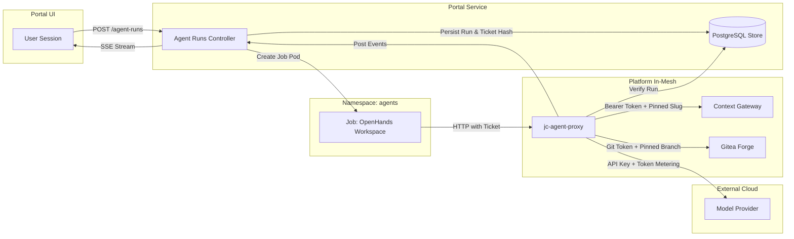
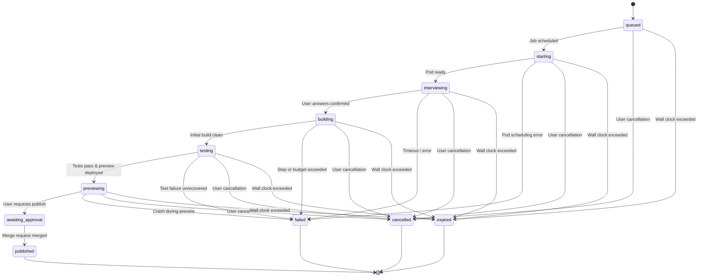

# Agent Runner and the Credential Proxy

This specification establishes the architectural execution model, process boundaries, security controls, and network mediation for autonomous application-builder agents within the joinedcontext platform.

```text
+---------------------------------------------------------------------------------------------------+
|                                AGENT RUNNER & PROXY TRUST BOUNDARY                                |
|                                                                                                   |
|  [ User in Portal UI ]                                                                            |
|        |                                                                                          |
|        v (OIDC Session / CSRF)                                                                    |
|  [ Portal Backend (axum + PostgreSQL) ]                                                           |
|        | 1. Mint Run Ticket & Store Hash (Argon2id)                                               |
|        | 2. Spawn Ephemeral Kubernetes Job                                                        |
|        v                                                                                          |
|  +---------------------------------------------------------------------------------------------+  |
|  | Namespace: agents                                                                           |  |
|  |                                                                                             |  |
|  |  [ Ephemeral Job Pod: OpenHands Runtime ]                                                    |  |
|  |  - No ServiceAccount Token Mount                                                            |  |
|  |  - No Kubernetes Secrets Mounted                                                            |  |
|  |  - Env: JC_PROXY_BASE, JC_RUN_ID, JC_RUN_TICKET                                            |  |
|  |  - Volume: emptyDir (/workspace)                                                            |  |
|  |        |                                                                                    |  |
|  |        v (HTTP + X-JC-Ticket)                                                               |  |
|  |  [ jc-agent-proxy (Rust axum Daemon) ]                                                       |  |
|  +--------|------------------------|-----------------------|----------------------|------------+  |
|           |                        |                       |                      |               |
|           | (Inject Endpoint JWT)  | (Inject Forge Token)  | (Inject Model Key)   | (Proxy Token) |
|           v                        v                       v                      v               |
|     [ Context Gateway ]       [ Gitea Forge ]         [ Model Provider ]     [ Portal Events ]    |
|     /api/endpoint/{slug}/     projects/{p}/apps/{a}/  the model provider     :9090/agent-runs/events     |
+---------------------------------------------------------------------------------------------------+
```

## 1. What Runs Where

The autonomous application builder operates across three distinct process boundaries:

1. **Portal Backend (`joinedcontext-portal`)**: Serves the user-facing generation wizard, validates declared `dataNeeds`, records run state in PostgreSQL, mints single-use run tickets, schedules workspace Jobs via the Kubernetes API, and streams real-time progress via Server-Sent Events (SSE).
2. **Agent Proxy (`jc-agent-proxy`)**: A stateless in-cluster daemon deployed in the platform namespace. It authenticates workspace requests using the run ticket hash, checks run status with the Portal, validates path constraints, enforces rate, step and token budgets, and injects platform credentials into outbound requests. One step is one model call: the proxy counts them per run against the profile's `stepsPerRun` and answers `429` once the run has spent them, so a run stops at the step limit however it loops (AG-25, AG-51).
3. **Workspace Job (`agent-run-{id}`)**: A single-pod Kubernetes Job executing in an isolated `agents` namespace. It runs the OpenHands agent software runtime, executes build tools (`cargo`, `pnpm`, `git`, `playwright`), and reaches the outside world exclusively through `jc-agent-proxy`.

### 1.1 How the Portal drives the runtime

The pod runs the upstream `openhands-agent-server` image unchanged, digest pinned, listening on port 8000. The platform adds no Python of its own: the agent server is an HTTP and WebSocket API, and the Portal is its only client (AP-23 keeps the platform on Rust and TypeScript; the runtime is third-party software like Keycloak).

- The Portal creates the conversation over that API and passes the agent settings: the LLM `base_url` is `${JC_PROXY_BASE}/v1/llm` with a placeholder key, and the MCP server is `${JC_PROXY_BASE}/v1/data/mcp`. Neither carries a credential, so the model key and the endpoint token stay in the proxy.
- The Portal subscribes to the agent server's event stream and writes each event into `agent_run_events`, which is what the browser reads over SSE. The workspace therefore never needs to reach the Portal.
- A question the agent asks is an event; the user's answer goes back as a message on the same conversation.
- A `navigate` event moves the Portal itself (UI-45): the agent names a route inside the Portal and, optionally, the values to prefill in the form that page opens. The Portal validates the route before it is stored (a path, nothing else), the browser follows it without reloading, and a banner says the assistant did it. The person still submits the form; the agent never proposes a change through this door.
- The agent server's own session key (`OH_SESSION_API_KEYS_0`) is generated per run. It protects the workspace from anything else in the cluster and is not a platform credential: it grants nothing outside that one pod, and it dies with it.
- Kubernetes objects follow from that: the workspace pod accepts ingress from the Portal on 8000 and nothing else, and its egress stays limited to the proxy and DNS (AG-34).
- `/v1/runs/events` on the proxy stays the path for events the **proxy itself** raises, `usage` above all, which is where the per-run token accounting of AG-41 comes from.



### 1.2 The kit pass: a static application in one model call

The kit pass is being retired ([ADR-N-022](../Decisions/adr-n-022-generated-applications-are-code-on-the-app-sdk.md)): a `static` application becomes code the model writes against the App SDK, built by the first run and the editing agent of [20-app-sdk §4](20-app-sdk.md#4-the-first-run-and-the-editing-agent). This section describes the pass that serves runs until the SDK first run reaches a preview on dev.

A `static` application does not start a workspace at all. The Portal is the builder: it makes one model call through `jc-agent-proxy` with the run's own ticket, applies what comes back to a prebuilt application, and the preview is on screen within a minute (AP-56, AP-57, AG-53). Everything else about the run (the record, the ticket, the event stream, the conversation, the publish) is the same as for a workspace run.

**The kit.** A React bundle built once with the Portal and shipped inside its image (`kit/` in the Portal repository). It renders one file, `spec.json`: a title, the entity types and attributes it reads, the filters, and the views (stat tiles, a map, a table, charts, an entity detail, a form). The kit declares its capabilities in `kit.json` (`capabilities` block), and the pass hands this block to the model with the pack (AP-58, AP-65). In-browser export artifacts (PDF, CSV, GeoJSON, PNG) are produced directly from rendered rows without external network requests (AP-66). Basemap tiles and styles route through the Portal's basemap proxy rather than external servers (AP-67). The bundle fetches its data from `/api/endpoint/{slug}/ngsi-ld/v1/entities` with `options=keyValues` and nothing else, so the host allow-list of AP-49 holds by construction. The model writes the specification; the kit's views are what a browser runs, unless the model wrote a page of its own (next paragraph), which reaches a browser only inside the sandboxed frame and under the page policy (AG-54).

**The page.** The views cover a dashboard; they do not cover a 3D scene, a bespoke chart or a free layout. When the ask needs one, the model writes a second editable file, `index.html`, a complete page with inline script and style that replaces the kit's rendering while `spec.json` keeps declaring the rows it gets. The Portal serves it with the rows in front (`window.kit = {slug, spec, data}`) and a page policy: inline script, libraries from three named CDN hosts (`cdn.jsdelivr.net`, `cdnjs.cloudflare.com`, `unpkg.com`), the basemap host, the platform origin, nothing else; still one document in the sandboxed frame (AP-50), still validated only as far as the specification beside it (AG-54). An empty `index.html` hands the rendering back to the views.

**The pack.** The Portal assembles the model's context on its own: the specification's JSON Schema, the kit's editable files as they stand, the run's `dataNeeds`, the endpoint's JSON Schema and five entities per type read through the proxy's data route, the person's prompt and every instruction sent since. The pack is the same for every run of one endpoint except the prompt and the samples, which is what makes the provider's prompt cache pay for the pass.

**The format.** The model answers with SEARCH/REPLACE blocks in the one-shot format the platform's own code generation uses: a path line, `<<<<<<< SEARCH`, the lines to find, `=======`, the replacement, `>>>>>>> REPLACE`; an empty SEARCH creates or rewrites the file, a `@@QZXJK@@` line splits a long region into a start and an end anchor. The Portal applies them with the same rules: exact match first, whitespace-fuzzy second, an ambiguous match refused, a block addressed to a path outside the run's editable files refused and reported as a `tool` event (AP-58). Prose outside the blocks is the assistant's turn of the conversation.

**The passes.** The first call writes `spec.json`. A specification the kit cannot render (an attribute the data needs do not carry, a view the kit does not have, malformed JSON) goes back to the model once with the validation errors; a second failure ends the pass with those errors on the conversation (AP-59). Every instruction a person sends afterwards is one more call over the current files, and the frame reloads with the result (AP-60). A call whose blocks change no file is an answer in the conversation: nothing is stored or committed and the frame keeps its version. The output of one call is capped at the profile's step budget in tokens; the design keeps a pass under a few thousand output tokens because the kit already holds the code.

**The form.** A `form` view is the kit's `<EntityForm>` over one source: its inputs come from the endpoint's JSON Schema in the pack, so the model declares which attributes a person edits and the schema decides what each input is (AP-61). A save is a write through the app's endpoint (AP-62); in the preview it travels as a message to the Portal page that framed it, which writes into the sandbox space with the reviewer's session (AP-63, [16-apps-on-demand.md §8](16-apps-on-demand.md#8-forms-that-write-through-the-endpoint)). A prompt that asks to edit, update or manage entities is answered with a `table` and a `form` on the same source, so a row picked in one opens in the other.

**The preview document.** `GET /api/v1/projects/{project}/agent-runs/{id}/preview` answers one HTML document: the kit's script and stylesheet inlined, the run's `spec.json` inlined as data, served with the application CSP whose `connect-src` is the platform origin and the basemap tiles. It is framed with `sandbox="allow-scripts"` and no `allow-same-origin` (AP-50), which is why it is one document with no further assets to fetch: a sandboxed frame has no session to fetch them with.

**What a `fullstack` run does instead.** It schedules the workspace Job of §1.1 and the OpenHands runtime builds the application there. The kit pass is the fast path for the dashboards a `static` application is; a backend needs the workspace.

## 2. The Run Lifecycle

An agent run advances through a deterministic, strictly monotonic state machine. State transitions are coordinated by the Portal backend based on proxy events and job health:



| Lifecycle State | Managed By | User Experience in Portal | Termination Condition |
|---|---|---|---|
| `queued` | Portal | "Initializing builder run..." | Portal job scheduler admits run. |
| `starting` | Portal | "Allocating isolated workspace..." | Pod container transitions to Ready. |
| `interviewing` | Workspace / Portal | Interactive questionnaire displayed in conversation feed. | All required form questions answered or defaults applied. |
| `building` | Workspace | Real-time thoughts, tool invocations, and file delta tree. | Code generated, clean `cargo check` and `pnpm build`. |
| `testing` | Workspace | Test execution progress (`cargo test`, `vitest`, `playwright`). | All test suites pass or step limit reached. |
| `previewing` | Portal / APISIX | Sandboxed preview iframe live under `/apps/{name}/`. | User clicks "Publish Application" or cancels run. |
| `awaiting_approval`| Gitea / Portal | Pending merge request banner with visual diff. | Approver merges pull request. |
| `published` | Reconciler | Application listed as Live in catalog. | Terminal successful state. |
| `failed` | Portal | Error description and last diagnostic log excerpt. | Terminal error state. |
| `cancelled` | User / Portal | "Run cancelled by user." | Terminal cancelled state. |
| `expired` | Portal | "Run exceeded maximum wall-clock limit." | Terminal timeout state. Reaped by Portal background loop on its own schedule (AG-66). |

The `expired` state is enforced by the Portal's automated background reaper loop (AG-66). If a run exceeds its wall-clock limit (`expires_at`), the reaper transitions the run to `expired`, halts the Kubernetes Job pod, invalidates the run ticket hash (identical to cancellation AG-52), and records the expiration reason on the associated draft `App` manifest. The reaper operates strictly on its own internal schedule and is never dependent on user page visits. Unattended runs (`unattended: true`) skip the `interviewing` state and transition directly from `starting` to `building` (or execute their kit pass without interactive questions), resolving ambiguities autonomously without human prompts. Where an interactive question would normally be raised, an unattended run decides on its own, records the assumption as a `thought` event, and continues execution.

## 3. The Interview

Before code generation commences, the agent can clarify architectural choices by submitting a structured question event:

1. The workspace sends `POST /v1/runs/events` containing `kind: "question"` and a valid **JSON Schema draft-07** definition in `payload.schema`.
2. The proxy validates the payload and forwards the event to the Portal.
3. The Portal transitions the run state to `interviewing` and renders an interactive form inside the conversation panel using the standard `@rjsf/core` stack.
4. The user completes the form and clicks "Submit Answer", issuing `POST /api/v1/projects/{project}/agent-runs/{id}/answers`.
5. The Portal appends an `answer` event to the run log. The workspace retrieves this answer via long-polling on the proxy.
6. If a question is marked `required: false` and the user does not respond within the configured timeout (default: 300 seconds), the agent proceeds using the schema's declared defaults.

## 4. The Proxy Surface

The `jc-agent-proxy` daemon exposes a strictly scoped REST API on port 8080 within the cluster. It validates every request against the authenticated run record:

| Route | Method | Target Destination | Credential Injected | Rejection Criteria |
|---|---|---|---|---|
| `/v1/llm/{*rest}` | `POST` | Configured Model Provider (e.g., Anthropic, OpenAI) | Provider API Key (via `secretRef`) | Body exceeding size limit (4 MiB); cumulative token budget exhausted; the model call past `AgentProfile.spec.limits.stepsPerRun` (AG-25, AG-51); path not matching chat/completions/messages. |
| `/v1/data/{*rest}` | `GET`, `POST` | `http://context-gateway/api/endpoint/{run.slug}/{rest}` | Scoped Keycloak JWT (`aud: {run.slug}`) | Path traversal (`..`); write methods (`POST`, `PATCH`, `PUT`, `DELETE`) on read-only runs; client-supplied `NGSILD-Tenant` or slug headers. |
| `/v1/data/endpoints/{slug}/{*rest}` | `GET`, `POST` | `http://context-gateway/api/endpoint/{slug}/{rest}` | Scoped Keycloak JWT (`aud: {slug}`) | A `slug` outside the run context's `endpointSlugs` (every endpoint of the run, the primary first, AP-44); otherwise the rules of `/v1/data/{*rest}`. |
| `/v1/data/mcp` | `POST` | `http://context-gateway/api/endpoint/{run.slug}/mcp` | Scoped Keycloak JWT (`aud: {run.slug}`) | Requests invoking mutation tools (`upsert_entity`, `create_subscription`) without declared write rights. |
| `/v1/forge/{*rest}` | `GET`, `POST`, `PUT` | In-Cluster Gitea API | Gitea Forge Token (via `secretRef`) | Branch not matching `agent/app-{name}/{runId}`; file path outside `projects/{project}/apps/{name}/`; direct writes to default branch. |
| `/v1/packages/{host}/{*rest}` | `GET` | Upstream Package Registries (e.g., `crates.io`, `npmjs.org`) | None | Host not present in profile allow-list; non-HTTPS protocols; response payloads exceeding 50 MiB. |
| `/v1/fetch?url={url}` | `GET` | Upstream documentation or package URL | None | Host not in `AgentProfile.spec.egress.allowedHosts`; redirects outside the allow-list; payload exceeding `limits.maxResponseBytes`; non-text content type; cumulative `egress.maxBytesPerRun` spent; URL with userinfo or a credential-looking query parameter. |
| `/v1/mcp` | `POST` | `http://portal-internal:9090/internal/agent-runs/{run}/mcp` (the Portal internal listener, not routed at the edge) | Proxy Service Account Bearer Token | An operation the run's `AgentProfile` does not name (AG-70); approving or rejecting a change, on any profile (AG-11); starting, cancelling or publishing another run, answering the question a run asked its person (AG-45), and minting, rotating or revoking a service account's key, all on any profile (AG-11); bringing a workspace back or throwing one away (AG-82); a run that has ended. The Portal runs the call as the person who started the run, narrowed by the profile, so a profile never widens anyone. |
| `/v1/runs/events` | `POST` | `http://portal-internal:9090/agent-runs/events` (the Portal internal listener, not routed at the edge) | Proxy Service Account Bearer Token | Event payload exceeding 64 KiB; event rate above the run profile's `limits.requestsPerMinute`, which every AgentProfile declares; ticket/run mismatch. |
| `/v1/diagnostics/{component}/{id}` | `GET` | `http://portal-internal:9090/agent-runs/{run}/diagnostics/{component}/{id}` | Proxy Service Account Bearer Token | Component other than `pipeline` or `change`; an id that is not a name; a resource outside the run's project (the Portal answers `404`). The body is redacted (AG-56) before the workspace sees it (AG-57). |
| `/*` | Any | None | None | Returns `403 Forbidden` (`application/problem+json`). |

### 4.1 Egress Allow-List for Builder Runs (AG-65)

The `builder` profile may require external documentation or registry metadata during autonomous build cycles. External HTTP access is mediated exclusively via `/v1/fetch?url=` on `jc-agent-proxy` (AG-65). The proxy strictly enforces:

- Scheme is HTTPS only; plain HTTP is rejected.
- Target host must match an entry in `AgentProfile.spec.egress.allowedHosts` exactly. Wildcard patterns are not permitted, and a host carrying a scheme, a port or a path is refused when the profile is validated.
- HTTP redirects are followed only if the target host is also on the allow-list.
- Payloads are restricted to text, JSON, and markdown content types up to a per-response cap.
- Cumulative egress volume is tracked against `egress.maxBytesPerRun`, an optional field that defaults to 16 MiB for a profile that names hosts and is meaningless for one that names none. When exhausted, the proxy answers HTTP 429 with an RFC 7807 problem document. The remaining byte allowance is returned in the `X-JC-Egress-Remaining` header of every fetch, so the agent can see the budget shrink rather than discover it at zero.
- The outbound request is built from the URL alone: no inbound header is forwarded, so `Authorization`, cookies and the run ticket cannot reach the upstream even by mistake. A URL carrying userinfo (`user:pass@host`) or a query parameter whose name reads like a credential (`token`, `api_key`, `access_token`, `secret`, `password`, `signature`) is refused with HTTP 400 rather than sent.
- Every fetch emits an audit log line containing run ID, agent identity, target host, HTTP status, byte count, and elapsed duration.
- Profiles lacking an `egress` block have zero external network reachability. What the agent reads during build time never becomes a runtime dependency of the application (AP-49, enforced by CI publish scans).

## 5. What the Workspace Can and Cannot Do

Security boundaries are enforced through layered infrastructure primitives:

- **No Kubernetes API Access**: The Job pod explicitly sets `automountServiceAccountToken: false`. No API tokens or CA bundles exist in the container.
- **No Direct Network Egress**: Egress NetworkPolicies block all outbound TCP/UDP traffic from `agents` pods, allowing connections only to `jc-agent-proxy` on port 8080 and `kube-dns` on port 53. Direct connections to the Internet, Context Gateway, or Gitea fail immediately at the socket level.
- **Read-Only Root Filesystem**: The container runs with `readOnlyRootFilesystem: true`. The only writable storage is an ephemeral `emptyDir` volume mounted at `/workspace`.
- **Dropped Capabilities**: All POSIX capabilities are dropped (`drop: ["ALL"]`), privilege escalation is disabled (`allowPrivilegeEscalation: false`), and `runAsNonRoot: true` is enforced.
- **No Secret Mounts**: Kubernetes Secret objects are never mounted into workspace pods. All secrets remain strictly within `jc-agent-proxy` and the Portal.

## 6. Limits and Cost Governance

Every execution is governed by structural resource and financial boundaries declared in the governing `AgentProfile`:

- **Step Limit**: Maximum reasoning-action cycles per run (default: 120 steps).
- **Wall-Clock Timeout**: Maximum total duration for job execution (default: 20 minutes, maximum: 60 minutes).
- **Concurrency Cap**: Maximum active runs per organization (default: 2 concurrent runs).
- **Model Token Budget**: Hard limit on input and output tokens consumed across all LLM requests (default: 2,000,000 tokens).
- **Response Size Cap**: Maximum payload size for individual package or HTTP downloads (default: 8 MiB).
- **Rate Limit**: Maximum proxy requests per minute per run (default: 240 requests/min).

## 7. Attribution and Audit

Every operation executed by the builder is recorded within the immutable platform audit trail:

- **Structured Proxy Logs**: Every proxied call produces a JSON audit record capturing timestamp, `runId`, `agentIdentity`, `initiatingUser`, upstream service, HTTP method, sanitized path, status code, response bytes, and duration.
- **Git Commit Attribution**: Commits generated by the agent set author to `agent:app-builder@{org}` and include a `Co-Proposed-By: User Name <email>` Git trailer identifying the initiating user (AG-17, AG-18).
- **Redaction Guarantees**: Model prompts, generated code content, and authorization headers are scrubbed from operational logs.
- **The Action Inspector**: every `tool` event the run emits is one expandable step in the conversation, with its input, its output or error, its duration and its diff (AG-56, OPS-50), so what the assistant did is read in the Portal, not in a log; a failed step is sent back into the run with one click.

## 8. Prompt Injection Defense

Sensor feeds and external digital twin datasets are treated as untrusted input vectors:

1. **System Prompt Framing**: The OpenHands system prompt instructs the model to treat all context entity attributes and query results strictly as passive text literals.
2. **Deterministic Proxy Gates**: Even if an injected payload commands the model to exfiltrate keys, the agent cannot access raw credentials or contact arbitrary IP addresses.
3. **Immutability of Declared Scope**: The agent cannot widen its data access or target new context spaces because its permissions are anchored to the pre-confirmed `dataNeeds` recorded in the Portal database.

## 9. What is Deliberately Not Offered

- No agent-initiated modification of `Policy`, `ScopeDefinition`, or security rules.
- No direct commit access to default Git branches (`main`, `master`).
- No shell execution outside the sandboxed workspace pod.
- No unauthenticated or public exposure of generated applications.
- No model provider bypass around the token-metering proxy.

## 10. Conversations and Unattended Work

The platform supports both interactive conversations and unattended background work runs across four distinct run kinds:

| Kind | Initiator | Interviewing Phase | Terminal Outcome | What is Published |
|---|---|---|---|---|
| `conversation` | User via assistant panel or API | No (continuous conversational turns) | Terminal state or idle completion | None (may trigger work runs or UI navigation) |
| `application` | User via wizard or Assistant page | Optional (`unattended: false` interviews; `unattended: true` skips) | `awaitingApproval` with live application preview | `kind: App` manifest via change flow |
| `dashboard` | User via Assistant page or API | Skipped (`unattended: true`) | `awaitingApproval` with kit preview | `kind: Dashboard` manifest via change flow |
| `analysis` | User via Assistant page or API | Skipped (`unattended: true`) | `awaitingApproval` with kit preview and `report.md` | None (never published; client-side kit export) |

### 10.1 Interactive Conversations

A conversation run (`kind: "conversation"`) provides an open-ended dialogue interface without requiring an initial application name, target endpoint, Git branch, or preview iframe (UI-53, AG-67). Initiated via `POST /api/v1/projects/{project}/assistant/conversations`, the run receives user instructions and responds either in explanatory prose or by invoking registered operations from the central operation registry (AG-59, AG-64).

Every turn, including the initial prompt, is executed through this tool registry (such as `jc_catalog_search`, endpoint proposal drafts, KPI computations, or context space schema completion). If a conversation leads to generating an application or a dashboard, the assistant initiates a dedicated work run (AG-69) or navigates the user directly to the relevant creation form; it does not execute dashboard synthesis within the conversation run itself. Initiating a conversation requires the caller to possess the permission to use the assistant in the project (the `propose` verb on `kind: App`). The assistant panel also surfaces the caller's three most recent active conversations in the project to support resuming work.

### 10.2 Continuing Ended Conversations

Conversation runs remain subject to the platform lease duration and reaper lifecycle (AG-66). Once a conversation reaches a terminal state (`cancelled`, `expired`, or `failed`), attempting to post new messages to that run ID is rejected with `409 Conflict`.

To continue an ended conversation, the client starts a new conversation run specifying `continues: <runId>` referencing an earlier conversation the caller is permitted to read (AG-68). The Portal loads the prior conversation transcript (user prompts, assistant responses, and structured tool results, retaining the newest items if the total transcript exceeds the profile token budget) and prepends it to the model context. In the Portal UI, both runs are linked by the `continues` reference and displayed as a single coherent conversation thread.

### 10.3 Unattended Work Runs

Work runs (`kind` of `application`, `dashboard`, or `analysis`) execute automated development and analytical tasks without requiring step-by-step supervision (UI-55, AG-69). Standard run creation accepts an optional `unattended: boolean` parameter, which defaults to `false` for applications and is mandatory `true` for dashboard and analysis tasks:

- **Application (`kind: "application"`):** When `unattended: true` is set, the run skips the interactive questionnaire phase. If architectural choices arise, the agent selects sensible defaults, logs the assumption as a `thought` event, produces a functional application preview, and concludes in `awaitingApproval`. Publication transitions the draft `App` manifest into Git via pull request (AP-20).
- **Dashboard (`kind: "dashboard"`):** Always unattended (`unattended: true`). The agent inspects available context space endpoints, derives layer configurations, and generates a kit specification. It concludes in `awaitingApproval` with an interactive kit preview and submits a `kind: Dashboard` manifest to the GitOps change queue.
- **Analysis (`kind: "analysis"`):** Always unattended (`unattended: true`). The agent queries live context space data, computes statistical aggregations, and renders a kit dashboard accompanied by an in-depth markdown summary (`report.md`) preserved directly on the run record. Analysis runs are never published to Git manifests; their findings and visualizations are exported client-side via in-browser export artifacts (AP-66).

All work runs strictly enforce profile token allowances, wall-clock timeouts, rate caps, and egress proxy allow-lists (AG-41, AG-65).

## Related

- [16-apps-on-demand.md](16-apps-on-demand.md) — Apps on Demand lifecycle and least-privilege data access.
- [07-agents-and-mcp.md](07-agents-and-mcp.md) — Model Context Protocol dual surfaces and agent governance.
- [04-agent-runs.md](../API/04-agent-runs.md) — REST API specification for agent runs and streaming events.
- [adr-n-020-agent-runner-and-credential-proxy.md](../Decisions/adr-n-020-agent-runner-and-credential-proxy.md) — architectural decision record establishing the runner and proxy.
