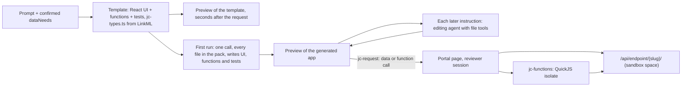

# App SDK

This chapter describes `@joinedcontext/sdk`, the TypeScript package every generated application is written against; the template application a generation run starts from (a working React interface, serverless JavaScript functions and their tests); the runtime that executes those functions; the one-shot first run and the editing agent that follow; and the preview that shows the result. Read it after [16-apps-on-demand](16-apps-on-demand.md), which says what an application is, and [19-agent-runner](19-agent-runner.md), which says how a run is driven. The decision behind it is [ADR-N-022](../Decisions/adr-n-022-generated-applications-are-code-on-the-app-sdk.md).



## 1. What the SDK is

One package, `@joinedcontext/sdk`, in `joinedcontext-portal/sdk/`, versioned with the Portal and embedded in its image. It is the only way a generated application reaches data, identity, functions and permissions (SDK-01), and it carries what the screens stand on: formatters, the schema's form fields, design tokens and chart themes, the basemap and the map worker, exports. The screens themselves (shell, tables, maps, charts, filters, forms) are not in the package. They are source files of the template (§2), so the model changes a table's columns or a chart's series the way it changes any other file (SDK-08).

Its reference is `sdk/API.md`: every export with its signature and one line on what it is for. The same file and the SDK's type declarations go into the model's pack, so the model and a person read one description (SDK-09).

| Entry point | Exports |
|---|---|
| `@joinedcontext/sdk` (browser) | `jc()`, the client of the application's endpoint: `entities.list`, `entities.all`, `entities.get`, `entities.create`, `entities.update`, `entities.remove`, `temporal.list`, `schema()`, `access()`, `me()`, `entityId(type, localId)`, `functions.call(name, body)`; `ProblemError`; `startApp`; hooks `useEntities`, `useEntity`, `useSave`, `useSchema`, `useAccess`, `useMe`, `useFilters`, `useFunction`; tokens `applyTokens`, `currentTokens`, `echartsTheme`, `rechartsPalette`, `mapColors`; helpers `format`, `columnKind`, `pointOf`, `aggregate`, `groupBy`, `distinct`, `extent`, `filterRows`, `compare`, `fieldOf`, `toFeatureCollection`; map `styleFor`, `mapWorkerReady`; exports `toCsv`, `toGeoJson`, `toPdf`, `toPng`, `download`; `reportError` |
| `@joinedcontext/sdk/server` (functions) | the types `FnRequest`, `FnResponse`, `FnContext`; `ctx.jc` is the same data client as `jc()` minus `functions`, bound to the caller's token |
| `@joinedcontext/sdk/testing` | `stubTransport(routes)` for interface tests, `fakeContext({entities, user})` for function tests |
| `@joinedcontext/sdk/style.css` | the base of the page over the CSS variables derived from `design-tokens.json`, and MapLibre's stylesheet |
| `echarts`, `recharts` | bundled chart libraries: the template's chart cards are ECharts (canvas, large time series, heatmaps, gauges, calendars), Recharts is there for simple React charts |
| `maplibre-gl`, `@deck.gl/core`, `@deck.gl/layers`, `@deck.gl/aggregation-layers`, `@deck.gl/mapbox` | bundled map libraries (ADR-N-011): the template's `EntityMap` is MapLibre, with a deck.gl overlay for 50 000 features and more or for hexbin and grid aggregation |

### 1.1 The data client

The client knows the application's endpoints and never takes a host, a slug or a token from application code (SDK-02). Most applications read one. One that reads, say, `transportation` and `transportation-kpis` gets both in the served configuration (`endpoints: [{name, slug, space, types}]`, the first one the primary): every call takes an optional `{ endpoint: name }`, a type served by exactly one of them goes there without it, a type served by both is refused until the call names one, and `create`, `update` and `remove` pick the endpoint of the entity's type (the id's space for an id). `schema()` merges the schemas of every endpoint and `access(name?)` answers one endpoint's grant document, the primary's by default. It reads entity lists in `keyValues` form and flattens each entity into a row: `id`, `type`, one value per attribute, a GeoProperty as a GeoJSON geometry, a DateTime as its ISO string, a LanguageProperty as the text in the document's language, a Relationship as its URN (SDK-03). `entities.all` pages through the endpoint up to the caller's limit, at most 5 000 rows.

A write is `create`, `update` (a patch of attributes, each sent as an NGSI-LD Property) or `remove`, through the same endpoint. `create` with a local id mints `urn:ngsi-ld:{Type}:{orgDomain}:{space}:{localId}` from the configuration the Portal served (SDK-05). A refusal is a `ProblemError`; the hooks hand it to the component, and the template's `EntityForm` shows its `detail` beside the inputs and reloads nothing (SDK-04).

`useAccess()` reads the endpoint's effective grant document (EP-55) once and answers `can(operation, type, attr)` with a reason, so a generated button is disabled with that reason instead of failing on click (SDK-07).

### 1.2 Transports

The application never picks how its requests travel; the document the Portal serves says so (SDK-06).

| Where the application runs | Data requests | Function calls |
|---|---|---|
| Published, `/apps/{name}/` | `fetch` on the same origin with the platform session cookie and the CSRF header | `POST /apps/{name}/api/functions/{fn}` on the same origin |
| The sandboxed preview of a run | `postMessage` of `{kind: "jc-request", id, method, path, body}` to the framing page, answered by `{kind: "jc-response", id, status, body}` | the same message with `path: "/functions/{fn}"` |

## 2. The template application

A run does not start from an empty folder. It starts from `joinedcontext-portal/sdk/template/`, a complete application that works for any endpoint from its schema alone, with its tests passing (SDK-19). Every path below is inside the generated application, which is that template copied — read them there:

```text
apps/{name}/
  app.yaml                    # kind: App, written at publication
  PROMPT.md                   # the request (AP-03)
  package.json                # react, react-dom, echarts, recharts, maplibre-gl, deck.gl, @joinedcontext/sdk pinned; vitest
  index.html                  # the page shell, not writable by the model
  tsconfig.json               # the project's TypeScript configuration, not writable
  vite.config.ts              # the build, not writable
  test-setup.ts               # what vitest loads before a test file
  src/
    main.tsx                  # mounts <App/> inside the SDK provider, not writable
    jc-types.ts               # rendered from the endpoint's LinkML, not writable
    App.tsx                   # AppShell and the list of pages
    components/               # the screens' building blocks, ordinary files the model may change:
                              #   AppShell, states (Problem, Loading, Empty, ErrorBoundary), StatTiles,
                              #   EntityTable, EntityDetail, filters (FilterBar, SearchBox, SelectFilter,
                              #   RangeFilter, DateRangeFilter), EntityForm, ExportButton, charts
                              #   (ChartCard, BarChartCard, LineChartCard, PieChartCard, TimeSeriesCard),
                              #   EntityMap, components.css, and a test beside each
    pages/Overview.tsx        # stat tiles and a chart card per entity type
    pages/TypePage.tsx        # one type: filter bar, table, map, chart, detail, edit form when writes are granted
    pages/TypePage.test.tsx   # renders against stubTransport
    pages/shape.ts            # what a page needs from one type's schema: its attributes, its geometry, its label, its filters
    design-tokens.json        # colours, typography, spacing, radii, chart palette, map colours; change it and the whole app re-themes
    app.css                   # the application's own styles over the token variables
  functions/
    summary.ts                # example: counts and averages per type, computed server-side
    summary.test.ts           # runs the function against fakeContext
```

The components are the kit's views, form and exports as they were in the package, now copied into every application like shadcn components: they import the data client, formatters, tokens, map plumbing and exports from `@joinedcontext/sdk` and nothing else from the platform, and a run that needs a different table edits `components/EntityTable.tsx` rather than working around it.

Out of the box the template shows an overview and one page per entity type the endpoint publishes, with filters, table, map, a chart and, where the data needs grant a write, an edit form; its `summary` function answers from the server. The Portal previews it the moment the run starts, before any model answers (SDK-15). A generated application is the template with files changed or added: a page named after the person's question, a function that joins two types, a form with the fields a steward edits, and the tests for each.

**Design tokens.** `src/design-tokens.json` is the one place the look lives. At start the SDK turns it into CSS variables (`--jc-color-accent`, `--jc-font-body`, `--jc-space-2`, …), registers an ECharts theme and a Recharts palette from its chart colours, and hands the map its point and layer colours, so a person or the model re-themes the whole application by editing one file (SDK-25). When the installation has branding configured, the Portal seeds the file from it at the start of the run.

**Types from LinkML.** `jc-types.ts` is rendered by Model Tools ([11-data-models](11-data-models.md)) with LinkML's `gen-typescript` from the endpoint's projected `schema/v{n}/model.linkml.yaml`, so it names exactly the classes and slots the endpoint publishes. Model Tools keeps LinkML's `TypescriptGenerator` for loading and naming and replaces its range mapping with the row shape of §1.1: a GeoProperty slot is a GeoJSON geometry, a LanguageProperty, a DateTime and a Relationship are strings, a list and an inline object are the text the SDK flattens them to, an enum is a union of string literals, a slot the model does not require is optional and nullable, an open-world class also accepts any other attribute, and every entity type carries `id` and a literal `type` (SDK-10). The file declares object type aliases and no runtime code: an alias, unlike an interface, is assignable to the SDK's `Row`, and interface code and functions import it with `import type`.

**What the model may write.** `src/**/*.tsx`, `src/**/*.ts`, `src/**/*.css`, `src/design-tokens.json` and `functions/**/*.ts`, except `src/main.tsx` and `src/jc-types.ts`, at most 80 files and 800 KB (SDK-11). Interface code imports relative files, `react`, `react-dom/client`, `react/jsx-runtime`, `echarts`, `recharts`, `maplibre-gl`, the four `@deck.gl/*` packages of §1 and `@joinedcontext/sdk`; functions import relative files under `functions/` and `@joinedcontext/sdk/server`; tests may also import `vitest`, `@testing-library/react` and `@joinedcontext/sdk/testing`; type-only imports are erased and allowed anywhere in the project. The Portal refuses any other import before a preview exists (SDK-12).

A page the first run adds for "stations with their latest values and a note a steward can change" comes out close to this:

```tsx
import { useAccess, useEntities, useFilters, useFunction } from "@joinedcontext/sdk";
import { useState } from "react";
import { EntityForm } from "../components/EntityForm";
import { EntityMap } from "../components/EntityMap";
import { EntityTable } from "../components/EntityTable";
import { FilterBar, SearchBox } from "../components/filters";
import { Problem } from "../components/states";
import { StatTiles } from "../components/StatTiles";
import type { AirQualityObserved } from "../jc-types";

export default function Stations() {
  const { rows, error } = useEntities<AirQualityObserved>("AirQualityObserved", { attrs: ["name", "pm10", "location", "stewardNote"] });
  const { shown, bind } = useFilters(rows, [{ kind: "search", attrs: ["name"] }]);
  const worst = useFunction<{ name: string; pm10: number }[]>("worst-stations", { top: 3 });
  const [picked, setPicked] = useState<string | null>(null);
  const edit = useAccess().can("updateAttrs", "AirQualityObserved", "stewardNote");
  return (
    <>
      <Problem error={error ?? worst.error} />
      <StatTiles items={[{ label: "Stations", value: shown.length }, { label: "Worst now", value: worst.data?.[0]?.name ?? null }]} />
      <FilterBar><SearchBox {...bind(0)} placeholder="Station" /></FilterBar>
      <EntityMap rows={shown} label="name" color="pm10" onSelect={setPicked} selectedId={picked} />
      <EntityTable rows={shown} columns={["name", "pm10", "stewardNote"]} onSelect={setPicked} />
      {picked && <EntityForm type="AirQualityObserved" id={picked} fields={["stewardNote"]} disabled={!edit.ok} reason={edit.reason} />}
    </>
  );
}
```

and the function beside it:

```ts
import type { FnContext, FnRequest, FnResponse } from "@joinedcontext/sdk/server";
import type { AirQualityObserved } from "../src/jc-types";

export default async function worstStations(request: FnRequest, ctx: FnContext): Promise<FnResponse> {
  const top = Math.min(Number(request.body?.top ?? 3), 20);
  const rows = await ctx.jc.entities.all<AirQualityObserved>("AirQualityObserved", { attrs: ["name", "pm10"] });
  const worst = rows.filter((row) => typeof row.pm10 === "number").sort((a, b) => b.pm10! - a.pm10!).slice(0, top);
  return { body: worst.map((row) => ({ name: row.name, pm10: row.pm10 })) };
}
```

## 3. Functions and their runtime

A function is one file `functions/{name}.ts` (`name` matches `[a-z][a-z0-9-]{0,39}`) whose default export takes an `FnRequest` (`method`, `query`, JSON `body`, `user`) and an `FnContext` (`jc`, `log`) and returns an `FnResponse` (`status`, JSON `body`). The signature is plain TypeScript with no runtime-specific API, so the same file runs in vitest against `fakeContext` and in the platform runtime (SDK-21).

**The runtime.** `jc-functions` is a Rust service that embeds the QuickJS engine. It holds no credential, no database connection and no application code of its own: every invocation carries the function's transpiled source, the request and the caller's token, and gets a fresh engine context that is thrown away afterwards (SDK-22).

| Limit | Value |
|---|---|
| Memory per invocation | 64 MiB |
| Execution time | 5 s, interrupted by the engine |
| Request body / response body | 256 KiB / 1 MiB |
| Concurrent invocations | 16 per runtime replica, further calls answer `429` |

Inside the context there is no `fetch`, no timer that outlives the call, no file system, no environment and no module loader beyond the function's own files. The one host capability is `ctx.jc`, the data client of §1.1, which the runtime implements by calling `/api/endpoint/{slug}/` of the application's endpoint through the Context Gateway with the caller's token, so a function can never read or write more than the person calling it may (GW10). A public application's functions call the endpoint anonymously. Functions get no secrets (AP-16); data from outside the platform arrives through a Pipeline, as for every application. `ctx.log` lines become run events in the preview and runtime log lines when published (SDK-22).

**The invocation.** One call, `POST /invoke` on the runtime, with the Portal's own Keycloak token (audience `jc-functions`, issued to the Portal's client) as `Authorization: Bearer`:

```json
{
  "files": { "@app/functions/summary.ts": "…transpiled JS…", "@joinedcontext/sdk/server": "…the SDK's server module…" },
  "entry": "@app/functions/summary.ts",
  "request": { "method": "POST", "query": {}, "body": { "types": ["BikeHireDockingStation"] }, "user": null },
  "config": { "slug": "k7m2qz4tv6xh3n5jb2ryd3wcfa", "orgDomain": "hel.fi", "space": "mobility" },
  "token": "<the caller's access token, absent for a public application>"
}
```

The module loader resolves an import only to a key of `files`; the runtime imports `entry` and `createClient` from `@joinedcontext/sdk/server`, builds `ctx.jc` with a transport whose one host call is a request to `{gateway}/api/endpoint/{config.slug}/…` carrying `token`, and calls the default export. The gateway address is the runtime's own configuration, never the caller's. A request path outside that endpoint, or one whose segments decode to `/`, `\`, `%` or a dot segment, is answered `403` without leaving the runtime. The answer is `200` with `{status, body, logs}` when the function returned, and `200` with `{status: 500, error: {message, file, line}, logs}` when it threw, ran out of memory or time, or returned more than 1 MiB; the runtime answers `401` to a caller without a valid token, `413` to an invocation over 8 MiB or a request body over 256 KiB, `400` to a malformed one and `429` when 16 invocations are running.

**Who calls it.** The runtime is reachable from the Portal only (NetworkPolicy), and the Portal is the only party that knows the code (SDK-23):

- *Preview.* The SDK in the frame sends `jc-request` with path `/functions/{fn}`; the host page posts it to `POST /api/v1/projects/{project}/agent-runs/{id}/functions/{fn}` with the reviewer's session; the Portal sends the run's current transpiled functions, the request and the reviewer's access token to the runtime.
- *Published.* The edge route `/apps/{name}/api/functions/{fn}` reaches the Portal's static host with `X-Access-Token` (§5 of [16-apps-on-demand](16-apps-on-demand.md#5-login-in-front-of-the-portal-and-every-app-apisix-openid-connect)); the host sends the functions of the published build, the request and that token to the runtime.

## 4. The first run and the editing agent

The Portal drives both phases in process, the way it drives the spec pass of [19 §1.2](19-agent-runner.md#12-the-kit-pass-a-static-application-in-one-model-call): every model call goes through `jc-agent-proxy` with the run's ticket, model output is untrusted text, and the run's events stream to the page.

### 4.1 First run: one shot with every file

One call writes the whole application, interface, functions and tests (SDK-13):

- **The pack.** Every file of the template (interface, functions, tests, `package.json`), the SDK's `API.md` and type declarations, `jc-types.ts` (rendered from the model of every endpoint that serves a needed type), the confirmed data needs, the endpoint's effective access, five entities per type and the prompt. A run over several endpoints adds one section listing each endpoint's name, context space and served types; its samples are read through each endpoint that serves the type (`/v1/data/endpoints/{slug}/…` for all but the primary, [19 §4](19-agent-runner.md#4-the-proxy-surface)); a type two endpoints of one space serve (an operations and a public endpoint) is sampled through both, the second asked for the ids the first answered, and the rows joined by `id`, with a line naming which endpoint carries which attributes, so the application reads and joins them the same way. Nothing the model needs to write correct code is left for it to guess. Everything but the prompt and the samples is the same for every run of one Portal version and endpoint, so the provider's prompt cache pays for it.
- **The model.** The run's `AgentProfile` model with its reasoning effort (AG-72); the reference `app-builder` profile uses `google/gemini-3.8-flash` at `medium`, which keeps a first run of the reference size inside the 60-second target (SDK-26).
- **The ask, in two calls.** A model writes about 180 tokens a second, so the first answer is kept small: `src/App.tsx`, the design (`src/design-tokens.json`, `src/app.css`) and the one page the request is most about, no tests, at most about 6,000 tokens, which puts a first version on screen within 40 seconds. The second call starts the moment that version is on screen and asks for the rest: every page, function, filter, chart, form and export the prompt and the data call for, with a test for every page and function, written as SEARCH/REPLACE blocks over the first version (whole-file rewrites for new files and for files that change a lot). Its version replaces the first when it builds, and each version is verified as below (SDK-13, SDK-15).
- **The frame.** The template is context for the model, not something the person looks at: every generation would start from the same dashboard. Until a generated version transpiles, the frame shows the building state: what the run is doing, the entities it read and, after a failed attempt, its errors (SDK-14, SDK-15).
- **Repair.** A transpile error, a refused import, or the first runtime error the preview posts back (`{kind: "jc-error", message, file, line}`) goes back to the model once with file and line. A second failure ends the first run with the errors on the conversation and in the building state; the frame never shows the template or the version that failed (SDK-14).
- **Verification.** A version on screen is not a finished one. Once it renders, the SDK walks the application's navigation, reads every page and posts a `jc-observation` (§5). The Portal checks it with no model call: runtime errors and failed function calls since the version, failed requests, `NaN`, `undefined`, `[object Object]` or `Invalid Date` on a page, and, per entity type of the data needs, whether any of the five sampled entities appears by name or local id. Problems go back to the model as a verification pass with the observation, at most three after each instruction; a clean check is one line on the conversation ("Checked 4 pages: 5 of 5 stations shown, no errors"). A person's message comes before a pending pass (SDK-27, SDK-28).

### 4.2 After the first run: the editing agent

Every instruction a person sends afterwards starts an agent, not a single call (SDK-20). The agent is a tool loop in the Portal process over the run's files:

| Tool | What it does |
|---|---|
| `list_files` | paths and sizes of the application's files |
| `read_file` | one file, or a line range of it |
| `edit_file` | SEARCH/REPLACE blocks on one file, with the rules of the first run |
| `write_file`, `delete_file` | a whole file, under the paths of SDK-11 |
| `check` | transpile and import check of the current files; errors with file and line |
| `call_function` | invokes one function in the runtime with the reviewer's grants and returns its answer or error |
| `preview_errors` | the runtime errors the preview reported since the last reload |
| `finish` | ends the turn with the message the person reads |

The agent stops at `finish` or at the profile's step limit (AG-25). Every tool call is a run event on the conversation; the preview reloads when a `check` passes after a change, so the person watches the application change while the agent works. Paths and imports outside SDK-11 and SDK-12 are refused as tool errors, never applied.

**Commits.** The first run and each finished agent turn commit the files they changed to the run branch (SDK-17). The application's tests run in CI at publication (SDK-24).

## 5. The preview document

The Portal transpiles each interface file in its own process: types stripped, JSX compiled for the automatic runtime, relative imports rewritten to module names the import map resolves. Eighty files take well under a second (SDK-15). The preview route answers one document (SDK-16):

- an inline import map: every bare import name of SDK-12 maps to the SDK runtime modules embedded in the Portal, each interface file to a `data:` module holding its transpiled code;
- the application's CSS and the SDK stylesheet inlined as `<style>`;
- the SDK configuration as JSON: slug, `orgDomain`, space, basemap style URL, `transport: "bridge"`;
- a policy that allows scripts only by hash and the `data:` modules the Portal wrote, and `connect-src` only for the basemap route.

The frame is `sandbox="allow-scripts"` without `allow-same-origin` (AP-50). It holds no session and no rows; the SDK sends every read, write and function call to the host page (SDK-06).

**The bridge in the host page.** The Portal page that frames the preview accepts a `jc-request` only from the frame it created: reads (`GET` on entities, temporal entities, schema and access) under `/api/endpoint/{slug}/` of any endpoint of the run always, writes only for operations the run's confirmed data needs name, and `/functions/{fn}` only for a function the run's files hold. It performs the request with the reviewer's session and posts the answer back as a `jc-response`; anything else is counted and never forwarded, and a refused request that carries an id is answered `403` at once, so the application shows the refusal instead of waiting out its timeout (SDK-18, AP-63). A write is the operation its method and path name, and only these three leave the page:

| Request under `/api/endpoint/{slug}/ngsi-ld/v1/` | Operation the data needs must name |
|---|---|
| `POST entities` | `createEntity` |
| `PATCH entities/{id}/attrs` | `updateAttrs` |
| `DELETE entities/{id}` | `deleteEntity` |

A `POST /functions/{fn}` with `fn` matching `[a-z][a-z0-9-]{0,39}` goes to the run's function route (`POST …/agent-runs/{id}/functions/{fn}`, API/04 §5), which answers `404` for a function the run's files do not hold. A write carries no query string, and a path the URL parser would change (a `.` or `..` segment, encoded or not, a backslash) is refused. The page also relays the frame's `jc-error` messages to the run (`POST …/agent-runs/{id}/preview-errors`, API/04 §5), at most 20 distinct ones per frame load, which is what the first run's repair and the editing agent's `preview_errors` tool read (§4), and relays the first `jc-observation` of each preview version (`POST …/agent-runs/{id}/preview-observations`), which the verification reads (§4.1, SDK-27).

## 6. Publication

Publishing commits `app.yaml` and goes through the lanes of AP-20. CI installs the project with the SDK version pinned in `package.json`, runs its tests (interface and functions) and builds it (AP-11); a failing test blocks the publication (SDK-24). The build is the static interface and one `functions.js` bundle; the static host serves the interface with the same-origin transport and hands `functions.js` to the runtime on each call. The preview transpiler is a fast path to a preview, never the artifact that is published.

What names the artifact is `App.status.build`, `{ digest, commit, sdkVersion, builtAt }`, and the build lane is its only writer (AP-13a, AP-73): CI builds from the merged source, stores the bundle under its digest and commits the field back; the host serves that digest and no other (AP-72). Source in git, one build by digest: the repository stays small and every served bundle is reproducible from a commit, which is also what moving an application to another instance means, the source moves with the project and the target's CI builds it again (Architecture/06 §6).

### 6.1 One repository per application

A `static` application lives in a repository of its own on the organization's forge, `{project}_{app}` beside the configuration repository, private (AP-75). The Portal creates it on the application's first commit and never touches an existing one except through a run branch. Each run commits to `agent/app-{app}/{runId}` in that repository: the first commit makes the branch hold exactly the run's files plus a `README.md` the Portal writes, and every later pass is one more commit (AP-76). The whole application sits at the root, template included, so a clone is a project `pnpm install` and `pnpm build` understand once the SDK package it pins is reachable.

Publish opens a merge request from the run branch into the repository's default branch and proposes the `App` manifest with `spec.source.git` naming the repository and the exact commit of the branch head (AP-77). The reviewer approves that Change in the configuration repository as for every other kind; the approval then merges the application's merge request with a merge commit, refusing if its head has moved, so the default branch of an application's repository is the history of what was published. The configuration repository holds the manifest and nothing of the source.

Runs of the `fullstack` and `service` classes still commit under `projects/{project}/apps/{name}/` of the configuration repository: their workspace reaches the forge only through the proxy's `/v1/forge` route, whose branch and path rules name that folder (Architecture/19).

## 7. What is deliberately not offered

- No npm package beyond the import names of SDK-12: what they do not cover, the application writes in its own files.
- No network access from application code, in the browser or in a function: no `fetch`, no CDN, no WebSocket; data comes through the SDK and its endpoint only (AP-49).
- No login, session or token code; identity comes from `me()` and `request.user` (AP-23).
- No secrets, no state between function invocations and no scheduled functions; background work is a Pipeline.
- No long-running server: an application that needs one is `fullstack` and is built in the workspace (19 §1.1).

## 8. The entity grid

The entity grid of Architecture/09 §13 is an export of the SDK, not a Portal page (SDK-29): the component, its configuration type with a published JSON Schema, a data-source interface with two built-in sources (an Endpoint by slug, a Context Space surface) and a headless hook with the same behaviour and no markup. Configuration is a serializable object: source, type, columns and their order, metadata columns, filters allowed and preset, page size, view or edit, editable attributes, history, comparison source, density and row actions. Code extends it where configuration ends: cell renderers and editors per attribute or kind, row actions and toolbar slots (UI-71). The grid fetches through the injected source and holds no credential and no URL of its own, so in a generated application it reads and writes through the host page like every other SDK call (SDK-16).

An application `spec.json` and a Dashboard place it as a view, `kind: "grid"`, with that same object (SDK-30).

## Related

- [Requirements/app-sdk](../Requirements/app-sdk.md) — the normative contract, SDK-01…SDK-26.
- [ADR-N-022](../Decisions/adr-n-022-generated-applications-are-code-on-the-app-sdk.md) — why applications are code, and why functions run in QuickJS.
- [11-data-models](11-data-models.md) — Model Tools, which renders `jc-types.ts` from LinkML.
- [16-apps-on-demand §8](16-apps-on-demand.md#8-forms-that-write-through-the-endpoint) — the write rules `EntityForm` follows.
- [19-agent-runner](19-agent-runner.md) — the run lifecycle and the proxy both phases use.
