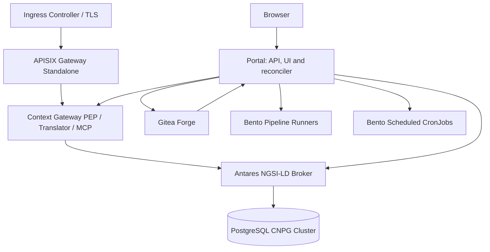

# Platform Deployment Overview

What the joinedcontext platform is made of when it runs on Kubernetes, and which chapter to read for each part of installing and operating it. Read this once before [01-prerequisites.md](01-prerequisites.md); an operator who already has a cluster goes straight to [02-installation.md](02-installation.md). Helmfile drives every component, from the repository `joinedcontext-deployment`.

## 1. Architecture Baseline

The platform replaces the legacy platform's JVM services and Kafka event buses with this stack:

- **Orchestration**: Helmfile, one directory per component under `components/`. Seven components carry over from the legacy deployment repository (`prepare`, `secrets`, `networkpolicies`, `runtime-policies`, `postgres`, `keycloak`, `apisix`); the rest are the platform's own.
- **Identity and access**: **Keycloak** (OIDC, OAuth 2.1, W3C Verifiable Credentials issuance).
- **Relational persistence**: **CloudNativePG** 1.30, PostgreSQL 16 with PostGIS 3.6, Barman object-store backups.
- **Context broker**: **Antares**, an ETSI GS CIM 009 NGSI-LD broker in Rust, from `components/context-broker`. Scorpio and Stellio stay supported alternatives ([ADR-N-008](../Decisions/adr-n-008-antares-default-broker.md)), but no values switch selects them: swapping the broker means replacing the chart named in `components/context-broker/charts.yaml`.
- **Policy enforcement and translation**: **Context Gateway** (Rust, axum): the Policy Enforcement Point, the representation translator and an MCP server.
- **Edge**: **Apache APISIX** in standalone declarative mode. Routes are rendered to a file mount; the platform runs no etcd and exposes no APISIX Admin API.
- **Ingestion and transformation**: **Bento** (`ghcr.io/warpstreamlabs/bento`), as resident Streams-mode runners and as Kubernetes CronJobs, from `components/pipeline-runner`.
- **Configuration-as-Code forge**: **Gitea**, holding the Organization repository that is the single source of truth. Gitea Actions is switched off: `components/gitea` deploys no runner, so a workflow in that forge would never start.
- **Platform management**: the **Portal**, one Rust process serving the API, the embedded React UI and the reconciler that applies the forge's manifests to the cluster. `jcctl` is the command-line tool over the same manifests, shipped in the platform image; no reconciler runs as a daemon of its own.

## 2. Non-Negotiable Deployment Invariants

1. **Mesh mTLS**: every platform namespace carries `config.linkerd.io/default-inbound-policy: cluster-authenticated`, set by the `prepare` component from `global.serviceMesh.defaultInboundPolicy`. Only authenticated, meshed clients of this cluster may connect. The APISIX data-plane edge is carved out through a Linkerd `Server` so plaintext ingress does not break.
2. **No user code in platform containers**: pipeline transformations run in Bento runtimes, configured by manifest and nothing else.
3. **No direct broker write access**: the broker listens on internal interfaces only; every write passes the Context Gateway's Policy Enforcement Point.
4. **Declarative edge**: APISIX reads a rendered `apisix.yaml` from a file mount. No etcd, no Admin API.

## 3. Deployment Documentation Chapters

1. **[Cluster Prerequisites & Sizing](01-prerequisites.md):** compute sizing, Kubernetes prerequisites, storage classes.
2. **[Installation Guide](02-installation.md):** the deployment procedure, component by component.
3. **[Global & Component Configuration](03-configuration.md):** the configuration hierarchy, environment overrides, component parameters.
4. **[Components & Optional Add-ons](04-components-and-addons.md):** the component matrix and the optional add-ons.
5. **[Monitoring, Logging & Observability](05-monitoring-logging.md):** metrics endpoints, structured logs, alert rules.
6. **[Upgrading & Version Management](06-updating.md):** upgrade sequence and broker replacement.
7. **[Backup, Disaster Recovery & Restore](07-backup-restore.md):** CloudNativePG backups, point-in-time recovery, recovering state from Git.
8. **[Security Hardening & Phase-1 Baseline](08-security-hardening.md):** the hardening layers, network policies, runtime enforcement, the acceptance checklist.
9. **[Troubleshooting Guide](09-troubleshooting.md):** diagnosis and remediation.
10. **[Edge Routing & APISIX Standalone Specification](10-edge-routing-apisix.md):** ingress topology, route tables, `apisix.yaml` generation, plugin chains.
11. **[Moving a Project Between Instances](11-moving-a-project.md):** exporting a project and importing it elsewhere.
12. **[Branding and Naming](12-branding-and-naming.md):** what an operator may rename, and what the platform derives.

## Related

- [Cluster Prerequisites & Sizing](01-prerequisites.md) — what the cluster needs before chapter 2.
- [Installation Guide](02-installation.md) — the procedure itself.
- [Global & Component Configuration](03-configuration.md) — where every value in that procedure comes from.
- [Components & Optional Add-ons](04-components-and-addons.md) — what each component deploys.
- [01-runbooks](../Operations/01-runbooks.md) — what to do when it breaks.
- [13-security](../Architecture/13-security.md) — the security model these invariants enforce.
