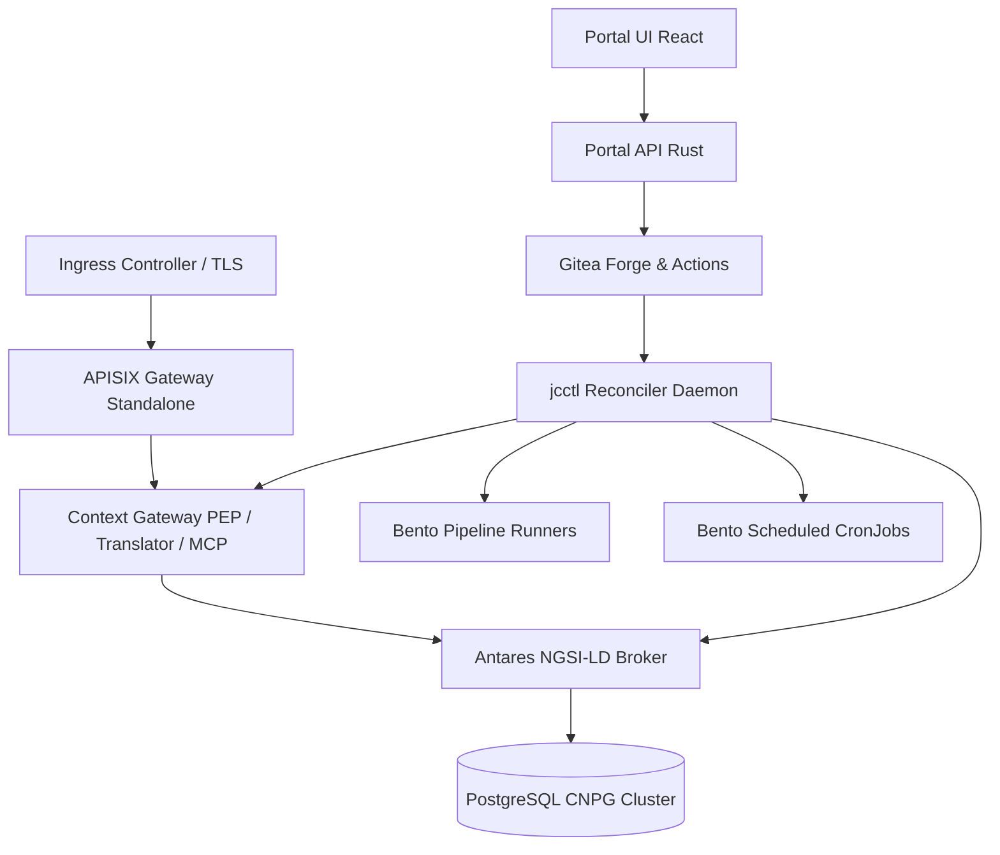

# Platform Deployment Overview

This guide details the deployment architecture and operational lifecycle of the joinedcontext next-generation federated digital twin platform. The platform is packaged, orchestrated, and operated using Helmfile on Kubernetes, preserving digital sovereignty and avoiding operator vendor lock-in.

## 1. Architecture Baseline

The next-generation platform architecture shifts from legacy custom JVM services and Kafka event buses to a lean, cloud-native, and high-performance stack:

- **Orchestration**: Managed strictly via **Helmfile** using the component module pattern inherited from the legacy deployment repository; the joinedcontext repository is `joinedcontext-deployment` (kept components: prepare, secrets, networkpolicies, runtime-policies, postgres, keycloak, apisix in standalone mode; new platform components are added as `components/<name>/`).
- **Identity & Access Management (IAM)**: **Keycloak** (OIDC, OAuth 2.1, and W3C Verifiable Credentials issuance).
- **Relational Data Persistence**: **CloudNativePG (CNPG)** managing PostgreSQL 16+ clusters with Barman object store backups.
- **Context Broker**: High-performance, memory-safe ETSI GS CIM 009 NGSI-LD Context Broker (**Antares** written in Rust; Stellio and Scorpio remain supported pluggable alternatives).
- **Security & Translation**: **Context Gateway** (Rust, Axum/Tower) acting as the Policy Enforcement Point (PEP), representation translator, and MCP server.
- **API Gateway**: **Apache APISIX** operating strictly in **standalone declarative mode** (zero etcd, zero Admin API attack surface).
- **Data Ingestion & Transformation**: **Bento** (`warpstreamlabs/bento`, MIT fork) deployed in resident Streams Mode and Kubernetes CronJobs.
- **Configuration-as-Code (CaC) Forge**: **Gitea** (+ Gitea Actions) hosting the versioned org repositories as the single source of truth.
- **Platform Management**: **Portal API** (Rust) and **Portal UI** (Vite/React/TypeScript) backed by the declarative reconciler **`jcctl`**.

## 2. Non-Negotiable Deployment Invariants

1. **Service Mesh mTLS**: Mandatory mutual TLS using **Linkerd** with `cluster-authenticated` inbound policy across all instance namespaces.
2. **Zero In-Cluster Code Execution**: No user code execution inside application containers; pipeline transformations run in sandboxed Bento runtimes.
3. **No Direct Broker Write Access**: The context broker is bound only to internal network interfaces; all traffic must pass through the Context Gateway PEP.
4. **Declarative Gateway**: APISIX routes are rendered to file mounts (`apisix.yaml`); etcd is entirely eliminated from platform core.

## 3. Deployment Documentation Chapters

1. **[Cluster Prerequisites & Sizing](01-prerequisites.md):** Compute sizing matrices, Kubernetes prerequisites, and storage classes.
2. **[Installation Guide](02-installation.md):** Step-by-step deployment procedure using Helmfile for shared operators and instance layers.
3. **[Global & Component Configuration](03-configuration.md):** Configuration hierarchy, environment overrides, and component parameters.
4. **[Components & Optional Add-ons](04-components-and-addons.md):** Core services matrix and pluggable add-on integration.
5. **[Monitoring, Logging & Observability](05-monitoring-logging.md):** Prometheus metrics endpoints, structured JSON logging, and alerting rules.
6. **[Upgrading & Version Management](06-updating.md):** Component upgrade sequencing and zero-downtime blue/green broker replacement.
7. **[Backup, Disaster Recovery & Restore](07-backup-restore.md):** Automated CloudNativePG S3 backups, PITR procedures, and Git-driven state recovery.
8. **[Security Hardening & Phase-1 Baseline](08-security-hardening.md):** Sequential hardening layers, network policies, runtime enforcement, and acceptance checklist.
9. **[Troubleshooting Guide](09-troubleshooting.md):** Root-cause analysis, diagnostic commands, and remediation steps.
10. **[Edge Routing & APISIX Standalone Specification](10-edge-routing-apisix.md):** Edge ingress topologies, route tables, standalone `apisix.yaml` generation, and plugin chains.

## Related

- [Cluster Prerequisites & Sizing](01-prerequisites.md) — referenced above.
- [Installation Guide](02-installation.md) — referenced above.
- [Global & Component Configuration](03-configuration.md) — referenced above.
- [Components & Optional Add-ons](04-components-and-addons.md) — referenced above.
- [01-runbooks](../Operations/01-runbooks.md) — what to do when it breaks.
- [13-security](../Architecture/13-security.md) — the security model being deployed.
