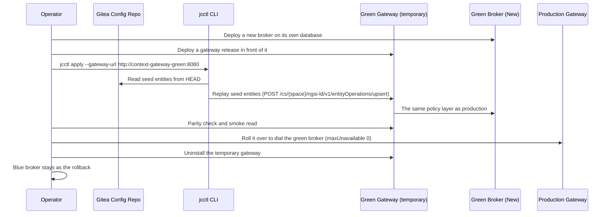

# Upgrading & Version Management

Platform components are versioned independently and deployed immutably. Upgrades are categorized into standard rolling updates (stateless web and gateway components) and blue/green data plane replacements (the NGSI-LD broker).

## 1. Component Upgrade Order

When upgrading the platform version, apply updates in strict sequence:

1. **Cluster Operators**: Upgrade CNPG, Strimzi, and Kyverno via `deployment/helmfile-operators.yaml`.
2. **PostgreSQL Database**: Apply minor database patches via CNPG rolling instance restarts.
3. **IAM & Forge**: Update Keycloak and Gitea.
4. **Context Gateway & Reconciler**: Deploy updated `context-gateway` and `jcctl` containers.
5. **Context Broker**: Update Antares (or alternate broker) using the procedure below.
6. **Portal UI & API**: Update user-facing web services.
7. **Pipeline Runners**: Update Bento runner images.

## 2. Blue/Green Zero-Downtime Broker Upgrade (CC-51)

Because the platform configuration is fully managed in Git, major upgrades of the Context Broker (e.g., migrating from Antares v1 to v2 or migrating between broker engines) are executed via parallel blue/green replay without modifying data in place:



### Execution Commands

One script runs the whole sequence, and the numbers it prints are the steps of the diagram
above (`scripts/upgrade-broker-bluegreen.sh` in the deployment repository, OPS-13, OPS-14):

```bash
# What the upgrade needs, asserted against the live instance. Writes nothing.
scripts/upgrade-broker-bluegreen.sh --check

# The upgrade. The image is pinned by digest (CC-35); a tag is refused.
scripts/upgrade-broker-bluegreen.sh \
  --image ghcr.io/marek-mraz/antares-broker@sha256:... \
  --repo-dir /var/git/city-config \
  --token-file /var/run/secrets/joinedcontext/token
```

The script discovers the blue releases and their namespaces from Helm, so it needs no
environment argument. In order, it:

1. creates a green database beside the blue one, owned by the same role and with the same
   extensions, so the replay cannot write into live data;
2. installs the green broker from the blue release's own values, with the name, the image and
   the database changed;
3. installs a green gateway in front of it, because nothing writes to a broker directly (CC-04)
   and the replay must pass the policy layer production uses;
4. replays the repository's seed entities with `jcctl apply --gateway-url <green gateway>`;
5. asserts parity with `jcctl plan`, which must print `0 to add, 0 to change, 0 to delete`;
6. reads `/healthz` through the green gateway, because rolled out is not the same as answering;
7. cuts over by upgrading the **production gateway** release so it dials the green broker.

Nothing at the edge moves. APISIX keeps routing to the same gateway Service, so there is no
route to flip and no window in which it holds a stale upstream. The cut-over is a rolling
update, and the workload chart sets `maxUnavailable: 0`, so no request is dropped; the script
asserts that value before it writes anything.

Anything that goes wrong before step 7 leaves blue serving: a plan with a diff in it, a green
gateway that does not answer, a replay that fails. The blue broker and its database are never
written to and never removed — they are the rollback, and taking them away is a later decision.

### After the cut-over

The cluster is now ahead of Git, and the next `helmfile apply` would undo the switch. The
script prints the two changes to commit:

```text
components/context-broker/images.yaml   digest: sha256:...
components/context-broker/values/broker/base-values.yaml.gotmpl
                                        ANTARES_DATABASE_URL -> /antares_green
```

After that apply, the release named `context-broker-broker` is the upgraded broker on the green
database, the gateway dials it by its ordinary name again, and the ephemeral
`context-broker-green` release can be uninstalled. Nothing carries the word green.

## 3. Automated Dependency Maintenance

The repository includes a standard `renovate.json` configuration to track container image tags, Helm charts, Rust crates, and npm dependencies. Container images must always be pinned to explicit tags or SHA256 digests; mutable tags (`latest`, `master`) are rejected by CI admission policies.

## 4. Manifest Title Migration: Multi-Language Maps to Plain Strings

Starting with version `v0.9`, manifest `metadata.title` (as well as user-authored descriptions and labels) is standardized as a single plain string in the author's working language instead of a multi-language map (UI-50). The Portal never prompts authors for per-language variants of their own names; Portal interface chrome remains translated in the shipped locale bundles.

### Migration Schedule and Compatibility

- **Release `v0.9` (Dual Mode):** Manifests containing the legacy multi-language map format (`title: { en: "...", sk: "..." }`) remain valid to read. When reading a legacy map, `jcctl` and the Portal extract one string: the manifest's author locale if recorded, then `en`, then the first non-empty string. On the next save or change proposal, `jcctl` rewrites `metadata.title` to a single plain string.
- **Release `v1.0` (Enforced String):** Manifests with multi-language map objects in `metadata.title` are rejected during CI schema validation and admission.
- **Deliberate Translations:** Where formal multilingual presentation is needed (such as an open-data portal distribution), manifests may define an optional `translations` map beside `title` (for example, `translations: { en: "...", sk: "..." }`). This map is never shown in default Portal creation forms.
- **Text Rendering:** Titles are user-provided text. They are strictly rendered as text, never evaluated as markup.

## Related

- [00-intro](00-intro.md) — deployment chapter order.
- [01-runbooks](../Operations/01-runbooks.md) — what to do when it breaks.
- [13-security](../Architecture/13-security.md) — the security model being deployed.
