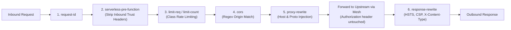

# Edge Routing & APISIX Standalone Specification

This specification defines the edge ingress routing architecture of the joinedcontext platform using Apache APISIX in declarative standalone file mode. It details the edge topology models, the global path-based routing table, the declarative schema of the rendered `apisix.yaml` configuration, the execution order and parameterization of gateway plugins, upstream service mesh integration, network isolation, and operational observability. Platform engineers and operators should use this guide to deploy, configure, and troubleshoot edge traffic routing.

## 1. Edge Ingress Topology Options

The joinedcontext platform supports two topological architectures for edge ingress traffic.

```mermaid
flowchart TD
    subgraph OptionA["Topology Option A: Two-Tier Ingress (Standard Enterprise)"]
        ClientA["Client / Browser"] -->|HTTPS (TLS Term)| IngressCtrl["Cluster Ingress Controller (ingress-nginx / Traefik)"]
        IngressCtrl -->|Linkerd mTLS or Plaintext (Port 9080)| APISIX_A["APISIX Data Plane (ClusterIP)"]
        APISIX_A -->|Linkerd mTLS (:8080)| UpstreamsA["Platform Upstreams (Gateway, Portal, IDM)"]
    end

    subgraph OptionB["Topology Option B: Single-Tier Direct Edge (Recommended)"]
        ClientB["Client / Browser"] -->|HTTPS (TLS Term on APISIX)| APISIX_B["APISIX Gateway (Service: LoadBalancer)"]
        APISIX_B -->|Linkerd mTLS (:8080)| UpstreamsB["Platform Upstreams (Gateway, Portal, IDM)"]
    end
```

### Option A: Two-Tier Ingress Architecture

In Topology Option A, traffic enters through a cluster-level Ingress Controller (such as ingress-nginx or Traefik):

1. **TLS Termination:** The Ingress Controller terminates external TLS using certificates provisioned by `cert-manager`.
2. **Hop to APISIX:** The Ingress Controller proxies requests to the APISIX gateway Service (`type: ClusterIP`) on port 9080.
3. **Mesh Gating:** If the Ingress Controller is meshed with Linkerd (`linkerd.io/inject: enabled`), traffic between the controller and APISIX is authenticated via mTLS. If the controller lives outside the mesh (e.g. host-level ingress in virtual clusters), `global.serviceMesh.allowUnauthenticatedIngress: true` configures APISIX's Linkerd `Server` to `accessPolicy: all-unauthenticated`.
4. **Use Case:** Required in multi-tenant or managed enterprise clusters where a single external LoadBalancer and Ingress Controller are shared across multiple independent platforms.

### Option B: Single-Tier Direct Edge Architecture

In Topology Option B, APISIX acts as the primary external ingress gateway:

1. **Service Type:** APISIX is deployed with `service.type: LoadBalancer`, receiving external traffic directly on ports 80 and 443.
2. **Direct TLS Termination:** APISIX terminates TLS directly using `ssl` configuration blocks in `apisix.yaml` pointing to Kubernetes Secrets managed by `cert-manager`.
3. **Elimination of Intermediate Hops:** Removes the latency and resource overhead of an extra reverse proxy layer.
4. **Simplified Mesh Boundaries:** Eliminates unmeshed ingress boundary ambiguity; APISIX runs as a meshed workload dispatching directly to upstreams over Linkerd mTLS.
5. **Architectural Recommendation:** Option B is the recommended baseline for dedicated city platform clusters and edge deployments. Option A is retained for backward compatibility with shared enterprise ingress controllers.

## 2. Public URL Surface and Path-Based Route Table

The platform consolidates external routing under a single primary domain `{host}` (e.g., `city.example.com`), with Keycloak identity management on `idm.{host}`. Services are partitioned by clean URL prefixes.

| Route ID | Path Pattern | Host Constraint | Upstream Service | Auth Mode | Rate Limit Class | Applied Plugins | Description |
|---|---|---|---|---|---|---|---|
| `portal-ui` | `/*` | `portal.{host}` | `portal:8080` | Edge session (`openid-connect`, `unauth_action: auth`) | Class 1 (Standard) | `request-id`, `serverless-pre-function`, `openid-connect`, `proxy-rewrite`, `response-rewrite` | Portal single-page UI; the edge logs the person in and hands the Portal `X-Userinfo` and `X-Access-Token` (ADR-N-019). |
| `portal-api` | `/api/v1/*` | `portal.{host}` | `portal:8080` | Edge session or OIDC Bearer Token (`unauth_action: pass`) | Class 2 (Authenticated) | `request-id`, `serverless-pre-function`, `openid-connect`, `proxy-rewrite`, `response-rewrite` | Portal REST API: a browser session becomes `X-Access-Token`, a bearer caller passes through and the Portal verifies the token itself. |
| `context-space` | `/cs/:space/*` | `{host}` | `context-gateway:8080` | OIDC Bearer Token, verified by the Context Gateway | Class 2 (Authenticated) | `request-id`, `serverless-pre-function`, `proxy-rewrite`, `response-rewrite` | Canonical NGSI-LD space surface for direct tenant members. |
| `context-endpoint`| `/api/endpoint/:slug/*` | `{host}`, `portal.{host}` | `context-gateway:8080` | Token or anonymous, decided by the Context Gateway PEP | Class 2 / Class 3 | `request-id`, `serverless-pre-function`, `cors`, `proxy-rewrite`, `response-rewrite` | Shared Endpoint surface exposing NGSI-LD, GeoJSON, OGC, STA. The apex is canonical (the DCAT record names it); the Portal host serves the same route, because the Portal UI hands out endpoint links on its own origin. |
| `apps-surface` | `/apps/*` | `{host}` | `portal:8080` | Edge session (`openid-connect`, `unauth_action: auth`) | Class 1 (Standard) | `request-id`, `serverless-pre-function`, `openid-connect`, `response-rewrite` | Hosts compiled bundles of `static` Apps on Demand behind the edge login; cookie path `/apps/`. |
| `app-{name}` | `/apps/{name}/*` | `{host}` | `app-{name}:8080` (service/fullstack) or `portal:8080` (static) | Edge session (`openid-connect`; `unauth_action: pass` for `visibility: public`) | Class 1 (Standard) | `request-id`, `serverless-pre-function`, `openid-connect`, `response-rewrite` | One route per App, rendered by jcctl with a higher priority than `apps-surface`; cookie path `/apps/{name}/`, logout `/apps/{name}/logout` (AP-26…AP-29). |
| `gitea-forge` | `/git/*` | `{host}` | `gitea:3000` | Basic / Token | Class 2 (Authenticated) | `request-id`, `proxy-rewrite` | Internal Git forge for pull requests and CI pipelines. |
| `well-known` | `/.well-known/*` | `{host}` | `portal:8080` | Anonymous | Class 1 (Standard) | `request-id`, `cors`, `response-rewrite` | Serves DID documents and platform discovery metadata. |
| `keycloak-idm` | `/*` | `idm.{host}` | `keycloak:8080` | Identity Provider | Class 2 (Authenticated) | `request-id`, `serverless-pre-function`, `proxy-rewrite` | Keycloak login pages, token issuance, and account console. |
| `grafana-addon` | `/grafana/*` | `{host}` | `grafana:3000` | OIDC / Session | Class 2 (Authenticated) | `request-id`, `proxy-rewrite` | Optional operational metrics and data dashboards. |

Internal Prometheus metrics (`:9091/apisix/prometheus/metrics`) and APISIX control ports are strictly bound to internal pod IPs and omitted from external routing.

## 3. Declarative Standalone Configuration (apisix.yaml)

In accordance with ADR-N-007, APISIX operates in standalone file mode without an external etcd cluster. The configuration is rendered into a ConfigMap by `jcctl` and mounted to `/usr/local/apisix/conf/apisix.yaml`.

```yaml
# Generated by jcctl — DO NOT EDIT DIRECTLY
# Source: projects/*/endpoints/*.yaml and platform-settings.yaml

routes:
  - id: portal-ui
    uri: /*
    priority: 1
    upstream_id: upstream-portal
    plugin_config_id: pc-public-web

  - id: portal-api
    uri: /api/v1/*
    priority: 10
    upstream_id: upstream-portal
    plugin_config_id: pc-authenticated-api

  - id: app-air-quality-today            # one per App, rendered from kind: App
    uri: /apps/air-quality-today/*
    priority: 30
    upstream_id: upstream-app-air-quality-today
    plugins:                               # the edge login, cookie scoped to the app (AP-26…AP-29)
      openid-connect:
        client_id: edge
        client_secret: ${EDGE_CLIENT_SECRET}
        discovery: https://idm.city.example.com/realms/city/.well-known/openid-configuration
        bearer_only: false
        unauth_action: auth                # `pass` for visibility: public
        use_jwks: false                    # the code flow's ID token is verified through discovery;
        use_pkce: true                     # a presented bearer is left to the upstream (unauth_action)
        redirect_uri: https://city.example.com/apps/air-quality-today/callback
        logout_path: /apps/air-quality-today/logout
        post_logout_redirect_uri: https://city.example.com/apps/air-quality-today/
        set_userinfo_header: true
        set_access_token_header: true
        set_id_token_header: false
        session:                           # flat keys: APISIX 3.17 ignores a nested `cookie:` block
          secret: ${OIDC_SESSION_SECRET}
          cookie_name: jc_edge_app_air-quality-today
          cookie_path: /apps/air-quality-today/
          cookie_secure: true
          cookie_http_only: true
          cookie_same_site: Lax
          idling_timeout: 3600
          absolute_timeout: 36000

  - id: context-space
    uri: /cs/*
    priority: 15
    upstream_id: upstream-context-gateway
    plugin_config_id: pc-context-firewall

  - id: context-endpoint
    uri: /api/endpoint/*
    priority: 20
    upstream_id: upstream-context-gateway
    plugin_config_id: pc-endpoint-surface

  - id: gitea-forge
    uri: /git/*
    priority: 10
    upstream_id: upstream-gitea
    plugin_config_id: pc-public-web

upstreams:
  - id: upstream-portal
    type: roundrobin
    nodes:
      "portal.prod.svc.cluster.local:8080": 1
    timeout:
      connect: 6
      send: 30
      read: 30

  - id: upstream-app-air-quality-today
    type: roundrobin
    nodes:
      "app-air-quality-today.prod.svc.cluster.local:8080": 1   # the app container itself (AP-26)
    timeout:
      connect: 6
      send: 30
      read: 30

  - id: upstream-context-gateway
    type: roundrobin
    nodes:
      "context-gateway.prod.svc.cluster.local:8080": 1
    timeout:
      connect: 6
      send: 60
      read: 300
    keepalive_pool:
      size: 320
      idle_timeout: 60
      requests: 1000

  - id: upstream-gitea
    type: roundrobin
    nodes:
      "gitea-http.prod.svc.cluster.local:3000": 1
    timeout:
      connect: 6
      send: 60
      read: 60

plugin_configs:
  - id: pc-public-web
    plugins:
      request-id:
        include_in_response: true
      response-rewrite:
        headers:
          set:
            Strict-Transport-Security: "max-age=31536000; includeSubDomains; preload"
            X-Content-Type-Options: "nosniff"
            X-Frame-Options: "SAMEORIGIN"
            Referrer-Policy: "strict-origin-when-cross-origin"

  - id: pc-authenticated-api
    plugins:
      request-id:
        include_in_response: true
      response-rewrite:
        headers:
          set:
            Strict-Transport-Security: "max-age=31536000; includeSubDomains; preload"
            X-Content-Type-Options: "nosniff"
            X-Frame-Options: "DENY"
            Cache-Control: "no-store, no-cache, must-revalidate"

  - id: pc-context-firewall
    plugins:
      request-id:
        include_in_response: true
      serverless-pre-function:
        phase: rewrite
        functions:
          - >-
            return function()
              ngx.req.clear_header("NGSILD-Tenant")
              ngx.req.clear_header("X-Userinfo")
              ngx.req.clear_header("X-Access-Token")
              ngx.req.clear_header("X-Allowed-Scope-Ids")
              ngx.req.clear_header("X-Endpoint-Slug")
              ngx.req.clear_header("X-Consumer-Identity")
            end
      response-rewrite:
        headers:
          set:
            Strict-Transport-Security: "max-age=31536000; includeSubDomains; preload"
            X-Content-Type-Options: "nosniff"
            Cache-Control: "no-store, no-cache, must-revalidate"

  - id: pc-endpoint-surface
    plugins:
      request-id:
        include_in_response: true
      serverless-pre-function:
        phase: rewrite
        functions:
          - >-
            return function()
              ngx.req.clear_header("NGSILD-Tenant")
              ngx.req.clear_header("X-Userinfo")
              ngx.req.clear_header("X-Access-Token")
              ngx.req.clear_header("X-Allowed-Scope-Ids")
              ngx.req.clear_header("X-Endpoint-Slug")
              ngx.req.clear_header("X-Consumer-Identity")
            end
      cors:
        allow_origins_by_regex:
          - "^https://.+\\.city\\.example\\.com$"
        allow_methods: "GET,HEAD,POST,OPTIONS"
        allow_headers: "Authorization,Content-Type,Accept,Link"
        allow_credential: true
      response-rewrite:
        headers:
          set:
            Strict-Transport-Security: "max-age=31536000; includeSubDomains; preload"
            X-Content-Type-Options: "nosniff"

#END
```

### The `#END` Marker Requirement

Per stack verdict S7, APISIX standalone mode requires that `apisix.yaml` end with the literal string `#END`. If this marker is omitted, APISIX's internal parser fails to commit the reload and continues serving the previous configuration without raising an error. The `jcctl` compiler automatically appends `#END` as the final line of all rendered gateway manifests.

### The `jcctl` Reconciliation Lifecycle

1. **Compilation:** `jcctl` evaluates committed `Endpoint` and `App` manifests in Git, rendering the unified `apisix.yaml`.
2. **Pre-Apply Validation:** Before updating Kubernetes, `jcctl` validates syntax and plugin schemas.
3. **ConfigMap Application:** `jcctl` updates the `apisix-standalone-config` ConfigMap in the instance namespace.
4. **Hot Reload:** APISIX worker processes poll `/usr/local/apisix/conf/apisix.yaml` every 1 second. When file modification is detected, workers reload routes in memory within 1 second without dropping active connections.

## 4. Plugin Chain Architecture by Route Class

Every request processed by APISIX executes through an ordered sequence of gateway plugins.

### Execution Pipeline



### Plugin Parameterization Specifications

1. **`request-id`:** Injected at the initial evaluation phase. Generates an RFC 4122 UUIDv4 and sets `X-Request-Id` on incoming request headers and outgoing response headers (`include_in_response: true`).
2. **`serverless-pre-function` (Header Sanitization):** Runs during the `rewrite` phase. Unconditionally drops headers that could forge tenant identity or authorization claims:
   - `NGSILD-Tenant`
   - `X-Userinfo`
   - `X-Access-Token`
   - `X-Allowed-Scope-Ids`
   - `X-Endpoint-Slug`
   - `X-Consumer-Identity`
   - Untrusted `X-Forwarded-*` headers
3. **`limit-req` / `limit-count` (Tiered Rate Limiting):**
   - **Class 1 (Standard Web / UI):** 300 requests per minute per IP.
   - **Class 2 (Authenticated APIs):** 1,200 requests per minute per client identity.
   - **Class 3 (High-Throughput Streams):** 5,000 requests per minute per pipeline service account.
   - **Class 4 (Bulk File Exports):** 10 concurrent requests per client.
4. **`cors`:** Evaluates incoming browser `Origin` headers against the approved domain regex (`^https://.+\.${DOMAIN}$`). Rejects wildcard origins when `allow_credential: true` is configured.
5. **No token verification at the edge.** APISIX forwards `Authorization: Bearer <token>` untouched; the Portal and the Context Gateway verify every token themselves (signature against the realm JWKS, `iss`, `aud`, `exp`, `nbf`; see [12-identity-and-access §3](../Architecture/12-identity-and-access.md)). Reason: the realm signs ES256 only (TR-03187 AR-11) and APISIX's `openid-connect` plugin (lua-resty-openidc) verifies RS- and HS-family signatures only, so with `use_jwks: true` every ES256 token is refused with `401`, and introspection would put Keycloak on the path of every request. A service behind APISIX that does not verify tokens is not exposed on an authenticated route; the route stays closed until its upstream verifies. The endpoint surface receives anonymous requests as well: the Context Gateway PEP decides between a public representation and `401`.
6. **`proxy-rewrite`:** Ensures correct protocol representation upstream (`X-Forwarded-Proto: https`, `X-Forwarded-Port: 443`).
7. **`response-rewrite` (Security Headers):** Closes legacy gap deployment#242 by injecting mandatory security headers:
   - `Strict-Transport-Security: max-age=31536000; includeSubDomains; preload`
   - `X-Content-Type-Options: nosniff`
   - `X-Frame-Options: SAMEORIGIN` (Portal UI) / `DENY` (APIs)
   - `Referrer-Policy: strict-origin-when-cross-origin`
   - `Cache-Control: no-store, no-cache, must-revalidate` (Authenticated APIs)

### Extended Timeouts for Bulk Exports

Standard API gateways configure aggressive 6-second timeouts. Bulk spatial queries, temporal histories, and GeoJSON/CSV streaming exports require extended execution windows:

- **Connect Timeout:** 6 seconds.
- **Send Timeout:** 60 seconds.
- **Read Timeout:** 300 seconds (5 minutes) on `context-gateway` upstreams.
- **Buffering:** Response buffering is disabled (`proxy_buffering: off`) for Server-Sent Events (SSE) and large dataset exports to allow streaming directly to clients.

## 5. Upstream Transport Security and Service Mesh Policy

All traffic between the APISIX gateway and internal platform upstreams is encrypted and authorized via Linkerd mutual TLS.

### Port 9080 Server Policy

The APISIX pod runs Linkerd sidecars. The public data-plane port (9080) is governed by a Linkerd `Server` resource in `components/apisix/charts/configuration/templates/linkerd-policy.yaml`:

- **Meshed Ingress (Option A / B):** `accessPolicy: all-authenticated`. Traffic is rejected unless originating from an authenticated mesh identity.
- **Unmeshed Ingress (Option A with host-level ingress):** `accessPolicy: all-unauthenticated`. Permits plaintext TCP traffic from the unmeshed ingress controller to port 9080 only.
- **Administrative Ports:** Port 9091 (metrics) and port 9092 (internal control) remain governed by the namespace-wide `cluster-authenticated` policy.

## 6. Network Policies for APISIX Gateway

Network policies isolate the APISIX gateway, enforcing strict default-deny boundaries on both ingress and egress.

```yaml
apiVersion: networking.k8s.io/v1
kind: NetworkPolicy
metadata:
  name: apisix-lockdown
  namespace: prod
spec:
  podSelector:
    matchLabels:
      app.kubernetes.io/name: apisix
  policyTypes:
    - Ingress
    - Egress
  ingress:
    # Ingress permitted from external LoadBalancer or Ingress Controller
    - from:
        - namespaceSelector:
            matchLabels:
              kubernetes.io/metadata.name: ingress-nginx
      ports:
        - protocol: TCP
          port: 9080
        - protocol: TCP
          port: 9443
  egress:
    # CoreDNS resolution
    - to:
        - namespaceSelector: {}
          podSelector:
            matchLabels:
              k8s-app: kube-dns
      ports:
        - protocol: UDP
          port: 53
        - protocol: TCP
          port: 53
    # Context Gateway PEP
    - to:
        - podSelector:
            matchLabels:
              app.kubernetes.io/name: context-gateway
      ports:
        - protocol: TCP
          port: 8080
    # Portal (one application: API + embedded UI + reconciler)
    - to:
        - podSelector:
            matchLabels:
              app.kubernetes.io/name: portal
      ports:
        - protocol: TCP
          port: 8080
    # Apps on Demand: the app container of every service/fullstack app (AP-26)
    - to:
        - podSelector:
            matchLabels:
              joinedcontext.com/app: "true"
      ports:
        - protocol: TCP
          port: 8080
    # Keycloak OIDC Provider
    - to:
        - podSelector:
            matchLabels:
              app.kubernetes.io/name: keycloakx
      ports:
        - protocol: TCP
          port: 8080
    # Linkerd Mesh Proxy Control
    - ports:
        - protocol: TCP
          port: 4143
        - protocol: TCP
          port: 4191
```

## 7. Observability, Logging, and Alerting

APISIX provides comprehensive telemetry on traffic throughput, latency percentiles, and configuration reload states.

### Structured JSON Access Logs

Access logs are emitted to `stdout` in structured JSON format, scrubbed of sensitive authorization tokens:

```json
{
  "timestamp": "2026-09-05T14:22:01.452Z",
  "client_ip": "198.51.100.42",
  "request_id": "c7a8b3e2-9f1d-4e8a-b5c6-1d2e3f4a5b6c",
  "route_id": "context-endpoint",
  "uri": "/api/endpoint/air-quality/ngsi-ld/v1/entities",
  "status": 200,
  "latency_ms": 4.8,
  "upstream_latency_ms": 3.2,
  "upstream_addr": "10.42.2.18:8080",
  "bytes_sent": 1482,
  "user_agent": "Mozilla/5.0 ...",
  "matched_host": "city.example.com"
}
```

### Prometheus Metrics and Health Scraping

APISIX exports Prometheus metrics on port 9091 (`/apisix/prometheus/metrics`). Key metrics include:

- `apisix_http_status`: Counter of HTTP status codes partitioned by route and service.
- `apisix_http_latency_bucket`: Histogram of gateway latency percentiles.
- `apisix_yaml_configuration_load_status`: Gauge indicating standalone configuration reload success (`1` = valid, `0` = failed reload).

### Recommended Alerting Rules

```yaml
apiVersion: monitoring.coreos.com/v1
kind: PrometheusRule
metadata:
  name: apisix-routing-alerts
  namespace: prod
spec:
  groups:
    - name: apisix-edge
      rules:
        - alert: APISIXConfigReloadFailed
          expr: apisix_yaml_configuration_load_status == 0
          for: 1m
          labels:
            severity: critical
          annotations:
            summary: "APISIX standalone failed to reload apisix.yaml (check #END marker)"

        - alert: APISIXHigh5xxRate
          expr: sum(rate(apisix_http_status{status=~"5.."}[5m])) / sum(rate(apisix_http_status[5m])) > 0.01
          for: 2m
          labels:
            severity: warning
          annotations:
            summary: "APISIX edge 5xx error rate exceeded 1%"
```

## 8. Failure Modes and Operational Troubleshooting

Common operational incidents and their remediation procedures are detailed below.

### Route Updates Ignored After ConfigMap Change

- **Symptom:** Modifications committed to Git are applied to the ConfigMap, but APISIX continues serving stale routes.
- **Root Cause:** The `apisix.yaml` manifest is missing the mandatory `#END` marker on its final line. APISIX silently discards invalid configuration updates.
- **Verification:**

  ```bash
  kubectl exec -it deploy/apisix -c apisix -n prod -- tail -n 2 /usr/local/apisix/conf/apisix.yaml
  ```

- **Remediation:** Append `#END` to the template and re-apply via `jcctl apply`.

### Upstream Connection Timeout (HTTP 504)

- **Symptom:** Large GeoJSON exports or temporal aggregation queries terminate with HTTP 504 Gateway Timeout after 6 seconds.
- **Root Cause:** Upstream timeout in `apisix.yaml` defaulted to legacy 6-second timeout.
- **Verification:** Check `apisix.yaml` upstream `timeout.read` setting.
- **Remediation:** Update `context-gateway` upstream definition with `read: 300` and reload.

### Token Validation Failures (HTTP 401)

- **Symptom:** Valid client JWT tokens are rejected with `401 Unauthorized`.
- **Root Cause:** The verifying service (Portal or Context Gateway) cannot fetch the realm JWKS, or the token's `iss`/`aud` does not match the service configuration (`JC_OIDC_ISSUER`, `JC_OIDC_JWKS_URL`). APISIX never returns `401` on its own for API routes; a `401` with `www-authenticate: Bearer realm="apisix"` means an `openid-connect` plugin was re-added to a route and must be removed.
- **Verification:**

  ```bash
  kubectl logs deploy/portal -n prod --tail=100 | grep -i oidc
  kubectl logs deploy/context-gateway -n prod --tail=100 | grep -i jwks
  curl -s https://idm.{host}/realms/{realm}/protocol/openid-connect/certs | jq '.keys[].alg'
  ```

- **Remediation:** Verify that Keycloak is running, that the JWKS lists an `ES256` key, and that the service's egress NetworkPolicy allows reaching the issuer URL.

## Related

- [Security Hardening & Phase-1 Baseline](08-security-hardening.md) — complete phase-1 security layers and acceptance checklist.
- [Legacy Security Research](../Research/legacy-deployment-security-and-routing.md) — empirical review of `civitas-core-deployment`.
- [ADR-N-007 Standalone APISIX](../Decisions/adr-n-007-apisix-standalone-no-etcd.md) — architectural decision eliminating etcd and the Admin API.
- [Incident Runbooks](../Operations/01-runbooks.md) — operational remediation procedures for edge rate-limiting and route failures.
