# Edge Routing & APISIX Standalone Specification

This specification defines the edge ingress routing architecture of the joinedcontext platform using Apache APISIX in declarative standalone file mode. It details the edge topology models, the global path-based routing table, the declarative schema of the rendered `apisix.yaml` configuration, the execution order and parameterization of gateway plugins, upstream service mesh integration, network isolation, and operational observability. Platform engineers and operators should use this guide to deploy, configure, and troubleshoot edge traffic routing.

## 1. Edge Ingress Topology Options

The joinedcontext platform supports two topological architectures for edge ingress traffic.

```mermaid
flowchart TD
    subgraph OptionA["Topology Option A: Two-Tier Ingress (Standard Enterprise)"]
        ClientA["Client / Browser"] -->|HTTPS (TLS Term)| IngressCtrl["Cluster Ingress Controller (ingress-nginx / Traefik)"]
        IngressCtrl -->|Linkerd mTLS or Plaintext (Port 9080)| APISIX_A["APISIX Data Plane (ClusterIP)"]
        APISIX_A -->|Linkerd mTLS (:8080)| UpstreamsA["Platform Upstreams (Gateway, Portal, IDM)"]
    end

    subgraph OptionB["Topology Option B: Single-Tier Direct Edge (Recommended)"]
        ClientB["Client / Browser"] -->|HTTPS (TLS Term on APISIX)| APISIX_B["APISIX Gateway (Service: LoadBalancer)"]
        APISIX_B -->|Linkerd mTLS (:8080)| UpstreamsB["Platform Upstreams (Gateway, Portal, IDM)"]
    end
```

### Option A: Two-Tier Ingress Architecture

In Topology Option A, traffic enters through a cluster-level Ingress Controller (such as ingress-nginx or Traefik):

1. **TLS Termination:** The Ingress Controller terminates external TLS using certificates provisioned by `cert-manager`.
2. **Hop to APISIX:** The Ingress Controller proxies requests to the APISIX gateway Service (`type: ClusterIP`) on port 9080.
3. **Mesh Gating:** If the Ingress Controller is meshed with Linkerd (`linkerd.io/inject: enabled`), traffic between the controller and APISIX is authenticated via mTLS. If the controller lives outside the mesh (e.g. host-level ingress in virtual clusters), `global.serviceMesh.allowUnauthenticatedIngress: true` configures APISIX's Linkerd `Server` to `accessPolicy: all-unauthenticated`.
4. **Use Case:** Required in multi-tenant or managed enterprise clusters where a single external LoadBalancer and Ingress Controller are shared across multiple independent platforms.

### Option B: Single-Tier Direct Edge Architecture

In Topology Option B, APISIX acts as the primary external ingress gateway:

1. **Service Type:** APISIX is deployed with `service.type: LoadBalancer`, receiving external traffic directly on ports 80 and 443.
2. **Direct TLS Termination:** APISIX terminates TLS directly using `ssl` configuration blocks in `apisix.yaml` pointing to Kubernetes Secrets managed by `cert-manager`.
3. **Elimination of Intermediate Hops:** Removes the latency and resource overhead of an extra reverse proxy layer.
4. **Simplified Mesh Boundaries:** Eliminates unmeshed ingress boundary ambiguity; APISIX runs as a meshed workload dispatching directly to upstreams over Linkerd mTLS.
5. **Architectural Recommendation:** Option B is the recommended baseline for dedicated city platform clusters and edge deployments. Option A is retained for backward compatibility with shared enterprise ingress controllers.

## 2. Public URL Surface and Path-Based Route Table

The platform consolidates external routing under a primary domain `{host}` (for example `city.example.com`). The Portal has a host of its own, `portal.{host}`; Keycloak is on `idm.{host}` and the open-data catalogue on `data.{host}`. The apex keeps the shared surfaces and redirects everything else to the Portal host (ADR-N-019).

Every row below is one entry of `components/<component>/apisix-routes.yaml` with its plugin config in `components/<component>/apisix-plugins.yaml`. Priority decides which route wins when two patterns match; APISIX takes the highest.

| Route ID | Path Pattern | Host | Priority | Upstream Service | Auth Mode | Rate Limit | Notable plugins |
|---|---|---|---|---|---|---|---|
| `portal-ui` | `/*` | `portal.{host}` | 1 | `portal:8080` | Edge session (`openid-connect`, `unauth_action: auth`) | Class 1 | `openid-connect`, `proxy-rewrite` |
| `security-txt` | `/.well-known/security.txt`, `GET` and `HEAD` | every host | 50 | terminates at the edge | none | Class 1 | `fault-injection` answering `200` with `Contact` and `Expires` from `global.securityTxt` (OPS-52) |
| `portal-metrics` | `/metrics` | `portal.{host}` | 5 | terminates at the edge | none | none | `fault-injection` answering `404` |
| `portal-well-known` | `/.well-known/oauth-protected-resource*` | `portal.{host}` | 5 | `portal:8080` | Anonymous (RFC 9728 discovery, AG-60) | 600/min per IP | `proxy-rewrite` |
| `portal-public`, `portal-public-assets` | `/catalogue*`; `/assets/*` (the same plugin config) | `portal.{host}` | 5 | `portal:8080` | Edge session when there is one, else anonymous (`unauth_action: pass`): the public catalogue and the bundle it runs on (EP-81) | Class 1 | `openid-connect`, `proxy-rewrite` |
| `portal-api` | `/api/v1/*` | `portal.{host}` | 10 | `portal:8080` | Edge session or OIDC bearer (`unauth_action: pass`) | Class 2 | `openid-connect`, `proxy-rewrite` |
| `portal-redirect` | `/*` | `{host}` | 1 | terminates at the edge | none | none | `redirect` to `https://portal.{host}/` |
| `context-space` | `/cs/*` | `{host}` | 15 | `context-gateway:8080` | OIDC bearer, verified by the Context Gateway | Class 2 | `proxy-buffering` off, `limit-count` |
| `context-endpoint` | `/api/endpoint/*` | `{host}` | 20 | `context-gateway:8080` | Bearer or anonymous, decided by the Context Gateway PEP | Class 3 and Class 4 | `cors`, `proxy-buffering` off, `limit-conn` |
| `context-endpoint-portal` | `/api/endpoint/*` | `portal.{host}` | 20 | `context-gateway:8080` | Edge session becomes the bearer, or a bearer passes through | Class 3 and Class 4 | as above, plus `openid-connect` |
| `catalog-feed` | `/catalog.*` (the gateway answers `/catalog.jsonld` and `/catalog.ttl`, 404 on anything else) | `{host}` | 20 | `context-gateway:8080` | Anonymous: the feed reads no token and lists public Endpoints only (EP-84) | Class 1 | `proxy-rewrite` |
| `gitea-forge` | `/git/*` | `{host}` | 10 | `gitea-http:3000` | Basic or token, verified by Gitea | Class 2 | `proxy-rewrite` |
| `grafana` | `/grafana*` | `{host}` | 5 | `grafana:3000` | Grafana's own OIDC login | Class 2 | `proxy-rewrite` |
| `ckan` | `/*` | `data.{host}` | default | `ckan:5000` | CKAN's own login | Class 1 | `proxy-rewrite` |
| `ckan-redirect` | `/ckan*` | `{host}` | 5 | terminates at the edge | none | none | `redirect` to `https://data.{host}/` |
| `keycloak` | `/*` | `idm.{host}` | default | `keycloak-app-keycloakx-http:80` | Identity provider | none at the edge | `proxy-rewrite` |
| `app-{name}` | `/*` | `{name}.apps.{host}` | 30 | `app-{name}` in `{release}-{project}-apps` (`ui-rust`, `ui-node`) or `portal:8080` (`ui`) | Session of the App's own client `app-{name}`; `unauth_action: pass` for `visibility: public` | Class 1 | `openid-connect`, a host-only cookie of its own, logout `/logout` (AP-26…AP-29, AP-112, AP-133) |
| `app-{name}-endpoint` | `/api/endpoint/{slug}/*`, the App's own slugs only | `{name}.apps.{host}` | 35 | `context-gateway:8080` | The App's session becomes the bearer; anonymous stays anonymous | Class 3 and Class 4 | client `app-{name}` (AP-112, AP-133) |
| `app-{name}-moved` | `/apps/{name}/*` | `{host}` | 30 | none | none: `308` to `https://{name}.apps.{host}/…`, no cookie set | Class 1 | `redirect` (AP-133) |

An App lives on a host of its own, `{name}.apps.{host}` (ADR-N-037, AP-133). A host is a browser origin, so a page of one App cannot read another's storage, frame it, or send a request that carries another App's session or reach `/git/*` and `/api/v1/*` with one: those paths are not routed on an App's host and answer `404`. The SDK calls `/api/endpoint/{slug}/…` on its own host, and `app-{name}-endpoint` turns the App's session into `Authorization: Bearer` for the endpoints the App reads and no other. Each App host has an edge Ingress and an HTTP-01 certificate of its own, which the reconciler creates once when the App is published; there is no wildcard certificate (T-2806).

The `app-{name}`, `app-{name}-endpoint` and `app-{name}-moved` rows are the routes no chart renders: the Portal's reconciler adds them per published App to the file helm renders (section 3, ADR-N-030). An App that is not published has no route and no host. Every other row exists in the deployment repository.

Four routes answer at the edge and never dial the upstream their entry declares: `security-txt` (`200`, the RFC 9116 file), `portal-metrics` (`404`, so the scrape path says nothing from outside the cluster), `portal-redirect` (`302` to the Portal host) and `ckan-redirect` (`302` to the catalogue host).

The `context-endpoint` routes refuse one path of their own before anything else runs: a URI matching `^/api/endpoint/[^/]+/egress/` is answered `403` in the rewrite phase. That is the notification delivery path, which carries no token by design (R46) and is reachable in-cluster only; published at the edge it would be a delivery-forging surface.

APISIX's own Prometheus surface and control ports are not routed. `global.metrics.enabled` turns the `prometheus` plugin on; the Admin API is disabled outright (`apisix.admin.enabled: false`), because standalone mode has none (ADR-N-007).

## 3. Declarative Standalone Configuration (apisix.yaml)

In accordance with ADR-N-007, APISIX runs in standalone file mode with no etcd cluster and no Admin API. The whole routing table is one file.

### Who renders the file

Two writers, one after the other (ADR-N-030, AP-112):

1. **The `configuration` chart** (`components/apisix/charts/configuration/templates/configmap.yaml`) renders the platform routes. It reads every `components/<component>/apisix-routes.yaml` and `components/<component>/apisix-plugins.yaml`, merges them into `upstreams`, `routes` and `plugin_configs`, and writes the ConfigMap `apisix-standalone-base` in the APISIX namespace. It holds no secret: the shared client's secrets appear as APISIX environment references (`${{EDGE_CLIENT_SECRET}}`).
2. **The Portal's reconciler** reads that base on every tick, adds `app-{name}`, `app-{name}-endpoint` and `app-{name}-moved` for every published App with the App's own client and its secret, appends `#END`, and writes the Secret `apisix-standalone-config`, which APISIX mounts. It writes only when the result differs, so an unchanged tick is no reload. A base change reaches the edge on the next tick. Until the Portal first writes, the chart seeds the Secret with the base, so a fresh install serves the shared routes.

The Role `edge-file-composer` in the APISIX namespace is everything the reconciler may do there: `get` on the ConfigMap `apisix-standalone-base`, `get` and `update` on the Secret `apisix-standalone-config`, each by name, and `get`, `list`, `create` and `delete` on `Ingress` and cert-manager `Certificate`, for the host of each published App (AP-133). A `create` cannot be narrowed to a name the Portal does not know yet; the reconciler deletes only the objects it labelled `app.kubernetes.io/managed-by: joinedcontext-portal` and `app.kubernetes.io/component: app-host`, and never updates or patches either kind. An App whose host has no certificate yet shows `CertificatePending`; one whose Ingress the cluster refused shows `HostRefused`.

An App's pod reaches its endpoints on the gateway's in-cluster Service (`JC_PORTAL_GATEWAY_URL`), not through the edge. The gateway's NetworkPolicies admit it by two labels together: the namespace `joinedcontext.com/managed-by: joinedcontext-portal` and the pod `joinedcontext.com/app: "true"` (AP-134).

`jcctl`'s `apisix::render` stays the offline renderer of the same shape for a configuration repository; no cluster is served from its output.

### How the file reaches APISIX

The upstream chart mounts its rule file from a ConfigMap only. The `apisix` part therefore carries a helmfile `jsonPatches` entry (`components/apisix/component.yaml`) that turns that volume into the Secret `apisix-standalone-config`, after a `test` that fails the render if a chart upgrade moves the volume. Rendering the part needs `kustomize` on the path, as helmfile's patching runs through it. The mount is a whole directory, never a `subPath`, so the kubelet swaps in each write of the reconciler and APISIX reloads the file without a restart.

The Secret has two writers in turn. The `configuration` chart seeds it with the base, marked `helm.sh/resource-policy: keep`, on every sync until the reconciler first writes it and annotates it `joinedcontext.com/composed-by: portal`. From then on helm's `lookup` sees the annotation and renders no Secret, and `keep` stops helm from deleting it, so a sync never takes the Apps' routes off the edge. An installation without the Portal keeps receiving the base from every sync. The Portal's ServiceAccount holds the Role `edge-file-composer` in the APISIX namespace: `get` on the ConfigMap `apisix-standalone-base` and `get`, `update` on the Secret `apisix-standalone-config`, both by name. It holds no `create`, because Kubernetes cannot narrow a `create` to one name.

The chart symlinks the mounted file to `conf/apisix.yaml` inside the container. An init container first copies the image's own `conf/` into a writable volume and deletes the `apisix.yaml` that ships in the image, or the symlink fails with `File exists` and the gateway crash-loops. `/usr/local/apisix/conf/apisix.yaml` is therefore a path inside the running container, not a file in any repository. `dev-smoke` reads the platform routes from the base ConfigMap and never reads the served Secret, which holds the App client secrets.

### What the rendered file looks like

The shape below is the chart's output with one route of each kind. Both secrets appear as APISIX environment-variable references, so their values come from Kubernetes Secrets and never sit in Git (AP-27).

```yaml
plugin_configs:
  - id: portal-ui
    desc: "Portal user interface behind the edge login"
    plugins:
      request-id:
        include_in_response: true
      serverless-pre-function:
        phase: rewrite
        functions:
          - >-
            return function()
              local forged = {
                "NGSILD-Tenant", "X-Userinfo", "X-Access-Token", "X-Allowed-Scope-Ids",
                "X-Endpoint-Slug", "X-Consumer-Identity",
                "X-Forwarded-Host", "X-Forwarded-Proto", "X-Forwarded-Port",
                "X-Forwarded-Prefix", "X-Forwarded-Server", "X-Real-IP",
              }
              for _, header in ipairs(forged) do
                ngx.req.clear_header(header)
              end
            end
      limit-count:
        count: 300
        time_window: 60
        key_type: var
        key: remote_addr
        rejected_code: 429
        policy: local
        show_limit_quota_header: true
      openid-connect:
        client_id: edge
        client_secret: ${EDGE_CLIENT_SECRET}
        discovery: https://idm.city.example.com/realms/city/.well-known/openid-configuration
        bearer_only: false
        use_jwks: false
        use_pkce: true
        ssl_verify: true
        unauth_action: auth
        redirect_uri: https://portal.city.example.com/callback
        logout_path: /logout
        post_logout_redirect_uri: https://portal.city.example.com/
        set_userinfo_header: true
        set_access_token_header: true
        set_id_token_header: false
        set_refresh_token_header: false
        session:
          secret: ${OIDC_SESSION_SECRET}
          cookie_name: jc_edge
          cookie_path: /
          cookie_secure: true
          cookie_http_only: true
          cookie_same_site: Lax
          idling_timeout: 3600
          rolling_timeout: 3600
          absolute_timeout: 36000
      proxy-rewrite:
        headers:
          set:
            X-Forwarded-Proto: https
            X-Forwarded-Port: '443'
      response-rewrite:
        headers:
          set:
            Strict-Transport-Security: "max-age=31536000; includeSubDomains; preload"
            X-Content-Type-Options: "nosniff"
            X-Frame-Options: "SAMEORIGIN"
            Referrer-Policy: "no-referrer"

upstreams:
  - id: portal-ui
    type: roundrobin
    nodes:
      "portal.prod.svc.cluster.local:8080": 1
    timeout:
      connect: 6
      send: 30
      read: 30

  - id: context-endpoint
    type: roundrobin
    nodes:
      "context-gateway.prod.svc.cluster.local:8080": 1
    timeout:
      connect: 6
      send: 60
      read: 300
    keepalive_pool:
      size: 320
      idle_timeout: 60
      requests: 1000

routes:
  - id: portal-ui
    name: "portal-ui"
    desc: "Portal user interface"
    uri: "/*"
    priority: 1
    host: "portal.city.example.com"
    upstream_id: portal-ui
    plugin_config_id: portal-ui

  - id: context-endpoint
    name: "context-endpoint"
    desc: "Shared context endpoint representation surface"
    uri: "/api/endpoint/*"
    priority: 20
    host: "city.example.com"
    upstream_id: context-endpoint
    plugin_config_id: context-endpoint

#END
```

One key names the route, its upstream and its plugin config: the chart iterates one map and emits the same id three times. A route whose id has no entry under `plugins` is rendered without `plugin_config_id` and runs with no plugin at all.

### The `#END` marker

APISIX standalone mode requires `apisix.yaml` to end with the literal string `#END`. Without it APISIX commits nothing and keeps serving the previous configuration without raising an error (stack verdict S7). Both renderers append it as the final line: the chart template writes it, and `jcctl::apisix::END_MARKER` carries it.

### Reload

APISIX workers re-read the file and reload routes in memory when it changes. A ConfigMap update reaches the pod's filesystem on the kubelet's sync period, which is up to a minute, and the gateway picks it up within a second of the file changing. Existing connections are not dropped.

## 4. Plugin Chain Architecture by Route Class

Every request processed by APISIX executes through an ordered sequence of gateway plugins.

### Execution Pipeline

```mermaid
flowchart LR
    InReq["Inbound Request"] --> P1["1. request-id"]
    P1 --> P2["2. serverless-pre-function<br/>(clear forgeable headers)"]
    P2 --> P3["3. limit-count / limit-conn<br/>(class rate limiting)"]
    P3 --> P4["4. cors<br/>(regex origin match)"]
    P4 --> P5["5. openid-connect<br/>(edge session, browser routes only)"]
    P5 --> P6["6. proxy-rewrite<br/>(X-Forwarded-Proto and -Port)"]
    P6 --> Forward["Forward to Upstream via Mesh<br/>(Authorization header untouched)"]
    Forward --> P7["7. response-rewrite<br/>(HSTS, nosniff, frame, referrer)"]
    P7 --> OutResp["Outbound Response"]
```



### Plugin Parameterization Specifications

1. **`request-id`:** generates an RFC 4122 UUIDv4, sets `X-Request-Id` on the upstream request and returns it to the client (`include_in_response: true`). Every route carries it, the refusing ones included.
2. **`serverless-pre-function` (header sanitisation):** runs in the `rewrite` phase on every route and clears the headers a client could use to claim a tenant, an identity or an origin it does not have (T-0026):
   - `NGSILD-Tenant`
   - `X-Userinfo`
   - `X-Access-Token`
   - `X-Allowed-Scope-Ids`
   - `X-Endpoint-Slug`
   - `X-Consumer-Identity`
   - `X-Forwarded-Host`, `X-Forwarded-Proto`, `X-Forwarded-Port`, `X-Forwarded-Prefix`, `X-Forwarded-Server`, `X-Real-IP`

   `X-Forwarded-For` is deliberately kept: nginx maintains it and the per-IP rate limit keys on it. The `openid-connect` plugin sets `X-Userinfo` and `X-Access-Token` afterwards, which is what makes them trustworthy upstream: the client's copies are already gone.
3. **`limit-count` and `limit-conn` (tiered rate limiting):** counted per APISIX worker with `policy: local`, so a gateway with several replicas allows the ceiling per replica. Every limit answers `429` and sets the quota headers. These classes are anti-flood protection for the node, sized far above what one caller needs; they are not an Endpoint's rate limit, which exists only when the Endpoint's manifest sets one (EP-20). Whether the Class 3 and Class 4 buckets stay on the `context-endpoint` routes is the owner's decision recorded in T-2775; until then they stay.
   - **Class 1 (standard web and UI):** 300 requests per minute, keyed on `remote_addr`. `portal-ui`, `portal-public`, `catalog-feed`, `app-{name}`, `ckan`.
   - **Class 2 (authenticated APIs):** 1,200 requests per minute, keyed on the `Authorization` header. `portal-api`, `context-space`. The bearer is not verified at the edge, so the bucket is per token string rather than per subject, and it resets when a client renews its token. `portal-api` keys on the bearer, the `X-Access-Token` the edge sets from a browser session and `remote_addr` together, so every person behind one office address has a bucket of their own and a caller with neither is limited per address (T-2669).
   - **Class 3 (high-throughput streams):** 5,000 requests per minute, keyed on `Authorization` and `remote_addr` together. The `context-endpoint` routes, which are what pipeline runners write telemetry to.
   - **Class 4 (bulk file exports):** 10 concurrent requests, keyed the same way, on the `context-endpoint` routes beside Class 3. A GeoJSON or CSV export holds its connection for minutes, which a per-minute count does not bound.
   - `portal-well-known` carries its own limit of 600 per minute per IP; `keycloak`, `grafana` and the three routes that answer at the edge carry none.
4. **`cors`:** only the `context-endpoint` routes configure it. Origins are matched against `^https://.+\.${DOMAIN}$`, methods are `GET,HEAD,OPTIONS`, headers are `Authorization,Content-Type`, and `allow_credential` is `false`. A page on another host gets no response, and no browser credential travels with a cross-origin call.
5. **No token verification at the edge.** APISIX forwards `Authorization: Bearer <token>` untouched; the Portal and the Context Gateway verify every token themselves (signature against the realm JWKS, `iss`, `aud`, `exp`, `nbf`; see [12-identity-and-access §3](../Architecture/12-identity-and-access.md)). Reason: the realm signs ES256 only (TR-03187 AR-11) and APISIX's `openid-connect` plugin (lua-resty-openidc) verifies RS- and HS-family signatures only, so with `use_jwks: true` every ES256 token is refused with `401`, and introspection would put Keycloak on the path of every request. That is why `use_jwks: false` and no `introspection_endpoint` are set on every route that runs the plugin. The ID token of the code flow is verified against the realm JWKS, which is why the `edge` client signs RS256 by a per-client override. A service behind APISIX that does not verify tokens is not exposed on an authenticated route; the route stays closed until its upstream verifies. The endpoint surface receives anonymous requests as well: the Context Gateway PEP decides between a public representation and `401`.
6. **`openid-connect` (edge session):** runs in session mode on the browser routes with the one confidential realm client `edge` (AP-27). `unauth_action: auth` sends a person without a session to Keycloak (`portal-ui`, `app-{name}`); `unauth_action: pass` lets a call without a session through to the upstream (`portal-api`, `portal-public`, and an `app-{name}` of a `visibility: public` App). `portal-public` is the one Portal page a visitor reads without an account, the catalogue of EP-81, and the static bundle every page loads; the bundle holds no data and is the same file for everyone, and every read the page makes still goes through `portal-api`. `use_pkce: true`, because the realm template sets `pkce.code.challenge.method: S256` on every browser client. The session cookie is host-only, `Secure`, `HttpOnly`, `SameSite=Lax`, idles out after 3,600 s and ends after 36,000 s, within the realm's own SSO idle time and max lifespan (AP-29). Each surface has its own cookie name and path so a browser never presents the wrong session to a route: `jc_edge` on `/` of the Portal host, `jc_edge_app_{name}` on `/` of the App's own host (AP-133). The `session.*` keys are the flat lua-resty-session 4 ones; APISIX 3.17 accepts a nested `session.cookie.path` and ignores it, which would land the cookie on `/`.
7. **`proxy-rewrite`:** sets `X-Forwarded-Proto: https` and `X-Forwarded-Port: 443` for the upstream, after the client's own copies were cleared.
8. **`response-rewrite` (security headers):** sets the headers below. `X-Frame-Options` is `SAMEORIGIN` on `portal-ui` and on `ckan`, whose resource previews frame themselves, and `DENY` everywhere else. `Referrer-Policy` is `no-referrer` on the Portal routes and `strict-origin-when-cross-origin` on `ckan` and the gateway routes.
   - `Strict-Transport-Security: max-age=31536000; includeSubDomains; preload`
   - `X-Content-Type-Options: nosniff`
   - `X-Frame-Options`
   - `Referrer-Policy`
   - `Cache-Control: no-store, no-cache, must-revalidate` on the gateway routes

### Extended Timeouts for Bulk Exports

Standard API gateways configure aggressive 6-second timeouts. Bulk spatial queries, temporal histories, and GeoJSON/CSV streaming exports require extended execution windows:

- **Connect Timeout:** 6 seconds.
- **Send Timeout:** 60 seconds.
- **Read Timeout:** 300 seconds (5 minutes) on `context-gateway` upstreams.
- **Buffering:** the `proxy-buffering` plugin sets `disable_proxy_buffering: true` on the three `context-*` routes, so Server-Sent Events and large exports reach the client as they are produced. With buffering on, a 300-second read timeout only means the client waits 300 seconds for the first byte.

## 5. Upstream Transport Security and Service Mesh Policy

All traffic between the APISIX gateway and internal platform upstreams is encrypted and authorized via Linkerd mutual TLS.

### Port 9080 Server Policy

The APISIX pod runs Linkerd sidecars. The public data-plane port (9080) is governed by a Linkerd `Server` resource in `components/apisix/charts/configuration/templates/linkerd-policy.yaml`:

- **Meshed Ingress (Option A / B):** `accessPolicy: all-authenticated`. Traffic is rejected unless originating from an authenticated mesh identity.
- **Unmeshed Ingress (Option A with host-level ingress):** `accessPolicy: all-unauthenticated`. Permits plaintext TCP traffic from the unmeshed ingress controller to port 9080 only.
- **Every other port:** the Admin API (9180) does not exist, because `apisix.admin.enabled` is `false` and standalone mode has none (ADR-N-007). The control port (9090) and the Prometheus surface stay governed by the namespace's default inbound policy, which is mandatory mTLS.

The same template also declares a second `Server` for the cert-manager HTTP-01 solver pod on port 8089 with `accessPolicy: all-unauthenticated`. The challenge is a public HTTP GET of one random token, and the unmeshed ingress controller has to reach it or the edge certificate is never issued.

## 6. Network Policies for APISIX Gateway

`components/apisix/networkpolicies.yaml` puts a default-deny boundary on both directions. The shape below is what that file declares, rendered into a `NetworkPolicy` per entry by the platform's policy chart.

Ingress: one rule, TCP 9080 from anywhere. The gateway is the public entry point, and the Linkerd `Server` of section 5 is what decides whether an unauthenticated connection on that port is accepted.

Egress: CoreDNS, then one rule per upstream the rule file routes to, and nothing else. A route added without a matching egress line fails at the gateway, which is the point.

| To | Port | Why |
|---|---|---|
| `kube-dns` in `kube-system` | UDP/TCP 53 | every rule below names a Service |
| Keycloak (`app.kubernetes.io/instance: keycloak-app`) | TCP 8080 | the `keycloak` route |
| Portal and Context Gateway | TCP 8080 | the Portal and gateway routes |
| Gitea (`gitea-forge`) | TCP 3000 | the `gitea-forge` route |
| `0.0.0.0/0` | TCP 443 and 8443 | the `openid-connect` plugin calls the **public** issuer host for discovery, tokens, JWKS and userinfo. The `iss` claim carries that host, so the in-cluster Keycloak Service is no substitute. kube-proxy DNATs the node address to the ingress controller's pod IP before this rule is evaluated, so there is no `except` for the cluster CIDRs, and the port the rule sees is the controller's container port (ingress-nginx binds 443, Traefik 8443). |

CKAN and Grafana are routed but have no egress rule of their own in this file; a deployment that enables either adds one, or its route answers `502`.

A second entry in the same file opens ingress to the cert-manager HTTP-01 solver pod, for the same reason the Linkerd `Server` does.

## 7. Observability, Logging, and Alerting

APISIX reports traffic throughput, latency percentiles and configuration reload state. The `prometheus` plugin is enabled by `global.metrics.enabled`.

### Structured JSON Access Logs

Access logs are emitted to `stdout` in structured JSON format, scrubbed of sensitive authorization tokens:

```json
{
  "timestamp": "2026-09-05T14:22:01.452Z",
  "client_ip": "198.51.100.42",
  "request_id": "c7a8b3e2-9f1d-4e8a-b5c6-1d2e3f4a5b6c",
  "route_id": "context-endpoint",
  "uri": "/api/endpoint/air-quality/ngsi-ld/v1/entities",
  "status": 200,
  "latency_ms": 4.8,
  "upstream_latency_ms": 3.2,
  "upstream_addr": "10.42.2.18:8080",
  "bytes_sent": 1482,
  "user_agent": "Mozilla/5.0 ...",
  "matched_host": "city.example.com"
}
```

### Prometheus Metrics and Health Scraping

APISIX exports Prometheus metrics on port 9091 (`/apisix/prometheus/metrics`). Key metrics include:

- `apisix_http_status`: Counter of HTTP status codes; the status is the `code` label, beside `route` and `service`.
- `apisix_http_latency_bucket`: Histogram of gateway latency percentiles.
- `apisix_yaml_configuration_load_status`: Gauge indicating standalone configuration reload success (`1` = valid, `0` = failed reload).

### Recommended Alerting Rules

```yaml
apiVersion: monitoring.coreos.com/v1
kind: PrometheusRule
metadata:
  name: apisix-routing-alerts
  namespace: prod
spec:
  groups:
    - name: apisix-edge
      rules:
        - alert: APISIXConfigReloadFailed
          expr: apisix_yaml_configuration_load_status == 0
          for: 1m
          labels:
            severity: critical
          annotations:
            summary: "APISIX standalone failed to reload apisix.yaml (check #END marker)"

        - alert: APISIXHigh5xxRate
          expr: sum(rate(apisix_http_status{code=~"5.."}[5m])) / sum(rate(apisix_http_status[5m])) > 0.01
          for: 2m
          labels:
            severity: warning
          annotations:
            summary: "APISIX edge 5xx error rate exceeded 1%"
```

## 8. Failure Modes and Operational Troubleshooting

Common operational incidents and their remediation procedures are detailed below.

### Route Updates Ignored After ConfigMap Change

- **Symptom:** Modifications committed to Git are applied to the ConfigMap, but APISIX continues serving stale routes.
- **Root Cause:** The `apisix.yaml` manifest is missing the mandatory `#END` marker on its final line. APISIX silently discards invalid configuration updates.
- **Verification:**

  ```bash
  kubectl exec -it deploy/apisix -c apisix -n prod -- tail -n 2 /usr/local/apisix/conf/apisix.yaml
  ```

- **Remediation:** append `#END` as the final line of the template that produced the file and apply the chart again. Both renderers write it; a hand-edited ConfigMap is the way to lose it.

### Upstream Connection Timeout (HTTP 504)

- **Symptom:** Large GeoJSON exports or temporal aggregation queries terminate with HTTP 504 Gateway Timeout after 6 seconds.
- **Root Cause:** the route's entry names no `timeout`, so the chart's defaults apply: connect 6, send 30, read 30.
- **Verification:** read `timeout.read` for that upstream in the rendered file.
- **Remediation:** add a `timeout` block with `read: 300` to the route's entry in `components/<component>/apisix-routes.yaml` and apply the chart again. The three `context-*` routes already carry it.

### Token Validation Failures (HTTP 401)

- **Symptom:** Valid client JWT tokens are rejected with `401 Unauthorized`.
- **Root Cause:** The verifying service (Portal or Context Gateway) cannot fetch the realm JWKS, or the token's `iss`/`aud` does not match the service configuration (`JC_OIDC_ISSUER`, `JC_OIDC_JWKS_URL`). APISIX never returns `401` on its own for API routes; a `401` with `www-authenticate: Bearer realm="apisix"` means an `openid-connect` plugin was re-added to a route and must be removed.
- **Verification:**

  ```bash
  kubectl logs deploy/portal -n prod --tail=100 | grep -i oidc
  kubectl logs deploy/context-gateway -n prod --tail=100 | grep -i jwks
  curl -s https://idm.{host}/realms/{realm}/protocol/openid-connect/certs | jq '.keys[].alg'
  ```

- **Remediation:** Verify that Keycloak is running, that the JWKS lists an `ES256` key, and that the service's egress NetworkPolicy allows reaching the issuer URL.

## Related

- [Security Hardening & Phase-1 Baseline](08-security-hardening.md) — complete phase-1 security layers and acceptance checklist.
- [Legacy Security Research](../Research/legacy-deployment-security-and-routing.md) — empirical review of `civitas-core-deployment`.
- [ADR-N-007 Standalone APISIX](../Decisions/adr-n-007-apisix-standalone-no-etcd.md) — architectural decision eliminating etcd and the Admin API.
- [Incident Runbooks](../Operations/01-runbooks.md) — operational remediation procedures for edge rate-limiting and route failures.
