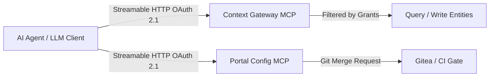

# Model Context Protocol (MCP) & AI Agents

The platform implements the open Model Context Protocol (MCP) using the official Rust `rmcp` SDK. Agents participate as first-class actors under strict identity and access governance.

## 1. Architectural Split: Two MCP Facades

1. **Context Data MCP** (Part of Context Gateway, SP-14…SP-20): Exposes spaces and endpoints as MCP Streamable HTTP servers. Tools are projected dynamically from the caller's active permissions.
2. **Configuration Plane MCP** (`POST /api/v1/mcp` on the Portal, CC-45…CC-48): Exposes blueprint instantiation, plan evaluation, and merge request proposals to autonomous agents. It is one adapter over the operation registry, so a tool call and the button a person presses run the same function ([ADR-N-021](../Decisions/adr-n-021-one-operation-registry-behind-ui-api-assistant-and-mcp.md)). It was specified as `jcctl serve --mcp` and built in the Portal instead: `jcctl` has no MCP code, and the configuration API — changes, dry runs, git, permissions — lives where the sessions and the forge credentials already are.



## 2. Standard Context Data MCP Toolset

```json
[
  {
    "name": "query_entities",
    "description": "Queries NGSI-LD context entities with optional filtering",
    "annotations": { "readOnlyHint": true },
    "inputSchema": {
      "type": "object",
      "properties": {
        "type": { "type": "string" },
        "q": { "type": "string" },
        "limit": { "type": "integer", "default": 20 }
      }
    }
  },
  {
    "name": "update_entity",
    "description": "Applies partial attribute updates to an existing entity",
    "annotations": { "destructiveHint": true },
    "inputSchema": {
      "type": "object",
      "required": ["entityId", "attributes"],
      "properties": {
        "entityId": { "type": "string" },
        "attributes": { "type": "object" }
      }
    }
  }
]
```

## 3. Configuration Plane MCP Tools (`jcctl`)

- `plan(repo, changes)`: Dry-runs a proposed manifest change, returning a structural diff.
- `list_blueprints()`: Lists blueprints available for the agent's assigned role.
- `propose_change(blueprint, params)`: Synthesizes a manifest change, branches the repository, and opens a merge request.

## 4. Prompt Injection Defense & Sandboxing

1. **Data Is Untrusted**: Payloads returned by `query_entities` are strictly isolated from tool instruction blocks.
2. **No Direct Writes**: Agents cannot issue direct writes to configuration or production data without going through a lane.
3. **Elicitation Mode**: High-risk or destructive tool executions trigger an interactive confirmation dialogue (`ConfirmRisky`) in the Portal UI before proceeding.

## Related

- [00-intro](00-intro.md) — development overview.
- [06-configuration-as-code](../Architecture/06-configuration-as-code.md) — how changes reach the platform.
