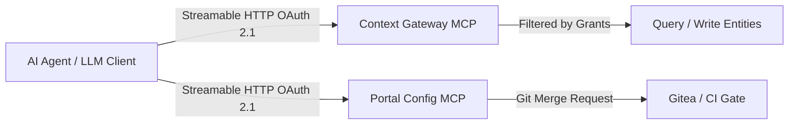

# Model Context Protocol (MCP) & AI Agents

The platform implements the open Model Context Protocol (MCP) using the official Rust `rmcp` SDK. Agents participate as first-class actors under strict identity and access governance.

## 1. Architectural Split: Two MCP Facades

1. **Context Data MCP** (Part of Context Gateway, SP-14…SP-20): Exposes spaces and endpoints as MCP Streamable HTTP servers. Tools are projected dynamically from the caller's active permissions.
2. **Configuration Plane MCP** (`POST /api/v1/mcp` on the Portal, CC-45…CC-48): Exposes blueprint instantiation, plan evaluation, and merge request proposals to autonomous agents. It is one adapter over the operation registry, so a tool call and the button a person presses run the same function ([ADR-N-021](../Decisions/adr-n-021-one-operation-registry-behind-ui-api-assistant-and-mcp.md)). It was specified as `jcctl serve --mcp` and built in the Portal instead: `jcctl` has no MCP code, and the configuration API — changes, dry runs, git, permissions — lives where the sessions and the forge credentials already are.



## 2. Standard Context Data MCP Toolset

The tools of an endpoint's façade are declared in one table, `TOOLS` in `crates/context-gateway/src/mcp/endpoint_facade.rs`, and each names the NGSI-LD operations it needs. `tools/list` returns only those the caller's grants would let through, so the tool list is itself an access decision and a tool a caller may not use is never offered.

The read side is `query_entities`, `get_entity`, `list_types`, `list_attributes`, `describe_schema`, `list_subscriptions` and `batch_query_temporal`; the write side is `upsert_entity` and `create_subscription`.

```json
[
  {
    "name": "query_entities",
    "description": "Query the entities of this context space by type and NGSI-LD filter.",
    "annotations": { "readOnlyHint": true },
    "inputSchema": {
      "type": "object",
      "properties": { "type": {}, "id": {}, "idPattern": {}, "q": {}, "limit": {} },
      "anyOf": [{ "required": ["type"] }, { "required": ["id"] }]
    }
  },
  {
    "name": "upsert_entity",
    "description": "Create or update one entity of this context space.",
    "annotations": { "destructiveHint": true },
    "inputSchema": {
      "type": "object",
      "required": ["entity"],
      "properties": { "entity": { "type": "object" } },
      "additionalProperties": false
    }
  }
]
```

The argument names are the REST surface's own, taken from the same parameter table the query string is built from, so the two cannot drift (AG-84). CIM 009 5.7.2.4 wants at least one selector and does not accept `idPattern` alone, which is why the schema asks for one of five rather than for `type`.

## 3. Configuration Plane MCP Tools

The Portal's MCP surface is an adapter over the operation registry, so every tool is an operation with a `jc_` name and the same lane, permission check and dry run as the button a person presses: `jc_catalog_search`, `jc_endpoint_propose`, `jc_pipeline_propose` with its `jc_pipeline_test` check, `jc_datasource_propose` with `jc_datasource_check`, `jc_manifest_dry_run`, `jc_project_create`, `jc_project_import`, `jc_workspace_propose`, `jc_workspace_discard` and the rest. `GET /api/v1/projects/{project}/ops` lists exactly what the caller would be let through; the registry is `joinedcontext-portal/src/ops/mod.rs`.

A propose operation does not write to a live system. It synthesises the manifest, runs the kind's check, branches the configuration repository and opens a merge request, and the lane decides who approves it.

## 4. Prompt Injection Defense & Sandboxing

1. **Data Is Untrusted**: Payloads returned by `query_entities` are strictly isolated from tool instruction blocks.
2. **No Direct Writes**: Agents cannot issue direct writes to configuration or production data without going through a lane.
3. **Elicitation Mode**: High-risk or destructive tool executions trigger an interactive confirmation dialogue (`ConfirmRisky`) in the Portal UI before proceeding.

## Related

- [00-intro](00-intro.md) — development overview.
- [06-configuration-as-code](../Architecture/06-configuration-as-code.md) — how changes reach the platform.
