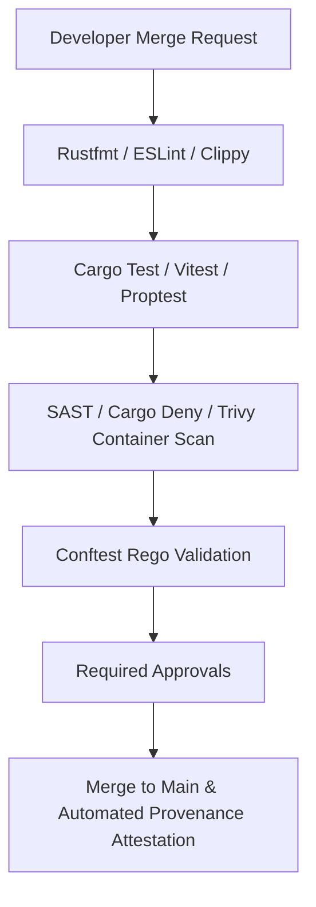

# Development Process, SSDLC & SBOM

All contributions follow the Secure Software Development Lifecycle (SSDLC) ensuring adherence to German organisational BSI TR-03187 standards.

## 1. Branching & Review Model

- **`main`**: Protected production branch. Direct pushes forbidden. Commits require passing CI and required peer reviews.
- **`develop`**: Integration branch for current release sprint.
- **`feat/*`, `fix/*`**: Developer feature branches.

## 2. SSDLC Quality Gates

Every merge request triggers automated quality pipelines:



## 3. Generating Full Software Bill of Materials (SBOM)

SBOMs are generated at build time using **Syft** in CycloneDX JSON format:

```bash
# Generate CycloneDX SBOM for Rust backend container
syft packages docker:registry.example.com/context-gateway:1.0.0 -o cyclonedx-json > context-gateway.cdx.json

# Validate and sign container image with Cosign
cosign sign --key k8s://prod/cosign-key registry.example.com/context-gateway:1.0.0
```

## Related

- [00-intro](00-intro.md) — development overview.
- [06-configuration-as-code](../Architecture/06-configuration-as-code.md) — how changes reach the platform.
