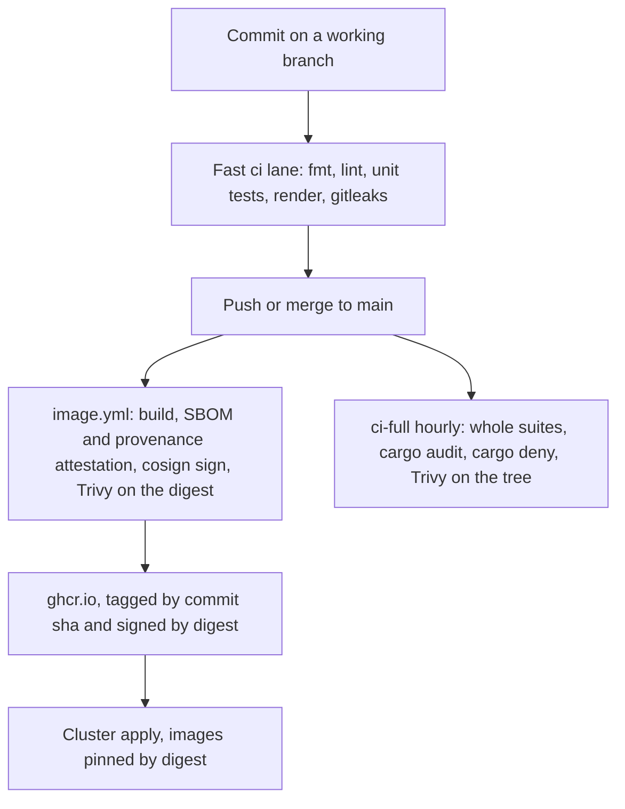

# Development Process, SSDLC & SBOM

What a contributor passes before a change lands, what runs after it lands, and what an auditor reads off a published image. The BSI TR-03187 controls this chain serves are listed in [../Architecture/13-security.md](../Architecture/13-security.md). Every command, trigger and tool below was read from the workflows and from the registry on 2026-09-20; where the chain falls short of a requirement, §4 says so instead of the page describing the intent.

## 1. How a change reaches `main`

The MVP is trunk-based. A commit reaches `main` by a push: no pull request is opened, and `main` carries no branch protection (its history is direct commits and the integrator's merges of worker branches; the public mirror of each repository answers `"protected": false` for `main` and has no pull request). The fast `ci` lane on the pushed commit is the safety net: a red `main` is fixed before new work, by fixing forward rather than by reverting or by disabling the check that caught it.

The push happens one of two ways:

- **A working branch, merged.** A worker commits on `agent/<worker>/T-<task-id>`, pushes that branch, and one integrator merges it into `main`. The pushed branch is the merge request, and nothing waits for a review.
- **Straight to `main`.** A contributor holding the whole repository commits on `main` and pushes.

Run what the gate will run before you push, over what the change touched rather than over the workspace:

| Repository | Before the push |
|---|---|
| `joinedcontext-platform`, `joinedcontext-portal` | `cargo fmt --all --check`, `cargo clippy -p <crate> --all-targets -- -D warnings`, and the test file or module you wrote |
| the Portal UI | `cd ui && pnpm lint`, then `pnpm vitest run <files>` for the tests you touched |
| `joinedcontext-deployment` | `just _dev-assemble`, then `helmfile template` and `kubeconform -strict` for the environment you changed |
| `joinedcontext-docs` | the checkers in `scripts/` that read the page you changed, then `npx markdownlint-cli@0.45.0 '**/*.md'` |

A change to a contract (a kind, a type, a URL path, a manifest field) lands in this documentation set first, in its own commit, and the code follows the pushed page.

## 2. The two lanes, per repository

Each repository runs a fast lane on pull requests and on pushes to `main`, and keeps the slow work in a second workflow. Whether that second workflow is scheduled or waits to be dispatched is an Actions-minutes decision: the three private repositories ran out of minutes once, so everything except `ci.yml` is `workflow_dispatch` there until the owner restores them. A workflow whose triggers were taken away keeps the old `push` and `schedule` lines in a comment beside its `on:` block, so putting them back is one edit. The conformance suites are dispatched for a second reason: each one takes the URL of the running system it tests.

| Repository | Fast `ci.yml` | The slow lane |
|---|---|---|
| `joinedcontext-platform` | `cargo fmt --all --check`, `cargo clippy --workspace --all-targets --locked -- -D warnings`, `cargo test --workspace --lib --bins`, `cargo doc`, the kind and configuration documentation tests, the workflow-pin check, the model-tools pytest suite, `bento lint` and `bento test` over the example pipelines, gitleaks | `ci-full.yml`, hourly at minute 7 and on demand: the whole workspace with all features and all targets, `cargo audit`, `cargo deny check advisories bans licenses sources`, Trivy over the tree |
| `joinedcontext-portal` | the same Rust legs, plus `cargo test --test openapi_tests`, the SDK (typecheck, tests, build) and the UI (`pnpm lint`, `pnpm test`, `pnpm build`), gitleaks | `ci-full.yml`, hourly at minute 7 and on demand: the whole workspace, the Playwright journeys of the SDK and of the UI, `cargo audit`, `cargo deny`, Trivy over the tree |
| `joinedcontext-deployment` | `helmfile template` per environment, `kubeconform -strict`, `conftest test --all-namespaces -p policies` (TS-19), `kyverno test .ci/policies`, gitleaks, `pytest tests` | `ci-full.yml`, on demand: the Kyverno policy suite, the README commands, the deployment variants and a k3d install |
| `joinedcontext-conformance` | shellcheck, the pinned requirements install, and the self-test of every suite's result checker | one workflow per suite (`etsi-ttf.yml`, `etsi-smoke.yml`, `mcp.yml`, `security.yml`, `e2e.yml`, `schemathesis.yml`, `k6.yml` and the rest), each dispatched with the URL of the system under test; `image.yml` on a `v*` tag |
| `joinedcontext-docs` | every checker in `scripts/`, each checker against the corpus it must reject, markdownlint, and the documented manifests through a `jcctl` built at the pinned platform tag | `docs-build.yml` on demand; `requirement-impact.yml` on a pull request that touches `Requirements/**` |

No fast lane reaches a running cluster: the deployment lane renders and validates manifests without applying them, and every conformance suite waits for a dispatch that names its target. The full ETSI test-to-fail suite is dispatched against a throwaway broker, never against a shared cluster, because it asserts refusals.



## 3. What a published image carries

`image.yml` runs on every push to `main` and on a `v*` tag in `joinedcontext-platform` and `joinedcontext-portal`, and builds with Docker Buildx under `id-token: write`. `image-ckan.yml` in `joinedcontext-deployment` builds the catalogue image the same way, and `image.yml` in `joinedcontext-conformance` runs on a `v*` tag only. Four things leave the lane with the image:

| Carried | Produced by | Detail |
|---|---|---|
| Tags | the build step | `:${{ github.sha }}` and `:main`. Everything downstream refers to the digest the step printed, never to a tag |
| An SBOM | `sbom: true` on the build | a BuildKit attestation holding an SPDX 2.3 document, scanned by Syft inside BuildKit |
| Provenance | `provenance: true` on the build | a SLSA build definition naming the workflow, the Dockerfile and the request, at BuildKit's default `min` level, so it names the build's inputs by reference and not every file read |
| A signature | `cosign sign --yes …@<digest>` | keyless, against the GitHub Actions OIDC issuer; no signing key is held anywhere |

Trivy then scans the pushed digest with `severity: HIGH,CRITICAL`, `exit-code: 1` and `ignore-unfixed: true`, so a fixable high or critical finding fails the lane after the push but before anything deploys the digest (TS-23).

Read the bill of materials of a running image with the digest, not the tag:

```bash
# The digest behind the tag, then the SBOM that is attested against it
digest=$(docker buildx imagetools inspect ghcr.io/marek-mraz/joinedcontext-portal:main \
  --format '{{ .Manifest.Digest }}')
docker buildx imagetools inspect "ghcr.io/marek-mraz/joinedcontext-portal@${digest}" \
  --format '{{ json .SBOM.SPDX }}' > portal.spdx.json
```

The document answers `SPDX-2.3`, and its creators are `Organization: Anchore, Inc`, `Tool: syft-v1.51.0` and `Tool: buildkit-v0.32.2`.

Verify the signature against the workflow that is allowed to produce it, rather than against a key:

```bash
cosign verify \
  --certificate-oidc-issuer https://token.actions.githubusercontent.com \
  --certificate-identity https://github.com/marek-mraz/joinedcontext-portal/.github/workflows/image.yml@refs/heads/main \
  "ghcr.io/marek-mraz/joinedcontext-portal@${digest}"
```

The identity is the subject alternative name in the Fulcio certificate the signature carries, which is where the two values above were read from: an image signed by any other workflow, repository or branch fails this check even though it is signed.

## 4. Where the chain and the requirements disagree

The gates above are what the workflows run today. Three statements of the requirement set are not yet true of them, and each is a task rather than a sentence this page softens:

- **OPS-41 asks for CycloneDX, the images attest SPDX 2.3.** The format is BuildKit's, and the CycloneDX lane that exists, `joinedcontext-deployment/.github/workflows/reusable-container-scan.yml`, produces `sbom.cdx.json` through Trivy and is called by no workflow in any of the five repositories. Either the image lanes attach a CycloneDX attestation beside the SPDX one, or OPS-41 names the format the platform ships; T-2412 carries the decision.
- **TS-24 asks for `npm audit` beside `cargo audit`.** Only `cargo audit` and `cargo deny` run. [../Testing/06-security-tests.md](../Testing/06-security-tests.md) records the gap and owns it.
- **Provenance is `min`, not `max`.** The attestation names the workflow, the commit and the Dockerfile; it does not list every source file of the build. Nothing in the requirement set asks for `max` yet, and raising it makes the attestation large enough to be worth a decision.

The SSDLC claim of this page is therefore the chain of §1 to §3 and nothing more: a gate that exists and blocks, plus three named gaps.

## Related

- [01-getting-started](01-getting-started.md) — running the platform in front of you before the checks above.
- [../Testing/00-strategy.md](../Testing/00-strategy.md) — which suite belongs in which lane, and what each proves.
- [../Testing/06-security-tests.md](../Testing/06-security-tests.md) — the security suites, and the audit legs that are still open.
- [../Architecture/13-security.md](../Architecture/13-security.md) — the trust zones and the TR-03187 controls this process serves.
- [../Requirements/operations.md](../Requirements/operations.md) — OPS-41, the SBOM and the remediation window.
- [../Requirements/testing.md](../Requirements/testing.md) — TS-19, TS-23 and TS-24, the gates named above.
