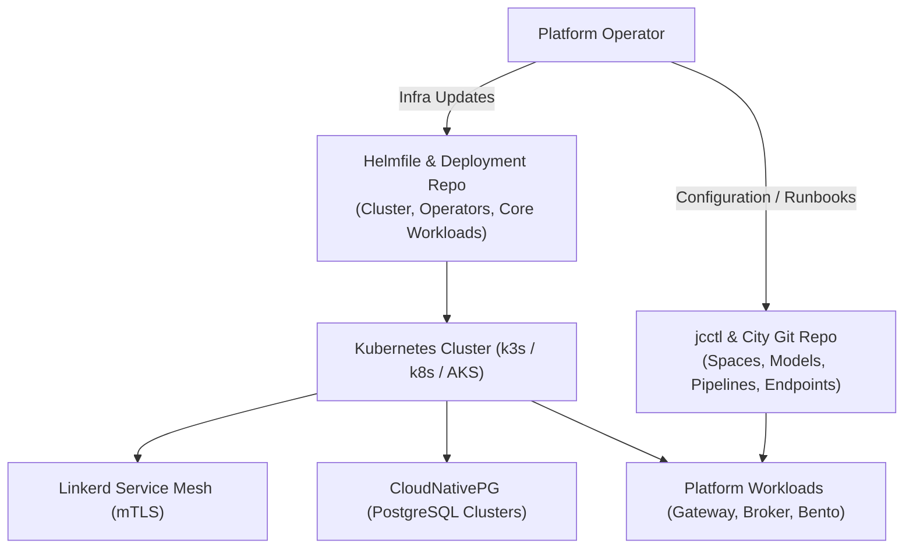

# Operations Overview

This section provides actionable operational procedures, incident response runbooks, and governance workflows for engineers managing production deployments of joinedcontext.

---

## 1. Operational Architecture

The platform's operational model separates declarative infrastructure management from GitOps-driven configuration management:

- **Infrastructure Layer:** Managed via `civitas-core-deployment` using Helmfile. Deploys base operators (CloudNativePG, Linkerd, APISIX, Gitea) and platform service pods.
- **Configuration Layer:** Managed via the City Git Repository. `jcctl` synchronizes context spaces, policies, subscriptions, Bento pipelines, and endpoints into the runtime platform.
- **Data Layer:** Context data resides in PostgreSQL managed by CloudNativePG. Transient configuration drifts are reconciled automatically against Git truth.

---

## 2. Core Operational Responsibilities

Operational duties are divided into three distinct roles:

1. **Platform Operations (DevOps / SRE):**
   - Cluster health, node capacity, and Linkerd service mesh operation.
   - Storage provisioning and CloudNativePG backup/restore verification.
   - Helmfile upgrades, container image updates, and security patch rollouts.
2. **Domain Operations (Data Stewards & Approvers):**
   - Reviewing visual plan diffs and approving Yellow/Red lane pull requests.
   - Investigating pipeline throughput bottlenecks and managing dead-letter streams.
   - Reconciling detected configuration drift using in-app Revert/Adopt tooling.
3. **Security Operations (SecOps / Compliance):**
   - Audit log reviews (Gitea history, Context Gateway decision logs, Keycloak events).
   - Emergency revocation of compromised credentials or misbehaving AI agent tokens.
   - Secret key rotations (SOPS age keys, database credentials, OAuth secrets).

---

## 3. Quick Reference Navigation

- **[Incident Runbooks](./01-runbooks.md):** Step-by-step diagnostic and remediation procedures for production alerts.
- **[Platform Governance & Approvals](./03-governance.md):** Managing approval lanes, audit trails, and privacy compliance.
- **[Deployment Troubleshooting](../Deployment/09-troubleshooting.md):** Resolving bootstrap, Helmfile, and network policy failures.
- **[Monitoring & Logging](../Deployment/05-monitoring-logging.md):** Prometheus metric alerts, Grafana dashboards, and Loki log queries.

## Related

- [Incident Runbooks](./01-runbooks.md) — referenced above.
- [Platform Governance & Approvals](./03-governance.md) — referenced above.
- [Deployment Troubleshooting](../Deployment/09-troubleshooting.md) — referenced above.
- [Monitoring & Logging](../Deployment/05-monitoring-logging.md) — referenced above.
- [08-security-hardening](../Deployment/08-security-hardening.md) — the baseline these procedures keep intact.
