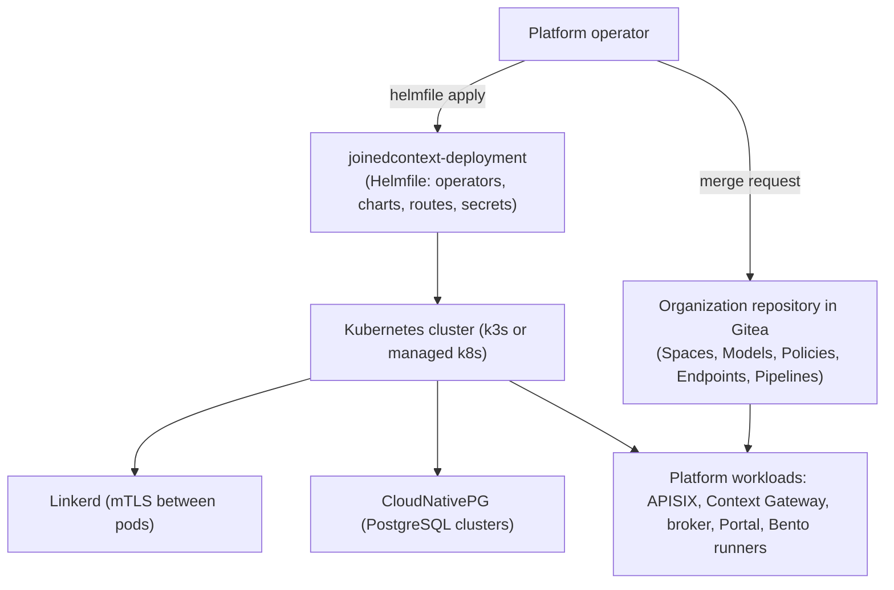

# Operations Overview

What an operator of a joinedcontext instance is responsible for, which of the two repositories each duty lives in, and where to go when something is on fire. The runbooks are in [01-runbooks.md](01-runbooks.md); this page is the map.

---

## 1. Two repositories, two planes

The platform separates the cluster from its configuration, and each plane has its own repository and its own tool.

- **Infrastructure plane.** `joinedcontext-deployment` holds one folder per component under `components/`, the environment values under `deployment/` and the entry point `helmfile-root.yaml.gotmpl`. It installs the operators (CloudNativePG, Linkerd, APISIX, Kyverno, Gitea) and every platform workload. Environment overrides never go into `components/` or `defaults/` (OPS-02), and the two profiles `global.profile` offers decide the resource and replica shape (OPS-04).
- **Configuration plane.** The organization repository in Gitea holds the manifests: Context Spaces, Data Models, Policies, Endpoints, Pipelines, Subscriptions. A change is a merge request in a lane (see [03-governance.md](03-governance.md)), and what serves a kind reads it from the repository rather than from an API (CC-72).
- **Data plane.** Context data is in PostgreSQL under CloudNativePG. History is kept until a retention is configured; see [02-capacity-and-scaling.md](02-capacity-and-scaling.md) section 3.

Two components turn a merged manifest into live state. The Portal runs the reconciler in its own process: it writes the Keycloak realm, the Subscriptions and the registrations an instance declares. `jcctl` is the repository CLI: `validate`, `plan`, `apply`, `drift` and `export` against a checkout, with `--gateway-url` for the part that reaches live state, which is the seed entities it replays through the Context Gateway (CC-50).

## 2. What an operator owns

1. **Cluster and workloads.** Node capacity, the Linkerd mesh, storage, CloudNativePG backups and their restore drills (OPS-09…OPS-12), Helmfile upgrades and image rollouts. Images are pinned by digest and signed; a rollout is a values change, never a `kubectl edit`.
2. **Configuration.** Reviewing and approving merge requests in the lanes, watching for drift between the repository and live state (`jcctl drift`), and keeping the seeded roles and policies in step with who is actually working on the instance.
3. **Security.** Reading the audit trail (forge history, the Context Gateway's decision logs, Keycloak events), revoking a leaked credential within the bound OPS-45 sets, and rotating the SOPS age key, database credentials and OAuth client secrets (OPS-37).

## 3. Where the procedures are

- [Incident runbooks](./01-runbooks.md) — drift, a failed apply, endpoint abuse, emergency revocation, key rotation, database failover and restore, runner out of memory, forge outage, disk full.
- [Capacity planning and autoscaling](./02-capacity-and-scaling.md) — replicas, runner budgets, retention.
- [Platform governance and approvals](./03-governance.md) — lanes, roles, audit queries.
- [Deployment troubleshooting](../Deployment/09-troubleshooting.md) — bootstrap, Helmfile and NetworkPolicy failures.
- [Monitoring and logging](../Deployment/05-monitoring-logging.md) — what is scraped, what is shipped, and what is off by default.

## Related

- [Incident runbooks](./01-runbooks.md) — the procedures this page maps.
- [Platform governance and approvals](./03-governance.md) — who may approve what, and what the audit trail holds.
- [Requirements/operations.md](../Requirements/operations.md) — OPS-01…OPS-45, the rules these duties implement.
- [Deployment troubleshooting](../Deployment/09-troubleshooting.md) — when the cluster itself will not come up.
- [08-security-hardening](../Deployment/08-security-hardening.md) — the baseline these procedures keep intact.
