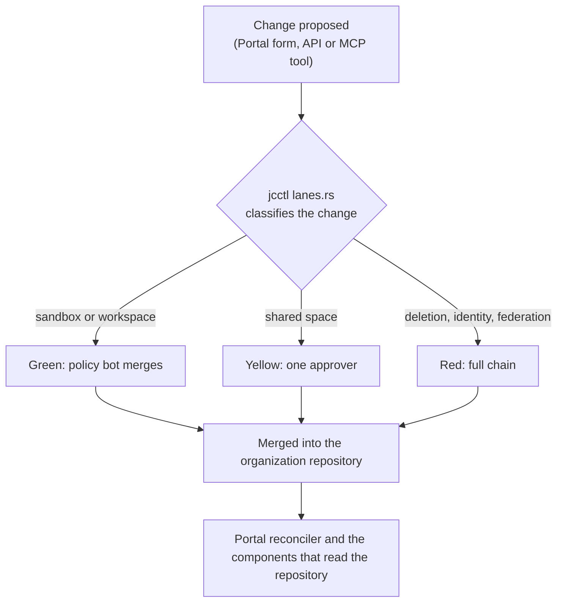

# Platform Governance, Auditing & Approvals

How a change to the platform's configuration gets approved, who may approve what, and where to look afterwards. Read this before you give somebody a role or answer an auditor.

---

## 1. The three lanes

Every configuration change is a merge request in the organization repository, and its lane decides who has to agree to it ([CC-63](../Requirements/city-as-code.md#11-interaction-lanes-and-sandboxes)).



### Lane assignment

The lane of a change is decided by `jcctl` (`crates/jcctl/src/lanes.rs`) and carried in the Change envelope the Portal renders. Three rules decide it, in this order:

1. A deletion is always red (CC-63, CC-19).
2. A change to a kind that is a federation edge or an identity decision is red whatever it does: `Organization`, `Policy`, `ScopeDefinition`, `ServiceAccount`, `SharedSpaceReference`, `DataOffer`, `DataAgreement`, `DataSpaceParticipant`, `ContextSourceRegistration`, `Role`, `RoleBinding`.
3. Everything else is green or yellow by what it touches: work inside a personal workspace or a sandbox space is green, a change to a shared Context Space is yellow.

| Lane | Approval | Who | Typical change |
|---|---|---|---|
| **Green** | The policy bot merges once CI passes | nobody, and the path is still a commit that can be reverted (CC-64) | a sandbox space, a draft pipeline, work in a personal workspace |
| **Yellow** | One approver clicks Approve in the Portal | a role whose rules grant `approve` on the kind | a pipeline writing to a shared space, a new Data Model, an Endpoint for the organization |
| **Red** | The full chain | an approver plus an organization-scoped role | any deletion, a public Endpoint, a `Policy`, a `Role` or `RoleBinding`, a registration, a data space agreement |

A public Endpoint is the one case where the verb is not enough: approving it needs a role whose `approve` rule names `spec.audience: public`, which the seeded set calls `publisher`. An approver without it is refused by name rather than silently.

### Approving one

Approvers work in the Portal, not in the forge.

1. Open **Approvals** in the Portal. The list holds the changes whose lane needs somebody, and nothing a caller may not read.
2. Read what the change does. The page renders the plan for the change: which resources are added, changed and removed, and the manifest diff behind each one.
3. Click **Approve**. The Portal checks the caller's roles for the `approve` verb on every kind the change touches, and refuses with the rule that failed. A change touching a public Endpoint needs the role whose `approve` is constrained to a public audience, `publisher` in the seeded set, and the refusal says so (EP-76, PF-71).
4. The approval is recorded on the merge request. What is merged is what the components read; nothing is applied out of band.

---

## 2. Roles as the platform seeds them

Identity comes from Keycloak over OIDC ([I1](../Requirements/policy-firewall.md#21-identity-stack-i1i4-canonical-here)). What a signed-in person may do is decided by `Role` and `RoleBinding` manifests in the organization repository, evaluated by the Portal on every request ([CC-41](../Requirements/city-as-code.md#6-roles-and-identity)); a token carries no permission of its own.

A role's rules pair kinds with verbs, and the verbs are `read`, `propose`, `approve` and `delete`. The set an instance starts from is seeded with the repository (`components/context-gateway/seed/<instance>/` in `joinedcontext-deployment`):

| Role | Verbs | Kinds | Who holds it |
|---|---|---|---|
| `viewer` | `read` | everything the project holds | every signed-in member of the organization (PF-61) |
| `pipeline-editor`, `model-editor`, `endpoint-editor`, `app-editor` | `propose` | the one kind in the name | the people who build that kind of thing |
| `steward` | `propose`, `approve` | the project's kinds | data stewards of a project |
| `approver` | `approve` | the project's kinds | whoever signs off other people's work |
| `org-admin` | `propose`, `approve`, `delete` | organization-wide | the two or three people who run the instance |

Bind a person by adding a `RoleBinding` in the repository, which is itself a red-lane change. Nobody is given a role by clicking in the Portal, and no role is granted by a Keycloak group alone.

## 3. Reading the audit trail

Three planes hold what happened, and they are correlated by time and by the identity each one records ([CC-44](../Requirements/city-as-code.md#6-roles-and-identity), OPS-42):

1. **What was configured.** Commits in the organization repository: author, approver, message, timestamp.
2. **What was decided.** The Context Gateway writes one structured JSON line per policy decision to stdout, with the operation and the verdict; the counter behind the same decisions is `jc_gateway_pdp_decisions_total`, labelled by operation and verdict.
3. **Who signed in.** Keycloak security events: logins, token issuance, failures.

None of the three stays in a pod. The `audit-logging` component runs a Vector daemonset that reads the container logs of the Context Gateway, Keycloak and the forge, and writes gzipped newline-delimited JSON to `audit/{component}/{date}/` in the artifact store's bucket, which is object-locked (OPS-42, PF-29). A record joins the trail because of the pod it came from, so no component can drop itself out of the trail by changing what it logs.

### Who changed a pipeline

```bash
git log -n 5 --pretty=format:"%h - %an (%ae), %ad : %s" \
  projects/mobility/pipelines/traffic-sensor/bento.yaml
```

### Which requests the gateway refused

Fetch the day's object from the bucket and read it with `jq`; there is no log query service in this deployment.

```bash
aws s3 cp "s3://<bucket>/audit/context-gateway/2026-09-20/" - --recursive \
  | gunzip \
  | jq -r 'select(.fields.message == "write refused" or .fields.refusal)
           | "\(.timestamp) \(.fields.slug // "-") \(.fields.refusal // .fields.message)"'
```

### What an agent proposed

```bash
git log --grep="Co-Proposed-By:" --all --pretty=fuller
```

## 4. Personal data

- **Tag it in the model.** Personal attributes in a Data Model carry W3C Data Privacy Vocabulary purpose markers ([MIM4-R10](../Requirements/access-control.md#15-mim4-personal-data-management-trust)), so a reader of the model can see which attributes are personal without opening the data.
- **Keep it out of the public Endpoint.** An Endpoint hides an attribute with `spec.hiddenAttributes`, and the gateway strips it from every representation, every file download and every notification. That is the control that decides what leaves the platform, not the tag.
- **Erasure is a write, and the platform has no command for it.** Deleting a subject today means deleting its entity through an Endpoint that grants the delete, and the temporal history with it. `jcctl` has no privacy verb, and a request that has to erase history across spaces is an operator procedure that nobody has written down yet. Do not promise an automated Article 17 workflow to a data protection officer on the strength of this page.

## 5. Routine reviews

### Every quarter: who holds which role

1. Render the effective role table from the repository:

   ```bash
   jcctl roles render --repo-dir ./<organization-repo>
   ```

2. Compare it with the people who still work here, and remove the `RoleBinding` of anybody who does not. Each removal is a red-lane change, which is the audit record of the review.
3. Check who can decrypt the repository's secrets: the public keys in `.sops.yaml`.

### Every month: the agents

- No agent holds a database or broker credential. Agents reach data through an Endpoint and its Policy, with a `ServiceAccount` client of their own.
- Every agent's client is audience-bound and short-lived. Rotate the client secret of any that is not, and read [Requirements/agents.md](../Requirements/agents.md) for what an agent's identity is required to be; DPoP proofs are named there and are not implemented today (T-2358).

## Related

- [CC-63](../Requirements/city-as-code.md) — referenced above.
- [I1](../Requirements/policy-firewall.md) — referenced above.
- [MIM4-R10](../Requirements/access-control.md) — referenced above.
- [00-intro](00-intro.md) — operations overview.
- [08-security-hardening](../Deployment/08-security-hardening.md) — the baseline these procedures keep intact.
