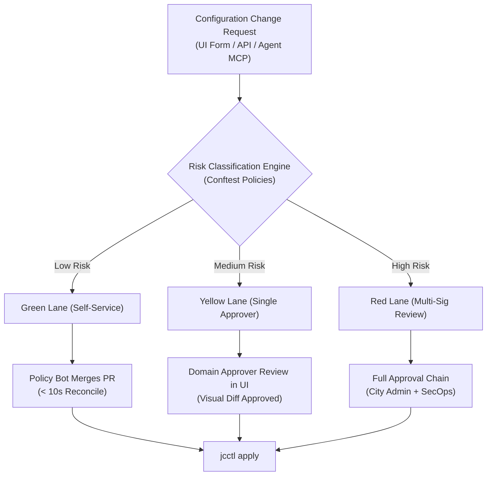

# Platform Governance, Auditing & Approvals

joinedcontext balances organisational data sovereignty, strict administrative oversight, and agile engineering self-service. This chapter establishes the operational governance procedures, approval workflows, and audit practices.

---

## 1. Interaction Lanes & Approvals in Practice

All configuration changes in the platform follow one of three risk-classified interaction lanes ([CC-63](../Requirements/city-as-code.md#11-interaction-lanes-and-sandboxes)).



### Lane Assignment Matrix

| Lane | Risk Class | Qualifying Operations | Approval Mechanism | Latency Target |
|---|---|---|---|---|
| **Green** | Low | Personal workspace spaces, private draft subscriptions, test pipelines, UI theme/dashboard styling within project | Automated policy bot merges MR upon passing CI tests | < 10 seconds |
| **Yellow** | Medium | Ingestion pipelines writing to shared Context Spaces, new Data Models, Endpoints restricted to organization | Single Domain Approver clicks "Approve" in Portal UI | Minutes to hours |
| **Red** | High | Public Endpoints, federation Context Source Registrations (CSRs), deletions of shared spaces, lane policy edits | Multi-signature: Domain Approver + City Admin / SecOps | Formal review window |

### Operationalizing Approvals

Approvers do not navigate raw git repositories. The Portal UI renders the change summary and visual plan diff:

1. Approver opens **Pending Approvals** in the Portal UI.
2. The UI displays what changes in plain language: *"Project Mobility adds an endpoint publishing 4 attributes of VehicleObserved publicly."*
3. The approver inspects the `jcctl plan` diff:
   - Green lines indicate new resources.
   - Yellow lines indicate attribute adjustments.
   - Red lines indicate resource removals.
4. Clicking **Approve** issues a signed approval to Gitea via the API, triggering immediate automated deployment.

---

## 2. Role-Based Access Control Matrix

Identity is provided by Keycloak via OIDC ([I1](../Requirements/policy-firewall.md#21-identity-stack-i1i4-canonical-here)). Rights are bound to Git ownership and Context Gateway policy evaluation ([CC-41](../Requirements/city-as-code.md#6-roles-and-identity)):

| Platform Role | Scope | Key Capabilities | Typical Assignee |
|---|---|---|---|
| **Viewer** | Organization / Project | Read-only inspection of dashboards, live context data, and flow statuses | External stakeholders, read-only staff |
| **Domain Editor** | Project | Authors pipelines, instantiates blueprints, manages spaces; submits MRs | Data Engineers, Domain Specialists |
| **Domain Approver** | Organization / Project | Reviews and approves Yellow-Lane merge requests; manages project access | Domain Leads, Data Stewards |
| **City Admin** | Organization | Full merge authority, manages lane policies, creates projects, revokes tokens | Lead IT Architects, SecOps |

---

## 3. Auditing & Forensic Queries

Every platform interaction produces an immutable audit record across three correlated planes ([CC-44](../Requirements/city-as-code.md#6-roles-and-identity)):

1. **Configuration History:** Immutable git commits in Gitea containing author identity, approver signature, and commit timestamp.
2. **Authorization Decisions:** Structured JSON logs emitted by the Context Gateway recording every allow/deny decision, user identity, and matching policy URN.
3. **Identity & Authentication:** Keycloak security events tracking logins, token exchanges, and failed authentication attempts.

### Forensic Query Examples

#### Audit Query 1: Who modified a pipeline configuration?

```bash
git log -n 5 --pretty=format:"%h - %an (%ae), %ad : %s" \
  projects/mobility/pipelines/traffic-sensor/bento.yaml
```

#### Audit Query 2: Extracting Gateway Denials from Loki

Querying all rejected requests across the last 24 hours:

```logql
{app_kubernetes_io_name="context-gateway"} 
  | json 
  | verdict = "DENY" 
  | line_format "{{.timestamp}} - Identity: {{.client_id}} - Resource: {{.target_urn}} - Reason: {{.reason}}"
```

#### Audit Query 3: Tracking Agent Autonomous Actions

Find all changes proposed or merged by an AI agent:

```bash
git log --grep="Co-Proposed-By:" --all --pretty=fuller
```

---

## 4. Data Protection & Privacy Governance (GDPR / DPV)

In compliance with European Data Protection regulations:

- **Attribute-Level Tagging:** Personal data attributes in Data Models must be tagged with W3C Data Privacy Vocabulary (DPV) purpose markers ([MIM4-R10](../Requirements/access-control.md#15-mim4-personal-data-management-trust)).
- **Automated Retention Enforcement:** Spaces storing personal context data must define automated time-to-live retention policies in their space manifest.
- **Right to Erasure (Article 17):** Executing an erasure request on an individual subject:

  ```bash
  jcctl privacy purge-subject \
    --space mobility-users \
    --subject-urn "urn:ngsi-ld:Person:hel.fi:residents:user-94812"
  ```

  The command deletes the primary entity and purges temporal historical observations from CloudNativePG.

---

## 5. Routine Operational Reviews

### Quarterly Access Review

Every 90 days, City Administrators must review active assignments:

1. Export active permissions registry:

   ```bash
   jcctl governance export-permissions --out ./audit/q3-permissions.csv
   ```

2. Verify that inactive accounts or users who changed departments have their roles revoked.
3. Review SOPS age key access lists.

### AI Agent Quota & Tool Budget Audit

SecOps audits active AI agent permissions monthly:

- Ensure agents hold zero direct database or broker write credentials.
- Verify that agent elicitation prompts and risky-action confirmations are functioning.
- Inspect agent token expiration limits (maximum 30 days before mandatory rotation).

## Related

- [CC-63](../Requirements/city-as-code.md) — referenced above.
- [I1](../Requirements/policy-firewall.md) — referenced above.
- [MIM4-R10](../Requirements/access-control.md) — referenced above.
- [00-intro](00-intro.md) — operations overview.
- [08-security-hardening](../Deployment/08-security-hardening.md) — the baseline these procedures keep intact.
