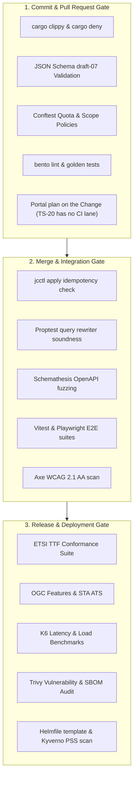

# Requirements Traceability Matrix

This document provides end-to-end traceability cross-referencing requirement families to system architecture components, design specifications, and automated verification suites.

## 1. Traceability Matrix

| Requirement Family | Focus Area | Canonical Specification | Architectural Components | Verification / CI Gates |
|---|---|---|---|---|
| **R1–R43** | Access Control & Federation | `access-control.md` | Context Gateway (PEP + in-process PDP), Context Broker (Antares) | TTF Robot Conformance Suite, Gateway Rewriter Property Tests, Integration Tests |
| **MIM0–MIM10** | OASC Interoperability | `access-control.md` (Part II) | Context Gateway, Data Models, DCAT-AP Catalog, OGC Features Translator | MIM0 API checks, Schema validation, Conformance ATS |
| **GW1–GW34** | Gateway Firewall Rules | `gateway-firewall.md` | Context Gateway (PEP), APISIX Data Plane, Antares RLS | Gateway Property Tests (`proptest`), Adversarial Bleed Corpus |
| **R44–R60** | Policy Firewall Extensions | `policy-firewall.md` | Context Gateway (the conditional-write flow); the ETag validator and the status-list verifier are designed, not built | Conditional-write tests; the revocation reaper has none yet |
| **I1–I4** | Identity & Credentials | `policy-firewall.md` | Keycloak (I1, I4); VCVerifier and the Trusted Issuers Registry (I2, I3) are designed and deployed nowhere | Keycloak OIDC and token-verification tests; no OID4VP test exists |
| **CC-01–CC-90** | Configuration-as-Code & Reconciler | `city-as-code.md` | Gitea (Org Repo), `jcctl` Reconciler, Minijinja Engine | `jcctl plan`/`apply` Idempotency Tests, Conftest Rego Gates |
| **SP-01–SP-22** | Context-Space Surface | `space-surface.md` | Context Gateway (`/cs/{space}` and every child its record names: `ngsi-ld/v1/`, `mcp`, `schema/index.json`; T-2373, T-2382), APISIX Routing, Space MCP Instance | Space Path Unit Tests, URL-to-URN Mapper Tests |
| **PF-01–PF-89** | Platform Invariants | `platform.md` | Portal API (Rust), Gitea, Reconciler, Artifact store (RustFS) | Conftest Quota Checks, URN Format Linters, DB Cascade Tests |
| **MF-01–MF-47** | Manifest Model, Import/Sync/Download | `manifests.md` | Portal API resource API, `jcctl export/import/sync`, Gitea | `import(export(x))==x` proptests, dry-run plan tests, SyncSource loop tests, conflict-policy tests |
| **EP-01–EP-77** | Endpoints & Parity | `endpoints.md` | Context Gateway, Format Translators, ArcSwap Cache | Representation Parity Tests, OGC ATS, STA Sensing Profile Suite |
| **DM-01–DM-60** | Data Models & LinkML Editor | `data-models.md` | Portal UI (LinkML Editor), Model Tools image, jcctl `model`, Context Gateway validation | Regeneration diff gate, example-validates test, JSON-LD expansion test, editor Playwright journey, breaking-change classifier tests |
| **MP-01–MP-03** | Model Projections | `model-projections.md` | jc-core kinds (`ModelProjection`), Context Gateway (R9 projection, schema surface) | Kind round-trip and model validation tests, projection gateway tests, schema surface ETag tests |
| **PL-01–PL-57** | Pipeline Execution | `pipelines.md` | Bento Streams Runner, K8s CronJob, NetworkPolicies, derived pipelines (WASM/container compute), any input the runner ships, sources, steps and outputs (ADR-N-023) | `bento lint`, Golden Transformation Tests, Stream Load Tests |
| **AG-01–AG-86** | Agents & MCP Governance | `agents.md` | Gateway MCP Façade, Portal MCP (`/api/v1/mcp`) over the operation registry, Agent Runner Addon, `jc-agent-proxy` | MCP Spec Conformance Suite, Adversarial Prompt-Injection Tests |
| **AP-01–AP-110** | Apps on Demand | `apps.md` | Portal static host, App reconciler (Endpoint+Policy from dataNeeds), in-cluster build lane Job (ADR-N-026) with SBOM, Agent Runner builder profile, APISIX edge login | dataNeeds⊆grants CI test, host-allowlist bundle scan, CSP/SRI tests, preview-sandbox e2e |
| **SDK-01–SDK-37** | App SDK | `app-sdk.md` | `@joinedcontext/sdk` and its template app (portal `sdk/`), `jc-functions` QuickJS runtime, Model Tools `gen-typescript`, Portal first run, editing agent and preview transpiler, host-page bridge | SDK vitest suites, import allow-list and bridge tests, preview e2e |
| **UI-01–UI-81** | Portal & User Interface | `portal-and-ui.md` | Portal UI (React 19), Portal API (Rust), MapLibre / deck.gl | Playwright E2E, Vitest Unit Tests, Axe WCAG 2.1 AA Audits |
| **TS-01–TS-25** | Testing & Quality | `testing.md` | CI Pipelines, Test Harnesses, Fuzzing Frameworks | Cargo Clippy, Schemathesis, K6 Load Tests, Trivy Scans |
| **OPS-01–OPS-51** | Operations & Reliability | `operations.md` | Helmfile Deployments, CNPG Operator, Linkerd mTLS | Kyverno Policy Scans, Disaster Recovery Replay Drills |
| **DS-01–DS-20** | Data Space Connector | `data-space.md` | Connector addon (post-MVP, engine not chosen), ODRL mapper, Context Gateway, OpenBao | DSP conformance kit, negotiation-to-Policy tests, token revocation tests |

## 2. Quality Gate Mapping

## Related

- [00-index](00-index.md) — every requirement family and what it covers.
- [compliance-matrix](compliance-matrix.md) — the per-requirement state and the tests that prove it.
- [Testing/00-strategy.md](../Testing/00-strategy.md) — how the gates below are run.
