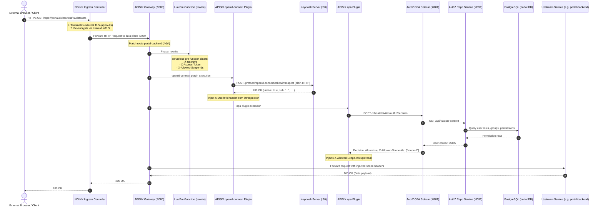

# Legacy Deployment Security and Routing Research

This research report evaluates the security architecture, edge ingress routing, identity configuration, and operational controls of the legacy platform deployment repository (`civitas-core-deployment`). It establishes an exhaustive layer-by-layer inventory of inherited mechanisms, diagrams the legacy request traversal and header-clearing pipeline, catalogs verified security gaps from deployment artifacts and conformance statements, and details the component transition matrix to the joinedcontext platform baseline. Platform security engineers and operators should use this document as the reference rationale for the phase-1 security and edge deployment.

## 1. Scope and Research Methodology

The analysis evaluates the declarative configuration files, Helm templates, container image definitions, and policy manifests preserved in the `civitas-core-deployment` repository. The evaluation covers the following artifacts:

- **Platform Defaults and Global Settings:** `defaults/environment/global.yaml`, `defaults/environment/security.yaml.gotmpl`, `defaults/environment/networkpolicies.yaml.gotmpl`, `defaults/environment/secrets.yaml.gotmpl`, `defaults/environment/apisix-routes.yaml.gotmpl`, `defaults/environment/apisix-plugins.yaml.gotmpl`, `defaults/environment/keycloak-clients.yaml.gotmpl`, and `defaults/environment/_helpers.tpl`.
- **APISIX API Gateway:** `components/apisix/civitas-component.yaml`, `components/apisix/charts.yaml`, `components/apisix/charts/configuration/templates/configuration.yaml`, `components/apisix/charts/configuration/templates/linkerd-policy.yaml`, `components/apisix/charts/configuration/values.yaml`, `components/apisix/values/apisix/base-values.yaml.gotmpl`, `components/apisix/values/apisix/production-values.yaml.gotmpl`, `components/apisix/networkpolicies.yaml`, `components/apisix/networkpolicies-linkerd.yaml`, and `components/apisix/secrets.yaml`.
- **Authorization Engine and Open Policy Agent (OPA):** `components/authz/charts/authz/templates/opa-deployment.yaml`, `components/authz/charts/authz/templates/authz-deployment.yaml`, `components/authz/networkpolicies.yaml`, and `components/authz/networkpolicies-linkerd.yaml`.
- **Identity and Access Management (Keycloak):** `components/keycloak/values/app/base-values.yaml.gotmpl`, `components/keycloak/values/config/base-values.yaml.gotmpl`, `components/keycloak/keycloak-clients.schema.json`, and `components/keycloak/networkpolicies.yaml`.
- **Policy Enforcement and Validation:** `.ci/policies/base/*` (vendored Kyverno Pod Security Standards), `.ci/policies/production/*` (high-availability rules), and `components/runtime-policies/charts/runtime-policies/files/*` (in-cluster runtime policies).
- **Cluster Preparation and Secret Generation:** `components/prepare/helmfile.yaml.gotmpl` and `components/secrets/charts/secrets-generator/templates/secrets.yaml`.
- **Component Route Definitions:** `components/portal/apisix-routes.yaml`, `components/portal/apisix-plugins.yaml`, `components/frost/apisix-routes.yaml`, `components/frost/apisix-plugins.yaml`, `components/keycloak/apisix-routes.yaml`, `components/keycloak/apisix-plugins.yaml`, `components/superset/apisix-routes.yaml`, and `components/superset/apisix-plugins.yaml`.
- **Security Conformance Audits:** `civitas-core-docs_v2/Architecture/Architecture_General/TR-Conformance-Statement.md` and `civitas-core-docs_v2/Architecture/Architecture_General/Security_Architecture_Principles.md`.

## 2. Layer-by-Layer Inventory of Inherited Security Controls

The legacy deployment structured security into multiple overlapping layers. The tables below capture the controls, defining templates, default parameters, and evidence paths in `civitas-core-deployment`.

### Edge Ingress and TLS Termination

| Control | Defined In | Default Setting | Evidence Path |
|---|---|---|---|
| Ingress Controller | `global.yaml` | Class `nginx` (`global.ingress.ingressClass`) | `defaults/environment/global.yaml` |
| TLS Certificate Issuance | `global.yaml` | ClusterIssuer `selfsigned-ca` (dev) / `letsencrypt-prod` (prod) | `defaults/environment/global.yaml` |
| Ingress Resource Generation | `base-values.yaml.gotmpl` | Enabled; creates one host rule per route with `subDomain` | `components/apisix/values/apisix/base-values.yaml.gotmpl` |
| TLS Secret Name | `base-values.yaml.gotmpl` | Static secret `apisix-tls` covering all route subdomains | `components/apisix/values/apisix/base-values.yaml.gotmpl` |
| Ingress Buffer Hardening | `base-values.yaml.gotmpl` | Proxy buffer size 16k, buffers number 4, busy buffers 24k | `components/apisix/values/apisix/base-values.yaml.gotmpl` |

### Gateway Data Plane

| Control | Defined In | Default Setting | Evidence Path |
|---|---|---|---|
| Gateway Technology | `charts.yaml` | Apache APISIX Helm chart 2.15.0, app image 3.17.0-ubuntu | `components/apisix/charts.yaml` |
| Data Plane Port & Service | `base-values.yaml.gotmpl` | Container port 9080, Service type `ClusterIP` | `components/apisix/values/apisix/base-values.yaml.gotmpl` |
| Worker Process Pinning | `production-values.yaml.gotmpl` | Pinned to 2 workers (prod) / 1 worker (dev) to match CPU limits | `components/apisix/values/apisix/production-values.yaml.gotmpl` |
| Trusted Proxy Addresses | `base-values.yaml.gotmpl` | `127.0.0.1`, `10.0.0.0/8`, `172.16.0.0/12`, `192.168.0.0/16` | `components/apisix/values/apisix/base-values.yaml.gotmpl` |
| Read-Only Root Filesystem | `base-values.yaml.gotmpl` | `readOnlyRootFilesystem: true` via init container emptyDir copies | `components/apisix/values/apisix/base-values.yaml.gotmpl` |

### Gateway Control Plane and Administration

| Control | Defined In | Default Setting | Evidence Path |
|---|---|---|---|
| Admin API Listener | `base-values.yaml.gotmpl` | Enabled on port 9180; ingress disabled | `components/apisix/values/apisix/base-values.yaml.gotmpl` |
| Admin Access Restriction | `base-values.yaml.gotmpl` | `ipList: [0.0.0.0/0]` (permissive, marked with TODO comment) | `components/apisix/values/apisix/base-values.yaml.gotmpl` |
| Admin Credentials | `secrets.yaml` | Secret `apisix-admin-credentials` (admin/viewer keys, 16 chars) | `components/apisix/secrets.yaml` |
| External Storage Backend | `base-values.yaml.gotmpl` | External etcd cluster (`etcd.enabled: false`) with user `apisix` | `components/apisix/values/apisix/base-values.yaml.gotmpl` |
| Static Route Provisioning | `configuration.yaml` | Post-install batch Job executing raw curl PUTs to Admin API | `components/apisix/charts/configuration/templates/configuration.yaml` |
| Upstream TLS Verification | `configuration.yaml` | Hard-coded `tls: { verify: false }` on all HTTPS upstreams | `components/apisix/charts/configuration/templates/configuration.yaml` |
| Default Gateway Timeouts | `configuration.yaml` | Connect 6s, send 6s, read 6s across all services | `components/apisix/charts/configuration/templates/configuration.yaml` |

### Policy Enforcement and Decision Chain

| Control | Defined In | Default Setting | Evidence Path |
|---|---|---|---|
| Policy Engine Stack | `civitas-component.yaml` | OPA (Open Policy Agent) sidecar + Spring Boot `authz` repo | `components/authz/civitas-component.yaml` |
| OPA Deployment | `opa-deployment.yaml` | OPA server running on port 8181; args load policies and data | `components/authz/charts/authz/templates/opa-deployment.yaml` |
| Repository Data Source | `authz-configmap.yaml` | Hikari pool (max 5) connecting read-only to portal PostgreSQL | `components/authz/charts/authz/templates/authz-configmap.yaml` |
| Policy Decision Hook | `apisix-plugins.yaml` | APISIX `opa` plugin calls `http://authz-authz-opa:8181` | `components/portal/apisix-plugins.yaml` |
| Policy Decision Path | `apisix-plugins.yaml` | Policy rule `civitas/authz/decision` | `components/portal/apisix-plugins.yaml` |
| Scope Header Forwarding | `apisix-plugins.yaml` | Injects decision header `X-Allowed-Scope-Ids` upstream | `components/portal/apisix-plugins.yaml` |

### Identity and Access Management

| Control | Defined In | Default Setting | Evidence Path |
|---|---|---|---|
| IAM Technology | `charts.yaml` | Keycloak 26.6.4 (codecentric/keycloakx chart 7.2.0) | `components/keycloak/charts.yaml` |
| Proxy Mode | `base-values.yaml.gotmpl` | `proxy.mode: xforwarded`, `http.enabled: true` | `components/keycloak/values/app/base-values.yaml.gotmpl` |
| Cluster Clustering Protocol | `base-values.yaml.gotmpl` | JGroups KUBE_PING (Linkerd skipped ports 7800, 57800) | `components/keycloak/values/app/base-values.yaml.gotmpl` |
| Realm Automation | `charts.yaml` | `keycloak-config-cli` chart 1.3.7 executing in post-install Job | `components/keycloak/charts.yaml` |
| Token Lifetimes | `base-values.yaml.gotmpl` | Access token 300s (5m), SSO idle 3600s (1h), SSO max 36000s (10h) | `components/keycloak/values/config/base-values.yaml.gotmpl` |
| Cryptographic Algorithms | `base-values.yaml.gotmpl` | ES256 for token signatures, HmacSHA256 for OTP, Argon2id | `components/keycloak/values/config/base-values.yaml.gotmpl` |
| Brute Force Protection | `base-values.yaml.gotmpl` | Lockout after 10 failures, 15m max wait, 60s increment | `components/keycloak/values/config/base-values.yaml.gotmpl` |
| Token Validation at Gateway | `apisix-plugins.yaml` | APISIX `openid-connect` plugin; HTTP introspection | `components/portal/apisix-plugins.yaml` |

### Cryptographic Secrets Management

| Control | Defined In | Default Setting | Evidence Path |
|---|---|---|---|
| Secret Generator Chart | `charts.yaml` | In-tree Helm chart `charts/secrets-generator` | `components/secrets/charts.yaml` |
| Generation Mechanism | `_helpers.tpl` | Helm `lookup` checks existing secret; generates random alphanumeric | `components/secrets/charts/secrets-generator/templates/_helpers.tpl` |
| Secret Lifecycle Policy | `secrets.yaml` | Annotated with `helm.sh/resource-policy: keep` to prevent delete | `components/secrets/charts/secrets-generator/templates/secrets.yaml` |
| Multi-Namespace Fanout | `helmfile.yaml.gotmpl` | Copies identical generated secret into all `componentNamespaces` | `components/secrets/helmfile.yaml.gotmpl` |
| External Secrets Store | N/A | None; secrets exist purely as Kubernetes Secret objects at rest | `components/secrets/` |

### Network Policy Boundaries

| Control | Defined In | Default Setting | Evidence Path |
|---|---|---|---|
| Ingress Filtering | `networkpolicies.yaml.gotmpl` | Auto-generates `default-deny-<component>` with `policyTypes: [Ingress]` | `defaults/environment/networkpolicies.yaml.gotmpl` |
| Egress Filtering | `networkpolicies.yaml.gotmpl` | Missing; no egress rules exist in default platform templates | `defaults/environment/networkpolicies.yaml.gotmpl` |
| Cross-Namespace Resolution | `base-values.yaml.gotmpl` | Translates `componentNamespace` to `kubernetes.io/metadata.name` | `components/networkpolicies/values/networkpolicies/base-values.yaml.gotmpl` |
| Service Mesh Port Openings | `networkpolicies-linkerd.yaml` | Opens Linkerd proxy ports 4143, 4190, 4191 between components | `components/apisix/networkpolicies-linkerd.yaml` |
| APISIX Public Access | `networkpolicies.yaml` | Allows port 9080 from CIDR `0.0.0.0/0` | `components/apisix/networkpolicies.yaml` |

### Service Mesh and Mutual TLS

| Control | Defined In | Default Setting | Evidence Path |
|---|---|---|---|
| Service Mesh Engine | `global.yaml` | Linkerd 2.x (`global.serviceMesh.type: linkerd`) | `defaults/environment/global.yaml` |
| Inbound Policy Enforcement | `global.yaml` | `defaultInboundPolicy: cluster-authenticated` (mandatory mTLS) | `defaults/environment/global.yaml` |
| Namespace Injection | `helmfile.yaml.gotmpl` | `prepare` hook annotates namespaces with `linkerd.io/inject=enabled` | `components/prepare/helmfile.yaml.gotmpl` |
| Edge Ingress Exemption | `linkerd-policy.yaml` | Linkerd `Server` resource scopes port 9080; sets `accessPolicy` | `components/apisix/charts/configuration/templates/linkerd-policy.yaml` |
| Unauthenticated Ingress Flag | `global.yaml` | `allowUnauthenticatedIngress: false` (requires meshed ingress) | `defaults/environment/global.yaml` |

### Admission and Runtime Policy Enforcement

| Control | Defined In | Default Setting | Evidence Path |
|---|---|---|---|
| Shift-Left Manifest Auditing | `.ci/policies/base/*` | Vendored Kyverno PSS baseline and restricted profile policies | `.ci/policies/base/` |
| Shift-Left Hygiene Checks | `.ci/policies/base/*` | Requires read-only rootfs, health probes, explicit ingress class | `.ci/policies/base/` |
| In-Cluster Runtime Engine | `helmfile.yaml.gotmpl` | Deploys `runtime-policies` Helm chart via `deployLayer: operators` | `components/runtime-policies/helmfile.yaml.gotmpl` |
| Runtime Mesh Invariants | `linkerd-policies.yaml` | Validates presence of `linkerd-proxy` sidecar and inbound policy | `components/runtime-policies/charts/runtime-policies/templates/linkerd-policies.yaml` |
| Mesh Opt-Out Audit | `justify-linkerd-inject-opt-out.yaml` | Requires `mesh.civitas-core/opt-out-reason` if injection is disabled | `components/runtime-policies/charts/runtime-policies/files/justify-linkerd-inject-opt-out.yaml` |
| Label Anti-Spoofing Rules | `operator-policies.yaml` | Restricts operator ServiceAccounts from setting spoofed Pod labels | `components/runtime-policies/charts/runtime-policies/templates/operator-policies.yaml` |
| Runtime Failure Action | `global.yaml` | `failureAction: Enforce` (blocks violating admissions in cluster) | `defaults/environment/global.yaml` |

### Pod Hardening Baseline

| Control | Defined In | Default Setting | Evidence Path |
|---|---|---|---|
| Execution Identity | `security.yaml.gotmpl` | `runAsNonRoot: true`, `runAsUser: 1000`, `fsGroup: 1000` | `defaults/environment/security.yaml.gotmpl` |
| Privilege Escalation | `security.yaml.gotmpl` | `allowPrivilegeEscalation: false` | `defaults/environment/security.yaml.gotmpl` |
| Linux Capabilities | `security.yaml.gotmpl` | `capabilities.drop: [ALL]` | `defaults/environment/security.yaml.gotmpl` |
| Filesystem Mutability | `security.yaml.gotmpl` | `readOnlyRootFilesystem: true` | `defaults/environment/security.yaml.gotmpl` |
| Seccomp Hardening | `security.yaml.gotmpl` | `seccompProfile.type: RuntimeDefault` | `defaults/environment/security.yaml.gotmpl` |

## 3. End-to-End Request Traversal and Header Sanitization

Traffic entering the legacy platform traverses an ingress controller, the APISIX gateway, and an authorization chain before reaching protected upstream services. The sequence diagram below traces a protected API call.



### Analysis of Legacy Header Sanitization

The legacy platform mitigated header injection attacks by attaching a Lua script via the `serverless-pre-function` plugin on protected routes (`components/portal/apisix-plugins.yaml`):

```lua
return function()
  ngx.req.clear_header("X-Userinfo")
  ngx.req.clear_header("X-Access-Token")
  ngx.req.clear_header("X-Allowed-Scope-Ids")
end
```

This defense has three structural vulnerabilities:

1. **Unscrubbed Tenant Headers:** The script did not clear `NGSILD-Tenant`. A malicious client could supply an arbitrary tenant header that traversed untouched into the backend.
2. **Missing Endpoint Metadata Stripping:** The script did not clear `X-Endpoint-Slug` or `X-Consumer-Identity`.
3. **Route Coverage Gaps:** The pre-function was declared individually in per-component plugin definitions. Routes missing this configuration passed raw client headers directly to upstreams.

## 4. Identity Architecture and Session Lifecycle

Identity management in the legacy deployment relies on Keycloak managed by `keycloak-config-cli`.

### Keycloak Realm Configuration

The instance realm (`components/keycloak/values/config/base-values.yaml.gotmpl`) is configured with the following parameters:

- **Token Lifetimes:** Access token lifespan is 300 seconds (5 minutes). The SSO session idle timeout is 3,600 seconds (1 hour). Maximum SSO session lifespan is 36,000 seconds (10 hours).
- **Master Admin Hardening:** The master realm enforces a stricter 1,800-second (30-minute) session idle timeout and requires a 20-character password policy with uppercase, lowercase, digits, and special characters.
- **Brute-Force Protection:** Permanent lockout is disabled; accounts lock after 10 consecutive failures (`failureFactor: 10`). Maximum failure wait is 900 seconds (15 minutes), minimum wait is 60 seconds, and delta time is 43,200 seconds (12 hours).
- **Cryptographic Algorithms:** Default token signature algorithm is ES256 (`ecdsa-generated` provider on curve P-256). RSA-256 and HMAC-512 key providers are explicitly deactivated. One-Time Password (OTP) generation uses `HmacSHA256` with 6 digits and a 30-second period.
- **Authentication Flows:** A custom browser flow integrates conditional two-factor authentication (2FA). Users with configured TOTP or WebAuthn tokens are prompted for second factors; users without credentials proceed without prompts.

### Client Topology and Introspection Bottlenecks

The gateway authenticates requests using the confidential Keycloak client `apisix-validator` (`components/apisix/keycloak-clients.yaml`). In the legacy route configuration (`components/portal/apisix-plugins.yaml`), the gateway performs synchronous token validation by issuing a network call:

```text
POST /realms/{realm}/protocol/openid-connect/token/introspect
```

This design has notable operational drawbacks:

- **High Latency Overhead:** Every API request triggers a network hop from APISIX to Keycloak over HTTP.
- **Insecure Transport:** The introspection URL uses `http://keycloak-app-keycloakx-http...:80` with `ssl_verify: false`.
- **Shared Secret Exposure:** The confidential client secret `APISIX_VALIDATOR_CLIENT_SECRET` must be provisioned across multiple namespaces.

## 5. Multi-Instance Architecture and Operator Sharing

The legacy deployment repository supports multi-tenant isolation via the `deployLayer` variable across three execution modes:

1. **Legacy All-in-One (`deployLayer: ""`):** Deploys all components, databases, and operators into a single instance namespace (`helmfile -f deployment/helmfile.yaml sync`).
2. **Shared Operator Layer (`deployLayer: "operators"`):** Deploys shared cluster operators (CloudNativePG, Strimzi Kafka, Kyverno ClusterPolicies) once per cluster into the namespace defined in `global.operators.namespace` (defaulting to `civitas-operators`).
3. **Dedicated Instance Layer (`deployLayer: "instance"`):** Deploys instance-specific components (APISIX, Keycloak, PostgreSQL cluster, web workloads) into the instance namespace (`deployment/helmfile-instance.yaml.gotmpl`).

### Pod Label Anti-Spoofing Controls

Because Kubernetes `NetworkPolicy` resources authorize traffic based on `app.kubernetes.io/name` labels, compromised operators or stray workloads could claim privileged labels to bypass network boundaries. The legacy chart `components/runtime-policies` deploys three Kyverno `ClusterPolicy` resources to counter this threat:

- `restrict-cnpg-operator-pod-labels`: Restricts pods created by `postgres-operator-cloudnative-pg` to the label values `cloudnative-pg` and `postgresql`.
- `restrict-strimzi-operator-pod-labels`: Restricts pods created by `strimzi-cluster-operator` to `kafka`, `entity-operator`, `strimzi-kafka-operator`, `kafka-exporter`, and `cruise-control`.
- `protect-operator-owned-labels`: Denies pods carrying `app.kubernetes.io/name: postgresql` or `kafka` unless created by the designated operator ServiceAccount username.

## 6. Gap Analysis and Security Risk Register

The analysis of `civitas-core-deployment` and `civitas-core-docs_v2/Architecture/Architecture_General/TR-Conformance-Statement.md` identified twelve concrete security gaps.

| Gap ID | Description | Severity | Evidence in Legacy Repository | joinedcontext Resolution |
|---|---|---|---|---|
| **SEC-GAP-01** | Gateway Omits Response Security Headers (HSTS, CSP, X-Frame-Options) | Medium | `components/apisix/values/apisix/base-values.yaml.gotmpl` (Issue deployment#242) | APISIX `response-rewrite` plugin injects HSTS, CSP, and X-Content-Type-Options headers. |
| **SEC-GAP-02** | Workloads Lack Dedicated ServiceAccounts and Auto-Mount API Tokens | Medium | `components/authz/charts/authz/values.yaml` (Issue deployment#209) | Dedicated ServiceAccounts per component with `automountServiceAccountToken: false`. |
| **SEC-GAP-03** | Mutable Image Tags and Insecure Image Pull Policies | Medium | `components/authz/values/authz/base-values.yaml.gotmpl` (`pullPolicy: Always`, deployment#278) | Mandatory SHA-256 digest pinning and `pullPolicy: IfNotPresent` across all charts. |
| **SEC-GAP-04** | NetworkPolicy Resolver Fails Open on Unresolved Namespaces | High | `components/networkpolicies/values/networkpolicies/base-values.yaml.gotmpl` (deployment#255) | Template engine halts with a `fail` error if a target namespace cannot be resolved. |
| **SEC-GAP-05** | Total Absence of Egress Network Policies Across All Components | High | `defaults/environment/networkpolicies.yaml.gotmpl` (policyTypes: [Ingress] only) | Dual `Ingress` and `Egress` default-deny with explicit destination IP and port allowlists. |
| **SEC-GAP-06** | Insecure Plaintext HTTP Token Introspection with Disabled TLS Verify | High | `components/portal/apisix-plugins.yaml` (`ssl_verify: false`) | In-memory cryptographic JWKS validation using Linkerd mTLS over HTTPS. |
| **SEC-GAP-07** | APISIX Admin API Exposed on Cluster Network with Permissive IP Whitelist | Critical | `components/apisix/values/apisix/base-values.yaml.gotmpl` (`ipList: [0.0.0.0/0]`) | Admin API physically disabled (`admin.enabled: false`) via standalone file mode (ADR-N-007). |
| **SEC-GAP-08** | Clustered etcd Infrastructure Overhead and Out-of-Band State Drift | Medium | `components/apisix/values/apisix/base-values.yaml.gotmpl` (`externalEtcd` config) | Complete removal of etcd cluster; routes declared in `apisix.yaml` managed by `jcctl`. |
| **SEC-GAP-09** | Hard-Coded Basic Authentication Credentials Injected at Gateway | Medium | `components/frost/apisix-plugins.yaml` (`Authorization: Basic d3JpdGU6d3JpdGU=`) | Native Context Gateway PEP replaces legacy FROST basic auth injection. |
| **SEC-GAP-10** | Multi-Hop Decision Latency (30–80 ms) and Query Privilege Bleed | High | `components/authz/charts/authz/templates/opa-deployment.yaml` | In-process Rust PDP evaluating compiled `Policy` entities with AST rewriting (ADR-N-003). |
| **SEC-GAP-11** | Unrestricted Message Bus Reachability and Missing Topic Authorization | Medium | `components/postgres/networkpolicies.yaml` (deployment#245) | Elimination of Kafka bus; internal pipelines use isolated Bento streams (ADR-N-006). |
| **SEC-GAP-12** | Absence of Formal Vulnerability Triage SLA and Automated Artifact Signing | Medium | `civitas-core-docs_v2/Architecture/Architecture_General/TR-Conformance-Statement.md` (platform#1473) | Enforced 7-day critical vulnerability triage SLA and automated SLSA Level 3 image signing. |

## 7. Component Transition and Verdict Matrix

The table below documents the disposition of each legacy deployment component within the joinedcontext platform architecture.

| Legacy Component / Mechanism | Legacy Implementation | Verdict | Governing ADR | joinedcontext Replacement Target |
|---|---|---|---|---|
| **APISIX Ingress Controller** | Disabled in values (`ingress-controller.enabled: false`) | **Drop** | ADR-N-007 | Native Kubernetes Ingress or APISIX direct LoadBalancer. |
| **APISIX Data Plane** | Apache APISIX 3.17.0 over port 9080 | **Keep with Change** | ADR-N-007 | Standalone declarative YAML mode (`conf/apisix.yaml`). |
| **APISIX Admin API & etcd** | Admin API :9180 backed by clustered etcd | **Drop** | ADR-N-007 | Admin API and etcd eliminated; zero runtime mutable API. |
| **Static Configuration Job** | Alpine/curl hook Job pushing routes via curl | **Drop** | ADR-N-007 | Replaced by `jcctl` compiling declarative ConfigMaps. |
| **OPA & AuthZ Repository** | OPA sidecar + Spring Boot Java SQL adapter | **Drop** | ADR-N-003 | Context Gateway in-process PDP with native AST rewriter. |
| **Keycloak Identity Provider** | Keycloak 26.6.4 Quarkus on CloudNativePG | **Keep with Change** | ADR-N-001 | Retained as central OIDC/OID4VCI; token introspection dropped. |
| **CloudNativePG Operator** | CloudNativePG operator managing PostgreSQL | **Keep** | ADR 004 | Retained as database cluster manager for all profiles. |
| **Linkerd Service Mesh** | Linkerd 2.x with `cluster-authenticated` policy | **Keep** | ADR 024 | Mandatory mTLS retained across all instance namespaces. |
| **Kyverno Runtime Policies** | ClusterPolicies in `civitas-operators` | **Keep with Change** | Architecture/13 | Retained with `failureAction: Enforce` and egress checks. |
| **secrets-generator Chart** | In-tree Helm chart with `lookup` function | **Keep with Change** | ADR-N-012 | Retained for bootstrap secrets; CaC secrets use SOPS+age. |
| **networkpolicies Chart** | In-tree Helm chart with Ingress-only default-deny | **Keep with Change** | Deployment/08 | Dual Ingress and Egress default-deny with fail-closed resolver. |
| **Spring Boot Microservices** | `portal-backend`, `config-adapters` | **Drop** | ADR-N-001 | Portal API (Rust Axum) and `jcctl` reconciler. |
| **Apache NiFi & Kafka Bus** | NiFi pipelines + Strimzi Kafka cluster | **Drop** | ADR-N-006 | Bento pipeline runners in resident Streams Mode. |

## 8. Open Research Questions

The following questions require operational validation during the phase-1 deployment rollout:

1. **Ingress Controller mTLS Integration:** In environments where the edge Ingress Controller cannot be injected with a Linkerd proxy (e.g. host-level ingress in virtual clusters), evaluate whether direct LoadBalancer exposure of APISIX should be standard to avoid `allowUnauthenticatedIngress: true` (`<to verify>`).
2. **Keycloak Brute-Force Production Tuning:** Verify whether the default `failureFactor: 10` and `maxFailureWaitSeconds: 900` settings require relaxation for high-density programmatic API clients, or if gateway-level rate limiting prevents account lockouts (`<to verify>`).
3. **Kyverno In-Cluster Admission Impact:** Measure latency impact of `failureAction: Enforce` across high-frequency CronJob pod creation cycles in production clusters (`<to verify>`).
4. **APISIX Standalone Pre-Flight Syntax Validation:** Determine whether `apisix -c /path/to/apisix.yaml test` can be reliably executed inside CI pipelines before updating production ConfigMaps (`<to verify>`).

## Related

- [Security Hardening](../Deployment/08-security-hardening.md) — normative phase-1 deployment hardening guide.
- [Edge Routing Specification](../Deployment/10-edge-routing-apisix.md) — technical specification of APISIX standalone routing.
- [Security Architecture](../Architecture/13-security.md) — overarching trust zone model and TR-03187 alignment.
- [ADR-N-007 Standalone APISIX](../Decisions/adr-n-007-apisix-standalone-no-etcd.md) — architectural decision eliminating etcd and the Admin API.
