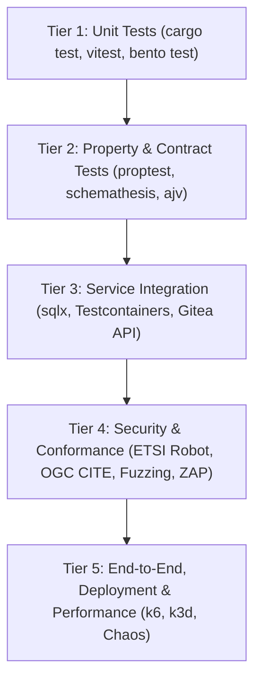

# Testing Strategy & Quality Gates

This chapter defines the normative verification framework for the next-generation joinedcontext platform. Every component, manifest, translation layer, and deployment artifact must pass automated gates prior to merging or release.

Testing guarantees the architectural invariants established across the platform:

- The Context Broker remains a vanilla, spec-compliant ETSI GS CIM 009 engine ([CC-01](../Requirements/city-as-code.md#1-architecture-and-source-of-truth)).
- The Context Gateway enforces strict fail-closed authorization, AST query rewriting, and tenant isolation without query parameter leaks ([R1–R15](../Requirements/access-control.md#1-architecture-and-enforcement-point), [GW1–GW31](../Requirements/gateway-firewall.md#1-verdicts-the-three-levels)).
- The org repository remains the sole source of truth for platform configuration ([CC-02](../Requirements/city-as-code.md#1-architecture-and-source-of-truth)), reconciled idempotently by `jcctl` ([CC-18](../Requirements/city-as-code.md#3-reconciler-jcctl)).
- All user-facing APIs, representation serializers, and data-flow pipelines operate predictably under load.

---

## 1. The Test Pyramid

The platform enforces a five-tier testing pyramid. Lower tiers provide immediate feedback in local development and commit hooks; upper tiers evaluate end-to-end system properties and resilience in continuous integration.



### Tier 1: Unit Testing

- **Rust Backend:** Crate-level unit tests testing pure functions, parsers, serializers, and state machines. Executed via `cargo test --workspace --lib`.
- **Frontend:** Isolated component testing using Vitest and React Testing Library. Executed via `pnpm test:unit`.
- **Pipelines:** Processor logic and transformation validation using native Bento unit testing via `bento test ./...`.

### Tier 2: Property-Based & Contract Testing

- **Property-Based Verification:** Evaluates mathematical invariants of the policy engine and representation serializers using `proptest`. Generates thousands of arbitrary request/policy pairs to prove absence of privilege bleed ([R57](../Requirements/policy-firewall.md#33-correctness--verification-the-actual-blockers)).
- **API Contract Verification:** Validates that OpenAPI schemas generated by `utoipa` in `portal-api` match runtime responses using `schemathesis`. Confirms that the generated TypeScript client (`openapi-typescript`) compiles cleanly against the frontend.

### Tier 3: Service Integration Testing

- **Database Integration:** Exercises data-access layers against real PostgreSQL instances using `sqlx::test` with per-test transaction rollbacks.
- **Service Boundaries:** Validates HTTP interactions between `portal-api`, `jcctl`, and the local Gitea instance using Testcontainers or in-memory wiremock servers.

### Tier 4: Security & Conformance Testing

- **Standards Conformance:** Validates the Context Gateway and Context Broker against the official ETSI NGSI-LD Testing Task Force suite, OGC TEAM-ENGINE for OGC API Features, and SensorThings API conformance suites.
- **Security Scans:** Integrates static analysis (`cargo deny`, `semgrep`), dynamic penetration scanning (OWASP ZAP baseline), container vulnerability assessments (Trivy), and secret leakage detection (`gitleaks`).

### Tier 5: Deployment, End-to-End & Performance Testing

- **Ephemeral Cluster Integration:** Deploys full platform releases into short-lived `k3d` clusters using Helmfile. Executes Playwright browser journeys that exercise real UI interactions without mocked backend APIs.
- **Performance & Chaos:** Executes k6 load scenarios verifying throughput and sub-10ms latency budgets. Injects chaos drills (broker crashes, forge partitions, database failovers) to verify graceful degradation ([CC-55](../Requirements/city-as-code.md#9-non-functional)).

---

## 2. Environment Boundaries & Data Policy

In compliance with BSI TR-03187 requirement **ORG-7** (Tests and developments must not run on production environments), testing is strictly isolated across distinct environments.

| Environment | Purpose | Target Infrastructure | Data Profile |
|---|---|---|---|
| **Local / Dev** | Feature development and unit tests | Local workstation, Docker, k3d | Ephemeral synthetic fixtures |
| **CI Runner** | Merge request validation and gating | Ephemeral containerized runners, k3d | Deterministic synthetic datasets |
| **Staging** | Pre-release qualification, integration | Dedicated Kubernetes cluster | Anonymized or generated synthetic datasets |
| **Production** | Live organisational operations | Production Kubernetes cluster | Authoritative live operational data |

### Synthetic Test Data Policy

1. **Zero Production Data in Pre-Production:** Real citizen data, personal identifiers, production credentials, or unredacted IoT streams must never be imported into Development, CI, or Staging environments.
2. **Deterministic Seed Generation:** Test data must be produced via reproducible generators using deterministic seeds. For entity generation, tests use `fake-rs` or custom generators producing valid URNs per [ADR-N-001](../Decisions/adr-n-001-rust-typescript-stack.md).
3. **Data Model Conformance:** All synthetic entities must validate against the published JSON Schema draft-07 schemas derived from the LinkML domain models ([CC-12](../Requirements/city-as-code.md#2-repository-and-manifest-model)).

---

## 3. CI Quality Gates

Every pull request and merge to the main branch is subjected to mandatory quality gates executed in Gitea Actions.

| Gate Identifier | Stage / Scope | Tooling & Checks | Blocking? | Failure Resolution Owner |
|---|---|---|---|---|
| `gate-lint-rust` | Code Style / Linting | `cargo fmt --check`, `cargo clippy --all-targets -- -D warnings` | Yes | Committer |
| `gate-lint-ts` | Code Style / Linting | `pnpm lint`, `pnpm typecheck`, Prettier | Yes | Committer |
| `gate-unit-backend` | Unit Tests | `cargo test --workspace --lib` | Yes | Committer |
| `gate-unit-frontend`| Unit Tests | `vitest run --coverage` | Yes | Committer |
| `gate-proptest` | Correctness Invariants| `cargo test -p context-gateway --test proptests` | Yes | Security / Core Team |
| `gate-manifest-schema`| Configuration | `jcctl validate --schema-dir ./schemas` | Yes | Committer |
| `gate-conftest` | Policy As Code | `conftest test ./projects/... -p ./policies` | Yes | Author / Approver |
| `gate-plan-diff` | GitOps Review | `jcctl plan --diff` published as MR comment | Yes | Reviewer / Approver |
| `gate-pipeline-lint`| Ingestion Streams | `bento lint ./projects/**/bento.yaml`, `bento test` | Yes | Pipeline Author |
| `gate-security-sast`| Security Scan | `gitleaks detect`, `cargo deny check`, `trivy fs` | Yes | Committer / SecOps |
| `gate-e2e-playwright`| User Journeys | Playwright running on ephemeral k3d deployment | Yes | QA / Fullstack Dev |
| `gate-conformance` | Standards Compliance| Robot Framework against Context Gateway endpoint | Yes | Core Team |
| `gate-performance` | Latency / Throughput | k6 load scenario against staging baseline | Yes (if >5% regr.) | Core Team |

---

## 4. Code Coverage & Ratchet Policy

Code coverage is monitored continuously. The platform enforces a non-decreasing "coverage ratchet" policy: a merge request is blocked if it decreases test coverage for any affected component.

```text
Minimum Required Coverage Baselines:
├── crates/context-gateway   : 85% line coverage, 80% branch coverage
├── crates/jcctl           : 85% line coverage, 80% branch coverage
├── crates/portal-api        : 80% line coverage, 75% branch coverage
├── crates/shared-kinds      : 90% line coverage, 85% branch coverage
└── apps/portal-ui           : 75% line coverage, 70% branch coverage
```

Coverage is measured in CI using `cargo-tarpaulin` or `cargo-llvm-cov` for Rust crates, and `@vitest/coverage-v8` for frontend applications. Pull requests that introduce complex logic paths without corresponding unit or property tests are rejected automatically.

---

## 5. Flakiness Quarantine Policy

Flaky tests erode confidence in the CI pipeline. To maintain high engineering velocity while preserving strict gates, the platform employs a structured quarantine procedure:

1. **Detection:** A test that fails intermittently without code changes (e.g. failing in 1 of 5 retries on identical git commits) is flagged automatically by the CI test reporter.
2. **Quarantine Tagging:**
   - In Rust: Test attribute is updated to `#[ignore = "quarantine: issue #<id>"]`.
   - In TypeScript: Test is flagged with `test.skip('quarantine: issue #<id>', ...)`.
   - In Playwright: Test is moved to `tests/quarantine/`.
3. **Tracking & SLA:** A high-priority defect ticket must be logged immediately. The quarantined test must be root-caused, fixed, and un-quarantined within **7 calendar days**. If unresolved within 7 days, the ticket escalates to a release blocker.
4. **Isolated Quarantine Execution:** Quarantined tests continue to execute in a non-blocking diagnostic CI job to gather telemetry and debug logs under load.

---

## 6. Definition of Done (DoD) per Change Type

A task or merge request cannot be closed or merged until all applicable Definition of Done criteria are fulfilled.

### A. Rust Backend Changes (`context-gateway`, `jcctl`, `portal-api`)

- [ ] Unit tests added for all new functions and branch conditions.
- [ ] Property-based tests updated or added if authorization, query rewriting, or data mapping logic was modified.
- [ ] Database schema changes backed by clean `sqlx` migration files with matching rollback/test suites.
- [ ] OpenAPI specification updated automatically via `utoipa`, and generated TypeScript client regenerated without compile errors.
- [ ] Zero warnings reported by `cargo clippy --all-targets -- -D warnings`.
- [ ] Code formatted per `cargo fmt`.
- [ ] Coverage meets or exceeds the component baseline.

### B. TypeScript Frontend Changes (`portal-ui`)

- [ ] Visual components covered by Vitest and React Testing Library tests.
- [ ] New user workflows covered by an end-to-end Playwright journey executing against real UI controls.
- [ ] Automated accessibility verification (`axe-core`) confirms zero WCAG 2.1 AA violations.
- [ ] Translation keys added across all supported locales (`sk`, `en`, `de`, `cs`) and validated via `pnpm i18n:validate`.
- [ ] Responsive design verified across mobile, tablet, and desktop viewports.
- [ ] Production build succeeds without warnings (`pnpm build`).

### C. Manifest & Blueprint Changes (`projects/`, `blueprints/`)

- [ ] Manifest validates against published JSON Schema draft-07 schemas (`jcctl validate`).
- [ ] Conftest policies pass without violation (risk class, quotas, role restrictions).
- [ ] Blueprint template expansion verified to be deterministic and pure (byte-identical across runs).
- [ ] `jcctl plan` diff verified and reviewed in the pull request.
- [ ] Idempotency confirmed: applying the change twice yields an empty diff on the second run.

### D. Pipeline Changes (`bento.yaml`)

- [ ] Pipeline passes `bento lint`.
- [ ] Golden input-to-output test cases pass via `bento test`.
- [ ] External network dependencies declared and matched against NetworkPolicy egress allowlists.
- [ ] Credentials referenced strictly via `secretRefs`; no plaintext tokens present.

### E. Helm Chart & Infrastructure Changes (`components/`, `helmfile.yaml`)

- [ ] Manifests render cleanly via `helmfile template`.
- [ ] Manifests pass Kyverno Pod Security Standards (PSS) restricted profile scan.
- [ ] Clean deployment and rollback tested on an ephemeral `k3d` test cluster.
- [ ] NetworkPolicies updated to maintain default-deny posture.

### F. Documentation Changes

- [ ] Relative links verified; no broken anchor tags or missing references.
- [ ] Any updated API behavior reflected in relevant OpenAPI specs and user guides.
- [ ] ADR published if architectural boundaries or non-negotiable decisions were altered.

## Related

- [CC-01](../Requirements/city-as-code.md) — referenced above.
- [R1–R15](../Requirements/access-control.md) — referenced above.
- [GW1–GW31](../Requirements/gateway-firewall.md) — referenced above.
- [R57](../Requirements/policy-firewall.md) — referenced above.
- [testing](../Requirements/testing.md) — the TS requirements.
