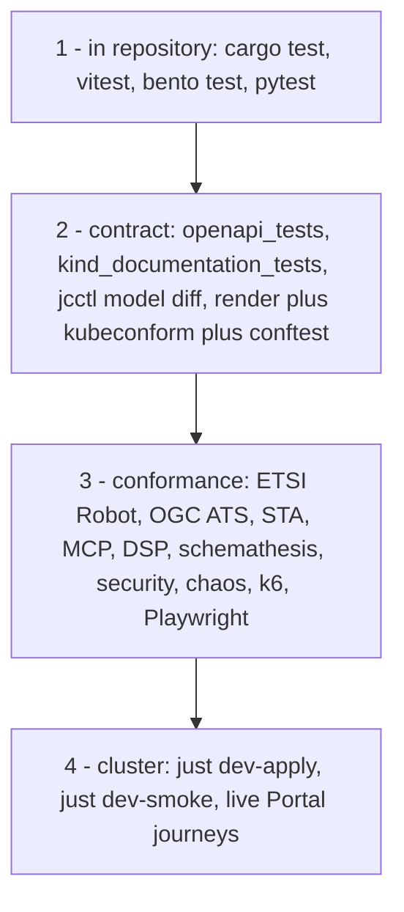

# Testing Strategy & Quality Gates

This page tells you which checks a change has to pass, where each suite lives and which lane runs it. Read it before your first commit to any of the five repositories; the pages after it describe the suites themselves. Everything below was read off the workflows and the test trees on 2026-09-20, and a claim the code does not support is listed in section 6 rather than written as fact.

Testing holds the invariants the architecture rests on:

- The Context Broker stays a vanilla ETSI GS CIM 009 engine ([CC-01](../Requirements/city-as-code.md#1-architecture-and-source-of-truth)), so the ETSI suite runs against the broker alone and against the same data through the gateway.
- The Context Gateway fails closed, rewrites queries and keeps spaces apart with no leak through a query parameter ([R1–R15](../Requirements/access-control.md#1-architecture-and-enforcement-point), [GW1–GW31](../Requirements/gateway-firewall.md#1-verdicts-the-three-levels)).
- The organization repository stays the single source of truth ([CC-02](../Requirements/city-as-code.md#1-architecture-and-source-of-truth)), reconciled without surprises by `jcctl` ([CC-18](../Requirements/city-as-code.md#3-reconciler-jcctl)).
- Every representation of an endpoint answers within its budget and shows the same data as every other one.

---

## 1. Four layers, and where each one lives

### Layer 1: in the repository

| Where | Command | Covers |
|---|---|---|
| `joinedcontext-platform` | `cargo test --workspace --lib --bins --locked` | `crates/jc-core`, `crates/context-gateway`, `crates/jcctl`, `crates/agent-proxy`, `crates/functions` |
| `joinedcontext-platform` | `cargo test -p <crate> --test <file>` | the integration tests beside each crate, one file per behaviour |
| `joinedcontext-platform` | `bento lint ./examples/ingestion/*/bento.yaml`, `bento test ./examples/ingestion/...` | pipeline processors and their golden cases |
| `joinedcontext-platform` | `pytest -q` in `tools/model-tools` | the model generator and its TypeScript output |
| `joinedcontext-portal` | `cargo test --workspace --lib --bins` | the axum API, the reconciler and the app lanes |
| `joinedcontext-portal` | `pnpm lint`, `pnpm test`, `pnpm build` in `ui/` and in `sdk/` | React components and hooks, one test file per screen under `ui/tests/` |
| `joinedcontext-deployment` | `pytest tests -q` | the rendered manifests, the chart values and the edge contracts |
| `joinedcontext-docs` | the checkers under `scripts/` | links, front matter, traceability, and what the pages assert about the code |

Test binaries in the Rust repositories are integration tests, so the fast lane's `--lib --bins` does not run them. A change that alters a shape has to be run with the whole crate, `cargo test -p <crate>`, or the fast lane will pass a break.

### Layer 2: contract

The generated surface is checked against its own consumers inside the repository that produces it: `cargo test --test openapi_tests` in the Portal (the OpenAPI document matches the routes), `cargo test -p jc-core --test kind_documentation_tests` in the platform (every manifest kind is documented), `jcctl model diff --repo-dir examples/datamodels` (the committed artifacts are the ones the generator renders), and `helmfile template` plus `kubeconform -strict` plus `conftest test -p policies` for every deployment environment.

### Layer 3: conformance

`joinedcontext-conformance` holds the suites that need a running system. Its own fast lane proves the runners rather than the platform: every Robot suite dry-runs, every pytest suite collects, and each verdict script has a `--selftest` that feeds it a broken result and expects red. The suites themselves are dispatched against a deployment.

| Suite | Where | Runs against |
|---|---|---|
| ETSI NGSI-LD smoke, 31 cases | `tests/etsi/smoke.robot` | the gateway on `dev` |
| ETSI NGSI-LD Testing Task Force | `tests/etsi-ttf/` | a throwaway broker in CI, never `dev` |
| Gateway transparency | `tests/etsi-ttf/compare_transparency.py` | broker and gateway side by side |
| OGC API Features Part 1 ATS | `tests/ogc/` through TEAM Engine | an endpoint's `ogc/features/` surface |
| SensorThings Sensing Profile | `tests/sta/` | an endpoint's `sta/v1.1/` surface, by assertions on the bodies |
| MCP framing and isolation | `tests/mcp/` | the per-space and per-endpoint MCP surfaces |
| Dataspace Protocol TCK | `tests/dsp/` | the connector |
| OpenAPI fuzzing | `tests/schemathesis/` | the Portal API and the gateway |
| Access control, representations, agent red-teaming | `tests/security/` | two spaces, one without a grant |
| Data models and mapping parity | `tests/models/` | the published artifacts and both mapping engines |
| DCAT-AP record and CKAN publication | `tests/ckan/` | the artifact store and CKAN |
| Chaos drills | `tests/chaos/` | a deployment with a fault injected |
| Load and endurance | `tests/k6/` | the gateway and one endpoint |
| Browser journeys, WCAG scan | `e2e/` | a live Portal |

`scripts/generate-qualification-report.py` aggregates the suite reports into one verdict; `allow_missing` names the suites a run may skip without failing the gate.

### Layer 4: cluster

One cluster, `dev`, is both the workbench and the demo target. It is applied from `main` with `just dev-apply` and checked with `just dev-smoke` from `joinedcontext-deployment`, once an hour, batching everything that went green since the last apply. The full ETSI Testing Task Force suite is never pointed at `dev`; only `tests/etsi/smoke.robot` touches it.

---

## 2. The two CI lanes

Every repository has a fast lane named `ci` and a slow lane. The fast lane is the merge gate: it runs on every pull request and on every push to `main`, and it stays under five minutes. Actions minutes are metered on the three private repositories and ran out once, so there the slow lanes are `workflow_dispatch` only until the owner restores them, with the former `push` and `schedule` lines kept in a comment beside each `on:`.

| Repository | `ci` runs | Slow lane | Trigger |
|---|---|---|---|
| `joinedcontext-platform` | workflow pin check, `cargo fmt --all --check`, `cargo clippy --workspace --all-targets --locked -- -D warnings`, `cargo test --workspace --lib --bins --locked`, `cargo doc -p jc-core`, kind documentation, model generator pytest and `jcctl model diff`, `bento lint` and `bento test`, gitleaks | `ci-full`: `cargo test --workspace --all-targets --all-features`, `cargo audit`, `cargo deny check`, Trivy filesystem | hourly schedule and on demand |
| `joinedcontext-portal` | the same Rust gates, `cargo test --test openapi_tests`, the SDK lane (`pnpm typecheck`, `pnpm test`, `pnpm build`), the UI lane (`pnpm lint`, `pnpm test`, `pnpm build`), the reference apps, gitleaks | `ci-full`: whole workspace with all features, `cargo audit`, `cargo deny check`, Trivy, Playwright journeys for `ui/`, the SDK and each app | hourly schedule and on demand |
| `joinedcontext-deployment` | `just _dev-assemble`, then per environment `helmfile template`, `kubeconform -strict`, image digest check, `conftest test -p policies`, rendered-secret and gitleaks scans, the golden object list in `.ci/golden/local.txt`, Kyverno policy unit tests, `pytest tests -q` | `ci-full`: Kyverno applied to rendered output, README commands, `scripts/test-deployment-variants.sh` and a k3d deployment | on demand |
| `joinedcontext-conformance` | shellcheck, Robot dry runs, pytest collection, the `--selftest` of every verdict script, and the analysers that need no deployment (pipeline escape, project isolation, the forge side doors, the compliance and security gates) | one workflow per suite, plus `compliance`, `qualification-report`, `forge-side-door` and `readme` | on demand, each with its target URL as an input |
| `joinedcontext-docs` | the checkers under `scripts/`, each with its own `--selftest`, markdownlint, and the truth gate against checkouts of the two public repositories | `docs-build` | on demand |

`image.yml` in the platform and the Portal builds, signs and pushes the image by digest on every push to `main`. It is an artifact lane, not a verdict: `dev-apply` deploys what it publishes, so it is queued per ref instead of cancelled.

---

## 3. What has to be green before a change lands

Trunk based, no branch protection, no pull requests for the MVP. The fast lane is the safety net.

1. Before the push, run only what the change touches: the test file or module you wrote (`cargo test -p <crate> --test <file>`, `pnpm vitest run <files>`, the render and `kubeconform` of the one chart), plus `cargo fmt --check` and `cargo clippy -p <crate> -- -D warnings`, or `pnpm lint` and `pnpm typecheck` for TypeScript.
2. Right after the push, write the edge cases for what landed: empty input, an unknown name, no permission, a conflict, a red verdict, a secret typed into a field. They do not block the first push; the change is not done without them.
3. The slow lanes are nobody's wait. `ci-full` fires on its own schedule, the cluster apply and the suites run in the hourly batch, and a red lane becomes a task.

A red `main` comes before new work. Fix it forward: never revert without a task, never force-push, never disable or weaken a check to get green.

---

## 4. Environments and test data

`deployment/helmfile.yaml` defines eight environments: `testing`, `local`, `production`, `staging`, `smoke-test`, `dev`, `recovery-test` and `addons` for the optional add-ons. CI renders and gates each of them. One of them exists as a cluster today, the single-node `dev`, which is why a demo and a fix cycle share it.

| Environment | Purpose | Runs where | Data |
|---|---|---|---|
| `local` | a developer's own render and unit runs | workstation, k3d | fixtures in the test trees |
| `testing`, `smoke-test`, `recovery-test` | the CI render gate, the k3d deployment test and the recovery drill | ephemeral runners | generated, thrown away with the cluster |
| `dev` | the one live cluster: workbench and demo target | single-node k3s | seeded synthetic entities |
| `staging`, `production` | rendered and gated, not yet deployed | not created yet | live data once they exist |

### Test data

1. No production data outside production. Real personal identifiers, production credentials and unredacted observation streams never enter a fixture, a test cluster or a CI run.
2. Fixtures are committed and deterministic. The suites read them from `tests/*/fixtures/`, so two runs of the same commit compare.
3. Every entity id a test mints follows `urn:ngsi-ld:{Type}:{orgDomain}:{space}:{localId}`, and the gateway refuses any other prefix with 400. A suite pointed at another deployment therefore takes that deployment's organization domain as an input.
4. No secret, live host or real person appears in a fixture or on a page. Secrets reach a workload by `secretRef` and are resolved by the reconciler.

---

## 5. Definition of Done per change type

### A. Rust changes in `joinedcontext-platform` or `joinedcontext-portal`

- [ ] Unit tests for the new functions and for each branch, in the crate that owns the logic.
- [ ] An integration test file for the behaviour a caller sees, named after that behaviour.
- [ ] Edge cases covered: empty, unknown name, no permission, conflict, malformed input.
- [ ] `cargo fmt --all --check` and `cargo clippy --workspace --all-targets -- -D warnings` clean, with no `allow(...)` added.
- [ ] No `unwrap`, `expect` or panic on a request path.
- [ ] A shape change run with the whole crate, not only the fast lane's `--lib --bins`.
- [ ] The OpenAPI document regenerated by `utoipa` and `cargo test --test openapi_tests` green.

### B. TypeScript changes in `ui/` or `sdk/`

- [ ] A test file under `ui/tests/` for the screen or hook, exercising the control a person clicks.
- [ ] `pnpm lint` and `pnpm typecheck` clean, with no `any` and no `ts-ignore`.
- [ ] Keyboard path and screen reader labels checked; the WCAG scan in `e2e/accessibility/wcag.spec.ts` stays green.
- [ ] Every new string added to `ui/src/locales/en.json`, `sk.json`, `cs.json` and `de.json`; `ui/tests/i18n.test.tsx` and the locale style test prove it.
- [ ] `pnpm build` succeeds, which runs `tsc -b` over the tests as well.

### C. Manifest and blueprint changes

- [ ] `jcctl validate --repo-dir <path>` passes.
- [ ] `conftest` policies pass: quotas, permitted types, role restrictions.
- [ ] Blueprint expansion asserted byte identical across runs.
- [ ] `jcctl plan --repo-dir <path>` read before the change is applied, and applying twice yields an empty second plan.

### D. Pipeline changes

- [ ] `bento lint` passes over the manifest.
- [ ] Golden input to output cases pass via `bento test`, or `jcctl pipeline test --pipeline <manifest.yaml> --sample <file>` for a sample file.
- [ ] Egress hosts declared and matched against the NetworkPolicy allowlist.
- [ ] Credentials by `secretRef` only, never a literal token.

### E. Chart and deployment changes

- [ ] `scripts/render.sh <env> <out>` renders every environment, `kubeconform -strict` and `conftest` pass.
- [ ] Kyverno restricted profile passes on the rendered output.
- [ ] Images pinned by digest; the digest check in the render job proves it.
- [ ] `.ci/golden/local.txt` updated in the same commit when the object list changes, and the diff explained in the commit message.
- [ ] NetworkPolicies still default deny.

### F. Documentation changes

- [ ] The docs fast lane green, including the truth gate: every path, environment variable and operation a page names exists in the code.
- [ ] Contract changes land here first, in their own commit, before the code that follows them.
- [ ] An ADR published when a boundary or a non-negotiable decision moves.

---

## 6. What the requirements ask for and is not built yet

These are open requirements, not descriptions of the platform. A reader comparing this page with [Requirements/testing.md](../Requirements/testing.md) meets them first, so they are named here.

- **TS-01** asks for unit test coverage verified in CI. No coverage tool is configured in any repository; the lanes assert that the tests pass, not how much they cover.
- **TS-02**, **TS-03** ask for property-based tests with `proptest` over query rewriting and the representation translators. `proptest` is in no manifest. Those invariants are covered today by hand written cases: the gateway's edge-case test files and the representation parity suite in `tests/security/representations.py`.
- **TS-20** asks CI to post the `jcctl plan` diff as a merge request comment. No workflow runs `jcctl plan`; the MVP has no pull requests to comment on.
- **TS-24** asks for `npm audit` beside `cargo audit`. Only `cargo audit` and `cargo deny check` run, in the hourly `ci-full` lane.

## Related

- [01-backend-tests.md](01-backend-tests.md) — the Rust suites and how to run one.
- [02-conformance-tests.md](02-conformance-tests.md) — the standards suites and their verdict scripts.
- [06-security-tests.md](06-security-tests.md) — the access control, injection and secret hygiene suites.
- [testing](../Requirements/testing.md) — the TS family this page is verified against.
- [13-security.md](../Architecture/13-security.md) — the trust zones and the BSI TR-03187 controls the security suites check.
