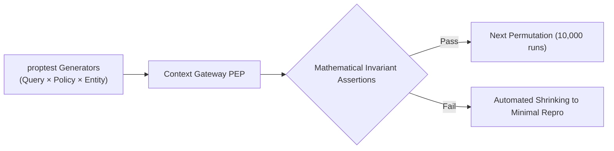

# Backend & Crate Testing

This chapter details the testing architectures and harnesses implemented across the Rust backend crates:

- `context-gateway`: The security Policy Enforcement Point (PEP), representation translator, and MCP server.
- `jcctl`: The reconciliation engine, blueprint expander, and configuration manager.
- `portal-api`: The platform management web service and OpenAPI provider.
- `shared-kinds`: Shared AST definitions, manifest envelopes, and serialization primitives.

---

## 1. Property-Based Testing in `context-gateway`

The Context Gateway sits on the critical security path between external callers and the Context Broker. Standard unit tests with static fixtures cannot exhaustively explore the combinatorial space of user queries, entity schemas, and authorization rules.

The gateway uses `proptest` to mathematically prove six core security properties ([R57](../Requirements/policy-firewall.md#33-correctness--verification-the-actual-blockers)).



### Invariant 1: Read Soundness

No entity or attribute returned by a rewritten query may fall outside the mathematical union of grants defined in applicable policies.

`for every entity e in Results(rewrite(Q)): e ∈ ⋃ Grants(p) over all applicable policies p`

```rust
// crates/context-gateway/tests/proptest_soundness.rs
use proptest::prelude::*;
use context_gateway::authz::{rewrite_query, evaluate_grants};
use shared_kinds::fixtures::*;

proptest! {
    #![proptest_config(ProptestConfig::with_cases(10000))]
    #[test]
    fn prop_read_soundness(
        user_query in arb_ngsi_query(),
        policies in arb_policy_set(),
        entities in arb_entity_database()
    ) {
        let rewritten = rewrite_query(&user_query, &policies).unwrap();
        let accessible = execute_mock_query(&rewritten, &entities);
        let allowed_union = evaluate_grants(&policies);

        for entity in accessible {
            prop_assert!(allowed_union.allows_entity(&entity),
                "Security violation: Entity {:?} escaped policy constraints!", entity.id);
            for (attr, _) in entity.properties {
                prop_assert!(allowed_union.allows_attribute(&entity.id, &attr),
                    "Security violation: Attribute {:?} escaped projection!", attr);
            }
        }
    }
}
```

### Invariant 2: Write Soundness

A write operation (create, update, append, delete) must be denied unless the entire payload conforms to at least one single policy grant. Writes cannot span an amalgamation of partial permissions ([GW16](../Requirements/gateway-firewall.md#4-reads-vs-writes)).

`Verdict(W) = ALLOW ⇒ there exists a policy p such that W ⊆ Grants(p)`

### Invariant 3: Response Projection Validity

Stripping ungranted attributes from an entity must preserve structural NGSI-LD validity. Mandatory core attributes (`id`, `type`) must never be stripped, and stripped entities must serialize cleanly without empty objects ([R9](../Requirements/access-control.md#2-granularity)).

### Invariant 4: Masking & Existence Side-Channel Protection

Retrieving an existing entity that the caller is forbidden to read must return HTTP 404 rather than HTTP 403, preventing resource enumeration attacks ([R20](../Requirements/access-control.md#5-requesting-extra-data)).

`Exists(E) ∧ ¬CanRead(U, E) ⇒ Status(U, E) = 404`

### Invariant 5: Idempotent AST Rewriting

Parsing an NGSI-LD query into an AST, folding scope constraints into regular expression conditions ([ADR-N-006](../Decisions/adr-n-006-bento-pipelines-supersede-nifi.md)), and serializing back to a query string must be strictly idempotent:

`Rewrite(Rewrite(Q)) ≡ Rewrite(Q)`

### Invariant 6: Tenant Pinning Invariance

Any `NGSILD-Tenant` header supplied by an untrusted client must be unconditionally stripped and replaced by the tenant resolved from authentication claims ([GW20](../Requirements/gateway-firewall.md#5-tenants-pinning-and-chaining)).

---

## 2. Representation Translator Round-Trip Tests

The Context Gateway projects native NGSI-LD entities into multiple output formats through dedicated Endpoint slugs ([SP-03](../Requirements/space-surface.md#1-url-scheme)). Round-trip property tests verify lossless bidirectional transformations:

```rust
// crates/context-gateway/tests/proptest_translators.rs
use proptest::prelude::*;
use context_gateway::translators::*;

proptest! {
    #[test]
    fn prop_ngsild_geojson_roundtrip(entity in arb_spatial_ngsild_entity()) {
        let feature = ngsild_to_geojson_feature(&entity).unwrap();
        let reconstructed = geojson_feature_to_ngsild(&feature).unwrap();
        
        prop_assert_eq!(entity.id, reconstructed.id);
        prop_assert_eq!(entity.entity_type, reconstructed.entity_type);
        prop_assert_eq!(entity.geometry(), reconstructed.geometry());
    }

    #[test]
    fn prop_ngsild_concise_roundtrip(entity in arb_normalized_entity()) {
        let concise = normalized_to_concise(&entity).unwrap();
        let normalized = concise_to_normalized(&concise).unwrap();
        prop_assert_eq!(entity, normalized);
    }
}
```

---

## 3. Reconciler (`jcctl`) Testing

The `jcctl` CLI and daemon automate the convergence of Git manifests to live platform state.

### Plan and Apply Idempotency

Executing `jcctl apply` twice consecutively against the same repository commit must produce an empty diff on the second execution ([CC-18](../Requirements/city-as-code.md#3-reconciler-jcctl)):

```rust
// crates/jcctl/tests/idempotency.rs
#[tokio::test]
async fn test_apply_idempotency() {
    let mock_broker = MockNgsiBroker::start().await;
    let repo_path = fixtures_path("test-city-repo");

    let first_plan = jcctl::engine::plan(&repo_path, &mock_broker.url()).await.unwrap();
    assert!(!first_plan.is_empty(), "First plan must detect resources to create");

    jcctl::engine::apply(&first_plan, &mock_broker.url()).await.unwrap();

    let second_plan = jcctl::engine::plan(&repo_path, &mock_broker.url()).await.unwrap();
    assert!(second_plan.is_empty(), "Subsequent plan immediately after apply must be empty!");
}
```

### Golden File Diff Testing

`jcctl plan` formats human-readable diffs showing additions, attribute modifications, and explicit deletions. These outputs are locked via golden files:

```bash
crates/jcctl/tests/golden/
├── plan_add_space.golden
├── plan_modify_subscription.golden
└── plan_drift_revert.golden
```

### Export / Import Invariance

Exporting live broker state into manifests and reapplying those manifests must yield zero mutations:

`Apply(Export(BrokerState)) ⇒ plan diff Δ = ∅`

### Blueprint Determinism Testing

Blueprints authored with `minijinja` must yield byte-identical manifests given identical input parameters. Maps and sets are sorted deterministically prior to rendering to eliminate platform divergence.

---

## 4. `portal-api` Integration & Database Testing

`portal-api` manages platform metadata, projects, organizations, and user preferences using `axum` and `sqlx`.

### Database Test Isolation via `sqlx::test`

Tests execute against isolated PostgreSQL databases spun up dynamically via Testcontainers or local Postgres instances. Each test executes within an isolated transaction or unique schema:

```rust
// crates/portal-api/tests/project_service_test.rs
use sqlx::PgPool;
use portal_api::services::ProjectService;
use shared_kinds::project::CreateProjectRequest;

#[sqlx::test]
async fn test_create_and_fetch_project(pool: PgPool) {
    let service = ProjectService::new(pool);
    let req = CreateProjectRequest {
        name: "Mobility Analysis".into(),
        slug: "mobility-analysis".into(),
        organization_id: uuid::Uuid::new_v4(),
    };

    let created = service.create_project(req).await.unwrap();
    assert_eq!(created.slug, "mobility-analysis");

    let fetched = service.get_project(created.id).await.unwrap();
    assert_eq!(fetched.name, "Mobility Analysis");
}
```

### Contract Testing with `schemathesis`

The OpenAPI specification generated by `portal-api` via `utoipa` is fuzzed by the `schemathesis`
suite of the conformance repository (`tests/schemathesis/`), against a running Portal:

```bash
PORTAL_URL=http://127.0.0.1:8080 jc-conformance schemathesis
```

Besides `--checks all`, which validates every response against the published document, the suite
adds two checks for the parts of the contract the document does not express: `ui05_error_is_problem_json`
(every 4xx/5xx is `application/problem+json` with `type`, `title` and a matching `status`, section 2
of [Portal REST API](../API/01-portal-api.md)) and `ts09_no_internal_detail_leak` (no panic,
backtrace, database DSN, SQL statement, server path or bearer token in a response body). Its
self-test runs both checks against a conforming and a panicking stub Portal in the fast lane, so a
check that can no longer fail is caught on the commit that breaks it.

---

## 5. Benchmark Harness (`criterion`)

High-throughput security filtering requires microsecond-level performance. The `benches/` directory contains benchmarks executed with `criterion`.

```text
Performance Thresholds (Tested on Reference AMD EPYC 7763):
├── AST Parse & Rewrite (antares-ql) : < 45 μs per complex query
├── In-Memory Policy Lookup (ArcSwap) : < 350 ns per request
├── Response Attribute Masking (100 objs): < 220 μs per payload
└── GeoJSON Serialization (1,000 feats): < 1.8 ms per payload
```

Run benchmarks locally:

```bash
cargo bench --workspace
```

CI automatically compares benchmark results against the main branch baseline and fails the pipeline if any regression exceeds 5%.

## Related

- [R57](../Requirements/policy-firewall.md) — referenced above.
- [GW16](../Requirements/gateway-firewall.md) — referenced above.
- [R9](../Requirements/access-control.md) — referenced above.
- [ADR-N-006](../Decisions/adr-n-006-bento-pipelines-supersede-nifi.md) — referenced above.
- [00-strategy](00-strategy.md) — test families and where each lives.
- [testing](../Requirements/testing.md) — the TS requirements.
