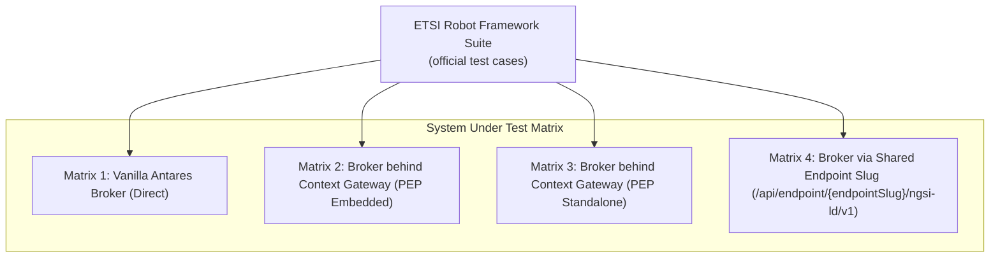

# Conformance & Standards Verification

joinedcontext avoids proprietary vendor lock-in by adhering strictly to open standards. Every release is tested against official external compliance suites to prove protocol conformance.

---

## 1. ETSI GS CIM 009 NGSI-LD Conformance

The platform's context broker and security gateway must pass the official ETSI NGSI-LD Testing Task Force (TTF) Robot Framework test suite.



### Testing Matrix

The test suite is executed across four operational modes:

1. **Vanilla Context Broker:** Confirms baseline engine compliance.
2. **Context Gateway in Embedded Mode:** Proves that compiling the PEP inside the broker preserves standard semantics.
3. **Context Gateway in Standalone Mode:** Proves transparent proxy operation through APISIX and the Rust gateway.
4. **Endpoint Slug URL Path:** Validates that standard NGSI-LD clients execute successfully against `/api/endpoint/{endpointSlug}/ngsi-ld/v1/...` ([SP-03](../Requirements/space-surface.md#1-url-scheme)).

### Execution in CI

Both ETSI lanes run from the conformance runner image
(`ghcr.io/marek-mraz-jc/joinedcontext-conformance`), which carries Robot Framework and the suite
libraries. `NGSILD_URL` selects the matrix, `NGSILD_TENANT` and `NGSILD_TOKEN` carry the tenant
header and the bearer token, and `NGSILD_ORG_DOMAIN` and `NGSILD_SPACE` are the org-domain and
space segments of the entity identifiers the suite mints.

On `dev` the suite runs as the service account `conformance` of project `helsinki`: a
confidential Keycloak client `helsinki-air-quality-conformance` whose `client_credentials` token carries
the seeded endpoint's slug as its audience, and a policy that binds the write operations to that
account and to nobody else; the anonymous caller keeps `retrieveOps` only
([PF-45](../Requirements/platform.md), GW22). `NGSILD_TOKEN` carries that token; the client secret
lives in the cluster and never in a workflow file.

Measured on `dev` through the seeded endpoint with that token: 31 cases, 28 pass and the three
gateway defects quarantined by task id, the same result as the gateway lab in CI. Before the first
write the space answers every read with `404 NonexistentTenant`: the broker creates a tenant on
the first create operation (CIM 009 clause 5.5.10), so the run needs no tenant provisioning and an
empty space reads as absent, not as empty. The `etsi-smoke` workflow dispatch of the conformance
repository repeats the run with the repository secret `NGSILD_CLIENT_SECRET`.

The last two are what makes matrices 3 and 4 different from matrices 1 and 2 rather than merely
slower. A broker accepts any syntactically valid URN; a Context Gateway refuses an identifier
whose organization and context space are not the endpoint's
([SP-02](../Requirements/space-surface.md#1-url-scheme), GW20), so a suite that mints its own
identifiers has to be told the deployment's values or it fails on its fixtures rather than on the
clause under test, in every case at once.

The merge-request gate is the smoke suite in `tests/etsi/`: 31 cases named after the CIM 009
clause each one verifies, budgeted at 60 seconds. It is green against the default broker
(`ghcr.io/marek-mraz/antares-broker`, in-memory store), which is the run that proves the suite
itself: two cases used to demand `200` for an `id`-only and an `idPattern`-only query, where
clause 5.7.2.4 mandates `BadRequestData` for a query with no type selector, attribute list, query,
geoquery or local scope. A suite nothing executes can disagree with the specification it cites and
still look healthy.

Matrix 3 is 28 of those 31 today, measured against the published gateway image in front of the
same broker, with the endpoint table loaded from a three-manifest repository (a context space, a
public endpoint, and a policy granting the role `public` the operations the suite performs). The
three that fail are the gateway's answers, not the suite's assertions, and each was reproduced
against the broker for contrast before it was filed: a `georel=near;maxDistance==N` geoquery is
refused because the gateway forwards `maxDistance` as a query parameter of its own; NGSI-LD errors
are rendered `application/problem+json` with platform error types, where clause 5.5.3 requires
`application/json` and a clause 5.5.2 type; and an unsupported request `Content-Type` answers
`400` where clause 6.3.2 requires `415`. Matrices 1 and 2 report none of them.

```bash
docker run --rm -e NGSILD_URL=https://{host}/cs/{space}/ngsi-ld/v1 \
  -v "$PWD/reports:/reports" ghcr.io/marek-mraz-jc/joinedcontext-conformance:main etsi
```

The full Testing Task Force suite is `tests/etsi-ttf/`. It fetches the official suite at a pinned
commit rather than vendoring it, and runs all five legs — `CommonBehaviours`,
`ContextInformation`, `ContextSource`, `DistributedOperations` and `jsonldContext` — unless
`TTF_LEGS` narrows the run to some of them:

```bash
docker run --rm -e NGSILD_URL=https://{host}/cs/{space}/ngsi-ld/v1 \
  -e TTF_LEGS="CommonBehaviours ContextInformation" \
  -v "$PWD/reports:/reports" ghcr.io/marek-mraz-jc/joinedcontext-conformance:main etsi-ttf
```

Reports (`output.xml`, `log.html`, `report.html`) land in `reports/etsi-ttf/`.

Two properties of the system under test decide whether a failure in this suite means anything.

The suite runs three mock servers of its own — a notification receiver, a Context Source and an
`@context` server — and binds each on `TTF_CALLBACK_HOST` while telling the system under test to
call back on that same address, so it has to be an address of the runner that the system under
test can reach (`127.0.0.1` when both share a network namespace, the runner's routable address on
a cluster). `run.sh` refuses a value it cannot bind rather than letting Robot stall on it.

Temporal test purposes only mean something against a system that persists temporal
representations. A broker on an in-memory store answers `GET /temporal/entities/{id}` with the
entity and no attribute instances, and every temporal purpose then fails for that one reason. The
same holds for an ordered query while any Context Source Registration matching the queried type is
present: clause 5.7.2.4 makes `orderBy` outside local scope a `400`, so a leg that orders needs a
broker whose registrations were cleaned up first.

### Expected Failure Quarantine

Deviations or unimplemented optional features are tracked explicitly in
`tests/etsi-ttf/expected_failures.json`, a JSON array whose `suite` and `test_case` are the names
Robot prints (the file `5510_01.robot` is the suite `5510 01`):

```json
{
  "suite": "009_BatchOperations",
  "test_case": "Batch_Create_Entities_Invalid_Payload",
  "reason": "Tracking upstream issue #142: Returns 400 instead of 207 ProblemDetails",
  "expiration": "2026-12-31"
}
```

`tests/etsi-ttf/check_expected_failures.py` enforces the list on every run: an unexpected
failure, a quarantined test that now passes, an entry whose test no longer runs, an entry past its
`expiration`, and an entry with an empty `reason` each fail the build. The quarantine list
therefore cannot rot, and a deviation cannot be parked indefinitely.

---

## 2. OGC API - Features Part 1 Conformance

Endpoints configured with geospatial representations expose data via OGC API - Features Part 1: Core ([SP-04](../Requirements/space-surface.md#1-url-scheme)).

### Conformance Classes Claimed

The platform formally claims and tests compliance for:

- `http://www.opengis.net/spec/ogcapi-features-1/1.0/conf/core`
- `http://www.opengis.net/spec/ogcapi-features-1/1.0/conf/oas30` (OpenAPI 3.0 definition)
- `http://www.opengis.net/spec/ogcapi-features-1/1.0/conf/geojson`
- `http://www.opengis.net/spec/ogcapi-features-2/1.0/conf/crs` (Coordinate Reference Systems)
- `http://www.opengis.net/spec/cql2/1.0/conf/basic-cql2`, `…/conf/cql2-text`, `…/conf/cql2-json` (CQL2 basic subset mapped to `q`, EP-35)
- `http://www.opengis.net/spec/ogcapi-features-3/1.0/conf/filter`, `…/conf/features-filter`

Not claimed and not advertised: HTML, Part 4 (Create/Replace/Update/Delete), advanced/spatial/temporal CQL2 beyond EP-35.

### Automated TEAM-ENGINE Validation

Verification is performed using OGC's official `ets-ogcapi-features10` test suite:

```bash
docker run --rm --network host \
  -v $(pwd)/reports/ogc:/root/teamengine/reports \
  ogccite/ets-ogcapi-features10:latest \
  http://localhost:8080/api/endpoint/test-slug/ogc/features
```

---

## 3. OGC SensorThings API (STA) v1.1 Verification

Endpoints exposing IoT sensor feeds project NGSI-LD entities into OGC SensorThings API v1.1 Sensing profiles.

### Conformance Classes

| Conformance Class | Status | Architectural Basis |
|---|---|---|
| **Core Sensing Entities** | Claimed | `Things`, `Datastreams`, `Observations`, `Locations`, `ObservedProperties` |
| **Observation Filtering ($filter)** | Claimed | Transpiled to NGSI-LD `q` and `temporalQ` queries |
| **Field Projection ($select)** | Claimed | Transpiled to NGSI-LD `attrs` parameter |
| **Entity Expansion ($expand)** | Claimed | Supported for parent/child relations (`Datastream/Observations`) |
| **DataArray Extension** | Not Claimed | Excluded by design; raw bulk arrays are handled via Parquet export |
| **MultiDatastream Extension** | Not Claimed | Multi-property streams are modeled as separate NGSI-LD Datastreams |
| **Tasking / Actuation Core** | Not Claimed | Write operations must use native NGSI-LD or Bento pipeline ingests |

Conformance is asserted using an automated integration suite verifying HTTP response bodies against OGC 15-078r6 schemas.

---

## 4. Model Context Protocol (MCP) Compliance

The Context Gateway serves an MCP Streamable HTTP endpoint for AI agent interaction ([SP-14](../Requirements/space-surface.md#4-per-space-mcp-instances)).

### Conformance Assertions

MCP endpoints are evaluated against the official TypeScript SDK compliance validator (`@modelcontextprotocol/inspector`):

1. **Stateless HTTP Transport:** Asserts compliance with MCP Streamable HTTP (2026-07-28 spec). Long-lived SSE connections must not leak memory.
2. **JSON-RPC 2.0 Compatibility:** Verifies structured error handling, request/response batching, and notification events.
3. **OAuth 2.1 Resource Server Binding:** Proves endpoint serves `/.well-known/oauth-protected-resource` metadata per RFC 9728 and validates RFC 8707 audience tags.
4. **Tool Annotation Integrity:** Confirms that read-only tools carry `readOnlyHint: true` and mutations carry `destructiveHint: true`.

---

## 5. JSON-LD 1.1 Specification Conformance

The platform's data-modeling pipeline converts LinkML schemas into valid JSON-LD 1.1 `@context` definitions and JSON Schema draft-07 artifacts ([CC-12](../Requirements/city-as-code.md#2-repository-and-manifest-model)).

Tests evaluate the `@context` generator against the W3C JSON-LD 1.1 official test suite:

- Expansion, Compaction, and Flattening algorithms conform to W3C recommendations.
- Internationalized attribute mappings utilize `@container: @language`.
- Terms map unambiguously to fully qualified IRIs without namespace collisions.

## 6. Dataspace Protocol conformance

The connector addon runs the Dataspace Protocol conformance test kit in both roles in CI, plus platform-level tests: an accepted agreement yields exactly the Policy entities the ODRL mapper predicts (DS-10), agreements cannot exceed the Endpoint ceiling (DS-03), and termination revokes tokens and grants within 5 s (DS-12).

## Related

- [SP-03](../Requirements/space-surface.md) — referenced above.
- [CC-12](../Requirements/city-as-code.md) — referenced above.
- [00-strategy](00-strategy.md) — test families and where each lives.
- [testing](../Requirements/testing.md) — the TS requirements.
