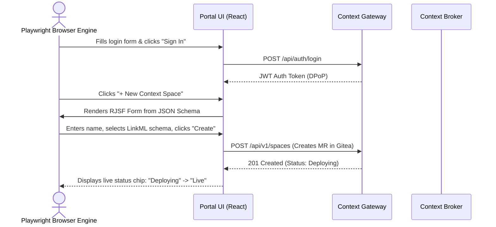

# Frontend, UI & End-to-End Testing

The user-facing Portal UI is built with Vite, React 19, TypeScript, TanStack Query/Router, and MapLibre GL JS / deck.gl. This chapter outlines the frontend verification strategy.

---

## 1. Unit & Component Testing with Vitest

Unit tests execute in Vitest using `jsdom` or `happy-dom`. Components are rendered using `@testing-library/react`.

### Testing Scope

- **Schema-Driven Form Widgets:** Asserts that `@rjsf/core` custom widgets render correctly from JSON Schema draft-07 schemas, enforce validation rules, and emit sanitized data.
- **State Reducers & URL Sync:** Validates that search filters, pagination tokens, and sorting states synchronize bidirectionally with URL search parameters.
- **Client Mocking:** Network requests from the generated `openapi-typescript` client are intercepted via Mock Service Worker (`msw`), ensuring tests run without live server dependencies.

```bash
# Execute frontend unit test suite with coverage
pnpm --filter portal-ui test:unit --coverage
```

---

## 2. Playwright End-to-End User Journeys

Playwright tests execute in real Chromium, Firefox, and WebKit browsers. **Shortcut URL mutations are strictly forbidden**: tests must navigate by clicking real buttons, filling forms, and responding to dialogues, precisely mirroring real user interaction.



### The 12 Mandatory End-to-End User Journeys

Every pull request qualifying for release must pass the 12 platform journeys:

#### Journey 1: User Onboarding & Organization Setup

Navigates to the Organization management console, enters invitation details for a new user, checks invitation email simulation, completes first-login password creation, and verifies presence in the organization directory ([User Guide 07](../User-Guide/07-users-roles-approvals.md)).

#### Journey 2: Project Creation & Team Assignment

Selects the organization, clicks "Create Project", fills project metadata, selects team members from Keycloak groups, assigns project-scoped roles, and validates that the project dashboard renders cleanly.

#### Journey 3: Context Space Initialization

Opens a project, clicks "Add Context Space", fills the identifier and human title, selects storage tier options, and verifies the space transitions from *Draft* to *Live*.

#### Journey 4: LinkML Model Import & Authoring

Opens the Data Models view, clicks "Import Smart Data Model", searches the FIWARE catalog for `WeatherObserved`, reviews generated LinkML YAML, edits an attribute slot, validates real-time preview of JSON Schema and `@context`, and publishes the model ([User Guide 03](../User-Guide/03-data-models.md)).

#### Journey 5: Ingestion Pipeline Deployment

Navigates to the Blueprint Gallery, selects the "MQTT Ingestion Flow", inputs broker connection parameters, selects the target Context Space and Data Model, fills credentials into secret inputs, and clicks "Deploy Flow" ([User Guide 04](../User-Guide/04-pipelines.md)).

#### Journey 6: Live Data Exploration

Opens the Context Space entity explorer, triggers a simulated MQTT message via a test fixture, observes real-time appearance of the entity on the screen, and inspects its normalized properties.

#### Journey 7: Multi-Layer Dashboard Construction

Navigates to Dashboards, clicks "Create Dashboard", adds a MapLibre base layer, adds a point layer bound to the Context Space, configures dynamic `colorBy` rules on an ambient temperature attribute, adds a deck.gl heatmap overlay, and saves the dashboard ([User Guide 06](../User-Guide/06-dashboards.md)).

#### Journey 8: Endpoint Configuration & Data Sharing

Opens Endpoint Management, creates a new Endpoint, enables GeoJSON, CSV, and MCP representations, sets audience to *Organization*, copies the generated URL slug, and executes an external curl request verifying data output ([User Guide 05](../User-Guide/05-endpoints-and-sharing.md)).

#### Journey 9: External Tool Connectivity (QGIS & Excel)

Launches a test fixture acting as QGIS connecting to the Endpoint's `/ogc/features` URL, verifies feature collection negotiation, then simulates an Excel CSV export checking UTF-8 encoding and header structure.

#### Journey 10: In-App Merge Request Approval (Yellow Lane)

Submits a change modifying a shared pipeline configuration, logs in as a designated Domain Approver, navigates to the pending approvals tab, reviews the visual `jcctl plan` diff, clicks "Approve & Merge", and monitors deployment progress to completion ([User Guide 07](../User-Guide/07-users-roles-approvals.md)).

#### Journey 11: Drift Detection & Automated Resolution

Injects an out-of-band attribute modification directly into the broker, navigates to the Space settings, observes the "Drift Detected" warning chip, clicks "Review Drift", clicks "Revert to Git Truth", and verifies the broker returns to the manifest specification.

#### Journey 12: Project Export & Disaster Recovery Drill

Navigates to Project Settings, clicks "Export Archive", downloads the exported zip file, opens a fresh scratch environment, uploads the archive via "Import Project", and asserts that all spaces, data models, dashboards, and pipelines restore identically ([User Guide 09](../User-Guide/09-export-import.md)).

#### Journey 13: Application Generation and Interactive Agent Run

Navigates to Applications, selects "New Application", chooses a published Endpoint, inspects the schema and live sample preview, inputs functional requirements, confirms the derived dataNeeds checklist, and submits. Monitors the live conversation feed over Server-Sent Events, answers a required questionnaire prompt rendered via dynamic schema forms, verifies that commits appear in Gitea with co-attribution trailers, inspects the sandboxed preview iframe, and submits a publication change proposal (AP-51, AP-55, UI-38).

---

## 3. Automated Accessibility Testing (a11y)

In conformance with WCAG 2.1 Level AA:

- Every Playwright test executes `axe-core` analysis across every visited page state:

```typescript
// apps/portal-ui/e2e/accessibility.spec.ts
import { test, expect } from '@playwright/test';
import AxeBuilder from '@axe-core/playwright';

test('dashboard page must meet WCAG 2.1 AA standards', async ({ page }) => {
  await page.goto('/projects/mobility/dashboards/traffic-overview');
  await page.waitForSelector('.maplibre-gl-map');

  const accessibilityScanResults = await new AxeBuilder({ page })
    .withTags(['wcag2a', 'wcag2aa', 'wcag21a', 'wcag21aa'])
    .analyze();

  expect(accessibilityScanResults.violations).toEqual([]);
});
```

- Full keyboard navigation workflows are verified: users must be able to navigate lists, open modals, complete forms, and trigger approvals using <kbd>Tab</kbd>, <kbd>Enter</kbd>, <kbd>Space</kbd>, and arrow keys alone.

---

## 4. Internationalization (i18n) Completeness Tests

The portal supports four languages: Slovak (`sk`), English (`en`), German (`de`), and Czech (`cs`). A dedicated CI script verifies translation completeness:

1. **Source Code Extraction:** Scans all React source files for translation keys (`t('...')`).
2. **Key Parity Check:** Asserts that every extracted key exists in all four locale resource bundles (`locales/*.json`). Missing keys fail the build.
3. **ICU Syntax Verification:** Validates that MessageFormat syntax (plurals, select statements, variables) compiles without syntax errors.

## Related

- [User Guide 07](../User-Guide/07-users-roles-approvals.md) — referenced above.
- [User Guide 03](../User-Guide/03-data-models.md) — referenced above.
- [User Guide 04](../User-Guide/04-pipelines.md) — referenced above.
- [User Guide 06](../User-Guide/06-dashboards.md) — referenced above.
- [00-strategy](00-strategy.md) — test families and where each lives.
- [testing](../Requirements/testing.md) — the TS requirements.
