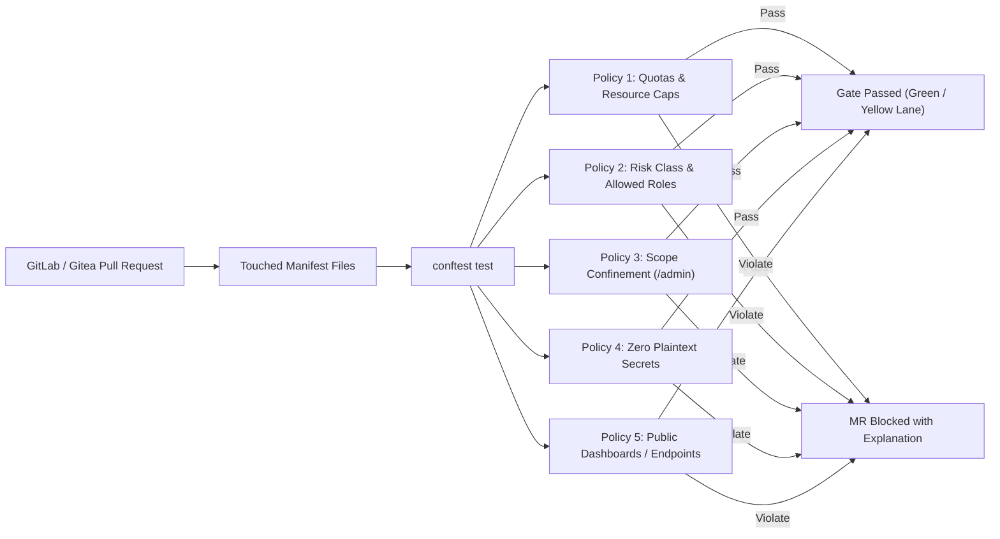

# Configuration Plane & Pipeline Testing

The platform configuration is stored declaratively as code in the org repository ([CC-02](../Requirements/city-as-code.md#1-architecture-and-source-of-truth)). This chapter describes the validation pipelines that verify configuration manifests, Conftest policy guardrails, and Bento ingestion pipelines.

---

## 1. Manifest Schema Validation

Every manifest committed to the org repository must adhere to the standard envelope schema ([CC-09](../Requirements/city-as-code.md#2-repository-and-manifest-model)):

```yaml excerpt
apiVersion: joinedcontext.com/v1alpha1
kind: ContextSpace # or DataModel, Policy, Subscription, Endpoint, Pipeline
metadata:
  name: air-quality
  namespace: helsinki
spec:
  # Literal spec or NGSI-LD payload
```

In CI, every YAML manifest is validated against published JSON Schema draft-07 schemas using `jcctl validate`:

```bash
jcctl validate --repo-dir ./helsinki-repo --schemas-dir ./schemas/kinds
```

Schemas reject unknown properties, missing metadata, invalid URN structures, and malformed entity payloads prior to pull request review.

---

## 2. Conftest Policy Guardrails (OPA / Rego)

Platform security constraints and governance rules are codified as Open Policy Agent (OPA) policies and evaluated using `conftest`.



### Mandated Conftest Policies

#### 1. Quota Enforcement

Verifies that a project does not declare more than its allocated limit of active Context Spaces, resident pipeline streams, or public Endpoints:

```rego
# policies/quotas.rego
package platform.quotas

deny[msg] {
    spaces := [s | s := input[_]; s.kind == "ContextSpace"]
    count(spaces) > 10
    msg := sprintf("Quota exceeded: Project declares %d spaces (max: 10)", [count(spaces)])
}
```

#### 2. Risk Class & Role Validation

Asserts that the author of the pull request possesses the required role declared in the blueprint metadata ([CC-59](../Requirements/city-as-code.md#10-blueprint-authorization-and-resource-ownership)).

#### 3. Scope Confinement

Validates that `ScopeDefinition` and `Policy` entities do not grant permissions outside the organizational unit's assigned scope tree ([ADR-N-004](../Decisions/adr-n-004-configuration-as-code-and-gitea.md)).

#### 4. Zero Plaintext Secrets

Scans all manifests to guarantee credentials are not embedded directly:

```rego
# policies/secrets.rego
package platform.security

deny[msg] {
    input.kind == "Pipeline"
    walk(input.spec, [path, value])
    re_match("(?i)(password|secret|token|api_key)", path[count(path)-1])
    not startswith(value, "secretRef:")
    msg := sprintf("Plaintext secret detected at %v. Must use secretRef!", [path])
}
```

#### 5. Public Endpoint & Dashboard Safety

A dashboard marked `visibility: public` may **only** bind to layers referencing Endpoints whose `audience` is explicitly configured as `public`. Binding a public dashboard to an internal Context Space is blocked.

---

## 3. Pull Request Plan & Reconciler Idempotency

### Automated Plan in Merge Requests

On every pull request, Gitea Actions executes:

```bash
jcctl plan --repo-dir . --gateway-url $STAGING_GATEWAY_URL > plan_output.txt
```

The resulting field-level diff is posted as an automated review comment, detailing exact creates, updates, and deletes.

### Idempotency Assertion

Automated integration tests apply the change into a transient broker and execute `jcctl plan` immediately afterward:

```bash
jcctl apply --plan plan_output.json
jcctl plan --assert-empty
```

If the second plan detects any residual mutation, the reconciler has failed idempotency, and the build is failed.

---

## 4. Bento Pipeline Testing

Ingestion and ETL pipelines written for `warpstreamlabs/bento` are treated as first-class software artifacts.

### Repository Layout

```text
projects/mobility/pipelines/traffic-counter/
├── pipeline.yaml              # Platform envelope & deployment class
├── bento.yaml                 # Native Bento stream configuration
├── bento_bento_test.yaml      # Golden tests for bento.yaml
└── tests/                     # Fixtures too large to inline, and their own configs
    └── decoder.yaml
```

Bento pairs a test definition with the configuration of the same name in the same folder, so
the tests for `bento.yaml` live in `bento_bento_test.yaml` beside it. A test file under
`tests/` is only found when it is named after a configuration in that folder, which is where
binary fixtures and the decoder configurations that read them belong.

### Pipeline Linting & Unit Testing

In CI, every pipeline stream is linted and executed against test fixtures:

```bash
# Verify syntax and connector configurations
bento lint ./projects/*/pipelines/*/bento.yaml

# Execute golden file unit tests
bento test ./projects/...
```

`bento lint` refuses a configuration whose environment interpolations are unset, so CI exports
a placeholder for each one before it runs; the runner gets the real value from its
ServiceAccount. Lint only the Bento configurations: a pipeline folder also holds platform
manifests, which are a different schema and are validated by `jcctl`.

The worked examples are in the platform repository under `examples/ingestion/`, and the fast
CI lane there lints and runs all four of them (PL-22).

### Network Egress Verification

A pipeline's declared `secretRefs` and external endpoints are verified against the Kubernetes NetworkPolicy allowlist. Pipelines attempting to connect to undeclared external IPs or unapproved ports are rejected in CI.

## Related

- [CC-02](../Requirements/city-as-code.md) — referenced above.
- [ADR-N-004](../Decisions/adr-n-004-configuration-as-code-and-gitea.md) — referenced above.
- [00-strategy](00-strategy.md) — test families and where each lives.
- [testing](../Requirements/testing.md) — the TS requirements.
