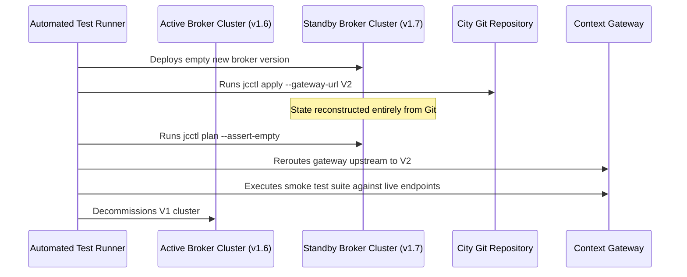
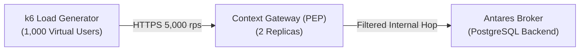

# Deployment & Performance Testing

This chapter covers testing of Kubernetes deployment artifacts, service mesh policies, failover procedures, and load benchmarking.

---

## 1. Manifest Linting & Kyverno PSS Scans

The deployment configuration lives in `civitas-core-deployment` using Helmfile.

Before deployment manifests are applied to any cluster, they are rendered and evaluated against Kubernetes Pod Security Standards (PSS) **Restricted** profile:

```bash
# 1. Render all component templates
helmfile -f deployment/helmfile.yaml template -e staging > rendered_manifests.yaml

# 2. Evaluate Kyverno policies locally
kyverno apply .ci/policies/base/ --resource rendered_manifests.yaml
```

### Validated Security Invariants

- `runAsNonRoot: true` and `runAsUser: 1000` enforced on all containers.
- `readOnlyRootFilesystem: true` on all pods.
- `capabilities.drop: ["ALL"]` present on every container security context.
- `allowPrivilegeEscalation: false` strictly enforced.
- Linkerd sidecar injection annotation `linkerd.io/inject: enabled` present on all meshed workloads.

---

## 2. Test Deployment Matrix

CI validates the platform against a matrix of deployment configurations using ephemeral `k3d` clusters:

| Matrix Parameter | Permutations Tested in CI |
|---|---|
| **Namespace Architecture** | Single Namespace (`global.singleNamespace: true`) vs Multi-Namespace (`global.singleNamespace: false`) |
| **Operational Profile** | `development` (single replica, light) vs `production` (HPA, PDBs, HA CloudNativePG) |
| **Service Mesh** | Linkerd mTLS Enabled (`defaultInboundPolicy: cluster-authenticated`) vs Disabled |
| **Runtime Policies** | Kyverno `failureAction: Enforce` vs `Audit` |

---

## 3. Disaster Recovery & Blue/Green Upgrade Drills

The platform must survive catastrophic infrastructure loss with zero configuration loss ([CC-50](../Requirements/city-as-code.md#8-export-portability-and-upgrade)).

### Automated Blue/Green Upgrade Drill

Executed weekly in automated test pipelines:



### PostgreSQL Point-In-Time Recovery (PITR) Drill

Automated tests simulate a catastrophic database corruption:

1. Simulates drop of PostgreSQL platform databases.
2. Triggers CloudNativePG (CNPG) recovery from Barman S3-compatible object storage.
3. Clones org repository and runs `jcctl plan`.
4. Confirms that zero database mutations or configuration drift are detected.

---

## 4. Load & Performance Testing with k6

The Context Gateway and Context Broker must satisfy rigorous performance budgets under sustained load. Scenarios execute in CI against a dedicated test environment.



### Performance Budgets & Gating Thresholds

| Scenario | Load Profile | Performance Target | Hard Failure Threshold |
|---|---|---|---|
| **Single Entity Read (`GET /entities/{id}`)** | 5,000 rps sustained | p95 < 8 ms, p99 < 15 ms | p99 > 25 ms or >0.01% errors |
| **Filtered Query (`q` + `scopeQ`)** | 1,500 rps sustained | p95 < 25 ms, p99 < 50 ms | p99 > 80 ms or >0.05% errors |
| **High-Volume Telemetry Ingestion (POST)** | 2,000 writes/sec | p95 < 30 ms, p99 < 60 ms | p99 > 100 ms or >0.01% errors |
| **GeoJSON Export (>5,000 features)** | 100 concurrent streams| Time to first byte < 120 ms| TTFB > 250 ms |
| **MCP Tool Invocation (`query_entities`)** | 500 tool calls/sec | p95 < 35 ms, p99 < 70 ms | p99 > 120 ms |

### Example k6 Scenario Definition

```javascript
// tests/performance/k6-entity-query.js
import http from 'k6/http';
import { check, sleep } from 'k6';

export const options = {
  stages: [
    { duration: '1m', target: 500 },
    { duration: '3m', target: 2000 },
    { duration: '1m', target: 0 },
  ],
  thresholds: {
    http_req_duration: ['p(95)<25', 'p(99)<50'],
    http_req_failed: ['rate<0.001'],
  },
};

export default function () {
  const params = {
    headers: {
      'Authorization': `Bearer ${__ENV.TEST_TOKEN}`,
      'Accept': 'application/ld+json',
    },
  };
  
  const res = http.get(
    'http://localhost:8080/api/endpoint/mobility-data/ngsi-ld/v1/entities?type=VehicleObserved&q=speed>50',
    params
  );
  
  check(res, {
    'status is 200': (r) => r.status === 200,
    'header restricted present': (r) => r.headers['Ngsild-Results-Restricted'] !== undefined,
  });
  sleep(0.05);
}
```

## Related

- [CC-50](../Requirements/city-as-code.md) — referenced above.
- [00-strategy](00-strategy.md) — test families and where each lives.
- [testing](../Requirements/testing.md) — the TS requirements.
