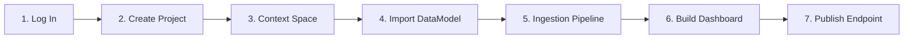

# Getting Started: From Zero to Shared Twin

This tutorial guides you through the complete lifecycle of creating, structuring, ingesting, visualizing, and sharing an urban data product in joinedcontext.

:::note A flow or a pipeline?
A **flow** is a Blueprint with its parameters filled in, managed in the flow gallery the Portal opens on; it expands into the manifests that make a feature work. A **pipeline** is one running Bento integration that reads a data source and writes into a context space; a flow may produce one, and the expert view lets you create one on its own.
:::

---

## 1. Overview of What You Will Build

You will set up an ambient environmental monitoring service for the city of Helsinki:

1. Log in and configure a dedicated **Project**.
2. Initialize an isolated **Context Space**.
3. Import the standard **`WeatherObserved`** data model using the visual LinkML editor.
4. Deploy an automated **Bento Ingestion Pipeline** from a blueprint.
5. Build an interactive geospatial **Map Dashboard**.
6. Publish a secure **Endpoint** and connect an external visualization client (e.g. QGIS or Grafana).

---

## 2. Step 1: Log In to the Platform Portal

1. Open your web browser and navigate to your organisational platform instance:
   `https://portal.joinedcontext.com`
2. Click **Sign In with Organisational ID** (Keycloak OIDC).
3. Enter your administrative credentials. Upon successful authentication, the portal displays the Organization Overview.

---

## 3. Step 2: Create a Working Project

Projects represent collaborative workspaces for organisational departments ([User Guide 02](./02-organizations-projects-spaces.md)).

1. In the top navigation, confirm your Organization is selected (e.g. `Helsingin kaupunki`).
2. Navigate to **Projects** in the left sidebar and click **+ New Project**.
3. Fill in the project details:
   - **Project Name:** `Environmental Monitoring`
   - **Identifier (Slug):** `environmental-monitoring`
   - **Description:** `Real-time ambient air quality and weather telemetry.`
4. Click **Create Project**. The portal initializes the project workspace and links it to the org repository.

---

## 4. Step 3: Initialize a Context Space

Context Spaces represent isolated data tenants inside the Context Broker ([SP-01](../Requirements/space-surface.md#1-url-scheme)).

1. Inside your new project, select the **Context Spaces** tab.
2. Click **+ Add Context Space**.
3. Enter:
   - **Space Name:** `Air Quality & Weather`
   - **Identifier:** `air-quality`
   - **Storage Tier:** `Standard (Relational + Spatial)`
4. Click **Save Space**. The status chip initially displays *Deploying* and automatically transitions to *Live* within seconds (Green Lane).

---

## 5. Step 4: Import a Smart Data Model

The platform standardizes domain entities using LinkML ([User Guide 03](./03-data-models.md)).

1. Navigate to **Data Models** within your Context Space.
2. Click **Import Standard Model**.
3. In the search catalog, type `WeatherObserved` (FIWARE / Smart Data Models standard).
4. Click **Inspect & Import**.
5. The visual LinkML editor displays the schema classes and attributes (`temperature`, `relativeHumidity`, `windSpeed`, `location`).
6. Click **Publish Model**. The system validates the schema, commits it to Git, and compiles the JSON Schema draft-07 and JSON-LD `@context` automatically.

---

## 6. Step 5: Deploy an Ingestion Pipeline

Now connect an external sensor feed using a pre-configured blueprint ([User Guide 04](./04-pipelines.md)).

1. Click the **Pipelines** tab and select **+ Instantiate Blueprint**.
2. Select the **MQTT Sensor Stream** blueprint card.
3. Fill in the generated form:
   - **Pipeline Name:** `City Weather Station Ingest`
   - **MQTT Broker URL:** `tcp://broker.hel.fi:1883`
   - **Topic Subscription:** `sensors/weather/+/telemetry`
   - **Target Context Space:** `Air Quality & Weather`
   - **Target Data Model:** `WeatherObserved`
4. Click **Deploy Pipeline**. The system validates the pipeline with `bento lint`, generates manifests, and launches the resident Bento stream.

---

## 7. Step 6: Verify Live Ingestion

1. Return to **Context Spaces** and click **Entity Explorer**.
2. Within seconds of the pipeline starting, live entities matching `urn:ngsi-ld:WeatherObserved:hel.fi:weather:...` populate the table.
3. Click an entity row to inspect its live normalized properties and spatial coordinates.

---

## 8. Step 7: Build an Interactive Map Dashboard

1. Navigate to **Dashboards** in the sidebar and click **+ Create Dashboard**.
2. Enter Title: `City Weather Overview`.
3. Click **Add Layer**:
   - **Layer Name:** `Weather Stations`
   - **Data Source:** Select Context Space `Air Quality & Weather`.
   - **Entity Type:** `WeatherObserved`
   - **Style:** Select `Circle Overlay`.
   - **Color By:** Select `temperature` (Numeric Gradient: Blue to Red).
   - **Size By:** Select `windSpeed`.
4. The MapLibre map renders sensor locations across the city. Click **Save Dashboard**.

---

## 9. Step 8: Publish a Shared Endpoint

Share your live data securely with other departments or external tools ([User Guide 05](./05-endpoints-and-sharing.md)).

1. Open your Context Space and navigate to **Endpoints**.
2. Click **+ Create Endpoint**.
3. Configure the endpoint:
   - **Title:** `Public Environmental Feed`
   - **Audience:** Select `Organization` (or `Public` for open data).
   - **Enabled Representations:** Toggle on **GeoJSON**, **CSV**, and **OGC API - Features**.
4. Click **Create Endpoint**.
5. The portal generates a secure, opaque URL slug:
   `https://portal.joinedcontext.com/api/endpoint/a8f9c2d1e0b4/...`
6. Copy the **GeoJSON URL** and paste it directly into QGIS or Grafana to visualize live organisational data in external software!

## Related

- [User Guide 02](./02-organizations-projects-spaces.md) — referenced above.
- [SP-01](../Requirements/space-surface.md) — referenced above.
- [User Guide 03](./03-data-models.md) — referenced above.
- [User Guide 04](./04-pipelines.md) — referenced above.
- [00-intro](00-intro.md) — user guide overview.
