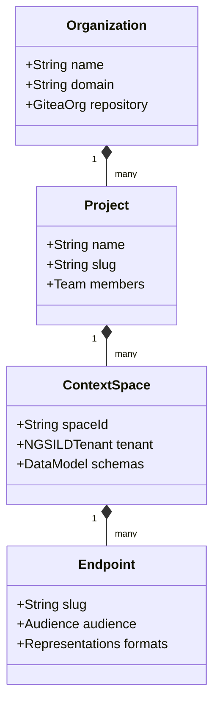

# Organizations, Projects & Context Spaces

joinedcontext organizes all organisational operations within a structured domain hierarchy. This chapter explains how to establish and manage these boundaries.

---

## 1. The Domain Hierarchy



### 1. Organization

An **Organization** corresponds to an entire local government administration or regional authority (e.g. *Helsingin kaupunki*).

- Backed by an isolated Keycloak realm and an authoritative Gitea organization.
- Holds the authoritative Org Repository containing all manifests, blueprints, and organizational policies.

### 2. Project (Working Group Level)

A **Project** corresponds to a department, working group, or multi-disciplinary initiative (e.g. *Department of Mobility*, *Civil Protection*).

- Defines collaboration boundaries, user group assignments, and resource quotas.
- Owns pipelines, dashboards, and Context Spaces.

### 3. Context Space (Data Isolation Unit)

A **Context Space** corresponds directly to an isolated NGSI-LD tenant in the Context Broker ([SP-01](../Requirements/space-surface.md#1-url-scheme)).

- Owned by **exactly one Project**.
- Entities within a Context Space are completely isolated at the database storage layer using PostgreSQL Row-Level Security (RLS).
- A Context Space cannot be queried directly by other projects without an **Endpoint**.

---

## 2. Managing Projects

### Creating a Project

1. Navigate to **Administration > Projects**.
2. Click **Create Project**.
3. Supply:
   - **Name:** Human-readable title.
   - **Slug:** Path identifier (lowercase, alphanumeric, dashes).
   - **Team Approver:** Select user or group possessing approval authority.
4. Saving generates a pull request adding `projects/{slug}/project.yaml`. Upon merge, the project space initializes.

### Managing Project Quotas

Platform Administrators configure project resource limits in `platform-settings.yaml`:

```yaml
quotas:
  projects:
    mobility:
      maxContextSpaces: 10
      maxResidentPipelines: 25
      maxEndpoints: 15
```

---

## 3. Working with Context Spaces

### Provisioning a Space

1. Inside your project, navigate to **Context Spaces > Add Space**.
2. Enter the unique alphanumeric space identifier (e.g. `traffic-sensors`).
3. Select the primary LinkML Data Model defining the space's entity schemas.
4. Click **Deploy Space**.

### Inter-Space Data Boundaries

Entities inside Context Space A cannot see or join entities in Context Space B directly. Cross-space integration must follow one of two patterns:

- **Shared Space Reference:** Project B binds to a shared **Endpoint** published by Project A ([User Guide 05](./05-endpoints-and-sharing.md)).
- **Federated Context Source Registration (CSR):** Space A registers Space B as an upstream provider for specific entity types.

## Related

- [SP-01](../Requirements/space-surface.md) — referenced above.
- [User Guide 05](./05-endpoints-and-sharing.md) — referenced above.
- [00-intro](00-intro.md) — user guide overview.
- [01-getting-started](01-getting-started.md) — first steps in the Portal.
