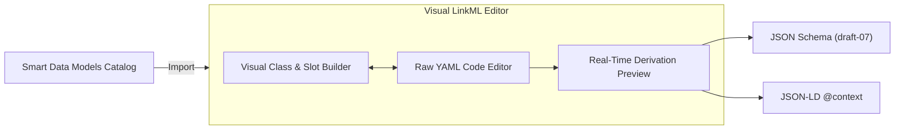

# Data Modeling & The LinkML Editor

In joinedcontext, data structure contracts are modeled using **LinkML** (Linked Open Data Modeling Language). This chapter explains how to author, import, and version organisational data models.

---

## 1. Why LinkML?

LinkML provides a single, technology-agnostic source of truth for entity structures:

- **Automatic Derivations:** From a single LinkML definition, the platform automatically derives:
  - Strict JSON Schema draft-07 schemas for API validation and form rendering ([CC-12](../Requirements/city-as-code.md#2-repository-and-manifest-model)).
  - Standards-compliant JSON-LD 1.1 `@context` files for semantic interoperability ([ADR-N-007](../Decisions/adr-n-007-apisix-standalone-no-etcd.md)).
  - TypeScript types and SQL table definitions.
- **Spec-Native Interoperability:** Prevents proprietary schema lock-in and bridges Smart Data Models directly into NGSI-LD.

---

## 2. The Visual LinkML Editor

The portal features a built-in visual modeling environment:



### Navigating the Editor Interface

1. **Class Palette:** Lists defined entity types (e.g. `AirQualityObserved`, `WasteContainer`).
2. **Properties (Slots) Panel:** Configures attribute names, types, multiplicity (cardinality), descriptions, and unit codes.
3. **Live Derivation Tabs:** Real-time inspectors showing:
   - Generated JSON Schema draft-07.
   - Compiled JSON-LD `@context`.
   - Synthetic mock entity matching the schema.

---

## 3. Importing Smart Data Models

1. In your Context Space, navigate to **Data Models** and click **Import Standard Model**.
2. Select from curated domains: *Mobility, Environment, Energy, Smart Cities (FIWARE / GSMA)*.
3. Search for the model (e.g. `Streetlight`).
4. Click **Import Model into Editor**.
5. The model imports with all standard attributes pre-configured. You can extend the model with organisational-specific attributes (e.g. `maintenanceContractorId`).

---

## 4. Authoring Custom Models in LinkML

You can write LinkML YAML directly in the code editor:

```yaml
id: https://joinedcontext.com/models/waste-management
name: WasteManagement
prefixes:
  core: https://joinedcontext.com/schema/
  schema: http://schema.org/
imports:
  - linkml:types

classes:
  WasteContainer:
    description: A public smart waste receptacle.
    slots:
      - id
      - type
      - fillLevel
      - temperature
      - location

slots:
  fillLevel:
    range: float
    description: Percentage fill level from 0.0 to 1.0.
    minimum_value: 0.0
    maximum_value: 1.0
  location:
    range: string
    description: GeoJSON point string representing coordinates.
```

---

## 5. Model Versioning & Approval Lanes

Data models evolve through strict Semantic Versioning:

- **Patch (1.0.0 -> 1.0.1):** Typo fixes, description adjustments (Green Lane - auto-approved).
- **Minor (1.0.0 -> 1.1.0):** Adding new optional attributes, non-breaking enum additions (Yellow Lane - Domain Approver).
- **Major (1.0.0 -> 2.0.0):** Renaming attributes, removing attributes, changing cardinalities (Red Lane - City Admin).

Publishing a model updates `projects/{project}/spaces/{space}/datamodels/` in Git, recompiling runtime schemas automatically.

## 6. Mappings between models

When data arrives in one model and must be stored in another (a Smart Data Model into your own model, an old version into a new one, a partner's vocabulary into yours), create a **Mapping** instead of writing transformation code.

1. Open the data model → **Mappings** → **New mapping**, choose the source model and the target model.
2. The editor pre-fills every target field that has an obvious counterpart (same name, or a recorded alignment). Fill the rest: pick a source field, rename, convert a unit, map enum values, or write a short formula such as `{stationName} + ' (' + {areaServed} + ')'`.
3. Watch the **Preview**: the example entity on the left becomes the target entity on the right, and any field the target requires but you have not filled is marked.
4. Add at least one **Test** (an input example and the expected result). Save. The mapping is validated and compiled; you never see the generated code unless you open the *Advanced* tab.
5. Use it in a pipeline (**Pipeline → Output → Mapping**) or, for migrating existing data to a new model version, **Data model → Versions → Migrate with mapping**, which shows how many entities will change before anything runs.

Formulas are deliberately simple. If you need sums over lists, grouping or business rules, the pipeline editor's *Advanced transformation* is the place, and the review will show that this part is not schema-checked.

## 7. Sharing what the data contains (schema, SHACL, OWL, RDF)

Every context space and every endpoint publishes its model under **Schema** in the formats other people expect: LinkML (the source), JSON Schema, JSON-LD context, SHACL shapes, OWL ontology, RDF and a readable documentation page. A partner who receives your endpoint link can open `…/schema/` and see exactly the types and fields they are allowed to read, in the format their tools need. Nothing you keep private appears there: the schema is filtered the same way as the data. Agents get the same files through the endpoint's MCP (`describe_schema` with a format, or as resources). Rendering happens when you publish a model version, so the files never change afterwards.

## Related

- [CC-12](../Requirements/city-as-code.md) — referenced above.
- [ADR-N-007](../Decisions/adr-n-007-apisix-standalone-no-etcd.md) — referenced above.
- [00-intro](00-intro.md) — user guide overview.
- [01-getting-started](01-getting-started.md) — first steps in the Portal.
