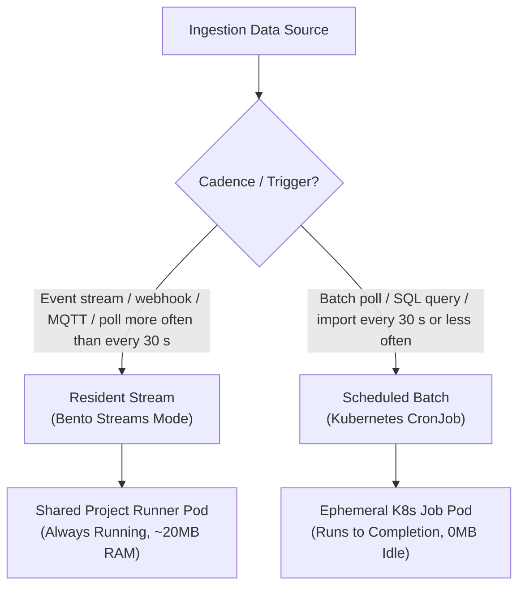

# Pipelines & Ingestion

joinedcontext handles data ingestion through **Bento** (`warpstreamlabs/bento`, MIT fork). This chapter explains how to deploy and operate data pipelines.

---

:::note A flow or a pipeline?
A **flow** is a Blueprint with its parameters filled in, managed in the flow gallery; it expands into the manifests that make a feature work. A **pipeline** is one running Bento integration that reads a data source and writes into a context space; a flow may produce one, and the expert view lets you create one on its own.
:::

## 1. Ingestion Execution Classes: The 15-Minute Rule

To conserve system memory and CPU resources, pipelines are categorized into two execution classes based on operational frequency ([Architecture Chapter 05](../Architecture/08-pipelines.md)):

- **Resident Streams:** Continuous streams (MQTT, Kafka, AMQP, WebSockets, or polling more often than every 30 seconds). Run inside the project's shared Bento runner pod in **Streams Mode**.
- **Scheduled Batches:** Periodic tasks running every 30 seconds or less often (a 30-second parking-feed poll, hourly weather file downloads, daily SQL syncs). Cadences between 30 and 59 seconds run as a one-minute job that repeats its fetch inside the minute; from 60 seconds upward each run is its own job. Deployed as lightweight **Kubernetes CronJobs** that scale to zero when idle.

---

## 2. Deploying a Pipeline from the Blueprint Gallery

1. In your project, navigate to **Pipelines** and click **+ Instantiate Blueprint**.
2. Select a template:
   - **MQTT Telemetry Stream:** Ingests sensor readings and normalizes to NGSI-LD.
   - **REST API Poller:** Polls external endpoints periodically and ingests payloads.
   - **SQL Database Importer:** Runs batch queries against external PostgreSQL/MySQL databases.
   - **CSV/File Watcher:** Ingests structured tabular files from S3/MinIO.
3. Configure parameters in the generated form.
4. Input credentials using secure secret reference dropdowns ([User Guide 05](./05-endpoints-and-sharing.md)).
5. Click **Deploy**. The platform lints the configuration and updates `pipelines/{name}/bento.yaml` in Git.

---

## 3. Monitoring Pipeline Health

Open any deployed pipeline to inspect operational metrics:

- **Throughput:** Real-time messages processed per second.
- **Latency:** Time spent in processor transformations.
- **Error Counter:** Number of malformed records rejected.
- **Live Stream Logs:** Real-time tail of processing events and connection statuses.

---

## 4. Pausing, Disabling & Replaying Pipelines

- **Pausing a Stream:** Click the **Pause** toggle in the pipeline header. The platform creates a Git commit setting `spec.enabled: false`. The runner unloads the stream cleanly without restarting other running pipelines.
- **Dead-Letter Handling (DLQ):** Messages failing transformation are routed to an internal dead-letter topic. Click **Inspect Dead Letters** to view failed payloads, edit mapping rules, and click **Replay Dead Letters** to reprocess.

## Related

- [Architecture Chapter 05](../Architecture/08-pipelines.md) — referenced above.
- [User Guide 05](./05-endpoints-and-sharing.md) — referenced above.
- [00-intro](00-intro.md) — user guide overview.
- [01-getting-started](01-getting-started.md) — first steps in the Portal.
