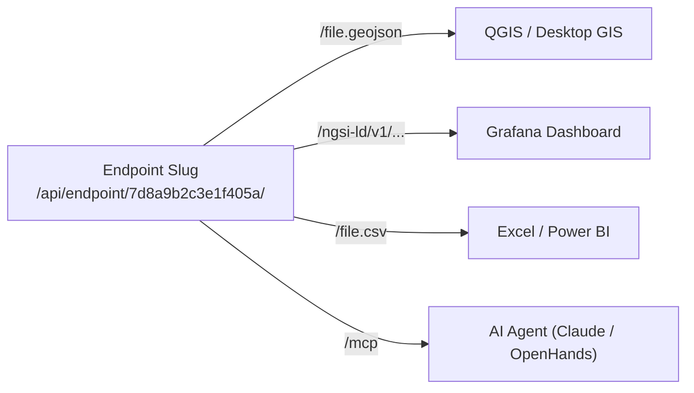

# Endpoints, Data Sharing & Integration

In joinedcontext, context spaces are private by default. The **only** way external software, public portals, other projects, or AI agents can access data is through an **Endpoint** ([SP-01](../Requirements/space-surface.md#1-url-scheme)).

---

## 1. Creating a Data Endpoint

1. Open your project, select your **Context Space**, and navigate to **Endpoints**.
2. Click **+ Create Endpoint**.
3. Fill in configuration:
   - **Title:** `Public Transit Live Feed`
   - **Audience:**
     - *Project-Only:* Accessible only to members of this project.
     - *Organization:* Accessible to any department in the city administration.
     - *Public:* Accessible anonymously worldwide (Open Data).
   - **Enabled Representations:** Toggle on the required formats (NGSI-LD, GeoJSON, CSV, XLSX, OGC Features, STA, MCP).
   - **Attribute Whitelist (Projection):** Select only attributes permitted for exposure (e.g. `vehicleId`, `speed`, `location`). Sensitive fields (e.g. `driverId`) are omitted.
4. Click **Generate Endpoint**.

The gateway generates an unguessable 128-bit random URL slug:
`https://portal.joinedcontext.com/api/endpoint/7d8a9b2c3e1f405a/...`

---

## 2. Connecting External Tools

### A. Connecting QGIS

1. In QGIS, open the Data Source Manager and select **WFS / OGC API - Features**.
2. Click **New Connection**.
3. Enter URL: `https://portal.joinedcontext.com/api/endpoint/{endpointSlug}/ogc`
4. If the endpoint audience is *Organization*, select Bearer Auth and paste an API key from a service account (User-Guide/07 §4) or use the QGIS OAuth2 plugin with the client snippet.
5. Click **Connect**. QGIS discovers collections automatically and renders vector layers on the map.

### B. Connecting Grafana

1. In Grafana, install the **Infinity** datasource plugin.
2. Create a new query pointing to:
   `https://portal.joinedcontext.com/api/endpoint/{endpointSlug}/file.geojson`
3. Add a **Geomap** panel. Grafana renders live entity positions and updates dynamically.

### C. Connecting Microsoft Excel / Power BI

1. In Excel, select **Data > From Web**.
2. Enter the CSV export URL:
   `https://portal.joinedcontext.com/api/endpoint/{endpointSlug}/file.csv`
3. Excel parses columns and dates automatically. Click **Load**.

### D. Connecting AI Agents via MCP

1. Copy the MCP Streamable HTTP URL:
   `https://portal.joinedcontext.com/api/endpoint/{endpointSlug}/mcp`
2. Configure your agent client (e.g. Claude Code or OpenHands) with the URL and bearer token.
3. The agent discovers available tools and queries data autonomously ([User Guide 08](./08-working-with-ai-agents.md)).

---

## 3. Rotating & Revoking Endpoints

- **Rotating a Slug:** If an endpoint URL is leaked, open Endpoint Settings and click **Rotate Slug**. A new URL is generated immediately; the old slug becomes invalid instantly.
- **Revoking an Endpoint:** Click **Delete Endpoint**. Deletion creates a pull request. Once merged, the gateway terminates the route.

## 4. Using data that lives in another space or another city

When you add a shared endpoint (from another project, or from another organisation's platform) the platform reads its published model first and shows it under **Data models → Foreign models**. You cannot edit it, but you can:

- **Map to my model**, a guided mapping from their fields to yours (renames, units, enum values, simple formulas). Save it and choose **Replicate** (a pipeline copies their data into your space in your model) or **Live** (your queries are translated on the fly; only simple mappings qualify, the wizard tells you which).
- **Watch for changes**, when they publish a new model version you get a change proposal showing what moved and which of your mappings are affected.

The other direction works the same way: mark one of your mappings as **Published** and consumers can download it next to your schema, or create a **View endpoint** that already serves your data in their model (for example as Smart Data Models).

## 5. Sharing with organisations you do not know yet

For partners outside your platform (another city, a national platform, a company in a data space) open **Data space → Offers** and publish an endpoint with the conditions under which others may use it (purpose, area, time, attribution, price). Partners find it in the data space catalog, request it, and, when the request matches your conditions, get access automatically; counter-proposals land in **Data space → Requests** for you to accept or decline. Access is always through the same endpoint link, so what they can read is exactly what the endpoint allows and never more.

The other way round, **Data space → Catalog** lists what other participants offer. Request a dataset, and once agreed use it like any shared endpoint: mount it, replicate it with a pipeline, or federate live queries.

## Related

- [SP-01](../Requirements/space-surface.md) — referenced above.
- [User Guide 08](./08-working-with-ai-agents.md) — referenced above.
- [00-intro](00-intro.md) — user guide overview.
- [01-getting-started](01-getting-started.md) — first steps in the Portal.
