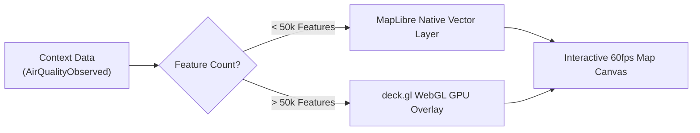

# Dashboards & Geospatial Visualization

The portal includes a visual dashboard builder capable of rendering high-frequency organisational spatial data.

---

## 1. Visualization Architecture: MapLibre + deck.gl

To ensure smooth 60fps rendering across both small sensor networks and city-wide telemetry datasets:

- **Datasets < 50,000 features:** Rendered using **MapLibre GL JS** native vector layers.
- **Datasets > 50,000 features or spatial aggregations:** Rendered using **deck.gl** WebGL overlays (`MapboxOverlay`), utilizing GPU acceleration for real-time clustering, heatmaps, and 3D hex-bins.

---

## 2. Building a Dashboard Step by Step

1. Navigate to **Dashboards** and click **+ Create Dashboard**.
2. Enter Title: `Organisational Air Quality Monitoring`.
3. Set **Visibility:** *Project, Organization,* or *Public*.

### Adding Map Layers

Click **+ Add Layer** to open the layer configuration panel:

1. **Layer Source:** Select a Context Space or Endpoint.
2. **Entity Type:** Select the target schema (e.g. `AirQualityObserved`).
3. **Visualization Style:**
   - *Circle Marker:* Individual points with color and size scaling.
   - *Heatmap:* Density visualization of particulate matter concentrations.
   - *Hexagon Grid (deck.gl):* 3D aggregations showing sensor density or average values.
   - *Fill / Polygon:* Administrative boundaries or zoning districts.
4. **Dynamic Data Styling:**
   - **Color By:** Select numeric attribute `pm25`. Choose color ramp (Green -> Yellow -> Red).
   - **Size By:** Select numeric attribute `pm10`.

---

## 3. Adding Temporal Charts

1. In the dashboard canvas, click **+ Add Widget > Temporal Chart**.
2. Select the sensor entity and the observed attribute `temperature`.
3. Select time horizon: *Last 24 Hours, Last 7 Days, Last 30 Days*.
4. The chart queries the Context Gateway Temporal API and displays trend lines with interactive tooltips.

---

## 4. Public Dashboards Rule

In compliance with security policy, **a dashboard marked Public may only consume Endpoints whose audience is configured as Public**. Attempting to add a layer bound to a private Context Space will display an error dialogue and block publication.

## Related

- [00-intro](00-intro.md) — user guide overview.
- [01-getting-started](01-getting-started.md) — first steps in the Portal.
