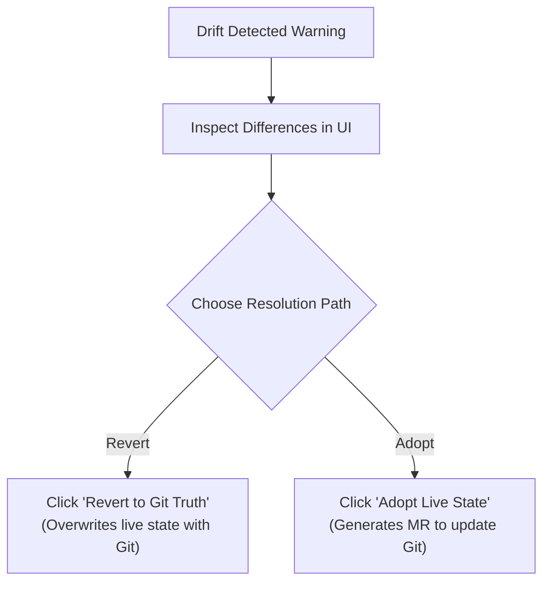

# Users, Roles, Approvals & Drift Management

This chapter explains administrative workflows for managing team access, conducting change approvals, and resolving configuration drift.

---

## 1. User & Team Administration

User identity is centralized in Keycloak ([I1](../Requirements/policy-firewall.md#21-identity-stack-i1i4-canonical-here)):

1. Navigate to **Administration > Users**.
2. Click **+ Invite User**.
3. Enter email address, full name, and assign initial organizational groups.
4. The system sends an invitation link allowing the user to set their password.
5. Assign the user to project roles: *Viewer, Domain Editor, Domain Approver,* or *City Admin*.

---

## 2. Reviewing & Approving Merge Requests

When an editor or AI agent makes a configuration change in a Yellow or Red lane, a pull request is generated in the org repository.

### In-App Review Workflow

Approvers do not need to read raw YAML files:

1. Open **Approvals** in the portal sidebar.
2. Select the pending change:

   ```text
   Title: Add Ingestion Pipeline for Parking Sensors
   Author: demo.steward@hel.fi
   Risk Class: Yellow Lane (Single Approver Required)
   ```

3. Inspect the visual **Plan Diff**:
   - **Additions (+):** Resources to be created (shown in green).
   - **Modifications (~):** Attributes being updated (shown in yellow).
   - **Deletions (-):** Resources marked for removal (shown in red).
4. Review the automated Conftest policy checks (all green checkmarks indicate quotas and roles are satisfied).
5. Click **Approve & Merge**. The reconciler executes immediately.

---

## 3. Resolving Configuration Drift

Configuration drift occurs if an out-of-band change is made to the live Context Broker that does not exist in the Git repository ([CC-21](../Requirements/city-as-code.md#3-reconciler-jcctl)).



### The Two-Button Resolution

The portal presents a simple, two-button resolution screen:

1. **Click "Revert to Git Truth":** Forces the live broker back to the state declared in Git. Unauthorized additions or modifications are purged.
2. **Click "Adopt Live Changes":** Exports the modified live state into a new pull request. Once approved by a Domain Approver, Git is updated to match the new reality.

## 4. Service accounts and API keys

Anything that is not a person (a vendor system pushing data, your own script, a partner's ETL, QGIS on a colleague's laptop, a pipeline, an agent) gets a **service account** under **Project → Access → Service accounts & keys**.

1. **New service account**: give it a name, a purpose and an owner (you, by default). Pick roles exactly as for a person, scoped to a space or an endpoint, optionally narrowed to entity types and operations (for example "upsert ParkingSpot only").
2. **Add a credential**: *OAuth client* (recommended; the system exchanges its client secret for short-lived tokens) or *API key* (for devices and tools that cannot do OAuth). The key is shown once. Copy it into the target system now; the platform keeps only a fingerprint.
3. **Client snippet**: download a ready-made configuration for curl, Python, Node, Bento, QGIS or Grafana with the right URL and header.
4. Later: **Rotate** (old and new key both work for a day), **Revoke** (immediate), watch **Last used** and **Requests 24 h**. You get an e-mail 14 and 3 days before a key expires.

Every service account shows up in audit logs and approvals like a person does. Widening its roles goes through review; granting it write access to a space that has a public endpoint needs an approver.

## Related

- [I1](../Requirements/policy-firewall.md) — referenced above.
- [CC-21](../Requirements/city-as-code.md) — referenced above.
- [00-intro](00-intro.md) — user guide overview.
- [01-getting-started](01-getting-started.md) — first steps in the Portal.
