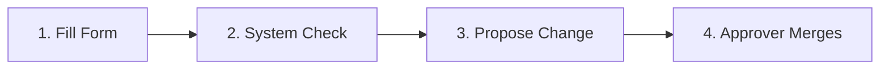

# Users, Roles, Approvals & Drift Management

This guide explains how to manage team permissions, service accounts, change proposals, and live configuration drift in the Portal. Every change to project access and configuration follows the same path: you fill the form, the system runs the check, you propose the change, and an approver reviews and merges it before anything takes effect.

## 1. Granting Roles to Team Members

Team members receive permissions through role bindings scoped to the organization, a project, or a single Context Space.

### Granting a Role to a Colleague

#### By hand

1. Open `/projects/helsinki/access` from the sidebar navigation by selecting **Access**.
2. In the **People and roles** section, click **Grant a role**.
3. In the dialog, set **Give it to** to `A person`.
4. In **Username or e-mail**, enter `jana.kovacova`.
5. In **Role**, select `steward`.
6. In **Where it applies**, select `Project helsinki`.
7. Click **Propose grant**.
You should see a green change notice showing the proposal identifier and a link to review it in Approvals.
8. An approver opens `/projects/helsinki/approvals`, reads the change field by field, and clicks **Approve**.

The live journey `change.spec.ts` replays these steps.

#### By asking the assistant

Type into the assistant composer: `Give jana.kovacova the steward role on the helsinki project`. The assistant navigates to `/projects/helsinki/access` and opens the **Grant a role** dialog with the username, role, and scope pre-filled. You review the fields, click **Propose grant**, and an approver decides the proposal.

## 2. Managing Service Accounts and API Keys

Non-human callers such as ingestion scripts, automated ETL jobs, or GIS tools connect through dedicated service accounts.

### Create a Service Account with the Form

#### By hand

1. Open `/projects/banskabystrica/access`, go to **Service accounts** and click **New service account**.
2. Under **Who and why**, give the account a **Name** such as `bb-senzory-import`, write its **Purpose** in one sentence an auditor can check (*Uploads the city gateway's air-quality readings every 10 minutes.*), and enter the person who answers for it in **Owner's sign-in**, such as `jana.novakova@banskabystrica.sk`.
3. Under **What it may do**, add one row to **Grants** for each thing the program needs: a **Role** such as `data-writer`, the **Scope level** (a project, one context space, or the whole organization) and the **Scope name**, such as `ovzdusie`. Narrow the grant further with **Operations** and **Entity types**, such as `AirQualityObserved`. Left empty, those two keep what the role itself allows.
4. Under **How it signs in**, add a row to **Credentials**. Choose `oauth-client` for any program that can sign in with OAuth, and `api-key` only for an older one that cannot. Give it a **Credential name** such as `brana-mesta`, and, when you can, an **Expires at** date and the **Allowed address blocks** it calls from, such as `185.14.232.0/24`. You never type a secret here; the key or client secret is issued after the approval.
5. Under **Limits and workload**, set **Requests per minute** if the program should be held below the endpoint's own limit. When the program runs inside the cluster, name its **Namespace** and **Kubernetes service account**, so that it signs in with its workload identity and holds no key at all.
6. Click **Propose change**. The account and its client exist once an approver accepts the proposal; then issue its key as below.

### Issuing an API Key

#### By hand

1. Open `/projects/helsinki/access` and scroll down to the **Service accounts** section.
2. Locate the account card for your client, such as `helsinki-pipelines`.
3. Click **New API key (api-key)**.
4. In the dialog titled **Your new API key**, copy the displayed token value.
You should see a read-only input field showing the generated token beside a warning that this is the only time the key is shown.
5. Click **Close** to dismiss the dialog. To cycle credentials later, click **Rotate** to create an overlapping successor key valid for 24 hours, or click **Revoke** to terminate access immediately.

#### By asking the assistant

The assistant cannot issue or display API key secrets, because credentials never pass through conversational context windows. You must generate and rotate keys by hand in the Portal.

## 3. Reviewing and Deciding Change Proposals

Every change waits in Approvals until somebody decides it. A green-lane change is approved for you by the platform itself and still lands as a change you can read and revert; a yellow-lane change needs one approver; a red-lane change (anything public, anything across projects, any deletion) needs the full chain.

### Reviewing and Deciding a Proposal

#### By hand

1. In the sidebar navigation, click **Approvals** to open `/projects/helsinki/approvals`.
2. Locate the pending proposal row and click **View** or click the summary title.
3. On `/projects/helsinki/approvals/chg-a1b2c3d4`, read the **Summary**, the **Author**, the **Risk lane** and the **Phase**, then the table of changes: every **Field** with its **Change type** and its value **Before** and **After**, marked **Added**, **Changed** or **Removed**. A change that touches several files lists them under **Files in this change**.
4. If the change is in the red risk lane, type the resource name into **Resource name confirmation**; until you do, the page says so and **Approve** stays closed.
5. Click **Approve** to merge and reconcile the change, or click **Reject** to open the rejection dialog.
6. When rejecting, enter a detailed explanation in **Why are you rejecting this?** and click **Reject the change**.
You should see the phase chip change to Merged or Applied, accompanied by a status notification linking to the affected resource.

The live journeys `roles-refusals.spec.ts` and `one-change-at-a-time.spec.ts` replay these steps.

#### By asking the assistant

Type into the assistant composer: `What waits for approval in helsinki?`. The assistant queries open change proposals and reports their titles, authors, and risk classes in prose. The assistant cannot approve or reject changes on your behalf, so you must click **Approve** or **Reject** in the Portal.

The live journey `assistant-reads.spec.ts` replays these steps.

## 4. Resolving Configuration Drift

Drift is the space answering differently from what the project declares: somebody wrote an entity by hand, or an entity the project declares is not there.

### Reconciling Live Drift

#### By hand

1. Open `/projects/helsinki/spaces` to inspect your Context Spaces.
2. A space that has drifted says so in its state; open it and the dialog **What changed in ‘{id}’** lists each **Attribute** with what is **Declared** and what is **Live**.
You should see the two columns side by side, and the file the entity is declared in named under the table.
3. To put the space back to what the project declares, click **Revert to Git**.
4. To keep what is live instead, click **Adopt as a proposal**: the project is updated to match it, as a change an approver reads like any other.

#### By asking the assistant

Type into the assistant composer: `Check for configuration drift in the helsinki space`. The assistant checks the current synchronization status and provides a direct link to open the resolution dialog.

## Related

- [06-dashboards.md](./06-dashboards.md): configuring operational map views and widgets.
- [08-working-with-ai-agents.md](./08-working-with-ai-agents.md): collaborating with autonomous agents and setting permissions.
- [10-role-guides.md](./10-role-guides.md): daily operational workflows tailored to specific project roles.
