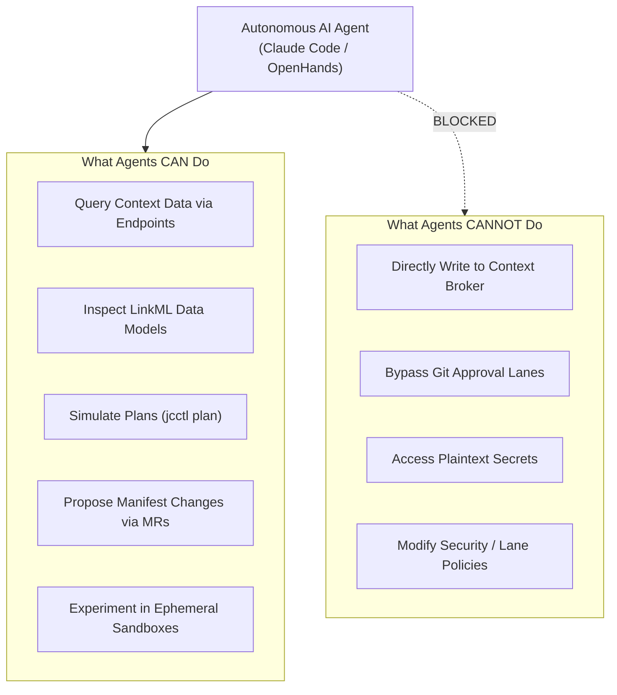

# Collaborating with Autonomous AI Agents

joinedcontext treats AI agents as first-class collaborators. Agents interact with the platform exclusively through the **Model Context Protocol (MCP)** under strict security boundaries ([CC-45](../Requirements/city-as-code.md#7-mcp-and-automation-surface)).

---

## 1. What AI Agents Can and Cannot Do



- **Agents CAN:** Query live data through Endpoints, inspect schemas, generate new blueprints, and propose configuration changes via merge requests.
- **Agents CANNOT:** Modify the Context Broker directly, bypass review lanes, access credentials, or alter security policies.

---

## 2. Connecting an AI Agent

1. Generate an agent access token in **Administration > Agent Credentials**.
2. Configure your agent environment (e.g. Claude Code or OpenHands) using the MCP discovery URL:

   ```json
   {
     "mcpServers": {
       "joinedcontext-data": {
         "url": "https://portal.joinedcontext.com/api/endpoint/mobility-feed/mcp",
         "headers": {
           "Authorization": "Bearer <agent-token>"
         }
       },
       "joinedcontext-config": {
         "url": "https://portal.joinedcontext.com/mcp/jcctl",
         "headers": {
           "Authorization": "Bearer <agent-token>"
         }
       }
     }
   }
   ```

---

## 3. Interactive Elicitation & Supervision

When an agent requests an action carrying potential operational risk (e.g. deploying a pipeline or modifying a space), the Context Gateway triggers an **elicitation prompt** ([Architecture Chapter 04](../Architecture/07-agents-and-mcp.md)).

The agent client prompts the human operator:

```text
[CONFIRMATION REQUIRED]: The agent wishes to propose creating an Ingestion Pipeline:
- Source: MQTT tcp://sensor.sk:1883
- Target Space: Air Quality
Do you approve this proposal? (y/N)
```

Upon confirmation, the proposal is committed to a new branch, and an automated merge request is opened for human review.

---

## 4. Ephemeral Sandboxes for Agent Experimentation

To allow agents to test data flows without risking operational spaces:

1. Agents can call `create_sandbox_space`.
2. The platform instantly provisions an unmanaged, short-lived Context Space tagged with a 24-hour Time-to-Live (TTL) ([CC-67](../Requirements/city-as-code.md#11-interaction-lanes-and-sandboxes)).
3. The agent tests schemas and pipelines safely.
4. If the experiment succeeds, the agent calls `propose_adoption`, submitting the sandbox configuration into an official merge request for production deployment.

## 5. The Assistant in the Portal

You can ask the assistant from any page: it finds data, opens the right form for you, and starts work that runs without you.

### The Assistant Bubble and Side Panel

A round button labelled "Assistant" is fixed at the bottom right corner of every page for signed-in users. Clicking the button opens the assistant panel docked to the right edge of your screen:

- On screens 1024 px wide and wider, the panel occupies 24 rem of width while the main page content reflows so that tables, forms, and charts remain fully visible.
- On screens narrower than 1024 px, the panel expands to full width.
- When the assistant guides you to a new view or pre-fills a form, it emits a navigation event that switches pages without a browser reload, displaying a notification banner that the assistant navigated.

### Panel Controls: Stop, Full Screen, Hide and Close

The header of the assistant panel carries four icons; hover one to see what it does:

- **Stop the assistant:** shown while a run is working. It stops the answer being produced and ends the run as `cancelled`; the panel then offers a new conversation.
- **Full screen:** gives the conversation the whole content area. The same icon, or Escape, puts it back at the side.
- **Hide the assistant:** folds the panel into the bubble at the bottom right. The conversation stays, a reload of the tab keeps it, and the bubble shows a dot while the assistant is working.
- **Close the assistant:** lets go of the conversation without stopping it. The run stays on the Assistant page, and the bubble opens an empty panel.

Files go in the drop zone at the bottom of the panel: a CSV, Excel, JSON or PDF sample becomes a draft data model.

### The Assistant Page

The dedicated Assistant page (`/projects/{project}/assistant`), accessible from the main navigation sidebar, lists all conversation threads and agent tasks within your project:

- Entries appear in reverse chronological order, displaying the run kind, title (truncated to 80 characters), lifecycle status, start timestamp, and last activity time.
- Filter controls allow narrowing the list by run kind, lifecycle status, or filtering exclusively to your own runs (`mine`).
- Clicking Open restores any selected run into the assistant panel or full screen view.
- Runs update in real time via the platform activity stream, reflecting progress and phase changes without requiring manual page reloads.

### Continuing Ended Conversations

Completed, expired, or cancelled conversation runs open in read-only mode, allowing full inspection of previous thoughts and tool outputs. To resume a completed dialogue, click Continue:

- The Portal launches a new conversation linked to the prior run via a `continues` relationship.
- The previous conversation transcript is provided to the model as context.
- The Portal UI threads both runs into a single continuous discussion history.

### Launching Unattended Agent Work

From the Assistant page, you can start unattended background work runs to produce platform artifacts without interactive prompts:

- **Application (`kind: application`):** Scaffolds and verifies an application. When an architectural ambiguity arises, the builder decides on an appropriate implementation, logs its reasoning as a thought event, deploys a sandboxed preview, and submits an `App` manifest to the change approval queue.
- **Dashboard (`kind: dashboard`):** Inspects endpoint data models and constructs a multi-layer dashboard view, generating an interactive preview and opening a `Dashboard` manifest change proposal.
- **Analysis (`kind: analysis`):** Analyzes context space entity distributions and trends, generating an interactive kit preview and a standalone `report.md` summary stored on the run. Analysis runs do not commit manifests and can be exported client-side using kit export tools.

### Governed Agent Access

All assistant and agent interactions adhere to the principle of least privilege. An agent's runtime capabilities are defined in its assigned `AgentProfile` and strictly intersected with your personal project permissions:

- An agent profile can only restrict or narrow your permissions, it can never widen them or grant access to operations you cannot perform yourself.
- If a profile omits an explicit `access` configuration block, the agent is restricted to read-only tools (`readOnlyHint: true`) and cannot propose changes.
- The Assistant page provides an access view detailing permitted registry operations, manifest kinds, endpoints, and allow-listed external internet hosts for each profile.

## Related

- [CC-45](../Requirements/city-as-code.md) — referenced above.
- [Architecture Chapter 04](../Architecture/07-agents-and-mcp.md) — referenced above.
- [00-intro](00-intro.md) — user guide overview.
- [01-getting-started](01-getting-started.md) — first steps in the Portal.
